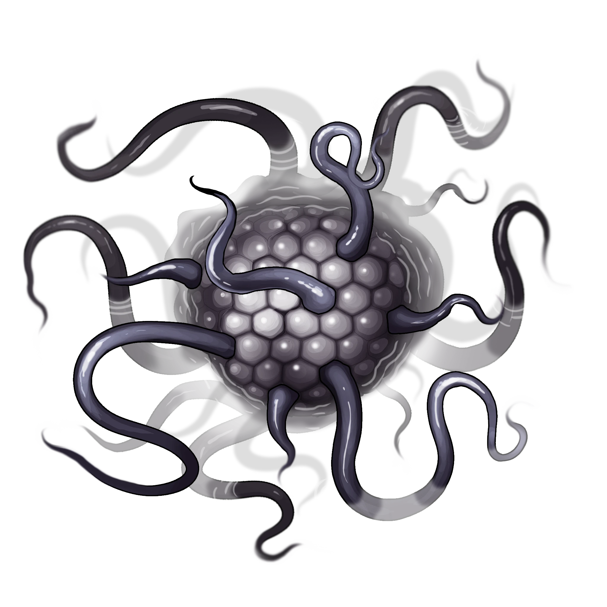
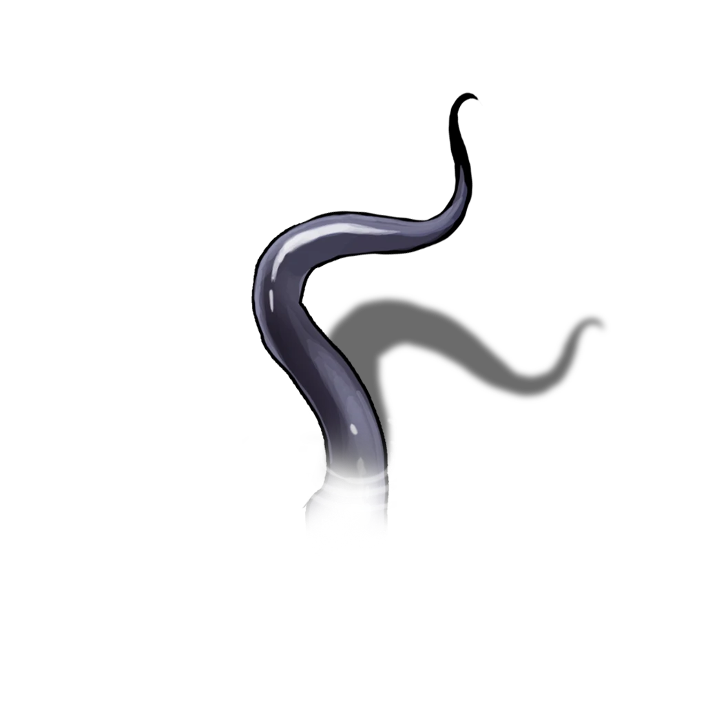

# Phantasmal Waters

> [!warning] Gamemaster
> #### Gamemaster's Summary
>
> This Combat Event occurs at the [[Lake of Whispers]], which sits in the middle of the Fogbound Caverns, between the entrance at the [[Shrouded Borehole]] and the [[Primordial Bastion]] that lies on the lake's southern bank. By crossing the lake, the characters can:
>
> - Combat the [[Pale Whisperer]] and its many tendrils, which combine to create a larger and more powerful variant of the [[Writhing Whisperer]] from [[Over The Moon]].
> - Fight to resist potential Abyssal intrusions into their minds.
>
> The Event is depicted using the "Lake of Whispers" Level of the [[Fogbound Caverns]] Area Map.

## A Pale Whisperer

The entity in the Lake of Whispers is an ancient, lingering Abyssal monster that notices the party as soon as they enter the lake, due to its telepathic ability to sense the minds of beings around it.

> [!danger] Hazard
> #### A Moment of Warning
>
> Characters with **Attunement: The Abyss** feel the oncoming attack before the Pale Whisperer breaks the surface; this is not enough time to prepare, but may provide a split-second warning.

As combat begins, read or paraphrase the following:

> [!quote] Read Aloud
> The calm, dark waters of the lake explode around you as writhing tendrils reach out for the wooden edges of the raft. You feel a roiling, twisting sensation in your chest, and as you recoil in horror, a bulbous, milky shape rises out of the water beside you, accompanied by the sensation of a thousand invisible insects crawling across your skin.

> [!abstract] Pale Whisperer
> **[[Pale Whisperer]]**
>
> Level 1 · Unknown Unknown
>
> 

> [!abstract] Pale Whisperer Tendril
> **[[Pale Whisperer Tendril]]**
>
> Level 1 · Unknown Unknown
>
> 

Unlike the [[Writhing Whisperer]] in [[An Ancient Battle]] during [[Over The Moon]], this monster is not interested in communication or dialogue with the party. It attacks immediately, surging from the water and surprising the party.

If the party encountered the previous Whisperer during that Event, read this additional text:

> [!quote] Read Aloud
> The creature before you appears to be a more formidable or perhaps more mature variant of the impaled being you found in the Forest of Stone. While the similarities are striking, this one moves with a sense of malice and shows little interest in engaging in elaborate conversation.

> [!danger] Hazard
> #### Abyssal Intrusion
>
> Conversely, if this is the first time the party has made contact with a Whisperer, the encounter has an immediate deleterious effect on the minds of the party. Each character must make a `[[/save wis 16]]` saving throw as the Whisperer makes telepathic contact with them and begins to weave itself into their minds. On a failure, the character suffers a single effect from the [[Minor Abyssal Madness]] table.

If the party spends any action or time trying to identify the Whisperer they will be unable to learn anything of note — the being defies all attempts to identify or understand it.

> [!tip] Exploration
> #### The Writhing Interloper
>
> None of Arcana, History, or Religion are helpful in identifying the Writhing Whisperer. It is beyond the ken of most mortals of Ember, and its kind have not been witnessed by mortal eyes for centuries, if not longer.

## Fighting the Whisperer

The Whisperer is intelligent, and well versed in fighting mortals — it is likely to present a formidable challenge for any party.

> [!danger] Hazard
> #### A Watery Ambush
>
> The Whisperer ambushes the party from underneath their makeshift boat. The Whisperer itself initially appears to the party's right, while simultaneously encircling the party's raft with its tentacles.
>
> The dark waters of the Lake of Whispers present a difficult environment for the party. Throughout the encounter, it is likely that one more party members will fall or be pulled into the water. Although cold, the water itself inflicts no penalty apart from the normal **Disadvantage** on melee attacks for characters without a Swim Speed.
>
> #### Whisperer Tactics
>
> This cunning creature of the Abyss focuses on drawing enemies closer in order to hold them in place with its various constraining abilities, then whip them to death with its tendrils.
>
> During combat:
>
> - The Whisperer uses [[Abyssal Whip]] whenever available, attempting to drag creatures close.
> - If possible, it will attempt to whip and drag creatures &Reference[Prone] before attacking, in order to grant it **Advantage** with its [[Shadow Tendril]] attack.
> - Its [[Abyssal Whispers]] Legendary Action can be used to draw enemies closer, and should target the farthest enemies on the battlefield. Its guaranteed damage is also effective at downing already weak enemies — something the Whisperer is intelligent enough to do.
> - Its [[Grasping Form]] Legendary Action can be used to hold nearby enemies in place. This is especially useful if the Whisperer has dragged primarily-ranged combatants into close range. It also prevents wounded characters from fleeing to (relative) safely.
>
> The encounter also includes 3 [[Pale Whisperer Tendril]]. During combat:
>
> - Though connected underwater to the main body of the Whisperer, these tendrils can move and act independently, each with their own initiative.
> - These smaller tendrils have only a single Attack Action, and the basic goal of attacking the closest creature.
>
> Combat ends when the Pale Whisperer itself is reduced to 0 Hit Points, at which point it slips back into the dark waters of the lake. This may leave lingering questions regarding its actual death, as the party will find themselves unable to investigate its body. In truth, the Pale Whisperer is not dead, and has instead simply retreated for the time being. It sinks deep into the Pathways to regenerate, and will appear again elsewhere at a later time.

#### Heart Attunement: Slay the Whisperer

If the party manages to defeat the Pale Whisperer in combat, each character advances their **Attunement: Heart of Ember (+1)** at the conclusion of the Event.

### Concluding the Event

> [!warning] Gamemaster
> #### Next Steps
>
> Having survived attack by the Pale Whisperer, the party may:
>
> - Continue their journey south towards the [[Primordial Bastion]] and explore it in [[Lightless Halls]].
> - Detour east or west to meet the Abyssal devotee [[Nadin]] in [[Smoldering Shelter]] or encounter the Outer God [[Vhismara]] in [[Snarled Promises]].
