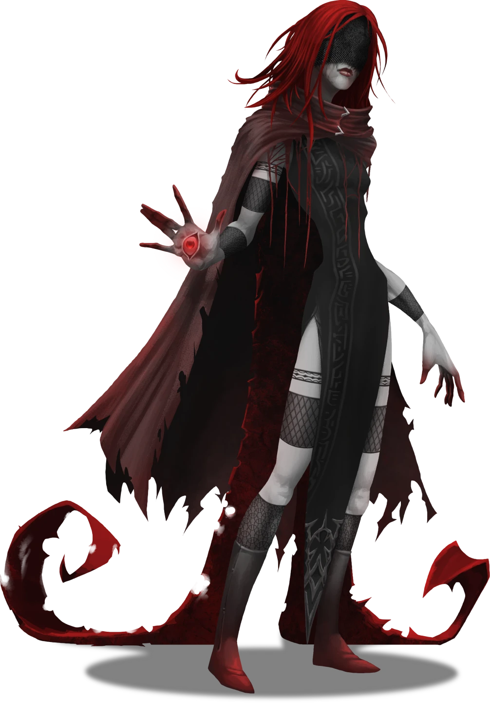

# Smoldering Shelter

> [!warning] Gamemaster
> #### Gamemaster's Summary
>
> This Social Event — with potential combat — can occur northwest or northeast of the [[Primordial Bastion]] on the Region Map. By meeting and speaking with the Abyssal devotee [[Nadin]], the characters can:
>
> - Listen to a firsthand account of [[The Abyss]] and one its Outer Gods from a worshipper thereof.
> - Accept or reject Nadin's offer of both gold and a powerful relic in exchange for turning off the light at the top of Primordial Bastion.
> - Opt to fight Nadin — a powerful but strangely merciful foe.
>
> The Event is depicted using the "Smoldering Tent" Level of the [[Fogbound Caverns]] Area Map.

### Studying the Tent

Nadin calls the Smoldering Tent home, but this tent is not a permanent fixture of the Fogbound Caverns. Instead, it is a wondrous magical artifact in its own right, capable of moving through space to distant locations whenever Nadin wishes.

Characters can stop and investigate the tent before entering, or choose to leave without heading inside. Those who investigate immediately notice the following.

> [!quote] Read Aloud
> The tent before you is a strange structure. It appears ancient, with unsettling designs and faded, rippled red-and-black patterns weathered and worn by uncounted years. A thick black smoke rises from the top of the tent and fades quickly into the darkness above. Softly burning red braziers are scattered outside, lying carelessly in places with deep dragging furrows in the ground leading from the tent entrance.

> [!tip] Exploration
> #### An Unsettling Structure
>
> Any character who studies the tent and makes a successful **Awareness (DC 14)** or **Arcana (DC 14)** check concludes that the aged tent exudes Abyssal energies and magic, and feels deeply wrong. There is something magical and near-undetectable in the smoke flowing from the top of the tent. This same smoke trails along the ground like a slow tide, coming from beneath the tent and its entrance. Whatever effect the smoke is causing does not appear to be dangerous at first, but likely should not be breathed in for too long.
>
> - **Knowledge: Abyssals**: The character gains **+2 Boons** on this check.
> - **Knowledge: Artifacts**: The character gains **+2 Boons** on this check.
> - **Critical Success**: The character determines that tent has not been in this part of the Fogbound Caverns for very long. While the fabrics are worn and old, the ground around the tent has been recently disturbed, and a faint aura of conjuration magic hums around the tent like a shroud. It is clear that the entire tent is magical in some way, and may even be a singular magical artifact.
>
> Meanwhile, a separate successful **Arcana (DC 16)** check reveals that the braziers around the tent exude an extremely faint magical energy. The magic is not Abyssal in nature — at least not entirely — but the braziers show residual signs of conjuration magic.
>
> - **Knowledge: Rituals**: The character gains **+2 Boons** on this check.
>
> Once the party has finished inspecting the tent, any character with a `[[/skill perception 18 passive format=long]]` or who makes a successful **Awareness (DC 16)** check notices the following:
>
> > As you linger near the tent, the coughing and hacking noises become clearer. It's a dry, rasping sound that makes you feel uneasy; it seems uncomfortable, if not downright painful. Whoever or whatever is inside the tent is likely humanoid, as amidst the dry coughs, you hear a low murmur — either multiple people are conversing with one another, or the person inside is talking to themselves.

> [!danger] Hazard
> #### Smoldering Black Smoke
>
> When a character spends more than 10 minutes breathing in the black smoke that lingers within 5 feet of the tent and directly inside, they begin to suffer adverse effects on their health.
>
> Characters other than Nadin or Abyssal monsters must make a successful `[[/check con 16]]` saving throw or else become &Reference[Poisoned] for 1 minute, develop an uncontrollable dry cough, and take `[[/damage 1d4 poison]]` damage. Any character who succeeds on their saving throw still takes half that damage, with a minimum damage of 1, but does not suffer any other adverse effects.
>
> At the Gamemaster's discretion, rather than track the exact time that characters are exposed to this hazard, the Gamemaster may choose to inflict it upon the characters randomly, or once they have spent significant time within the smoke while talking to Nadin.

### Meeting Nadin

If the characters choose to enter the strange structure, describe the following:

> [!quote] Read Aloud
> The interior of the tent is stifling and hot, filled with more of the thick black smoke that stings your eyes and is overwhelming to inhale. A dark, rich wooden floor is strewn with a collection of red patterned rugs, rags, and piles of crumbling and ancient manuscripts. Across the walls, suspended from thick black chains, are several blackened, spiked weapons that seem twisted with cruelty, clearly capable of inflicting great pain. These weapons seem to be part of a personal collection, all crafted by the same disturbing artisan. At the center of the tent is a large black brazier, with ever-burning red coals burning within, glimmering through the smoke. A hunched figure stands, shrouded at the back of the tent, facing you.

> [!abstract] Nadin
> **[[Nadin]]**
>
> Level 1 · Unknown Unknown
>
> 

> [!quote] Read Aloud
> The woman's rasping voice cuts through the smoke, landing not only in your ears but also in your mind.
>
> > Ahh … a merry band of adventurous types I see, stumbling around …
>
> She pauses to cough and hack into the air, her figure twisting as if in great pain, and her limbs tremble with the exertion. But she recovers quickly and finishes.
>
> > In the dark …
>
> Her mouth twists into a strange, unsettling smile and she turns her head slowly to regard each of you.
>
> > Did my unusual abode pique your unending curiosity, perhaps?
>
> She laughs with a loud, rasping cackle, and her long-fingered hands twitch and curl before closing into tight fists. She seems to wrestle with control over her own actions.
>
> > So now lovelies, by all means, ask for my story, my wisdom and the blessings of my Dark Goddess ... I will answer you truthfully and reveal so many wonderful things to you …

> [!info] Social
> #### Talking with Nadin
>
> The party can continue their conversation with Nadin, during which time she provides additional information:
>
> - Nadin is a follower of a goddess known as the "Red Eye," and is guided by her will. She has devoted her entire life to this deity and does not remember her age or origins. Deeply committed to this entity, she regards her chosen goddess with adoration, but is not actively trying to persuade her party members to follow the Red Eye.
> - If asked about her appearance or mask, Nadin will respond that she can see the party using the eye on her hand and that she is not blind. If questioned about her ancestry or whether she is human, Nadin simply laughs and exclaims, *"Certainly not!"*
> - Nadin is very careful with her words, and refrains from providing the players with additional names or terms that might cause them long-term mental harm. She avoids saying the word "Abyss," preferring to use "Dark Beyond." Although Nadin is aware of many dangerous Abyssal monsters nearby, she does not share any details with the party, as she wants the party to confront such horrors and test themselves against them.
> - If the players point to the weapons hanging from the chains on the tent's walls, Nadin will gesture toward them and remark that they are hers, acquired long ago from a friend for whom she *"did a favor."*
> - If asked about her tent, Nadin will confirm it is not merely a tent but a magical artifact in its own right — something she deeply treasures as her home. She notes that it has its own temperament and is rather sensitive to loud voices, advising the party not to shout.
>
> Some specific dialogue options for Nadin are presented below this block, and contain additional details on some of the topics above.
>
> #### Nadin's Request
>
> After the party has conversed with Nadin for some time, or if the party asks her reason for being here in the Fogbound Caverns, Nadin offers to compensate the party for completing a task, the details of which can be found below in the section [[Smoldering Shelter]].
>
> #### Nadin's Motives
>
> Any character who makes a successful **Deception (DC 16)** check determines that Nadin is serious and forthcoming in her intentions. Although she appears unhinged and profoundly affected by Abyssal energies or powers — likely to provoke the party's suspicion — she is not lying to the party but rather concealing certain things for the sake of their own well-being.
>
> - **Critical Success**: Nadin is deeply fascinated by the party and seems strangely interested in them; she has no intention of harming anyone.
>
> Any character who casts the [[Unknown]] Spell on Nadin is met with inconclusive results — a swirling tapestry of confusing images that are impossible to read.
>
> #### Making Accusations
>
> If the party accuses Nadin of being an agent of dark powers or a servant of [[The Abyss]], she will not deny it. In fact, she will grin and confirm that she is exactly as they say, but also that this does not mean she is their enemy. Nadin is refreshingly blunt about her own character, and the party might see this as an opportunity to attack her; in that case, they should skip directly to the [[Smoldering Shelter]] section below.

> [!question] Q&A
> **Q:** About The Abyss?
>
> **A:**
>
> > The "Dark Beyond", as I call it, is a deeply mysterious place, home to ancient creatures and wondrous magic. I have studied it all my life and have even ventured into its depths on several occasions. However, it is not a place for the faint-hearted, and the experience has taken a great toll on me. I lament its dark and terrible reputation, for truly it can be monstrous, but there are aspects within that are so wondrous and filled with such beauty that it brings me to tears.

> [!question] Q&A
> **Q:** About your "Dark Goddess"?
>
> **A:**
>
> > My wonderful teacher, my dark beauty, and the one I worship above all things. She is caring, compassionate, and filled with love. She exists within the Dark Beyond and is a being I believe to be simply misunderstood by many. I follow her desires and goals without question, and she leads me here and there to carry out her will. What I do greatly depends on her — most recently, she called me here to watch and learn.

### Nadin's Offer

If the party asks Nadin want she wants from them or why she is in the Fogbound Caverns, read the following:

> [!quote] Read Aloud
> > Ah, to the heart of the matter then. Yes, I'm here now, but I was once elsewhere. I came to investigate the fading light of the Bastion … It has stood eternal for millennia, but it’s beautifully dim now!
> >
> > In fact, that brings up a rather exciting —
>
> Nadin is briefly interrupted by a racking cough.
>
> > — opportunity. If you examine that old dilapidated ruin for me, explore its ancient, lightless halls, climb to the apex of the tower, and ensure that the blasted light is dimmed permanently … you will discover a fitting reward when we meet again. I shall offer you treasures, such as gold, of course, and even more thrilling, a relic of my own — something I guarantee will bring you more power, glory, and joy than anything else in this world … what do you say, lovelies?

> [!info] Social
> #### Dousing the Light
>
> If the party agrees to her terms, Nadin offers the characters  **100** and a powerful dark relic when they meet again, so long as the party "turns off the lights." Though Nadin does not specify what this relic reward is, her eyes dart to one of the many black weapons on the walls of her tent.
>
> If the party ultimately refuses Nadin's offer and chooses to leave, Nadin watches them depart with a grin. She has no desire to stop the party, and does not desperately try to convince them. Nadin is confident she will approach the party again with other offers.
>
> Some specific dialogue options for Nadin about this offer are presented below.

> [!question] Q&A
> **Q:** About the bastion?
>
> **A:**
>
> > It's been there since ancient times; not even I know when it was built or what its true purpose ever was, but it's stubborn and enduring, I'll give it that. It should be a crumbling pile of rocks by now, yet it's filled with ancient secrets and treasures. Delving into its depths will surely be profitable, and to be honest, I'm rather curious about many of its aspects myself.

> [!question] Q&A
> **Q:** About the light?
>
> **A:**
>
> > That "thing" is deeply wrong. A **light**?! In the middle of the lovely darkened Pathways of this world?! Silly, useless, irritating. Thankfully, it's been fading for years and finally seems to be giving up, but it would be dear to turn it off permanently, either by destroying it or flicking off the switch. I would be very grateful, as would my Dark Goddess, of course. It will plunge this area back into darkness, yes, but that is this place's natural state, and everything drawn to it will fade away, I suspect.

If the party accepts Nadin's offer, mark the following Event Outcome:

`[[/outcome accepted]]`

## Parting with Nadin

If the party leaves the Smoldering Tent peacefully, read the following:

> [!quote] Read Aloud
> As you move away from the tent and leave it behind you, a faint hum can be heard. Within moments, the sound twists and quickens into a whining screech of metal on metal. With a thunderous crack, the blackened smoldering tent behind you vanishes in a flash of crackling light, leaving you alone in a cold, dark depression within the caverns, faint echoes reverberating around you.

## Fighting Nadin

Combat with Nadin is not the *intended* outcome of this event, as Nadin does not instigate such conflict. She is curious and calculating, viewing the party as unwitting pawns to achieve her own goals, and the goals of destruction and chaos. Even if the party provokes her, acts rudely, or behaves generally hostile toward her, she will not attack unless party members draw their weapons and attempt to hurt her.

It is not unlikely, however, that Nadin's persona, comments, and appearance will compel the party to attack her, deeming her obviously evil and malicious.

> [!danger] Hazard
> #### Nadin Tactics
>
> [[Nadin]] is calculating and careful. During combat:
>
> - Nadin will test the party, attempting to gauge weaknesses and strengths. She may randomly switch targets, attacking the strongest martial character before turning to attack a healer or a mage.
> - When Nadin does attack, she will focus both [[Gleeful Smash]] and[[Crimson Ray]] on that one target for an entire turn.
> - Nadin will use her legendary action [[Teleport]] to move behind or next to characters in the party, attempting to hide from or stay behind more challenging party members.
> - Nadin will also use [[Spellcasting]]to cast [[Blindness/Deafness]], [[Confusion]], and [[Fear]] Spells on characters she wants to remove temporarily from the fight, allowing her to focus on someone else in the party.
> - Nadin's [[Keen Senses]] and high passive Perception make it nearly impossible to stay hidden from her. If anyone in the party attempts to hide from her magically, she will cast [[See Invisibility]] and target that character next.
>
> Importantly, Nadin's damaging abilities do not do lethal damage, as she will control herself just enough to stop herself from landing lethal blows. However, once someone is knocked unconscious, she will happily pull a part of their spirit from their body and use her [[Create Abyssal Eye]] feature. This may lead to a snowball effect where the party is quickly overwhelmed.
>
> If Nadin successfully knocks the entire party unconscious, the party naturally awakens on empty ground within the Fogbound Caverns after `[[/roll 1d4]]` hours.
>
> It is not possible to kill Nadin during this encounter, as she, along with her tent, teleports away if she reaches 0 Hit Points. This is unlikely to occur, as the battle is in Nadin's favor. She is both more powerful than the party and intentionally holding back, as her true intention is to observe and corrupt the party, not destroy them.

If the party does manage to overwhelm Nadin somehow, read the following:

> [!quote] Read Aloud
> Nadin's form shudders, and her face splits open into a wide, cruel smile before she hacks into her palm. As she does, the tent around you begins to hum slowly with a strange sound. Within moments, the sound twists and quickens into a whining screech of metal on metal, and the patterns of the tent's fabric start to swirl in increasingly rapid movements. The air thickens with black smoke, and Nadin turns, straightening to her full height, as any semblance of combat, wounds, or ailments vanish from her form. Her smile widens even further, horrifically stretching the skin as she softly whispers:
>
> > What a charming little group you all are … until we meet again, lovelies.
>
> With a thunderous crack, Nadin and the blackened smoldering tent vanish in a flash of crackling light, leaving you alone in a cold, dark depression within the caverns, with faint echoes reverberating around you.

#### Ragen Attunement: Nadin Defeated

If the party defeats Nadin in combat, each character advances their **Attunement: Ragen (+1)** at the conclusion of the Event.

### Concluding the Event

> [!warning] Gamemaster
> #### Next Steps
>
> After the interaction with Nadin, whether peaceful or hostile, the party may be further compelled to reach the Primordial Bastion deeper within the caverns. Along this journey, they may:
>
> - Fight Abyssal creatures while traversing the [[Lake of Whispers]] in [[Phantasmal Waters]].
> - Encounter the Outer God [[Vhismara]] in [[Snarled Promises]].
> - Delve into the Primordial Bastion itself in [[Lightless Halls]].
>
> Nadin herself will not appear again to reward the party for some time, but will play a role in further Quests later in the game.
