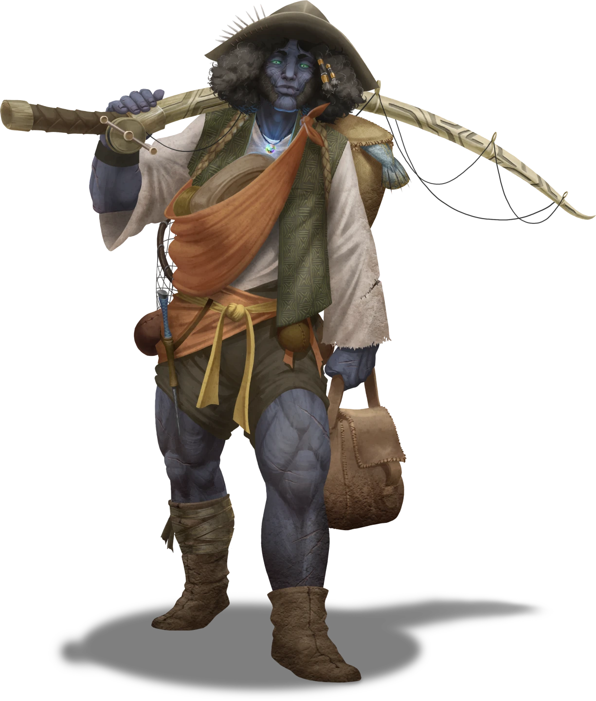

# Strand of Fate

> [!warning] Gamemaster
> #### Gamemaster's Summary
>
> This Social Event occurs in [[Storsa's Strand]], a small hamlet awaiting news of a missing town member, Aberin Lowd. While exploring the town, the characters can:
>
> - Inform [[Kendral Lowd]], father of Aberin Lowd, of Aberin's death, if the party previously learned of it during [[Tormented Threads]].
> - Convince Kendral Lowd to give them the location of a nearby entryway to the [[Pathways]] that Aberin was studying before he died.
> - Meet the residents of Storsa's Strand, who are friendly but have been feeling a general sense of weariness and malaise for some time — due secretly to a leak of Abyssal energy.
> - Visit the local shrine to [[Lantyr]] for comfort.
>
> This Event is depicted using the "Storsa's Strand" Level of the [[Rustvar Valleys]] Area Map.

### The Missing Son of Storsa's Strand

The laborer who flagged the party down while carrying a heavy crate is **Verdal Fain** (Neutral Good, Arcturian Human, they/them).

Verdal believes the party has come with news about the missing Aberin Lowd. Verdal wants to speak with the party, but can only talk for so long while balancing the crate that they're carrying.

> [!info] Social
> #### A Short Conversation with Verdal Fain
>
> Though Verdal's task leaves them with little time to talk, the party may extend their conversation with Verdal multiple ways, in which case they instead have [[Strand of Fate]] below:
>
> - `[[/check athletics 15]]` to help Verdal carry the crate.
> - `[[/check persuasion 15]]` to convince Verdal to stop and put the crate down.
>
> Unless a character succeeds on a strategy such as one of those above, Verdal only has time to share the following:
>
> - He wishes to know if they have news of Aberin.
> - If the party knows and shares that Aberin has died, Verdal is crushed by the news. They suggest telling Aberin's father, Kendral, who works by the docks.
> - If the party does not know anything about Aberin, Verdal apologizes for interrupting their journey — it's just that the town is worried about Aberin, who is the son of Kendral Lowd, a local fisher who has "already lost so much."
>
> Any character who makes a successful `[[/check insight 11]]` check can tell that Verdal is honestly sharing all that they know.
>
> Some specific dialogue options for a short conversation with Verdal are presented below.

> [!question] Q&A
> **Q:** Thoughts on Aberin's death?
>
> **A:**
>
> > I feared that this might happen, I did. Aberin just isn't the same as he was when we were in school together. I was worried something might happen to him. One of the only things I've really felt at all lately. His father's here in town — a fisher just down there at the docks. You'll have to tell him. After everything he's been through, I hope it doesn't break his heart.

> [!question] Q&A
> **Q:** Who is Aberin?
>
> **A:**
>
> > I'm sorry. Shouldn't have assumed. You're probably here to try the fish stew. Though it don't taste like much these days. Whole town's just worried about Aberin Lowd. Mostly because of everything his father's been through. He won't talk about it — just wants to talk about fishing — but he's lost so much already that I was hoping y'might have good news. Thought it might lighten the mood around here a little.

> [!info] Social
> #### A Longer Conversation with Verdal Fain
>
> If is able to enage Verdal in a longer conversation, they can learn the following:
>
> - Aberin Lowd is the son of the Lowd family, themselves a group adventurers who would go on dangerous expeditions. After his sister Daelin died on one such expedition, Aberin begin acting strange and mumbling about passageways to the deep.
> - When Aberin started losing touch with reality, he was sent to Corpin Sanctuary for healing. Later, a letter from the sanctuary arrived stating Aberin left for home weeks ago, but no one has heard from him since.
> - Town morale has been low recently, but that started before Aberin left town. Seems something in the air is dragging everyone down.
> - The main attraction in town is the Far From Home inn, where Chef Tama Tyne serves up the town's famous fish stew, served in edible bowls. The stew seems a bit bland to Verdal, but then everything seems a bit bland to them these days.
> - The structure in the center of town is the town's shrine to Lantyr, which they keep burning at all times and is the only thing that seems to boost spirits.
>
> Any character who makes a successful `[[/check insight 11]]` check can tell that Verdal is honestly sharing all that they know.
>
> Some specific dialogue options for a longer conversation with Verdal are presented below.

> [!question] Q&A
> **Q:** Who is Aberin?
>
> **A:**
>
> > Aberin Lowd. One of the adventuring Lowds. At least they used to be. Nowadays only Kendral's left, fishing at the docks like he didn't have a whole different life once. Sad story, really — daughter Daelin disappeared somewhere down below the surface of Ember and Aberin went just about crazy trying to get her back. That's why he left Storsa's Strand.

> [!question] Q&A
> **Q:** About Aberin's disappearance?
>
> **A:**
>
> > Aberin was looking into something — a way to get down to where his sister Daelin disappeared. It started playing tricks with his mind. Kendral sent him to Corpin Sanctuary for help. Then word came down from Corpin that Aberin left, said he was headed back this way. But that was weeks ago, and the world's a dangerous place these days.

> [!question] Q&A
> **Q:** About life in Storsa's Strand?
>
> **A:**
>
> > Not much to tell about Storsa's Strand. Days come, days go. You keep your head down and do what needs to be done. Mood in town's been low recently. Even before Aberin left. Don't know what it is, but no one seems able to shake the feeling that your steps are heavier, the food is blander, and everything looks a bit dim.

> [!question] Q&A
> **Q:** About the inn?
>
> **A:**
>
> > Far From Home's known more for the fish stew that Tyne serves up than its room and board, but I'm sure there are a few rooms available. Just know — if you walk through the doors of the inn, Tyne will make you try some of the stuff. It all tastes the same to me, like liquid dust, but she swears she's putting seasoning on it.

> [!question] Q&A
> **Q:** About the large flaming bowl?
>
> **A:**
>
> > A shrine to Lantyr. About the only thing that really puts a smile on folks' face around here. Grabbing one of the torches can fix just about anything for a moment, though it didn't do much for Aberin in the end.

### Meeting Kendral Lowd

> [!abstract] Kendral Lowd
> **[[Kendral Lowd]]**
>
> Level 1 · Unknown Unknown
>
> 

Kendral is generally kind, but prefers keep his answers short, and return to his fishing.

> [!info] Social
> #### A Short Conversation with Kendral Lowd
>
> Kendral is reluctant to speak about anything other than fishing, especially if it relates to the Pathways, his life as an adventurer, or his family — fishing is safe, after all. He speaks briefly and dismissively on the following topics:
>
> - The odd feeling in town, which he refuses to investigate.
> - His son Aberin, who went to [[Corpin Sanctuary]] for healing, but hasn't been heard from since he left Corpin weeks ago — Kendral believes him likely dead.
>
> Any character who succeeds on a `[[/check insight 14]]` check can tell that he is both guilty and afraid — he fears that sharing what happened to Aberin will somehow lead others to follow in his son's path.
>
> Some specific dialogue options for this short conversation with Kendral are presented below.
>
> #### Continuing the Conversation: About Kendral's Children
>
> Kendral will only say more about Aberin to the party if they inform him of his son's death, and provide an item of proof such as Aberin's [[A Note For Pa]], the [[Defiled Journal]], or an [[Inscribed Ring of Eternal Rest]], all of which can be found in [[Tormented Threads]]. If the party knows the details of Aberin's demise, their decision of whether to reveal those details will affect their Attunement at the conclusion of the Event.
>
> Any character who knows about Aberin's death and makes a successful `[[/check persuasion 16]]` check can convince Kendral to speak further about Aberin without providing proof.
>
> Meanwhile, any character unaware of Aberin's death must make a successful `[[/check persuasion 18]]` to convince Kendral to speak further about Aberin.
>
> If the party provides proof of Aberin's death, proceed to [[Strand of Fate]] below.

> [!question] Q&A
> **Q:** About the odd feeling in town?
>
> **A:**
>
> > Not my business. I used to be the type to think about things like that. Always off trying to make the world better. Only made my own life worse in the process.

> [!question] Q&A
> **Q:** About Aberin, or Kendral's other family?
>
> **A:**
>
> > I'm the only Lowd left in town these days. Used to think Aberin would come back one day, healed from whatever's troubling his mind, but even the healers at Corpin Sanctuary couldn't help him, so he may be lost forever.

#### Cora Attunement: Proof of Aberin's Fate

If the party chooses to reveal the details of Aberin's fate to Kendral, each character advances their **Attunement: Cora (+1)** at the conclusion of the Event.

#### Primordis Attunement: Aberin's Fate Untold

If the party chooses to withold the details of Aberin's fate from Kendral, each character advances their **Attunement: Primordis (+1)** at the conclusion of the Event.

> [!info] Social
> #### About Kendral's Children
>
> If informed about Aberin's passing, Kendral is saddened but not surprised.
>
> Once convinced to speak of his family, Kendral will share the following:
>
> - Kendral was trained as a wizard by the [[Anachraenum]] and once adventured in the near-mythical [[Pathways]] beneath the surface, accompanied by his wife Jai, a cleric of [[Lantyr]], and his children Aberin and Daelin.
> - On one trip, Kendral and Jai were separated from their children. Aberin returned, but Daelin was permanently lost.
> - After losing Dealin, Kendral stopped adventuring, and Jai left Storsa's Strand for Ordain, but Aberin became obsessed with getting back to the Pathways and finding Daelin.
> - Aberin found what he thought was a way down to the Pathways, the [[Shrouded Borehole]], but trying to get to the Pathways began driving him mad.
>
> Any character who makes a successful `[[/check persuasion 17]]` or `[[/check intimidation 17]]` check can convince Kendral to share the location of the Shrouded Borehole and mark the location on the party's map — otherwise he refuses, not wanting the party to endanger themselves as well.
>
> - **Knowledge: Abyssals**: The character gains **+2 Boons** on this check.
> - **Character informed Kendral of his son's death**: The character gains **+2 Boons** on this check.
>
> Some specific dialogue options for this conversation with Kendral are presented below.

> [!question] Q&A
> **Q:** Aberin is dead.
>
> **A:**
>
> > I should have known it would come to this, I suppose. Ever since that horrible night. I lost my daughter in the Pathways beneath the surface … but in truth, I lost my son too, overcome with this obsession with finding her.

> [!question] Q&A
> **Q:** About the Lowd family?
>
> **A:**
>
> > There was a time when it was the four of us — me, my wife Jai, Aberin, my daughter Daelin. Traveling into those dark spaces beneath the surface of Ember, trying to understand them and bring them Lantyr's light. I have always favored the goddess Spectra myself, but my wife was dedicated to Lantyr, and for a while the group of us seemed unstoppable. Then we had a bad night, and Daelin was lost. And so was Aberin, in his own way.

> [!question] Q&A
> **Q:** What happened with Aberin?
>
> **A:**
>
> > After his sister died down in the Pathways and his mother went to Ordain to rededicate herself to the temple of her youth, I thought Aberin and I could support each other here. Give up adventuring. Live a slower, safer life. But he kept wanting to go back below. Find her body. Say his last goodbye. Even found a cave near here that leads that way. But he couldn't find a way through it, and each time he came back he'd left some piece of himself behind. Ended up tearing him apart so badly he went to Corpin Sanctuary for healing.

> [!question] Q&A
> **Q:** About Daelin?
>
> **A:**
>
> > My daughter Daelin was strong, bright. Smart as a whip, just like her mother. And devoted to Lantyr. It's why we settled here — the whole town is about Lantyr, but don't worry, they're welcoming. Didn't mind an old Spectra follower like me setting up and living here as long as I did right by the community. Maybe they take pity on me — it only took one wrong battle with those inky shadows in the Pathways for me to lose Daelin, and my wife, and now Aberin, and … and everything.

`[[/outcome convinced]]`

### Exploring Storsa's Strand

If the party wishes to learn more about the town of Storsa's Strand, they can visit the Far From Home inn, investigate the large bowl of fire, or speak to the woman who is now lighting her unlit torch sticks from the communal flame, Sielle Kraddock.

### Speaking with Sielle

**Sielle Kraddock** (Neutral Good, Arcturian Ashka, she/her) is the daughter of the infamous Quag Kraddock, who had a knack for pulling odd items out of the deep. She iss trying to clear out some of the finds he kept in his Kraddock's Dock after Quag's recent death in the lake. She will attempt to get the party to buy her items first and foremost.

> [!quote] Read Aloud
> > You're interested in my curious artifacts, are you? They're a legacy from my father, Quag Kraddock. He was always pulling odd things out of the lake. House is filled with them now, so I'm trying to sell a few — any interest in buying?

> [!warning] Gamemaster
> #### Sielle's Wares
>
> To determine what Sielle currently has for sale, roll 3 times on the [[Arcturian Trinkets]] treasure table. She charges 10 sp for each item.

> [!info] Social
> #### Sielle Kraddock's Lost & Found Artifacts
>
> What topics Sielle is willing to discuss with the party depends on character options selected by the party, and successful checks made:
>
> - **Knowledge: Trade**: Her business and sales.
> - `[[/check religion 14]]` **or** **Knowledge: Gods**: Her devotion to Lantyr.
>
> Additionally, if players buy an item, Sielle will talk at length, and knows the following:
>
> - Her father felt an odd energy in the area in the weeks before his death, which he felt was coming from outside of the town, somewhere close. Sielle believes that this energy may have been the reason that her father's boat capsized in the lake, and for a general feeling of malaise in the town.
> - Sielle suggested that Kendral Lowd investigate the odd energy, as members of his family have long been unofficial protectors of the town, but he worries that it will go wrong. If the party thinks they can talk him into it, he's at the docks.
> - Sielle is hoping that by keeping the flame of Lantyr lit, the town will be protected from whatever is in the air.
>
> Any character who makes a successful `[[/check insight 11]]` check determines that everything Sielle shares is spoken truthfully.

> [!question] Q&A
> **Q:** About Sielle's father and his trinkets?
>
> **A:**
>
> > I don't know which of these things is worth anything at all. My dad was the artifact expert. Had a sense for things beyond the ordinary. Sometimes I think it's what got him killed — he was too good a fisher to just fall out of his boat, but he'd been talking about an odd feeling in the air. It's still here, I think. Don't you feel it?

> [!question] Q&A
> **Q:** About the energy in the town?
>
> **A:**
>
> > Something is off. Been like even before Aberin left for Corpin Sanctuary. Things don't taste the same, we haven't had our regular festival. My dad … he felt it. Used to be the kind of thing you'd ask a Lowd to take care of, but Kendral's not the same these days.

> [!question] Q&A
> **Q:** About Aberin Lowd?
>
> **A:**
>
> > I liked Aberin. A lot. Not sure what happened to him there in the end. Just couldn't get over Daelin's death, I guess. The whole family hasn't been the same. I think it's the reason Kendral won't investigate whatever it is that's settled on the air here. Afraid of losing more. I get it. I just wish someone would figure out what's going on around here.

> [!question] Q&A
> **Q:** About Kendral Lowd?
>
> **A:**
>
> > Only member of the Lowd family left in Storsa's Strand. Used to be him and his wife Jai, along with the kids, Daelin and Aberin. Daelin and I were about the same age. When she didn't come back after one of their expeditions, whole family tore apart. Bad for them and bad for us too — Storsa's Strand has always had a Lowd family member looking out for it, and now the whole town just feels sad.

> [!question] Q&A
> **Q:** About Lantyr?
>
> **A:**
>
> > We have always worshipped Lantyr here. How can you look upon her glowing beauty and not feel warmed from within? I only hope that she will keep us safe now.

> [!tip] Exploration
> #### Investigating the Bowl of Flame
>
> The first time that any character approaches the flame, they feel a sense of warmth fill them, unless they are carrying an item of [[The Abyss]] or have **Attunement: The Abyss** in which case:
>
> - Any character carrying an item of The Abyss (such as the [[Defiled Journal]] or the [[Finger of Nethehepticas]]) feels the item grow hot in their bag and takes `[[/damage 1d6 fire]]` damage.
>   > A fierce heat begins to radiate from the object of The Abyss that you carry with you, as if it is a ball of flame, leaving burns on your skin.
> - If a character with **Attunement: The Abyss** that approaches the dancing fire of the shrine is repelled, taking `[[/damage 1d6 force]]` damage.
>   > As you move toward the dancing flame, you hit what feels like a wall of force and are thrown backward.
>
> Any character who witnesses one of the above phenomena and makes a successful `[[/check arcana 15]]` check determines that the shrine is protected by some sort of divine magic that is anathema to Abyssal attunement.
>
> Any character who sees the shrine and makes a successful `[[/check religion 13]]` or `[[/check history 15]]` check knows that the bowl and torches comprise a shrine to [[Lantyr]], an Elder Goddess of Light and Life whose physical form is the celestial body commonly known as The Sun. Shrines of this type are open to all, and those who wish to honor Lantyr can do so by lighting one of the torches and opening themselves to the warmth of The Sun.
>
> - **Knowledge: Gods**: The character automatically succeeds on this check.
>
> The first time that a given character lights a torch at this shrine and opens themselves in this way, they receive the benefits of the spell [[Unknown]]. Any character who is under the effects of a curse has that curse removed, as if targeted by the [[Unknown]] spell. If a character lights a torch a second time, they feel the warmth but do not receive the mechanical benefit.
>
> > A feeling of warmth fills your body, lifting your spirits. The warmth does not seem to come from the flame ahead of you, but from deep within your heart.
>
> The party is permitted to take one (but only one) torch with them — additional torches must be returned to the nearby bowl. If the party takes more than one, only one will stay lit; lit torches become [[Lantyr's Flame]]. Any additional torch sticks behave as [[Torches]] that refuse to light.

### The Far From Home Inn

The party may choose, if they wish, to visit the Far From Home inn. It is mostly empty, save for the chef, **Tama Tyne** (Neutral Good, Arcturian Vrjnhar, she/her).

> [!quote] Read Aloud
> The inn is brightly decorated, but nearly empty of anyone other than the Vrjnhar who stands behind the countertop, cooking fish in a series of large silver skillets over a carved box that spurts fire at regular intervals. The air is almost chokingly thick with the smell of spices. As you enter, the chef drops a handful of something red into one of the skillets and turns your way without skipping a beat.
>
> > Come for the famous spiced fish stew? Hopefully you'll actually be able to taste what I'm trying to do here, unlike everyone else in this town.

> [!danger] Hazard
> #### Maximum Spice
>
> If a character chooses to taste the fish stew at any point during their conversation with Chef Tyne, the chef is thrilled and offers a bite free of charge. It is spiced aggressively, with enough heat on it to burn the mouth.
>
> Any character who tastes it must make a `[[/save constitution 14]]` saving throw. On a failure, they are burned by the spices and take `[[/damage 1d4 fire]]` damage.
>
> - **Ancestry: Vrjnhar**: The character gains **+2 Boons** on this saving throw.
> - **Ancestry: Fej**: The character gains **+2 Boons** on this saving throw.

> [!info] Social
> #### Talking to Chef Tyne
>
> The Vrjnhar introduces herself as Chef Tama Tyne, and invites the party to try a sample of the fish stew. If no one in the party will taste the food, she's hurt and offended and busies herself with trying to come up with a new recipe, ignoring any further attempts at conversation.
>
> Any character who makes a successful `[[/check persuasion 18]]` check can convince Chef Tyne to speak with the party despite a collective refusal to taste the food.
>
> - **Knowledge: Trade**: The character gains **+2 Boons** on this check.
>
> Meanwhile, characters who sample the food can address their experience with Chef Tyne in a number of ways:
>
> - `[[/check deception 15]]` to lie about their enjoyment of the meal.
> - `[[/check 14 nature]]` to identify an ingredient and talk about it.
> - `[[/check 14 persuasion]]` to change the conversation entirely to local matters.
>
> With a success on any of the three checks, Chef Tyne will share information about Storsa’s Strand. Otherwise, she turns away from the group and goes back to cooking, mumbling about the palates of the people in the village.
>
> If the party manages to engage Chef Tyne in conversation, she can share the following:
>
> - She has a higher spice tolerance than most, but feels as if she is overdoing her attempts recently as she tries to get any reaction from the locals, who seem to have no real sense of taste anymore.
> - She arrived in Storsa’s Strand only about a season ago, having been recruited by the previous chef of the Far From Home. Tyne thought it would be a good opportunity, but the chef she replaced complained about having lost their ability to really enjoy food — Chef Tyne is now observing the same.
> - The issues with the food predate Chef Tyne's arrival, but according to the previous chef, they started just before one of the locals had to be sent to Corpin Sanctuary after losing touch with reality. Tyne believes the last name of this unfortunate local was Lowd, probably related to the fisher Kendral Lowd, who works on the docks and helps supply her with fish.
>
> Any character who makes a successful `[[/check insight 11]]` check determines that Chef Tyne is being straightforwardly truthful with the party.

### Concluding the Event

> [!warning] Gamemaster
> #### Next Steps
>
> Once the party has finished exploring Storsa's Strand, their path forward depends on what they were able to accomplish:
>
> - If the party successfully acquired the location of the [[Shrouded Borehole]] from Kendral Lowd, they can visit it and attempt to enter the Pathways in [[Savage Descent]].
> - If the party did not acquire the location of the Shrouded Borehole, they will have to find another way into the Pathways, but can still return to Storsa's Strand to follow up with residents at the end of the Quest.
