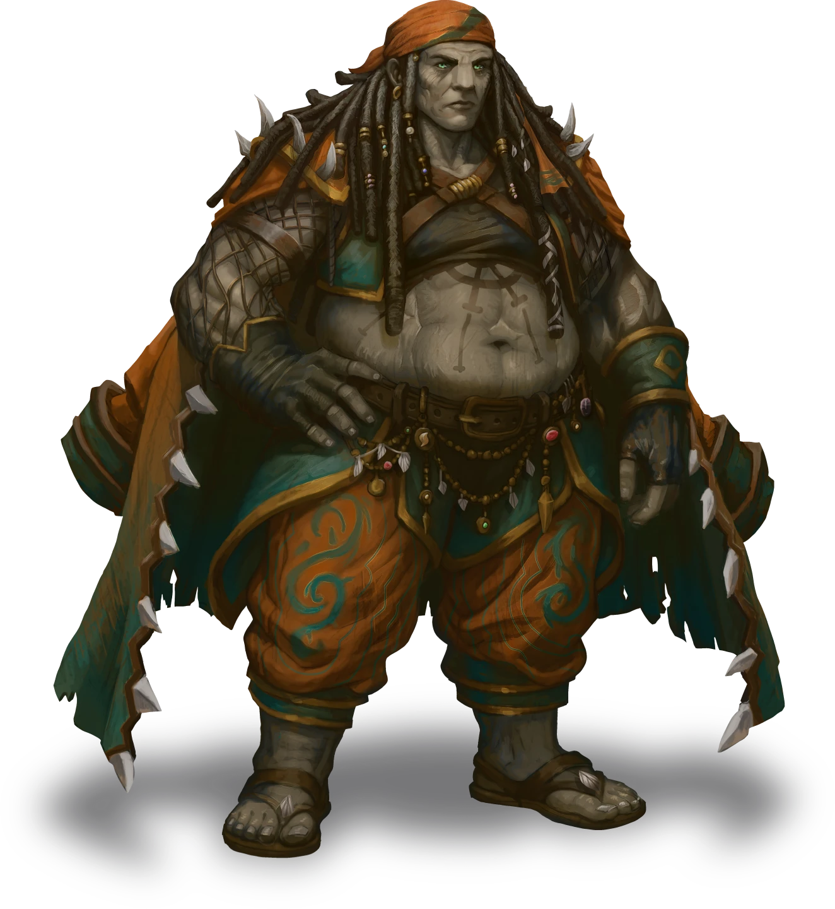

# Criminal Records

> [!warning] Gamemaster
> #### Gamemaster's Summary
>
> In this social event the party meets with Katerin Bastilla, head of the Trading House, and has a chance to get to know her before being asked to handle a handful of tasks. In this event the party will:
>
> - Get to know Katerin Bastilla a bit, and how she's connected to Ambassador Tezran.
> - Learn about the jobs she wants them to do.
> - Work with a clerk she employs to create some documents of a dubious nature.

### Ringing the Bell

> [!quote] Read Aloud
> When you ring the bell, the sound rolls deep and clear, like a call across harbor water. An attendant arrives almost at once, orange and teal livery neat in the lamplight, and with a courteous incline of the head they unbar the gate.
>
> > You are expected, please follow me.
>
> They usher you inside, and you are guided to a cool foyer that smells faintly of lemon oil and sea salt. The parlor is all dark wood and high ceilings, with heavy beams of wood stretching overhead.
>
> The furniture is worn from use and age, but impeccably maintained. Along the walls, model ships sit on shelves, with navigational charts are on display above them.
>
> A brass chronometer ticks with patient precision as you wait, until a moment later nearby double doors burst open and a mountain of a being strides in, their heavy footfalls shattering the quiet.
>
> > Aha, you're the band that Loris pressed into helping me with my tasks, eh? I’m Katerin Bastilla head of house Bastilla. Who all are you lot? Speak up now!

> [!abstract] Katerin Bastilla
> **[[Katerin Bastilla]]**
>
> Level 1 · Unknown Unknown
>
> 

### Katerin's Tasks

> [!quote] Read Aloud
> Katerin takes a seat. A moment later the doors open and a clerk walks in, carrying a leather folder, and a scribe's case. They give you a silent nod and offer a polite greeting to Katerin, who waves them toward a table where they carefully unpack their pens, pencils, papers, and inks.
>
> Katerin speaks while they do:
>
> > I've got some work for you. One's simple, the other two less so. The first job is helping my clerk here with some paperwork. The second and third jobs are just picking up items.
> >
> > Of course, the people holding those items might not be cooperative. You'll need to get some equipment from the Ember's Bounty, and steal an item from a Cascillian warehouse in Tridents Point.

> [!question] Q&A
> **Q:** What paperwork are we doing?
>
> **A:**
>
> Katerin waves a hand in dismissal.
>
> > Some records we'll need in the future need finalizing and you're going to furnish some details for them. It'll be the easiest of the tasks you're assigned.

> [!question] Q&A
> **Q:** What are we getting on the Ember's Bounty?
>
> **A:**
>
> > There's a privateer that I hired, Gastern Favyos, he's a bit of a wildcard, and little too much of a rogue element for Bastilla membership, but he has his uses. He was paid to acquire some equipment for me, and they are being held on the bounty, awaiting pickup.
> >
> > Just make sure you follow the rules you're given, or else you'll be tossed overboard. If you are going to break the rules, at least break them after you get the wingsuits from Gastern!

> [!question] Q&A
> **Q:** What are the items?
>
> **A:**
>
> > I had him acquire some wingsuits, ingenious creations that let the wearer glide through the air rather than plummeting like a stone.

> [!question] Q&A
> **Q:** Where is the Ember's Bounty?
>
> **A:**
>
> > It's the massive ship docked off the coast of the Coinwealth harbor. You have probably seen it already. You'll need to take a boat from the waterfront out to the ship, but it has its own dock, so getting aboard is simple, and I'll make sure the crew lets you on.

> [!question] Q&A
> **Q:** What is the Ember's Bounty?
>
> **A:**
>
> > Only the largest ship that's ever sailed. It's the crown jewel and flagship of House Bastilla, and roams the seas, traveling from port to port doing business and making our presence known. It's effectively a floating town with its own market, casino, and more.
> >
> > There's a lot of rare and unusual things that end up aboard the bounty that people might have trouble getting their hands on otherwise. You ought to poke around and see what's being offered when you're there.

> [!tip] Exploration
> #### Piratical Supership
>
> Characters with **Knowledge: Crime** know that the *Ember's Bounty* is a hotbed of smuggling, and is effectively a floating black market. Rare, banned, and regulated items can be found here, though the price is often exceptionally high. It also a good place to sell items of dubious provenance.
>
> Characters with **Knowledge: Intrigue** or **Knowledge: Politics** know that the *Embers Bounty* skirts legality, operating as a trade and social hub inside Ordain's area without ever submitting itself to the laws of the city. Since the ship never officially docks in Ordain, it has never been officially searched and its cargo manifests never scrutinized. This allows it to operate with impunity, and serve as a safe haven for people looking to avoid the prying eyes of the Hallows and Veiled chain.
>
> On a successful **Society (DC 16)** check a character knows that the *Embers Bounty* has been a controversial vessel for it's long and storied lifespan. It has been under the command of House Bastilla for almost as long as there have been records of the ship, and the actual origin of the ship remains an open question. It is unclear if the ship was a gift or was seized from another navy or if it was custom built for House Bastilla. Unfortunately, the story changes with the captains, and none have bee considered reliable narrators.

> [!question] Q&A
> **Q:** How do you know the Ambassador?
>
> **A:**
>
> > House Bastilla and the Tayan Empire have a shared interest: trade. They need their exports moved around the world, and their fleets are all tied up in whatever war they are fighting currently. So, House Bastilla graciously stepped up to lend a hand and a small fleet of merchant vessels, for a cut of the trade profits, of course.
> >
> > Because I'm based in Ordain, Loris is my main point of contact.

> [!question] Q&A
> **Q:** Do you trust the Ambassador?
>
> **A:**
>
> Katerin laughs!
>
> > Gods no! I wouldn't trust him as far as I could throw him. He's Tayan, and they want nothing more than conquest and supremacy over all others. Right now he and his superiors know that House Bastilla is their current best choice for trade needed to fill their war chests.
> >
> > That doesn't mean we're friends, or even allies.
> >
> > But I have some tasks I need done, he has some goals he wants to achieve, and working with him benefits my house.

> [!question] Q&A
> **Q:** Do you care that you're funding their wars?
>
> **A:**
>
> > So long as the Tayans play nice and pay their contracts on time the wars of the Empire don't concern me or my house. The money and trade interests of the Empires is what I care about, and right now both are very positive.

### The Second Task

> [!quote] Read Aloud
> > The second task for you is a bit more complex: You're going to head to a warehouse in the Tridents Point District on the other side of the waterfront, and pick up a Cascillian autotool device. Ideally without being seen.

> [!tip] Exploration
> #### Government Property
>
> Characters with **Knowledge: Politics**, **Culture: Cascilian**, **Path: Anchorite Marine** or making a successful **Society (DC 16)** know that Tridents Point is largely occupied and patrolled by members of the Cascilian Republic, and they employ highly trained marines, combat animals and war machines. In addition to that, the Cascilians and House Bastilla are not on good terms due to clashing ideologies about magic use.

> [!question] Q&A
> **Q:** Are we stealing the tool?
>
> **A:**
>
> > Sure are! I'd recommend not being seen by the Cascilians that run the place, but if you want to break in and fight your way through, feel free. It's your ass to risk. Cascilian Marines are no joke.

> [!question] Q&A
> **Q:** What does the tool do?
>
> **A:**
>
> > Cascilians love their machines. The autotool, from what I understand, is a handheld toolbox that can do its work automatically. It's going to be very useful in the future.

> [!tip] Exploration
> #### Cascilian Innovations
>
> Characters with **Knowledge: Machines**, **Culture: Cascilian**, **Path: Anchorite Marine** or making a successful **Wilderness (DC 16)** check know that Cascilians eschew magic for their constructs and devices, relying on a pairing of biological creatures grown around machinery, creating new biotechnology, sometimes with the capacity to carry out tasks autonomously.

> [!question] Q&A
> **Q:** What will it be helpful for exactly?
>
> **A:**
>
> Katerin smirks.
>
> > I'm not surprised that Loris hasn't told you what you're doing yet. Unfortunately for you, I'm not going to spoil the reveal. Just know that you'll want to have it around when the time comes.

> [!question] Q&A
> **Q:** Won't this provoke the Cascilians?
>
> **A:**
>
> > If it were House Bastilla doing the robbing, sure, but it's not. You don't work for me, not officially in any way they can prove, at least.

> [!question] Q&A
> **Q:** Why are House Bastilla and the Cascilians at odds?
>
> **A:**
>
> > We didn't always used to be. The Cascilians and Bastilla were allied once upon a time, but it didn't last. Nowadays their hatred and mistrust of magic, and our willingness to utilize any magical trick or enchantment to give our ships an edge puts us on their short list of people to watch.
> >
> > I think our shared history and the fact we're not pushovers keeps things from becoming an all-out war, but that doesn't mean we don't trade blows now and then.

> [!tip] Exploration
> #### Cascilians & House Bastilla
>
> Characters that succeed on a **Society (DC 16)** check know that the Cascilian Republic and House Bastilla have a long and complex history dating back centuries when their fleets were allied against common enemies. However, the march of time and development of differing ideologies has driven a wedge between them.
>
> While neither side is fully willing to commit to war with each other, creating an ongoing cold war scenario where both sides interfere with each other's operations in obfuscated and deniable ways. Unfortunately, this means that the tensions are raising, and goodwill is stretching thin. Conflict may be unavoidable in the future.
>
> Characters with **Culture: Cascilian** or **Path: Anchorite Marine** know that the warehouse and most of trident point for that matter our controlled by the Republic, which means they will have Marines protecting most of the structures, and may even have warbots which are these powerful automatons loaded with weaponry and covered in armor that's all but immune to Magic.

### Wrapping Up With Katerin

Once the party has finished speaking with Katerin, she takes her leave.

> [!quote] Read Aloud
> Katerin claps her hands loudly.
>
> > All right. Excellent, sounds like I can leave this with you. I'll leave you to sort out the document details. Once you've done the other two jobs, drop the items off with lobby guard at the Spellbreaker Tower. They'll know what to do.
> >
> > Pleasure meeting you, keep the wind at your backs.
>
> With that, Katerin strides out of the parlor. The clerk looks at you expectantly.
>
> > Ready to get started, then?

### Helping the Clerk

> [!quote] Read Aloud
> > Madame Bastilla wants me to forge some criminal records, but didn't give me any guidance on what those records should hold, and, frankly, don't have a head for these sorts of things. So if you could help me finesse the details, that would be incredibly helpful.
>
> What I'll do is give you some questions, and you can furnish the answers.

> [!info] Social
> #### Build-a-Brigand
>
> For each person the clerk poses the following prompts:
>
> - This criminal, what name do they go by? What is their most famed alias?
> - List this person's known and suspected crimes.
> - Declare this person's level of magical ability: minor, major, or master. In addition, are they member to any guild, religion, cult, or are they a know servant to any god?
> - Does this persona belong to any gangs, outlaw forces, and if so, what position do they hold within?

> [!quote] Read Aloud
> The clerk takes note furiously, casting aside pages of parchment to make room for thoughts that spill from one to the next. After a moment he looks up at you and says:
>
> > This is all fantastically helpful! With these suggestions I can finish the work madame Bastilla's given me. Thank you for your help.

> [!question] Q&A
> **Q:** What are the files for?
>
> **A:** I honestly don't know. They are forged warrants for arrest and criminal records for people that don't exist. I'm not sure what she wants these for, or why she wants them filed with the Hallows, but she doesn't pay me to ask those sorts of questions.

> [!question] Q&A
> **Q:** Why do you work for Katerine?
>
> **A:** Because I need money to survive, and the Hallows doesn't pay as well as one would like. At least not well enough if you intend to live comfortably, and I do.

### Concluding the Event

> [!warning] Gamemaster
> #### Next Steps
>
> Once the party has finished speaking with Katerin and helped the clerk develop their forged criminal records they can go tackle one of the other jobs given to them. Optionally, they can report to the Veiled Chain first.
