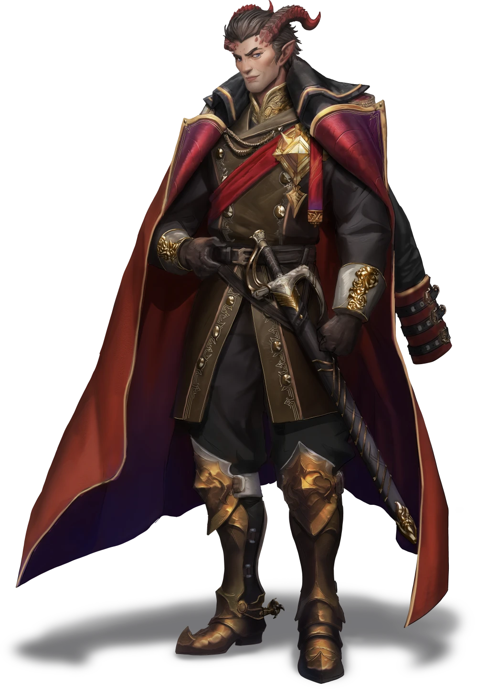
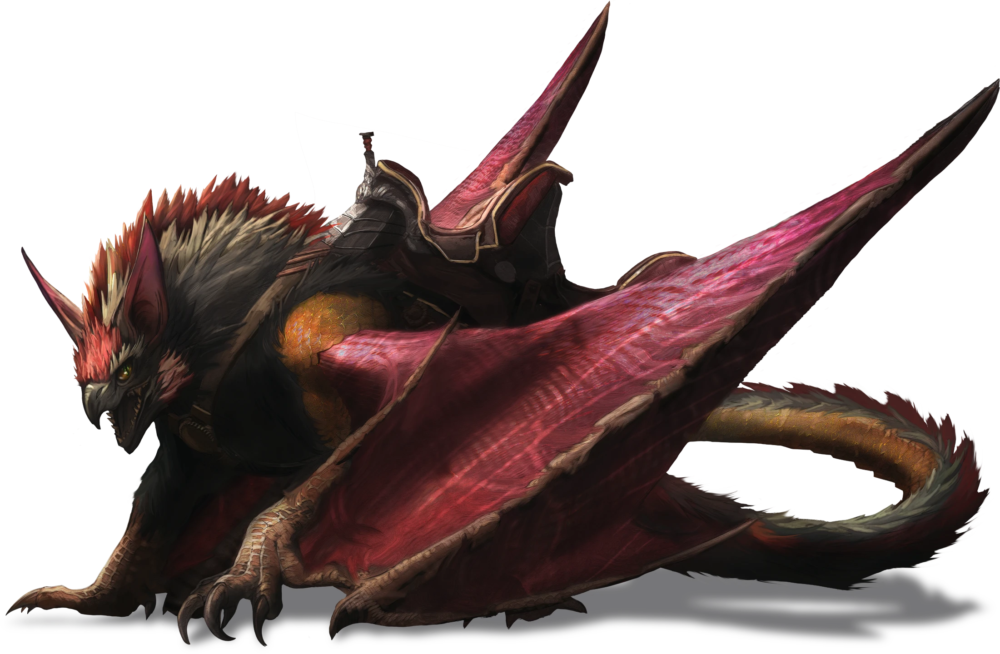

# Foreign Influence

> [!warning] Gamemaster
> #### Gamemaster's Summary
>
> This social event involves the party meeting and being extorted by the Tayan Ambassador [[Loris Tezran]] who is also a special agent to the crown. In this event the following should occur:
>
> - The party will be pressed into service, forced to help the ambassador under threat of punishment for a crime they likely didn't commit.
> - The party will be sent to meet with another ally/contact of the Ambassador in Coinwealth Heights.
> - The party will be able to learn a little bit about Tayan culture, and the Ambassador himself.

### Meeting the Ambassador

After the party states their business, and presents the messenger bag the attendant responds as follows:

> [!quote] Read Aloud
> > Ah, that is most fortunate. We received word that our courier was in the city, but had not seen them. Please, come inside, Ambassador Tezran will want to speak with you directly.
>
> You’re ushered through a cool, polished foyer and along a quiet corridor that opens into a manicured garden. Clipped hedges and white gravel paths frame a view of the city’s waterfront below. You’re invited to wait among marble benches, the attendant leaving you to sit in silence, yet you cannot shake the sensation of being watched.

> [!tip] Exploration
> #### Concealed Security
>
> Characters succeeding on a **Awareness (DC 16)** note that several of the windows above have armed guards watching the garden below. There are four of these sharpshooters in total, and they are watching the garden closely.
>
> - **Result of 21+** Though it's hard to see from this low vantage, the guards appear to be well armed with heavy crossbows or something similar, and would be firing from raised, concealed positions with ample cover. They would have a significant.

> [!warning] Gamemaster
> #### An Obvious Deterrent
>
> The presence of the armed guards here is meant to deter the players from choosing violence in the upcoming social encounter. While the Ambassador is a highly competent combatant himself, and has the aid of his trained mount, this is a layer of additional insurance.

> [!danger] Hazard
> #### Combat Diplomacy
>
> If the party does decide to escalate to violence for any reason, the four snipers act on initiative count 20, have a `[[/roll 2d20kh +6]]`{Ranged Attack} with a +6 bonus and advantage from their firing position. They deal `[[/damage 1d10 +4 piercing]]` damage on hit. They have an AC of 18 to hit (with cover) and 35 HP.

### The Ambassador Arrives

> [!abstract] Loris Tezran
> **[[Loris Tezran]]**
>
> Level 1 · Unknown Unknown
>
> 

> [!abstract] Ancara
> **[[Ancara]]**
>
> Level 1 · Unknown Unknown
>
> 

> [!quote] Read Aloud
> From the side of the building a shadow slips across the gravel as a massive winged creature stalks into view, talons clicking, its pinions rustling like heavy silk. It watches you with a predatory intensity that tightens the air.
>
> A heartbeat later, a regal man in red and black finery joins it, every line of his attire tailored to quiet authority. He lays a hand on the side of the beast.
>
> > Calm, Rakavi, they are guests.
>
> The beast exhales, posture easing, wings settling close to its sides as the Ambassador offers you a courteous nod.
>
> > I am Loris Tezran, Ambassador to Ordain from the Tayan Empire. I understand you've come into possession of some documents belonging to my office.

> [!tip] Exploration
> #### Host and Pet
>
> Characters with either the **Culture: Tayan** or **Path: Imperial Conscript** or making a successful **Society (DC 18)** check recognizes Loris Tezran as a famed commander of the Tayan Empire, and holder of the moniker "Redfiend" after his role in the bloody conquest of a Kelmezian city state some years ago.
>
> Characters that make a successful **Wilderness (DC 14)** check will know a bit about the ancara: Native to the Corebright Forest, Ancara roost in the massive trees, utilizing its natural agility to climb and glide swiftly. Largely carnivorous, it is an ambush hunter, dropping on prey from above, carried silently on its wings. This one appears to be of a unique color, has been branded as property of the Tayan Empire, and seems to have been trained as a war beast.

The party can engage in a bit of small talk with the Ambassador if they want, but once they hand over the messenger bag, the next part of this event begins.

### Imperial Ambition

> [!quote] Read Aloud
> The Ambassador lays out the documents from the bag, examining them one by one, taking note of the crushing damage and numerous broken seals on them. And air of displeasure brews around him like a storm, and eventually he looked to you, his voice taking on an edge:
>
> > You know, it is a high crime in the city of Ordain to tamper with official diplomatic documents. The seals are broken on nearly every document here, leaving me to question if they have been tampered with, or if sensitive knowledge has been gleaned about the innermost operations of my nation's diplomatic efforts.
> >
> > If I were less merciful, I'd have you all detained to be put before the Hallows and tried for espionage against a foreign dignitary. However, that is messy, and time consuming, and benefits neither of us.
> >
> > Instead, I'd rather you run some errands for me as compensation, then we put this whole debacle behind us.

> [!question] Q&A
> **Q:** We didn't open the documents!
>
> **A:**
>
> > So you say, but you have no proof and I have no evidence that these documents are opened by anyone other than you. You can claim unknown figures, or faceless murders carried out the act, but I see neither here right now. Perhaps the Hallows would side with you, but such cases take months to resolve, and you'd be jailed for the duration, I'd see to it.

> [!question] Q&A
> **Q:** What are the tasks?
>
> **A:**
>
> > They are very simple, and not even mine, truly. I need you to head to the Coinwealth Heights and visit with a woman known as Katerine Bastila, an important ally of mine. She has a handful of tasks she wants dealt with, and I've agreed to get her help on them. This means you. Once you've satisfied her task list, come back to me, and we'll settle up affairs.

### Responding to the Ambassador

> [!warning] Gamemaster
> #### No Easy Way Out
>
> The party is intended to be coerced into this course of action by the Ambassador. While it is possible for them to refuse to help, the offer remains open so that they can come back if they change their minds.

If the party does say no, they are able to leave without issue, and carry on with their adventure.

#### Elements Under Development

At present there are no repercussions for refusing to work with the Ambassador. If the party refuses they are free to go about their business and carry on their adventure unhindered. They will not be arrested or harassed unless you decide to do so as the gamemaster.

This may change in the future with additional events.

> [!question] Q&A
> **Q:** If the party threatens the Ambassador
>
> **A:**
>
> > I'm sure you've also noted that there are several guards in the windows above keeping watch over this meeting. They do not miss.
>
> The the party has expressed recognition of his title "Redfiend" he adds:
>
> > If you know who I am, then you also know what I am capable of. Do not test me.

If the party does accept to carry out the ambassador's tasks, he responds as such:

> [!quote] Read Aloud
> The Ambassador sweeps the documents into the bag and stands lifting it with him
>
> > Good, very good! I am pleased you've chosen to be reasonable. Seek out Katerin Bastilla at the Bastilla estate in Coinwealth, and handle the tasks she has for you. Once you've done them all, report back here, and we can put all this ugly business behind us.
> >
> > Endran will see you out.
>
> With that, the Ambassador takes his leave, though the massive ancara, Rakavi, remains in place, watchful and vigilant.
>
> A moment later an attendant appear, Endran you presume, and he gestures for you to follow.
>
> > This way, please.
>
> You are walked through the embassy to the entrance, and escorted to the front gates which clatter closed behind you.

Once the party is clear of the embassy they can carry on with this quest, or return to other matters.

### Concluding the Event

> [!warning] Gamemaster
> #### Next Steps
>
> Once the party has finished being coerced by the ambassador, they should head off to Coinwealth Heights to meet the ambassador's contact. If they want, they can also report this meeting to the Veiled Chain via the [[Coming Clean]] event.
