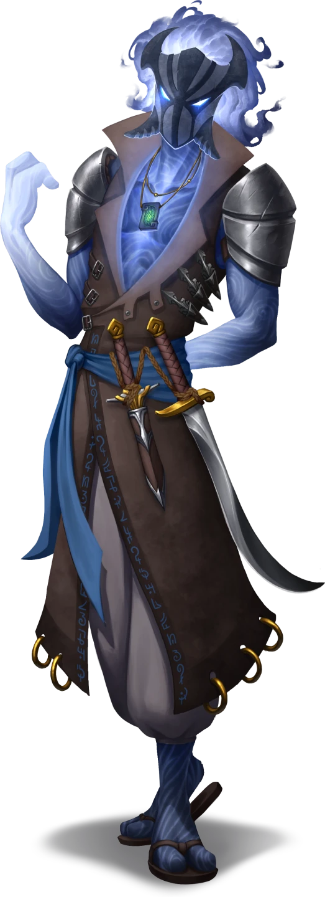

# Parcels & Pirates

> [!warning] Gamemaster
> #### Gamemaster's Summary
>
> In this combat event the party is tasked with collecting items from a pirate captain hired by Katerin Bastilla. However, this captain isn't going to be cooperative, and will require come convincing. This event will see the party:
>
> - Visit the *Ember's Bounty*, the massive flagship of House Bastilla, and famed haven for pirates.
> - Meet Gastern Faviyos and his wind raiders, and convince him to give up the items he has.
> - Engage in combat with Gastern, if negotiations fall apart.
>
> #### Area Walkthrough
>
> This event's gameplay transitions to the "Ember's Bounty" scene where the this event transpires. A complete room-by-room description of its environment occurs there is detailed in the [[Ember's Bounty]] area walkthrough. Text related to this event's resolution is retained in this event and should be referenced alongside the walkthrough.
>
> This area has several special rules and gameplay expectations, so it is advisable to review the [[Gameplay Details]] page either before or during the party's exploration of the location.

### Rules and Regs

> [!quote] Read Aloud
> Just aboard the ship the party is confronted by a burly sailor with a pair of swords slung from her belt. She holds out an arm, halting you briefly. Gruffly she speaks:
>
> > Rules aboard the Bounty are simple: No stealing, no killing, no damaging the ship.
> >
> > Break any of these rules and we throw you overboard and will have to swim for dry land, cause you ain't comin' back aboard after.
> >
> > Got it?

If the party refuses to agree to follow the rules they are told they can leave and come back once they do. They won't be let on the ship until they do. Otherwise, if the party agrees (or lies about agreeing) they are welcomed through without any further issue, and get the following narrative addition:

> [!quote] Read Aloud
> Inside, the ship stops feeling like a ship at all, instead you are greeted with a bustling space full of shops, distractions and vices to entice visitors.
>
> Laughter and haggling roll together with the chiming of coin. You hear the muted strains of a band's lively performance, but can't tell from which direction it comes. Somewhere in this vessel, on this deck, is the pirate you need to speak to.

### Finding Gastern

Locating Gastern should be fairly straightforward, as most named npcs should have had at least one unpleasant run-in with him or his crew by the time the party arrives. The way they talk about Gastern should leave the aprty the distinct impression that that crew is not fond of him or his Wind Raider cronies.

Asking around should reveal that Gastern can be found in the corner of the [[The Game Room]] next to the stage, with some of his crew.

### Speaking to Gastern

> [!abstract] Gastern Faviyos
> **[[Gastern Faviyos]]**
>
> Level 1 · Unknown Unknown
>
> 

Gastern and his crew of brigands are all cocky, mean spirited, and evil in alignment. They are self-serving, and have no regard for the party, or others, and only care about House Bastilla insofar as they can pay them for work. This is why Gastern remains an outsider privateer rather than being officially welcomed into the house.

> [!question] Q&A
> **Q:** Are you Gastern?
>
> **A:** I am. Who’s asking?

> [!question] Q&A
> **Q:** What are the items?
>
> **A:**
>
> > Kessian-designed wingsuits, each one has adjustable harnesses to fit nearly anyone. Expensive, not that we paid much for them...
>
> Though their mask is fixed, you can hear the grin and mean spirited amusement in their words. His cronies chuckle along with him.

> [!question] Q&A
> **Q:** Can we have the package?
>
> **A:**
>
> > Sure! Just hand over five hundred gold pieces first.

> [!question] Q&A
> **Q:** You were already paid.
>
> **A:**
>
> > I was. In fact, I was paid to get them for Katerin, not you. So if you want them, you’ll pay me too. Just the cost of doing business out on the water.

> [!question] Q&A
> **Q:** Do you care that Katerin sent us?
>
> **A:**
>
> Gastern scoffs.
>
> > Not even a little bit. Katerin can come get them herself, or you can pay me to care.

> [!info] Social
> #### Persuading a Pirate
>
> Gastern can be talked into handing over the crate of wingsuits with a successful **Diplomacy (DC 20)** check. Otherwise he'll only hand them over if given 500 gold, intimidated, or defeated.
>
> #### Negotiating Price
>
> He can be negotiated down to 300gp with an easier, successful **Diplomacy (DC 14)** check. Characters with **Knowledge: Trade** have advantage on this roll.
>
> - **Result of 19+** Gastern will agree to drop the price to 150 Gold Pieces.
>
> #### Talking Tough
>
> The party can attempt to intimidate Gastern and his henchmen, but need to make a successful **Intimidation (DC 18)** check. Failing this check by 5 or more results in Gastern becoming hostile.

#### Primordis Attunement: Convincing the Corsairs

Each character who uses their social skills to persuade, intimidate, or negotiate with Gastern Faviyos to acquire the wingsuits advances their **Attunement: Primordis (+1)** at the conclusion of the event.

### Fighting Gastern

> [!danger] Hazard
> #### The Hard Way
>
> Gastern is backed up by a group of Windraider Pirates. Should a fight break out, they fight with their bare hands unless the party draws their weapons first. Gastern will back down if his health is reduced to half its maximum, and his pirates will stop fighting if he does.
>
> Adhering to the laws of the Ember's Bounty, they won't kill the party if they win the fight, but will take some of their money or valuables while knocked out.

Upon defeating Gastern in combat, he yields.

> [!quote] Read Aloud
> Gastern throws up their hands, attempting to ward you off.
>
> > Katu's balls, all right, all right, enough! Back off. You can have the damned package, it's not worth this much trouble, and I'm certainly not dying for the old sea hag's ambitions.
> >
> > We stashed them inside a dark chest with brass fittings outside, across from the smoke hut. Go get them and get lost!

#### Ragen Attunement: Clobbering the Corsairs

Any character who engaged in combat with Gastern Faviyos advances their **Attunement: Ragen (+1)** at the conclusion of the event.

### Finding the Stash

The party may suspect that the items they are meant to pick up are somewhere on the ship, and they would be correct. The party can attempt to locate the items without needing to deal with Gastern, but they will need a little information to work with first.

> [!tip] Exploration
> #### Eavesdropping
>
> A successful **Stealth (DC 16)** check nearby but out of sight of Gastern and his pirates allows a party member to listen in on Gastern's conversation with his pirates. Alternatively, a character may blend in with nearby patrons with a successful **Deception (DC 16)** check. They have disadvantage on this check if Gastern and his pirates have already interacted with the party and has seen them before.
>
> In either case, successfully listening in reveals that Gastern has stashed the items on the ship in a nearby room. With this information in-hand, the party can search the surrounding spaces and find the stash of items, collecting them without having to persuade, pay, or fight Gastern.

#### Mayis Attunement: Patient Observation

Any character who successfully eavesdropped on Gastern and his band to learn the location of the stash advances their **Attunement: Mayis (+1)** at the conclusion of the event.

### Concluding the Event

> [!warning] Gamemaster
> #### Next Steps
>
> Once the party has finished with Gastern and the *Ember's Bounty*, they can move on to Katerin's other job if they haven't completed it yet, or move on to depositing the items at the Spellbreaker Tower if they've completed all the jobs given to them.
