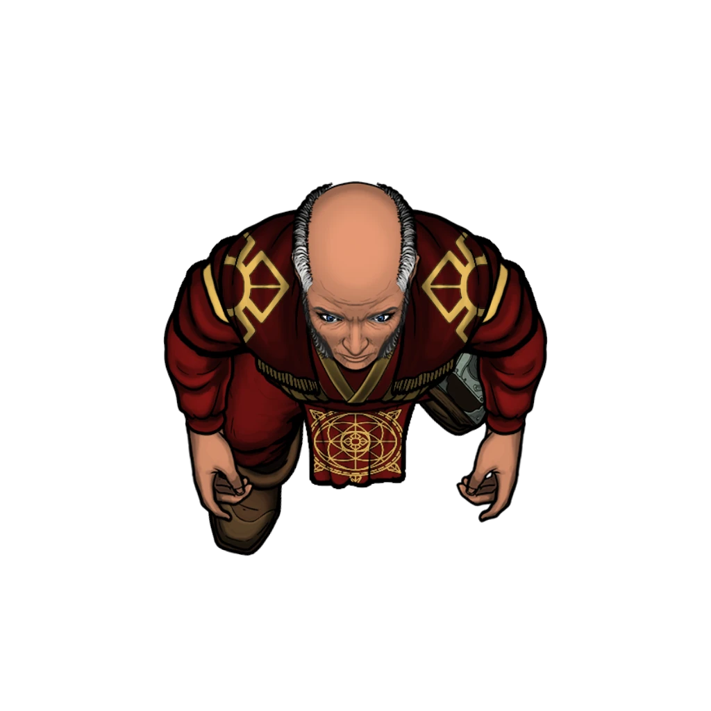

# Visiting Hours

> [!warning] Gamemaster
> #### Gamemaster's Summary
>
> This exploration event sees the party visiting the Spellbreaker Tower to drop off the items they acquired while working for Katerin Bastilla. The contact they are speaking to is a guard in the tower, and in return they'll get a packet of info in return. This event entails:
>
> - Exploring the lower level of the Spellbreaker Tower and the healing house.
> - Interact with the Cindaric Sage in charge the healing house, learning about them and their position.
> - Learn about the Spellbreaker Tower and gain insight into what they are working toward in this quest.

### Delivering the Items

The party can tell the guard they are making a delivery, and they will understand. The party doesn't have to namedrop Katerin Bastilla, or House Bastilla, but can if they want.

- To deliver the wingsuits the party needs to have acquired to get the wingsuits from the *Ember's Bounty*. How they did this doesn't matter as long as they didn't mark the [[Parcels & Pirates]] outcome.
- To deliver the autotool, the party needs to have [[Three Point Lift]] from the Cascillian warehouse on the docks.

If the party has no items to deliver read or paraphrase:

> [!quote] Read Aloud
> The guard looks at you like you've grown a few extra heads:
>
> > I was told you'd be delivering some items. If you don't have them, I can't help you. So… is there anything you want me to take?

The party can still give the guard items they want smuggled into the tower if they choose.

Otherwise they read or paraphrase this passage:

> [!quote] Read Aloud
> The guard takes the items off of you, and takes a few minutes relocating them into a large rucksack. They pause a moment and ask:
>
> > Anything else you want me to take?

The party can give the guard additional items to smuggle into the prison levels if they want.

> [!question] Q&A
> **Q:** What will you do with them?
>
> **A:**
>
> > Take them into the tower and stash them. Wait, were you not informed … ?
>
> A wave of their hand makes it clear they don't want to continue this line of thought.
>
> > You know what? Not my problem. If you want me to take anything, hand it over. Just understand anything magical you give me will be worthless in the tower.

Once they have handed over any items they want stashed, the guard will cinch up the rucksack and leave.

### Meeting Jonico

> [!quote] Read Aloud
> Manning a reception desk is an older fellow with silver-streaked hair and wire-rimmed spectacles. Seeing you standing about, waiting for the guard to return he whistles at you, and gestures for you to come his way.
>
> > C'mere! Why're you just standing around in my lobby?

> [!abstract] Jonico Daridane
> **[[Jonico Daridane]]**
>
> Level 1 · Unknown Unknown
>
> 

> [!question] Q&A
> **Q:** Your lobby?
>
> **A:**
>
> > I'm the head of the ground level, the Foundation we call it, so yes, my lobby.

> [!question] Q&A
> **Q:** Who are you?
>
> **A:**
>
> > Chief Healer Jonico Daridane, head of the Foundation, and elder sage of the Cindarics.

> [!tip] Exploration
> #### A Familiar Name
>
> Charactgers with **Knowledge: Politics** or **Path: Cindaric Initiate** or making a successful **Society (DC 14)** check recognizes the name, and that he was once also a member of the Ordinate council but was recently replaced.

> [!question] Q&A
> **Q:** Weren't you on the Ordinate council?
>
> **A:**
>
> > Yep, sure was! Not anymore though, and I certainly don't care. It's a big popularity game these days, and I'm not the game-playing sort. I'd rather show up, do the work, and get things done.
> >
> > Vinarith likes his little cult of personality and weeding out anybody who doesn't immediately agree with whatever bout of self-serving, ego-stroking soapbox he's decided to stand on that day.
> >
> > Well, I was one of those weeds.

> [!question] Q&A
> **Q:** Why are you manning the lobby?
>
> **A:**
>
> > I'm giving the woman who works here a break. Besides, I'm not to good to do the low-level stuff now and again.

> [!question] Q&A
> **Q:** Don't you have other people for that?
>
> **A:**
>
> > Hey, hey, hey, I don't show up randomly in ancient ruins or whatever telling you how to do your job. So don't come into my lobby and tell me how to do mine. Also no, I don't, there was a scheduling issue.

> [!question] Q&A
> **Q:** What is the Foundation?
>
> **A:**
>
> > It's the largest Cindaric healing house in the city, and the only one where no magic is used. We specialize in healing techniques that utilize existing traditional knowledge, and newly pioneered methods to mend bodies. We also work on studying and breaking magical maladies, curses, illnesses, and the like.

> [!question] Q&A
> **Q:** Who built the tower?
>
> **A:**
>
> > Well now that's an interesting story!
> >
> > The tower is some six centuries old, built by one person: Avilla. Now, it's worth noting that she was special, being as she was the first Shard God of Ordain. She shaped the tower from the very spire of ancient basalt the whole district is built on, and imbued the tower with its anti-magic properties.
> >
> > As for the Foundation and apartments built into the other levels of the tower, those were established many years later. The newest addition was the prison on the upper levels, having been built a few decades ago.

For more the on history of the tower see [[The Spellbreaker]]. Jonico is well versed on the topic, and can speak at length about the history of the tower if asked.

> [!question] Q&A
> **Q:** What is the tower used for?
>
> **A:**
>
> > Tower's used for quite a lot, actually!
> >
> > Beyond the Foundation levels you have a collection of dormitories, apartments, and communal spaces set aside for people that are suffering from magical maladies, curses, afflictions, and the like. Since the tower suppresses all magic inside itself and the district, this is a haven for people who couldn't live normal lives elsewhere.
>
> > Past that, the top levels are a prison, but that's not my domain.

> [!question] Q&A
> **Q:** Do you also oversee the rest of the tower?
>
> **A:**
>
> > Yep, that falls under purview of the Foundation healing house. We even provide healing service to the prison levels, making sure the people there are kept healthy.

> [!question] Q&A
> **Q:** Who is in charge of the prison?
>
> **A:**
>
> > Warden Cyran Holst, my counterpart here, sort of.

> [!question] Q&A
> **Q:** Who is kept in the prison?
>
> **A:**
>
> > It's a prison, so it mostly has criminals in it. But I also send people to be held temporarily if they have intermittent curses that make them a danger to other people. Prison's not my responsibility, as a note, you'd want to talk to Warden REFERENCE about how they run things.

### Delivery Confirmation

If the party is still talking to Jonico:

> [!quote] Read Aloud
> While speaking to Jonico you noticed the guard return, carrying a thin leather satchel in his offhand. As he draws near he nods at you but turns to address the healer, saying:
>
> > Healer Daridane, if you don't mind, I need to have a word, and hand off a delivery.
>
> He holds up the satchel, giving it a shake.
>
> In response Jonico throws up his hands defensively.
>
> > All right then, don't mind me. I'll just leave you to your prison business, and go back to what I was doing.
>
> At that, he turns and walks off without so much as a goodbye. The guard then looks back to you, and offers the satchel, saying:
>
> > Your shipment was received, here are the documents you're expected to deliver. Come this way, I'll show you out.
>
> The guard gestures toward the doors, intending to escort you out.

Otherwise, if the party is done speaking with Jonico:

> [!quote] Read Aloud
> The guard returns, carrying a thin leather satchel in his offhand. As he draws near he nods at you and offers the satchel, saying:
>
> > Your shipment was received, here are the documents you're expected to deliver. Come this way, I'll show you out.
>
> The guard gestures toward the doors, intending to escort you out.

The party is given both a [[Report on Toron]] and [[Spellbreaker Intel]]

### Clandestine Documents

If the party chooses to look at the documents they are handed, it includes several diagrams and writeups on the prison levels of the Spellbreaker tower, as well as a report on one of the prisoners there, a Tayan spy named Toron.

> [!tip] Exploration
> #### Information on Prison
>
> Like the rest of the tower and district, the prison area is devoid of magic. Spells, magic items, and some magical abilities possessed by beings cease functioning entirely. This means everything in the prison levels is mundane in nature, with the exception of some Cascillian technology.
>
> The prison is patrolled mostly by prison guards who are lightly armed at all times. In times of riot or crisis the guards can gear up with heavier equipment from the armory. There is also a Cascilian Surge Walker machine available if things get out of hand.
>
> #### Prison Levels
>
> The prison is contained in the topmost six levels. Internally, the prison levels are broken up across multiple floors and movement between levels is highly restricted and managed through secured gates. The distinct floors are as follows:
>
> **Guard Barracks**
>
> Temporary housing for on-duty guards. Usually contains at least 8 guards at all times, up to 16 during the day. These guards are on-call to respond to issues, and rotate watch with other guards on higher levels. Guard armory is here.
>
> **Visitation/Medical**
>
> A medical ward, waiting area, visiting area, and temporary holding space is here. Newly arrived inmates may be held here, but inmates seeing visitors are also brought down here.
>
> **Blue Block**
>
> Dedicated to lower threat individuals, this is the minimum security area that allows prisoners the most freedom. Physical security is somewhat relaxed here.
>
> **Yellow Block**
>
> Yellow Block holds individuals considered highly dangerous and employs heavier security, frequent searches, and has more restricted movement.
>
> **Red Block**
>
> The uppermost and most secure level. Here, prisoners are isolated in reinforced cells under constant monitoring, and the most restrictive routines. Entry is limited to senior staff and only under the strictest protocols.
>
> **Warden's Office**
>
> The penultimate level of the tower holds the warden's office, and their personal gallery and meeting spaces. The prison levels are administered from this location.
>
> **Tower Roof**
>
> The top level of the tower is a natural garden/terrace accessible only by prison staff.

The report on Toron is far less extensive, but does specify where they are being kept and how they ended up in prison. At this point the party won't know why Toron matters, but they should be beginning to get an idea of what the mission is if they haven't already figured it out.

> [!tip] Exploration
> #### Report on Toron
>
> Toron, Prisoner number 15874, is a Tayan national, human male. Their record states they are trained in martial and magical combat, intrusion, and general skullduggery. Their magical capacity is noted as being significant, and combined with their reported skillset they have been assigned to a cell in Yellow Block.
>
> They were arrested in the Ordinate when security wards went off, alerting the evening watch to their presence. The ensuing pursuit resulted in several minor injuries and one life threatening but nonfatal injury before they were cornered and captured. They were charged and convicted of assault with a weapon, assault with intent to maim, in addition to multiple counts of espionage and theft against the Ordinate and its member entities.
>
> They are presently being held until the Ordinate determines a proper diplomatic response to the presence of a Tayan spy in the city. The Tayan Embassy has not yet been informed of this arrest, but will be once diplomatic channels are opened.

### The Waiting Courier

> [!quote] Read Aloud
> As you leave the Spellbreaker Tower a figure wearing a bright orange sash around their waist and a crisp double breasted coat approaches you. You quickly spot the gold ship's wheel pinned to their chest — a House Bastilla agent.
>
> They move with you, speaking casually:
>
> > Lady Bastilla sent me to give you some further instructions, and take something off your hands.

> [!question] Q&A
> **Q:** What's the message?
>
> **A:**
>
> > She wanted me to inform you that now , since all your tasks are done, you're meant to report to the Tayan Embassy for a meeting. I'd recommend you not waste their time, and go soon as you're able.
>
> He pauses then adds:
>
> > Before you ask, no, I don't know any details about the meeting. But I do know you're reporting to the boss directly, and not many people do that in Bastilla, let alone outside it. Don't waste an opportunity other people would kill for...

> [!question] Q&A
> **Q:** What are you taking?
>
> **A:**
>
> > She said you were overseeing delivery of sensitive documents from the tower. I was sent to get them from you, and see them on their way back to her for study. I was also told not to leave until I got them from you.

Once the party hands over the documents, the courier takes their leave, and moves with purpose. If the party chooses to follow them, their trail ends at Katerin's private estate in Coinwealth Heights, a location they won't be let back into.

### Concluding the Event

> [!warning] Gamemaster
> #### Milestone Progression
>
> Completing this event awards a [[Milestone Progression]] point, potentially enabling the party to advance in level.
>
> #### Next Steps
>
> Once the party has finished at the tower they can move on with the next steps in the quest. From this point they'll need to report back to the Embassy and Ambassador Tezran as part of [[One Last Thing]], but they could also report their recent actions to the Veiled Chain via the [[Coming Clean]] event.
