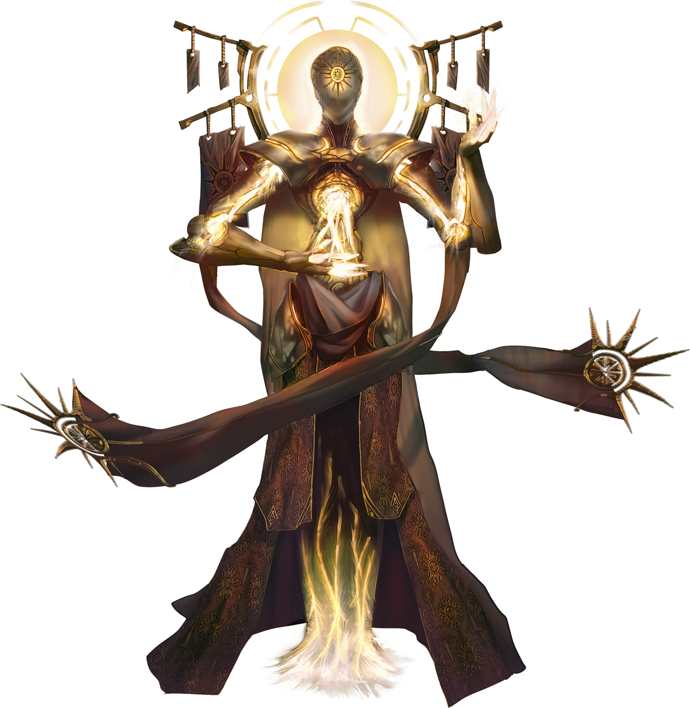

# Not All Who Wandren

> [!warning] Gamemaster
> #### Gamemaster's Summary
>
> This Combat and Exploration Event occurs when the party enters Wandren HQ. In this Event, the characters can:
>
> - Find and rescue [[Funar Cevher]].
> - Discover the Inner Chamber by activating switches throughout the facility.
> - Meet an imprisoned [[Tyraphem]] and potentially receive their help.
> - Confront [[Hephiss Wandren]] and her master, [[Projection of Pyix]], a celestial.
> - Escape via [[Lantern Roads]].
>
> #### Area Walkthrough
>
> The party begins in the [[Lantern Roads]] Scene, where the central gameplay of this Event transpires. A complete description of Wandren HQ and the gameplay that occurs there is detailed in the [[Lantern Roads]] Area Walkthrough.

### Locating Funar

If the party is carrying the Locator Rod with them, it reacts as they enter Wandren HQ:

> [!quote] Read Aloud
> The locator rod you are carrying with you begins to move, swinging itself toward the wall immediately ahead of you.

While within Wandren HQ, the party can get new results from the [[Locator Rod]] — in the room they enter, the [[Stairway Entrance]], the Locator Rod indicates that Funar is in an adjacent room.

> [!warning] Gamemaster
> #### Indicators of Funar's Presence
>
> In addition to use of the [[Locator Rod]], the party can learn Funar's location within Wandren HQ from any of the following:
>
> - If the party learned that Funar was being held beneath the Marlstone Manor dining room, they can triangulate his current position on the floor below with a successful `[[/check investigation 16]]` check.
> - While within the Central Chamber, party members can potentially hear Funar banging on his prison cell wall, as noted in [[Central Chamber]].
> - If party members defeat the Aburyx in the [[Training Room]] and search its desk, they can find a list of prisoners, which includes Funar Cevher.
> - Once the party has reached the [[Holding Cells Antechamber]], characters can clearly hear Funar yelling for help.

While the door to the [[Holding Cells]] is locked, the party can speak to Funar through the wall.

> [!info] Social
> #### A Conversation with Funar
>
> Funar is thrilled to have help on the way, but wary of strangers. If Lyla is with the party, he will share everything he knows. If she is not with the party, characters can persuade him that they are friends of Lyla with a successful `[[/check persuasion 16]]` check or by sharing a piece of information about Lyla that only someone who knows her well would know.
>
> Funar can share the following:
>
> - He was on his way to see his uncle Darius when he was ambushed and woke up here. He isn't sure who ambushed him, but the guards brought him an article showing that Darius was killed and he is being blamed.
> - He was injured during the ambush. It isn't life-threatening, but he could use some medical assistance once the party has left.
> - The guards who come to see him look human, but something about them is off. They speak as if they aren't used to forming the words they are saying.
> - He is the only prisoner in these cells, but there was another prisoner, who appeared to be made of light — they were briefly in the holding cells while being questioned in some language he does not understand, but almost escaped and were moved elsewhere.
> - He believes the controls to the holding cell doors are somewhere in a central chamber and has heard a grinding or scraping sound in that direction just before the guards appeared in the area.
> - Funar believes the prisoner is still in the facility and wants to rescue them before leaving.
>
> Once Funar is freed from the cells and the party is ready to leave, he focuses on keeping up with the group and delays any conversation until after they escape.

> [!question] Q&A
> **Q:** Is Funar okay?
>
> **A:**
>
> > Thank you for the inquiry. In truth, I am not in the best possible state, but my injuries are not life threatening. I will be ok. I would welcome medical attention, but it can wait until we are far away from this place.

> [!question] Q&A
> **Q:** How he was imprisoned
>
> **A:**
>
> > Some ruffians grabbed me from the street while I was on the way to see my uncle Darius — may his soul return unburdened — about a business matter. I don't recall much of the attack — one moment I was choking on the air around me, and the next I was here, being given food and information by these very peculiar guards.

> [!question] Q&A
> **Q:** Darius' death
>
> **A:**
>
> > I know what happened to uncle Darius. One of the guards brought me a copy of that horrible gossip rag Overheard in Ordain, so that I would know that he was dead and know that I was being blamed for it.

> [!question] Q&A
> **Q:** The guards
>
> **A:**
>
> > I have tried to befriend the guards to gain information and better treatment, but there is something odd about them. They move in a somewhat stilted manner, and speak as if their tongues aren't quite used to the words they are saying. Occasionally I have heard them use another language — the same language they used when questioning the other prisoner who was here — and then they seem as if the words are more familiar.

> [!question] Q&A
> **Q:** Operating the door/How the facility works
>
> **A:**
>
> > When the other prisoner who was here escaped, I was able to get a little information about how things work — there's some sort of central chamber that holds the controls for the door to this area. I'm not sure how it works, but sometimes I hear a grinding or scraping sound in the distance before they come to bring me food — it may be connected.

> [!question] Q&A
> **Q:** Another prisoner
>
> **A:**
>
> > For a while, there was another prisoner back here with me — I didn't really get a full glimpse, but when they were around, it was like the whole area was filled with some sort of glowing light. I wonder if it was a power they had, because there was a huge bang not long after their arrival — I heard some of the guards say the word escape, and I'm pretty sure they dragged the prisoner to somewhere else in this place. I want to make sure we take them with us — no one should be left down here to rot.

To release Funar, the party will need to reach the Holding Cell controls, which are located within the facility's Central Chamber.

### Reaching the Central Chamber

The metal domes in the facility's [[Central Chamber]] are set into grooves in the floor and can be rotated. The rotation for each groove is controlled from a wheel attached to a wall elsewhere in the facility, as follows:

> [!tip] Exploration
> #### Location of Dome Controls
>
> - **The Outer Dome:** Controls located in the Training Room. It rotates clockwise, with its opening moving between the 12:00, 3:00, 6:00, and 9:00 positions. When the party arrives, the opening is in the 6:00 position, facing south.
> - **The Middle Dome:** Controls located in the Construction Room. It rotates counter-clockwise and is mostly northern-facing, with its opening moving between the 10:00 and 2:00 positions. When the party arrives, the opening is in the 10:00 position, facing northwest.
> - **The Inner Dome:** Located in the Blessing Room. It rotates counter-clockwise, and its opening can stop on any position on the clock, always landing on the hour position. When the party arrives, the opening is in the 9:00 position, facing east.

#### Work in Progress

In future releases, interacting with the switches within Wandren HQ will rotate the central sections of the chamber as noted above, giving the party the direct challenge of lining them up to reach the chamber inside.

### Meeting the Prisoner

Once the party enters the central chamber, they immediately encounter a being encased in a cage of light. If they attempt to cross through into the cage of light, or call out to it, it speaks to them:

> [!quote] Read Aloud
> The creature inside of the cage of light suddenly speaks. Their voice is raspy and strained, and the words are in a language far different than Ember's common tongue.

> [!info] Social
> #### A Conversation with the Prisoner
>
> Any character who knows **Language: Harmos** can translate the words being spoken as:
>
> > Please, help me. I am being held prisoner here.
>
> If they reply using Harmos, the prisoner acknowledges in Harmos before switching to Common:
>
> > You speak to me like someone from my homeland! But your companions seem confused. Let me switch to Ember's common tongue.
>
> Any character who does not know **Language: Harmos** and makes a **Society (DC 16)** check can identify it as the language primarily used by creatures from the Inner Realm Luxarum.
>
> - **Knowledge: Celestials**: The character automatically succeeds on this check.
>
> If no one in the party replies to the prisoner, they switch languages on their own:
>
> > I am sorry. I should speak the common tongue. I am just so tired. Please, I need your help to get free of this place. I am being held prisoner here.
>
> The prisoner is happy to share anything they can with the party, but is faltering physically. Their language is increasingly halting as they go. Any character who makes a successful **Medicine (DC 12)** or **Deception (DC 12)** check can tell that they are in some sort of physical distress, and are exhausted and scared.
>
> They can reveal the following before collapsing:
>
> - Their name is Yllith and they are a Tyraphem from Luxarum known as one of the Architects of Light for their building skills. They have been captured and held here to help build this facility.
> - The being who holds them here is just a disembodied voice, but whoever it is is trying to create a factory to create celestial creatures here on Ember.
> - To release them, the party must press the glowing panels in the central control room at the same time. This will deactivate the prison and raise the door to the holding cells, where a human is being held captive.
>
> After conveying this information, Yllith collapses and can't say much more, moaning about the glowing panels if asked any further questions.

> [!question] Q&A
> **Q:** Who they are
>
> **A:**
>
> > I am Yllith, and I am far from my home, Luxarum. There, among my fellow Tyraphem, I am known as an Architect of the Light, one blessed with the ability to create buildings that honor my allies and destroy my enemies. Now I can go nowhere but this prison. Not without your help.
>
> As Yllith finishes their speech, they breathe heavily, and their body slumps ever so slightly.

> [!question] Q&A
> **Q:** Luxarum/The Tyraphem
>
> **A:**
>
> > Luxarum is one of what you call the Inner Realms and I call the Three — three realms of the Weave, far away from this small piece of land. The other two, Primordis and Signara, are of little consequence, but Luxarum is a place of holy light and we Tyraphem who dwell there fight for the right to be the keepers of its glory.
>
> Yllith gasps with a rattling sound, body slightly trembling.

> [!question] Q&A
> **Q:** Their Captor
>
> **A:**
>
> > I do not know the name or form of the Tyraphem who bound me here — only their voice and their creatures show up here, trying to force me to build something that will turn the mortals of Ember into something new, fit for a holy war.
>
> Yllith's voice rises in volume as they finish their speech, then dissolves into a fit of coughing.

> [!question] Q&A
> **Q:** Releasing Them/Funar
>
> **A:**
>
> > Please — yes, get me out of here. Then I will share anything else I can. I begin by sharing this — you must press all four of the glowing panels at the same to turn off this horrible contraption. Then I can regain my strength and be free of this place.
>
> Yllith's voice is growing weaker, and as they finish answering, they collapse and cannot be roused again.

#### Heart Attunement: Prisoner Released

Any character who frees the Tyraphem Yllith from captivity advances their **Attunement: Heart of Ember (+1)** at the conclusion of the Event.

### A Final Battle

Once the party has successfully opened the prison and holding cells, Hephiss Wandren enters from the vault stairway.

> [!abstract] Hephiss Wandren
> **[[Hephiss Wandren]]**
>
> Level 1 · Unknown Unknown
>
> 

> [!quote] Read Aloud
> Hephiss enters the center chamber with fast steps that echo against the floor, still wearing her gala finery.
>
> > You got this open! Though if you found your way down here, I suppose I shouldn't be surprised. And say thank you. All that tromping around my party pretending to be spies and ruining the ambiance — it was all worth it. I've been telling Pyix for ages that I'm more than just some landlord of his facility or procurer of power — I can be a giver of life just like he can! And now I'm going to prove it.
>
> Hephiss steps forward, only to be interrupted by the appearance of a creature that has more in common with the one trapped in the cage than anything you've seen on Ember.

> [!abstract] Projection of Pyix
> **[[Projection of Pyix]]**
>
> Level 1 · Unknown Unknown
>
> 

> [!quote] Read Aloud
> The image speaks, its voice seeming to come from everywhere and nowhere at once.
>
> > You've been telling me what exactly? Oh child, you really do seek to outstep yourself at every turn. I hate when a tool becomes more trouble than it's worth. Eventually, you have to throw it away. Or do you forget what's beneath that gold you wear so proudly?
>
> The image waves its hands, and the gold on Hephiss' gown begins to glow, not unlike the glowing cage that stood in the center of the chamber. She hisses, in what can only be pain and frustration, gritting her teeth as a wave of something you can't identify seems to pass from her clothes into her body.
>
> > A reminder that you made your choice long ago. When you agree to work with Pyix, you don't get to decide the terms. Your life is at my command. And I command you to get rid of these intruders — and the prisoner — or you will live just long enough to regret it. And just in case you think about fleeing? The door behind you is now locked. Whatever happens, it's in your hands.
>
> The projection disappears, and Hephiss' gown is once again nothing more than fabric and gold. She turns toward you and whispers, almost under her voice.
>
> > Getting rid of these infiltrators? That, at least, we agree on.

> [!danger] Hazard
> #### Hephiss Tactics
>
> At the start of combat, [[Hephiss Wandren]] will move to a console inside the Central Chamber and use her Call for Backup feature to call for reinforcements.
>
> Over the course of combat, Hephiss will prioritize the following actions and abilities:
>
> - In melee, Hephiss will use her [[Radiant Dagger]].
> - From range, Hephiss will use her [[Necklace of Power]].
>
> #### Celestial Support Tactics
>
> [[Aburyx]] that support Hephiss will attack the strongest character they can find with their [[Cleaving Light]] and summon Skithers to defend Hephiss with [[Beckoning]].
>
> [[Kynryth]] that support Hephiss attack without regard for their own safety, expending their [[The Light Within]] to quickly reach the party and do more powerful attacks until they are down to 1 portion, at which point they switch to conventional attacks.

> [!tip] Exploration
> #### Looting Hephiss' Items
>
> Hephiss' [[Ashen Cloak]] disintegrates when she dies, and the [[Necklace of Power]] are attuned to her and useless when used by anyone else. The party can collect the [[Radiant Dagger]] from her body.

Once the battle is over, the prisoner Yllith may either be dead or alive.

`[[/outcome captiveFreed]]`

`[[/outcome captiveDied]]`

If alive, they thank the party before vanishing:

> [!quote] Read Aloud
> With a cough, the once-imprisoned creature slowly raises its arms, as if summoning what is left of its strength.
>
> > Thank you. I must recover from my injuries somewhere … else, but I promise — I will repay you.

The projection of Pyix reappears:

> [!quote] Read Aloud
> With a flicker, the strange creature of light returns.
>
> > Why am I not surprised? Hephiss had her uses, but they were just about at an end. Though I am sad to lose my special guest — I was just starting to get a bit of cooperation out of them. It's all about finding the right motivation.
> >
> > Luckily, you seem just as interesting. If I were there, of course, you'd be interesting bodies, but as it is, I will keep my eye on you. If you make it out of my facility, that is. There are big things in store for Ember, and I don't intend to let you get in our way.
> >
> > Kynryrth, rise!
>
> With a gesture, the projection vanishes in a burst of light.

> [!danger] Hazard
> #### Newly Arisen Kynryth
>
> Any [[Kynryth Husk]] in the facility who were previously inactive or in stasis immediately activate and begin pursuing the party, using the tactics noted above. It is likely in the party's best interest to escape rather than fight, as the Kynryth will take time to reach them and the exit is close by.

### Leaving Wandren HQ

The best route out of Wandren HQ is for the party to leave from the [[Training Room]] through the [[Storage Room]] and out through Lantern Roads. If Funar has been successfully freed from captivity, note the outcome below.

`[[/outcome funarRescued]]`

The Beacon Brigade still lurks in this area, behaving as noted in [[Area Overview]], and the party may choose to use stealth or combat as they flee the area.

### Concluding the Event

The party makes its way away from the immediate dangers of the Marlstone Manor underground facility, though there is still much to discuss.

> [!warning] Gamemaster
> #### Milestone
>
> Completing this Event earns the party 1 [[Milestone Progression]], potentially advancing them in Level.
>
> #### Next Steps
>
> Once the party has escaped Wandren HQ, they may reunite with their allies and discuss what happened in the [[Aftermath]] Event.
