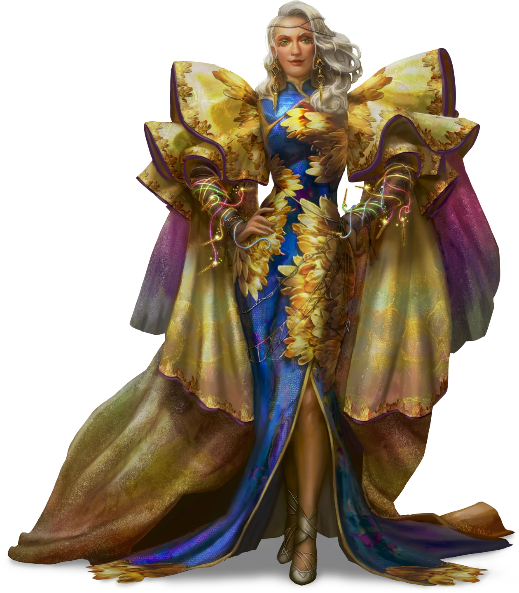

# Not All Who Wandren

> [!warning] Gamemaster
> #### Gamemaster's Summary
>
> This Combat and Exploration Event occurs when the party enters Wandren HQ. In this Event, the characters can:
>
> - Find and rescue [[Funar Cevher]].
> - Discover the Inner Chamber by activating switches throughout the facility.
> - Meet an imprisoned [[Tyraphem]] and potentially receive their help.
> - Confront [[Hephiss Wandren]] and her master, [[Projection of Pyix]], a celestial.
> - Escape via [[Lantern Roads]].
>
> #### Area Walkthrough
>
> The party begins in the [[Lantern Roads]] Scene, where the central gameplay of this Event transpires. A complete description of Wandren HQ and the gameplay that occurs there is detailed in the [[Lantern Roads]] Area Walkthrough.

### Locating Funar

If the party is carrying the Locator Rod with them, it reacts as they enter Wandren HQ:

> [!quote] Read Aloud
> The locator rod you are carrying with you begins to move, swinging itself toward the wall immediately ahead of you.

While within Wandren HQ, the party can get new results from the [[Locator Rod]] — in the room they enter, the [[Stairway Entrance]], the Locator Rod indicates that Funar's earring is to the south.

> [!warning] Gamemaster
> #### Indicators of Funar's Presence
>
> In addition to use of the [[Locator Rod]], the party can learn Funar's location within Wandren HQ from any of the following:
>
> - If the party learned that Funar was being held beneath the Marlstone Manor dining room, they can triangulate the current position of his earring on the floor below with a successful `[[/check investigation 16]]` check.
> - While within the Central Chamber, party members can potentially hear Funar banging on his prison cell wall, as noted in [[Central Chamber]].
> - Once the party has reached the [[Holding Cells Antechamber]], the characters can more clearly hear him banging on the pipe in his cell.

### Rescuing Funar

Funar is located in one of the facility's [[Holding Cells]]. In order to release him, the characters must reach the facility's controls in the [[Inner Chamber]]. Refer to the Area Walkthrough text for more information.

### Reaching the Inner Chamber

To reach the [[Inner Chamber]], the party must align the concentric domes in the facility's [[Central Chamber]]. Refer to the Area Walkthrough text for more information.

### Meeting the Prisoner

Once the party enters the [[Inner Chamber]], they encounter an imprisoned Tyraphem named Ylith. Refer to the Area Walkthrough text for more information.

#### Heart Attunement: Prisoner Released

Any character who frees the Tyraphem Ylith from captivity advances their **Attunement: Heart of Ember (+1)** at the conclusion of the Event.

### A Final Battle

Once the party has successfully opened the prison and holding cells, Hephiss Wandren enters from the vault stairway and begins tracking the characters down.

> [!abstract] Hephiss Wandren
> **[[Hephiss Wandren]]**
>
> Level 1 · Unknown Unknown
>
> 

> [!quote] Read Aloud
> Hephiss enters the center chamber with fast steps that echo against the floor, still wearing her gala finery.
>
> > You got this open! Though if you found your way down here, I suppose I shouldn't be surprised. And say thank you. All that tromping around my party pretending to be spies and ruining the ambiance — it was all worth it. I've been telling Pyix for ages that I'm more than just some landlord of his facility or procurer of power — I can be a giver of life just like he can! And now I'm going to prove it.
>
> Hephiss steps forward, only to be interrupted by the appearance of a creature that has more in common with the one trapped in the cage than anything you've seen on Ember.

> [!abstract] Projection of Pyix
> **[[Projection of Pyix]]**
>
> Level 1 · Unknown Unknown
>
> 

> [!quote] Read Aloud
> The image speaks, its voice seeming to come from everywhere and nowhere at once.
>
> > You've been telling me what exactly? Oh child, you really do seek to outstep yourself at every turn. I hate when a tool becomes more trouble than it's worth. Eventually, you have to throw it away. Or do you forget what's beneath that gold you wear so proudly?
>
> The image waves its hands, and the gold on Hephiss' gown begins to glow, not unlike the glowing cage that stood in the center of the chamber. She hisses, in what can only be pain and frustration, gritting her teeth as a wave of something you can't identify seems to pass from her clothes into her body.
>
> > A reminder that you made your choice long ago. When you agree to work with Pyix, you don't get to decide the terms. Your life is at my command. And I command you to get rid of these intruders — and the prisoner — or you will live just long enough to regret it. And just in case you think about fleeing? The door behind you is now locked. Whatever happens, it's in your hands.
>
> The projection disappears, and Hephiss' gown is once again nothing more than fabric and gold. She turns toward you and whispers, almost under her voice.
>
> > Getting rid of these infiltrators? That, at least, we agree on.

> [!danger] Hazard
> #### Hephiss Tactics
>
> At the start of combat, [[Hephiss Wandren]] will move to a console inside the Central Chamber and use her Call for Backup feature to call for reinforcements.
>
> Over the course of combat, Hephiss will prioritize the following actions and abilities:
>
> - In melee, Hephiss will use her [[Radiant Dagger]].
> - From range, Hephiss will use her [[Necklace of Power]].
>
> #### Celestial Support Tactics
>
> [[Aburyx]] that support Hephiss will attack the strongest character they can find with their [[Cleaving Light]] and summon Skithers to defend Hephiss with [[Beckoning]].
>
> [[Kynryth]] that support Hephiss attack without regard for their own safety, expending their [[The Light Within]] to quickly reach the party and do more powerful attacks until they are down to 1 portion, at which point they switch to conventional attacks.

> [!tip] Exploration
> #### Looting Hephiss' Items
>
> Hephiss' [[Ashen Cloak]] disintegrates when she dies, and the [[Necklace of Power]] are attuned to her and useless when used by anyone else. The party can collect the [[Radiant Dagger]] from her body.

Once the battle is over, the prisoner Ylith may either be dead or alive.

`[[/outcome captiveFreed]]`

`[[/outcome captiveDied]]`

If alive, they thank the party before vanishing:

> [!quote] Read Aloud
> With a cough, the once-imprisoned creature slowly raises its arms, as if summoning what is left of its strength.
>
> > Thank you. I must recover from my injuries somewhere … else, but I promise — I will repay you.

The projection of Pyix reappears:

> [!quote] Read Aloud
> With a flicker, the strange creature of light returns.
>
> > Why am I not surprised? Hephiss had her uses, but they were just about at an end. Though I am sad to lose my special guest — I was just starting to get a bit of cooperation out of them. It's all about finding the right motivation.
> >
> > Luckily, you seem just as interesting. If I were there, of course, you'd be interesting bodies, but as it is, I will keep my eye on you. If you make it out of my facility, that is. There are big things in store for Ember, and I don't intend to let you get in our way.
> >
> > Kynryrth, rise!
>
> With a gesture, the projection vanishes in a burst of light.

> [!danger] Hazard
> #### Newly Arisen Kynryth
>
> Any [[Kynryth Husk]] in the facility who were previously inactive or in stasis immediately activate and begin pursuing the party, using the tactics noted above. It is likely in the party's best interest to escape rather than fight, as the Kynryth will take time to reach them and the exit is close by.

### Leaving Wandren HQ

The best route out of Wandren HQ is for the party to leave from the [[Training Room]] through the [[Storage Room]] and out through Lantern Roads. If Funar has been successfully freed from captivity, note the outcome below.

`[[/outcome funarRescued]]`

The Beacon Brigade still lurks in this area, behaving as noted in [[Area Overview]], and the party may choose to use stealth or combat as they flee the area.

### Concluding the Event

The party makes its way away from the immediate dangers of the Marlstone Manor underground facility, though there is still much to discuss.

> [!warning] Gamemaster
> #### Milestone
>
> Completing this Event earns the party 1 [[Milestone Progression]], potentially advancing them in Level.
>
> #### Next Steps
>
> Once the party has escaped Wandren HQ, they may reunite with their allies and discuss what happened in the [[Aftermath]] Event.
