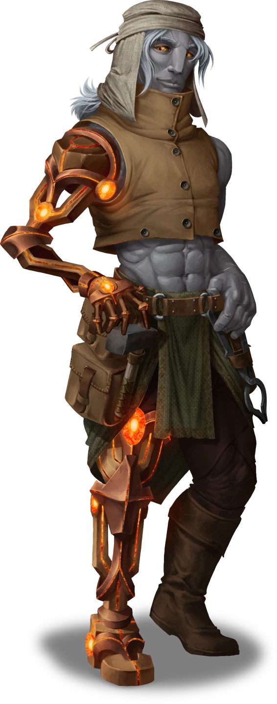
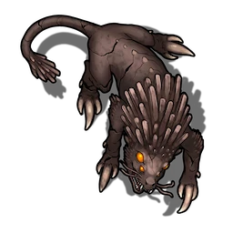
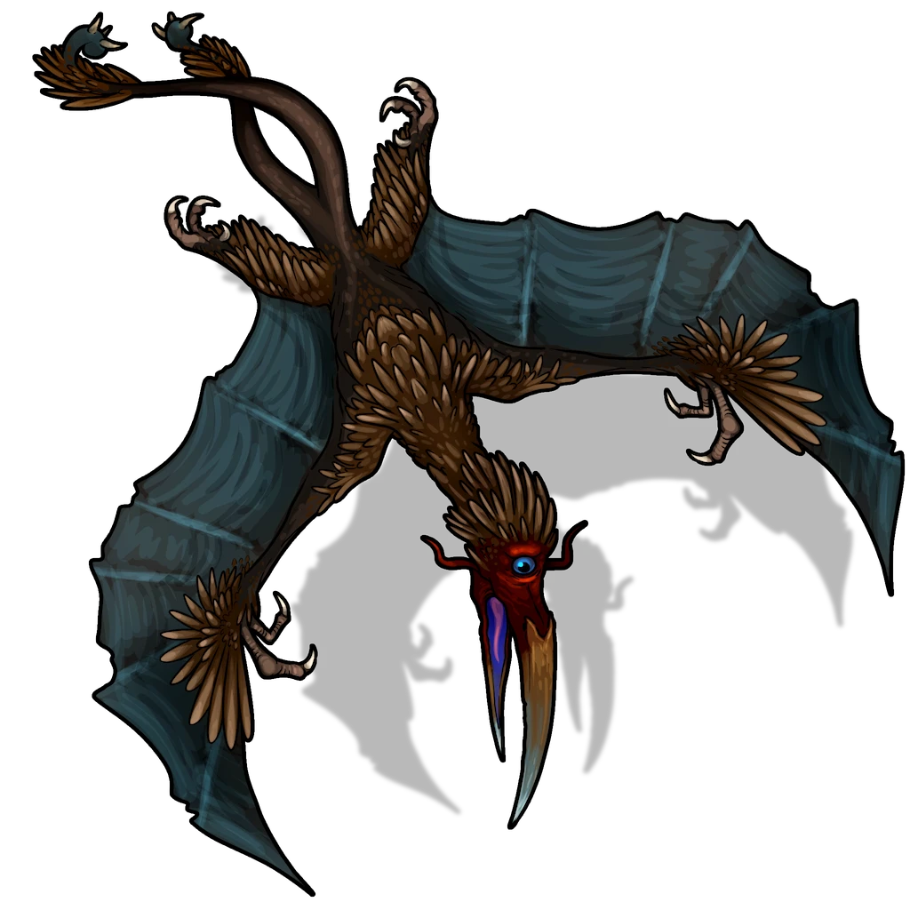

# To Copy a Key

> [!warning] Gamemaster
> #### Gamemaster's Summary
>
> This Combat and Social Event occurs when the party travels to [[Stonework Hollow]] following the [[Veiled Threats]] Event. In this Event, the characters can:
>
> - Meet Janix Mance to recruit his help in copying a key.
> - Retrieve some materials that Janix needs in return for his help, which requires fighting off a pack of aggressive [[Ketral]].
>
> This Event is depicted using the "Ledge Wreckage" Level of the [[Vista: Splinter Canyons]] Vista.

### Meeting Janix Mance

The party may have met Janix Mance previously, which affects how he greets them.

If they completed [[Sickness in The Burns]]:

> [!quote] Read Aloud
> > I should have known that when Lyla Cevher said she had a set of top-notch adventurers ready to help me out that it would be you lot. Lyla's always had a good head on her shoulders. I'll still need you to do a little something for me before I can help you out though.

If they did not complete [[Sickness in The Burns]]:

> [!quote] Read Aloud
> > There's not many folks I would trust to send folks my way based only on a note, but Lyla Cevher is one of them. Says she's got a bit of a situation and I can maybe help, but I'm gonna need something from you first.

> [!abstract] Janix Mance
> **[[Janix Mance]]**
>
> Level 1 · Unknown Unknown
>
> 

> [!info] Social
> #### A Conversation with Janix
>
> Janix Mance is inclined to help Lyla Cevher, but first he wants to know what he's getting into. With a successful `[[/check insight 16]]` check, characters know that he's most interested in problem solving — if there's an interesting challenge to be met, he'll automatically be more intrigued.
>
> Janix is willing to talk about any of the following:
>
> - He knew Lyla before she left Ordain and feels bad about her recent losses.
> - He doesn't trust anything that any of the other Trading Houses say about Darius' death, especially House Wandren, which has increasingly been associated with shady groups around the city.
> - He believes that Hephiss Wandren's keys are attuned keys, only able to be used by the person they are attuned to, but can make a mold that will copy the keys and fool them into thinking that anyone holding them is attuned to them.
>
> Janix is reluctant to participate in the heist without getting something in return. Any character who makes a successful **Diplomacy (DC 20)** check can convince Janix to join them.
>
> - **Knowledge: Machines**: The character gains **+2 Boons** on this check.
> - **Helped Janix:** The character gains **+2 Boons** on this check if they previously helped Janix in the [[Sickness in The Burns]] Event.
>
> If the characters cannot convince Janix to help, they must retrieve a rare metal — quickmetal — from a vein within the abandoned Stonehollow Quarry, which has recently become overrun with local wildlife. The metal has the added benefit of making the mold work faster.
>
> If he does join the heist, Janix has no interest in attending the Marlstone Gala — he's not a fan of crowds. He'd much rather meet them outside, do what he needs to do, and head home. He needs the party to find him a way in.

> [!question] Q&A
> **Q:** How Janix Knows Lyla
>
> **A:**
>
> > I know Lyla's been away a few years, but feels like I saw her grow up and she's always had a good head on her shoulders. Plus she's never boring. If she's into something, it's something worth doing.

> [!question] Q&A
> **Q:** The Accusations About Funar
>
> **A:**
>
> > Funar isn't quite as much fun as Lyla, but he's always had a solid head on his shoulders. Not the type to go off and kill anybody. That Hephiss Wandren, on the other hand? Ever since she got control of the house, they've gotten more and more suspicious. I know they've always had their secret ways of getting the best luxuries money can buy, but it feels like when I hear their name these days, it's always alongside some common criminal.

> [!question] Q&A
> **Q:** Hephiss' Keys
>
> **A:**
>
> > Attuned keys. I'm sure of it. You attune to them, and only you can use them. If anyone else tries, the shape of the key changes and it won't work. Half the time it also has wards or sets off alarms, if you don't know what you're doing. Luckily for you, I do. And I'm willing to help … if you do me a favor. It's why I had Lyla send you here instead of to my workshop.

> [!question] Q&A
> **Q:** What Janix Needs
>
> **A:**
>
> > We should get down to business. I love to help a friend, but I need a bit of help too. There's a vein of metal in the old quarry that's exactly what I need for my next construct — and it'll make creating this mold for you easier too. Only problem is that the place is overrun by creatures. I could use some backup to retrieve it safely.

#### Primordis Attunement: Janix Persuaded

Any character who helps persuade Janix advances their **Attunement: Primordis (+1)** at the conclusion of the Event.

### Clearing Stonework Hollow

> [!warning] Gamemaster
> #### Note: Scene Transition
>
> If you check the Outcome box below, the Scene will transition to an Area Map for the combat noted below.

`[[/outcome entered]]`

The party must cross the seemingly empty quarry in order to retrieve the quickmetal, which Janix has the tools to remove from the vein in the rock. Once a character comes within 20 feet of any of the ketral hidden within the rocks, all reveal themselves and attack. This attack draws the attention of a juvenile Suarrok, which is drawn down into an attack.

> [!abstract] Ketral
> **[[Ketral]]**
>
> Level 1 · Unknown Unknown
>
> 

> [!abstract] Suarrok Juvenile
> **[[Suarrok Juvenile]]**
>
> Level 4 (Elite) · Winged Terror Suarrok
>
> 
>
> This creature is an unsettling thing, a strange mixture of bird and lizard, with massive, bat-like wings fringed with trailing feathers. A long, sinuous neck that coils and moves like a serpent holds a massive head with menacing, serrated beak that's perfectly designed for tearing through flesh. On this head rests a single, enormous eye that glows ominously, and as its gaze sweeps over you, a wash of stinging heat can be felt.

> [!danger] Hazard
> #### Ambush
>
> Any character with a `[[/skill perception 15 passive format=long]]` can spot the hidden Ketral before they have a chance to reveal themselves. Otherwise, the characters are &Reference[surprise]{Surprised}.
>
> #### Ketral Tactics
>
> At the start of combat, the Ketral will break off into pairs and engage the characters that appear most vulnerable. If the characters were &Reference[surprise]{Surprised}, the Ketral will use their [[Surprise Attack]]. Otherwise, they use their [[Bite]] or [[Claws]] attack.
>
> Over the course of combat, the Ketral will prioritize the following actions and abilities:
>
> - In melee, the Ketral will take advantage of their [[Pack Tactics]] feature to maximize damage dealt by their [[Bite]] and [[Claws]] attacks.
> - When reduced to under half its maximum Hit Points, the Ketral will use its [[Of The Earth]] feature to climb a rocky surface and hide. If the Ketral cannot escape, it will move into a position to maximize the effectiveness of its [[Dust to Dust]] feature.
>
> #### Suarrok Juvenile Tactics
>
> The Suarrok Juvenile joins combat after sensing blood, whether spilled from a Ketral or one of the characters. Add it to the initiative tracker on the following round.
>
> At the start of combat, the Suarrok Juvenile will use its [[Searing Stare]] to inflict the most threatening enemy with the **Broken** condition.
>
> Over the course of combat, the Suarrok Juvenile will prioritize the following actions and abilities:
>
> - In melee, the Suarrok Juvenile will use its [[Swooping Strike]] and [[Raking Talons]] actions.
> - The Suarrok Juvenile uses its [[Elusive Flight]] talent to make hit-and-run attacks.
>
> The battle ends when the creatures are slain or forced to retreat.

Once the party has defeated all enemies, Janix is able to collect his quickmetal without incident and agrees to join the group.

#### Akon Attunement: An Errand for Janix

Any character who completes the errand for Janix advances their **Attunement: Akon (+1)** at the conclusion of the Event.

`[[/outcome recruited]]`

### Concluding the Event

> [!warning] Gamemaster
> #### Next Steps
>
> Once the party has recruited Janix, they can proceed with their other preparations (if they have not done so already):
>
> - Going to [[The Hallows]] to recruit Juro Wandren in the [[The Insider]] Event.
> - Going to [[Lantern Roads]] to find a hidden route into Marlstone Manor in the [[Revealed by Lantern]] Event.
> - Going to [[Marlstone]] to scout Marlstone Manor in the [[Casing the Joint]] Event.
>
> If the party has finished their preparations, they should return to [[Lyla Cevher]] in the Tradeway, triggering the [[Set in Motion]] Event.
