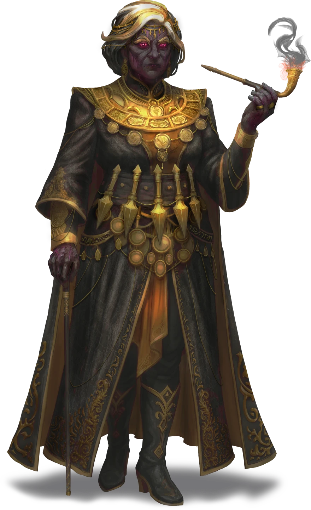
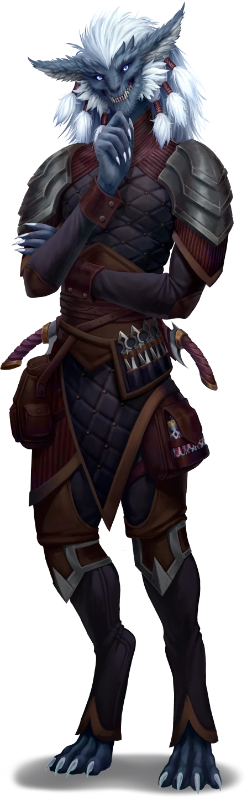

# Veiled Threats

> [!warning] Gamemaster
> #### Gamemaster's Summary
>
> This Exploration and Social Event occurs when the party returns to [[Lyla Cevher]] following the discovery of Funar's location in [[Finding Funar]] and the investigation of Darius' shop in [[The Death of Darius]]. In this Event, the characters can:
>
> - Review what information they have discovered with Lyla.
> - Quietly observe a conversation between Lyla and Hephiss Wandren.
> - Come up with a plan to expose Hephiss and rescue Funar.
>
> This Event is depicted using the "House Cevher HQ" and "House Cevher HQ (hiding)" Levels of the [[Vista: Ordain Interiors]] Vista.

### Putting the Clues Together

> [!info] Social
> #### Sharing the Clues
>
> Lyla generally believes that what the party has found is promising, and has her own thoughts to share about the information.
>
> - Money was scattered across the desk.
>   > The rumors say that Funar killed Darius for his money. If money was left behind, that helps to prove his innocence — and it means that this wasn't a random robbery.
> - The killers used a special dust to choke Darius.
>   > Dust? That sounds familiar. I've been hearing that a new local group has begun using dust as a way to incapacitate people — Beacon, I think they're called. I can ask around, find out more.
> - Darius was stabbed twice, in the back and then in the chest.
>   > Stabbed in the back. Of course. Cowards. But that helps prove Funar's innocence — if Darius was fighting with Funar the way everyone claims, he wouldn't have turned his back on Funar.
> - There was a withering poison on the knife blade.
>   > A withering necrotic poison. You don't see that every day. I can ask around, find out who's been using that method in any other crimes.
> - The body was likely moved from where it fell. A blood pool in the center of the room is far from where the outline of the body is located.
>   > Someone is trying to frame Funar. Plain as day. And whoever it is, they aren't getting away with it.

As the party finishes this conversation, a messenger enters the room.

> [!quote] Read Aloud
> No sooner have you finished talking than a messenger appears, sweaty and out of breath.
>
> > Lyla, you have visitors. Including the head of House Wandren, Hephiss. They're only a minute or two behind me. Thought you'd want to know.

### An Unexpected Guest

> [!info] Social
> #### An Incoming Visitor
>
> Though there isn't much time, Lyla quickly updates the party — the head of House Wandren is Hephiss Wandren, a powerful force in the city of Ordain. Lyla can share the following:
>
> - It's not clear why Hephiss Wandren is visiting. She could be coming to pay her condolences, but she was never particularly close with Darius Cevher. It seems like a ruse.
> - If the party found Funar's location ([[Finding Funar]]), Lyla is especially concerned about what Hephiss' intentions might be, and thinks that Hephiss knows exactly where Funar is and will be trying to throw her off.
> - Lyla doesn't know Hephiss well — Lyla was once close friends with Juro Wandren, who also belongs to House Wandren, but Juro had a somewhat distant relationship with Hephiss. She and Juro are on decent terms now, but she doesn’t quite trust him or House Wandren.
> - There are rumors that since Hephiss gained control of the house, it has become more secretive, secluded, and dangerous.
>
> Lyla would like the party to hide in the room behind a dividing screen, out of sight, and see what they think of Hephiss during the meeting, so she doesn't miss anything.

> [!warning] Gamemaster
> #### Scene Transition
>
> At this time, activate the "House Cevher HQ (hiding)" Level of the [[Vista: Ordain Interiors]] Vista.

> [!quote] Read Aloud
> Lyla quickly hurries to the door to peer down the hall, hand on her sword hilt. As she stares out, she takes her hand down and straightens her back instead.
>
> > Here she comes. You should be able to avoid her knowing you're here as long as you don't make too much noise behind that folding screen. If she figures it out, she'll leave without sharing any good information.

Just as Lyla opens the folding screen and ushers the party behind it, two people appear at the doorway of Lyla's office — Hephiss and Juro Wandren.

> [!abstract] Hephiss Wandren
> **[[Hephiss Wandren]]**
>
> Level 1 · Unknown Unknown
>
> 

> [!abstract] Juro Wandren
> **[[Juro Wandren]]**
>
> Level 4 · Wirrun Operator
>
> 
>
> Though he maintains a pleasant smile, with an expression that appears calculated to seem warm, the tall lanky wirrun is unmistakeably sizing up everyone and everything nearby, letting his gaze brush past any potential items of value before focusing on whatever is directly in front of him. As he finishes his appraisal, he smiles more brightly, though whether that's because it's met his expectations or not is hard to tell.

During Hephiss Wandren's conversation with Lyla, the party can take the following actions, as desired, but must remain out of sight throughout Hephiss' visit:

> [!info] Social
> #### Observing Hephiss and Juro Wandren
>
> Any character with a `[[/skill perception 14 passive format=long]]` or who makes a successful **Awareness (DC 12)** check notices a set of keys around Hephiss' wrist.
>
> - **Path: Cosmopolitan Fashionista**: The character automatically succeeds on this check.
> - **Knowledge: Intrigue**: The character gains **+2 Boons** on this check.
>
> Throughout the conversation, the characters will have opportunities to make Insight checks to determine Hephiss' and Juro's true motives.
>
> When making Insight checks during the conversation:
>
> - **Knowledge: Intrigue**: The character gains **+2 Boons** on the check.
>
> If at any point the characters make themselves known, Hephiss ends the conversation; see [[Veiled Threats]].

> [!tip] Exploration
> #### Create a Distraction
>
> If the party is at risk of being discovered, or wishes to end a line of conversation, they can cause a distraction. This can be accomplished as the party sees fit, including:
>
> - Use of [[Mage Hand]], [[Prestidigitation]], or another spell with a visual or auditory effect.
> - Sliding an object across the room from under the screen. The character performing the action must make a successful `[[/check athletics 16]]` check to slide it far enough that it draws Hephiss' attention away from the screen — on a failure, the object draws Hephiss' attention instead and any character who is currently observing her must make a successful `[[/check stealth 16]]` check to maintain their position. If they fail, Hephiss notices as if the initial Stealth check had been failed.

#### Primordis Attunement: Party Hidden

Any character who successfully remains hidden through the entirety of the conversation advances their **Attunement: Primordis (+1)** at the conclusion of the Event.

> [!danger] Hazard
> #### Party Discovered
>
> Hephiss Wandren is uninterested in having her conversation with unexpected guests listening in. If the party does not hide, she sees any member, or their actions bring them to her attention, she immediately ends the conversation and leaves, saying:
>
> > I'm sorry, I came for a private conversation. Just you, me, and your old friend here. I can see you're busy, though, and I'd hate to think of uninformed ears listening to what we have to say. Please accept my condolences, and if you're up for it, I'd welcome you to attend the Marlstone Gala. Alone, of course. It's at my home, and I can't let just anyone through my doors.

### The Conversation Begins

> [!quote] Read Aloud
> As Hephiss and Juro enter her office, Lyla greets them politely.
>
> > Hephiss Wandren. And Juro. Fancy seeing you here. To what do I owe the pleasure?

> [!info] Social
> #### Condolences and Invitations
>
> Hephiss begins by extending her condolences to Lyla. A successful `[[/check insight 17]]` check while within range reveals that she seems irritated at Darius Cevher's death, as if she wanted it to yield more than it did.
>
> > First, I apologize for not having reached out to you sooner, but I wanted to extend the deepest condolences of all of House Wandren on the lost off your uncle Darius. I have always been a fan of his work with threads and metals, and I regret that he will be unable to make this year's Marlstone Gala, where we always look forward to seeing his work. You are of course welcome to come in his stead. As long as you promise not to stab anyone.
>
> Juro adds his sympathies. On a successful insight check within range, characters know that he is indeed sorry for Lyla's loss.
>
> > Yeah, Ly, I'm sorry. Darius was a good guy. Whoever did this, it can't have had anything to do with the kindness of his heart.
>
> Hephiss sighs. (A successful insight check reveals that Hephiss is trying to get Lyla upset on purpose, possibly to learn something, though it is not clear what.)
>
> > Yes, who knows what would have motivated Lyla's brother Funar to become a killer. I never would have thought he could have done such a thing, but with him on the run, it's clear that his guilt must have gotten the better of him. I hope you know that the removal of House Cevher from the Ordinate is likely only temporary, to give you a chance to recuperate from this time of tragedy. Though House Bastilla is filling the seat admirably.
>
> After a silence, Lyla replies.
>
> > How thoughtful of you to make that determination for us instead of burdening us with the decision.
>
> Lyla then coughs, taking the opportunity to whisper to the party.
>
> > I'm ready for this conversation to be over, but is there anything you think I should ask?
>
> #### Additional Questions
>
> If the party has any topics that they want to be discussed, they can attempt to whisper Lyla to continue the conversation along those lines. Characters can do this by using a spell that allows for information to be communicated non-verbally or physically passing a note to Lyla without Hephiss noticing (requiring a successful **`[[/skill sleightofhand 15]]`** check). Alternatively, they let the conversation end naturally. Topics could include:
>
> - **Why is Hephiss Wandren here now?** Hephiss insists that she simply wants to pay her condolences, but has been busy with internal house business and did not want to disturb Lyla right away while she was grieving.
>
> Any character who makes a successful **Deception (DC 15)** check can tell that Hephiss came when she felt it was strategically important, and that Juro seems skeptical of her answer.
>
> - **Why is Juro accompanying Hephiss?** Juro just got to town and wanted to meet up with Lyla right away to give his condolences.
>
> Any character who makes a successful **Deception (DC 15)** check can tell that this is partly true, but that he was more forced to come on this particular trip; Hephiss may have some leverage over him.
>
> - **Why are they accusing Funar of Darius' death?** Hephiss claims not to know much about the situation — she says she's gotten her information from the local paper Overheard in Ordain, which has a source within the investigation.
>
> Any character who makes a successful **Deception (DC 15)** check can tell that Hephiss is lying — it's more likely that she is the paper's source of information than the other way around, and she definitely knows more about where Funar is.
>
> - **When will House Cevher be returned to the Ordinate?** Hephiss reiterates that House Cevher was removed to avoid them having to deal with politics during a tragedy and claims that making another change too quickly would cause dissension during a time when stability is needed.
>
> Any character who makes a successful **Deception (DC 15)** check can tell that Hephiss never plans for House Cevher to return to the Ordinate.
>
> - **What does she know about Funar's current whereabouts?** Hephiss seems surprised at the question — she claims to believe that he ran away from Ordain because of the shame of killing his uncle. While answering the question, she fidgets, briefly exposing a ring of keys on a bracelet that is normally hidden by her sleeves. An insight check reveals worry that Lyla knows more than she should.
>
> Any character who makes a successful **Deception (DC 15)** check can tell that Hephiss is worried that Lyla knows more than she should.
>
> Full answer text is below.
>
> Once characters have no more questions for Lyla to ask or actions they wish to take, she wraps up the conversation.
>
> > Thank you for your kind words, but I do need to deal with a good deal of House business, Hephiss. You understand. Thank you again for coming by!

> [!question] Q&A
> **Q:** Why is Hephiss here?
>
> **A:**
>
> > I am sorry it has taken me so long to reach out to you. I wanted to give you time with your family before burdening you with an additional guest.

> [!question] Q&A
> **Q:** Why is Juro here?
>
> **A:**
>
> > Nothing more than a coincidence. I happened to run into him while heading in this direction and thought you might be interested in seeing a familiar face.

> [!question] Q&A
> **Q:** Accusations of Funar
>
> **A:**
>
> > I've always liked Funar, though he's never said much to me. I wouldn't suspect him at all, but with his disappearance and the evidence that's been shared in Overheard in Ordain, it seems clear he did it. I take no comfort in this fact, but I think it is good to face it head on.

> [!question] Q&A
> **Q:** Returning Cevher to the Ordinate
>
> **A:**
>
> > Let's give it some time. Your father understood how things worked in the Ordinate, but without him, and with Funar on the run, we thought it might be best to give the House a bit of a chance to recover. In truth, from what I've heard about the troubles on the Arctus Plateau, you may have your hands full. I wish you all the best with it, of course.

> [!question] Q&A
> **Q:** Funar's Whereabouts
>
> **A:**
>
> > What an odd question. I have no idea, though I had heard he'd fled the city. Probably guilty from what he'd done. I'm so sorry Lyla — I hope you don't feel too guilty that he changed while you were away. How could you know that going off to do your own thing would lead to you coming back to two deaths in the family?

### Debriefing With Lyla

> [!info] Social
> #### A Brief Debrief
>
> With Hephiss and Juro's departure, Lyla is ready to debrief.
>
> > They're gone. That was … unpleasant, though I'm not sure Juro's heart was fully in it. Also, did you notice what was going on with Hephiss' wrist? I think she has a set of keys on there. If she has Funar trapped somewhere in Marlstone, we'll have to get a hold of them.
>
> If the party succeeded on any Insight checks, they can share the results with Lyla, which confirm what she suspected — even if she didn't do it herself, Hephiss Wandren is involved in what happened to Darius.
>
> - Given the evidence that the party found in Darius' shop, Lyla posits that a group in Lantern Roads, the Beacon Brigade, was responsible for Darius' death. They favor poisons, dusts, and other items in their work, which lines up with the evidence the party found. The group is also loosely associated with House Wandren, which now makes Lyla fairly sure they're the ones responsible.

### Lyla's Plan

> [!warning] Gamemaster
> #### Music: Lyla's Theme
>
> As Lyla reveals her plan, play  **Music: Lyla Theme**.

> [!info] Social
> #### The Heist in a Nutshell
>
> The invitation to the Marlstone Gala that Hephiss brought with her has given Lyla an idea — the gala is the perfect place to search for Funar's exact location in the manor and get Hephiss' keys from her while she's distracted. Her plan has two phases — preparation and execution — each of which will need the party's help.
>
> > I think Hephiss just overplayed her hand. That invitation to the Marlstone Gala? I'm sure she just wants to rub my new circumstances in my face, but I think it's the perfect time to turn the tables on her. Why not use it to search the place, take her keys, and sneak off with Funar?
>
> A successful **Deception (DC 15)** check reveals that Lyla is slightly nervous, but overwhelmingly convinced that she can pull it off with the party's help — either way, she makes it clear that she's going to attempt to do this with or without their help.
>
> The overarching plan works as follows:
>
> - The party attends the Marlstone Gala, sneaking a renowned artificer onto the grounds on their way into the event. Lyla is sure that Hephiss' keys won't be easily copied, but the artificer, Janix Mance, is an expert on magically warded keys.
> - Hephiss Wandren offered Lyla an invitation, but the party members will need to get their own invitations, convince the artificer to participate, and find a hidden way for the artificer to get in before the ball begins.
> - Once at the gala, the party creates a distraction and steals Hephiss Wandren's key, which they sneak to the artificer to copy for them. They then return the key to Hephiss Wandren with the House Wandren leader none the wiser.
> - The party leaves the event early and sneaks through the manor, where they find and release Funar Cevher, look for evidence of who truly killed Darius Cevher, and try to find evidence to clear House Cevher's name.
>
> Lyla suggests they focus on what needs to be done before the day of the gala and can regroup just before the gala begins when they've gotten the early pieces in place.
>
> > In order to pull this off, we'll need to have everything in place before the Marlstone Gala begins. I have some work to do here, so I'm counting on you to recruit the rest of the team and do some scouting. You up for it?
>
> Lyla asks that the party keep her informed via signal stone or coded message and meet her at House Cevher HQ on the night of the gala ready to go. She trusts they will get everything done in the meantime.

> [!question] Q&A
> **Q:** Recruiting Juro Wandren
>
> **A:**
>
> > As you know, Juro's not my favorite person in Ordain, but we go way back, and he still owes me one. Which he isn't going to want me to collect. I'd love if you could find a way to convince him that it'll be in his best interest to get you on the list for the Marlstone Gala. Juro seemed like he felt for me when he was here, but he's never given a favor without making a production out of it.

> [!question] Q&A
> **Q:** Recruiting Janix Mance
>
> **A:**
>
> > Janix Mance is the best artificer in Ordain, hands down. And he's got a pretty straightforward view on life — do something for him and he'll do something for you. My sources say he's been complaining about an infestation of some kind keeping him away from some of the materials he needs in the old quarry. I'd bet if you offer to take care of it, he'll be on board, and he'll know exactly how to copy Hephiss' keys.

> [!question] Q&A
> **Q:** Scout Marlstone Manor and Lantern Roads for a hidden way in.
>
> **A:**
>
> > Juro should be able to get all of us onto the guest list after your heroics elsewhere on the Arctus Plateau, but we'll have to sneak Janix in. Which means finding a good route in. I'm pretty sure there's a way to the Marlstone Manor through the back alleys of Lantern Roads that we can use the night of the event. If you can disrupt things for that horrible Beacon gang that killed Darius in the process, I'd love it.
> >
> > It would also be good to get the layout of the manor itself so we know what we're up against. With all the party prep, my guess is that a lot of laborers are coming in and out. You may be able to use that to your advantage.
> >
> > See if you can figure out the quickest way between the main gala floor and where Janix will be waiting, taking note of guard stations and the like. The more we know, the better off we'll be.

### Concluding the Event

> [!warning] Gamemaster
> #### Milestone
>
> Completing this Event earns the party 1 [[Milestone Progression]], potentially advancing them in Level.
>
> #### Next Steps
>
> Once the party has finished speaking with Lyla, they can make the following preparations in any order:
>
> - Going to [[The Hallows]] to recruit Juro Wandren in the [[The Insider]] Event.
> - Going to [[Stonework Hollow]] to recruit Janix Mance in the [[To Copy a Key]] Event.
> - Going to [[Lantern Roads]] to find a hidden route into Marlstone Manor in the [[Revealed by Lantern]] Event.
> - Going to [[Marlstone]] to scout Marlstone Manor in the [[Casing the Joint]] Event.
