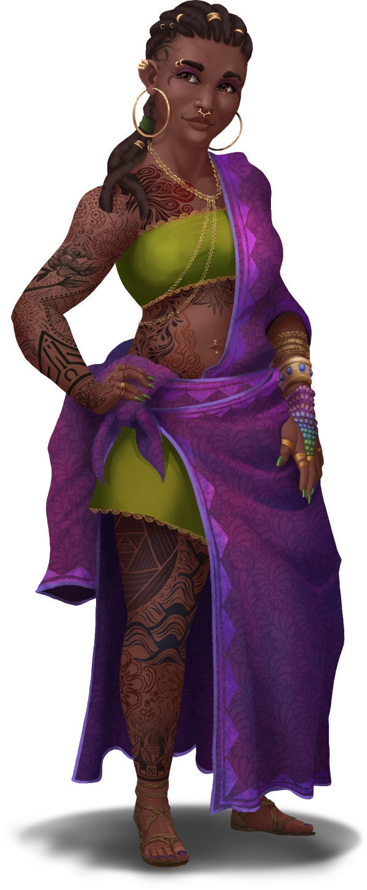
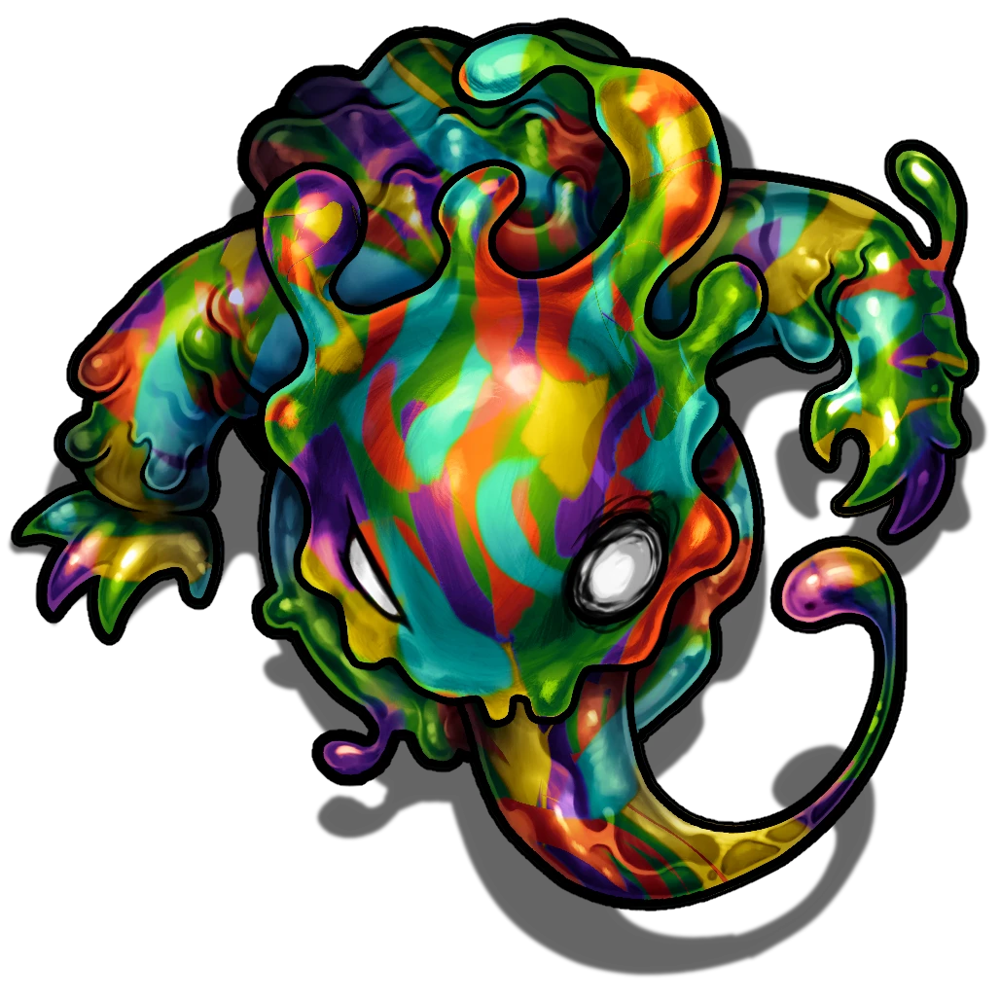

# Drawing Attention

> [!warning] Gamemaster
> #### Gamemaster's Summary
>
> This Combat Event occurs as the party examines a freshly painted mural alongside Cherish Ellerie, a liaison of [[House Salva]]; a pack of [[Paint Globlin]] emerges from the mural and attacks. By defending Cherish (and themselves), the characters can:
>
> - Get to know Cherish and learn more about House Salva and its role in [[Ordain]].
> - Investigate the mural and its paint to learn more about its mysterious creator.
> - Encounter Paint Globlins, a strange and chaotic form of earth elemental.
>
> This Event is more likely to trigger during the day than at night.
>
> This Event is depicted using the "Huge Mural" Level of the [[Vista: Ordain Streets]] Vista.

### Chatting With Cherish

> [!abstract] Cherish Ellerie
> **[[Cherish Ellerie]]**
>
> Level 1 · Unknown Unknown
>
> 

> [!question] Q&A
> **Q:** Who are you?
>
> **A:**
>
> > Ah! So sorry, I forgot my manners there for a moment. I'm Cherish Ellerie, nice to meet you. Who are you?

> [!question] Q&A
> **Q:** What do you do in Ordain?
>
> **A:**
>
> > I work for House Salva, primarily as a project overseer for various things in the trade house, such as textile manufacturing and clothing production, but my main expertise is design. I've also been getting myself attached to other things, like helping pick the roster for next season's style trend, and I've helped arrange the Art Ramble event the last two years.

> [!question] Q&A
> **Q:** What's the Art Ramble?
>
> **A:**
>
> > Oh, it's great! House Salva brings in a bunch of artists to create murals on the walkways in the Redwalk Ramble. It's happening soon, you should absolutely come by and check it out. There'll be food and drinks, live music, art and clothing for sale, and a sneak peek at the next season's style.

> [!question] Q&A
> **Q:** This is about House Salva?
>
> **A:**
>
> > Seems like it! House Salva's expertise is textiles, and the clothing made from them. At the top are the experts in those fields, picking the best of the year's production, guiding the markets, celebrating the best of the year's artists, and setting fashion trends across the city. It's exclusive, to be sure, and I think the artist is bitter about that.

> [!question] Q&A
> **Q:** Who made this?
>
> **A:**
>
> > I'm not sure, the style looks familiar, I feel like I've seen their work somewhere before, but I can't recall the artist's name.

The characters may examine the mural closely for clues.

> [!tip] Exploration
> #### Style Points
>
> Any character with a `[[/skill perception 18 passive format=long]]` or who makes a successful **Awareness (DC 16)** check observes that the lines and the style are very clean, indicating someone who is well-versed in creating art pieces at this sort of scale. However, without other styles to compare to, it's impossible to know more about the artist.
>
> - **Knowledge: Arts**: The character gains **+2 Boons** on this check.
>
> #### Wet Paint
>
> Any character with a `[[/skill investigation 16 passive format=long]]` or who makes a successful **Awareness (DC 14)** check notes that the paint is fresh but fully dried, meaning it's been on this wall for at least a day, if not longer. The scale of the painting indicates that there were likely scaffolds and days of work involved.
>
> - **Knowledge: Arts**: The character gains **+2 Boons** on this check.
>
> Characters that cast [[Detect Magic]] notice an aura of abjuration magic radiating from the mural.

`[[/outcome examinedSalvaMural]]`

### Globlin Attack

When the encounter begins, read the following aloud, then click the Outcome box below to transition the Scene:

> [!quote] Read Aloud
> Your conversation with Cherish is cut short as the surface of the mural ripples and several small humanoid forms made of paint fall to the ground, leaving large splats of color where they land.
>
> > That's new...
>
> The paint creatures stand up, fix their eyes on you and Cherish, and begin to advance.

`[[/outcome attack]]`

> [!abstract] Paint Globlin
> **[[Paint Globlin]]**
>
> Level 1 · Unknown Unknown
>
> 

> [!danger] Hazard
> #### Challenging Art
>
> These strange elemental creatures are intensely chaotic, and revel in creating mess and disorder.
>
> #### Paint Globlin Tactics
>
> The 4 [[Paint Globlin]] emerge from the mural.
>
> At the start of combat, at least 1 of the Paint Globlins will use its [[Glob Lob]] attack against potential ranged threats, while the rest of the Globlins will use their [[Paint Roller]] bonus action to close ranks with enemy characters.
>
> Over the course of combat, the Paint Globlins will prioritize the following actions and abilities:
>
> - In melee, the Paint Globlins will use their [[Clobber]] attack.
> - From range, the Paint Globlins will use their [[Glob Lob]] attack.
> - When a Paint Globlin dies, their [[Death Burst]] feature triggers, potentially inflicting the &Reference[blinded] condition on nearby enemies. Blinded enemies become preferred targets for other Paint Globlins.
> - The Paint Globlins will fight to the death, and will either pursue enemies outside of the immediate area or target them with ranged attacks.
>
> The battle concludes when the Paint Globlins are defeated.
>
> #### Cherish's Assistance
>
> [[Cherish Ellerie]] is unarmed but not afraid to defend herself. She will retreat to safety, leaving the Scene if she is brought to under half her Hit Point maximum.
>
> At the start of combat, Cherish will use [[Heroism]] on herself to improve her odds of survival.
>
> Over the course of combat, Cherish will prioritize the following actions and abilities:
>
> - In melee, Cherish will use her [[Punch]] attack.
> - Cherish will cast [[Healing Word]] on injured characters to help keep them alive, or on herself if she gets too badly wounded.

When the battle concludes, click the Outcome box below to transition the Scene:

`[[/outcome defeated]]`

### Attack Aftermath

> [!quote] Read Aloud
> With the last globlin defeated, you have a chance to survey the area, and it is splattered with paint. Much of the mural's lower half has been ruined by the explosive demise each globlin underwent, and the ground is similarly coated with a thin, vibrant layer of paints, the colors blending into an unattractive gray-brown wash in places.
>
> Cherish looks at herself, trying to wipe paint from her face and arms, but only smearing it in the attempt.
>
> > This was a new outfit, too. It's lucky you were here, I might have been in real trouble if they caught me out here alone. Thanks for the help!

> [!question] Q&A
> **Q:** What were those?
>
> **A:**
>
> > Good question! I've never seen anything like those before. They were made out of paint, right? Maybe there's magic runes hidden in the art, or maybe the paint is magic? This isn't really my area of expertise, my sister is the spellcaster in the family.

> [!question] Q&A
> **Q:** Where would someone get magic paint?
>
> **A:**
>
> > Off the top of my head, I know there's a lot of art supplies sold in Flotsam at the canal market. I'd expect there's almost certainly someone selling it there. Certainly there are other places in the city, but I don't know them offhand.

> [!tip] Exploration
> #### Examining the Mural
>
> Any character with a `[[/skill investigation 16 passive format=long]]`, `[[/skill arcana 16 passive format=long]]`, or who makes a successful **Awareness (DC 14)** or **Arcana (DC 14)** check notes that there are no hidden magical symbols, marks, or runes in the mural. Whatever spawned the paint globlins had to be contained in the paint itself.
>
> - **Knowledge: Arts**: The character gains **+2 Boons** on this check.
>
> #### Examining the Paint
>
> The splatter of paint left over from the creatures is filled with strange mineral flecks that glimmer brightly on their own. Examining the components of the paint at the source of its creation is the only sure way to know how these creatures were made.
>
> - Characters with **Knowledge: Arts** know that paints can often have metallic elements included to give them a glittering appearance, which this may be, and is not indicative of anything untoward.
> - Characters with **Attunement: Cora** sense the faintest connection to these flecks, as though they bear a small measure of magic from the moon itself.
> - Characters that cast [[Detect Magic]] notice an aura of abjuration magic coming from the mural, and conjuration magic where the globlins once stood. Both are rapidly deteriorating in the wake of the globlin attack.

### Cherish Departs

> [!quote] Read Aloud
> Cherish fusses at some of the paint splattered on her before giving a sigh of resignation.
>
> > Okay, I'm going to go see if I can salvage this outfit. You should swing by Silver Street in Gossamer tomorrow, or whenever, and look me up. I've got my office there, and I'd like to formally reward you.
> >
> > I could give you a new set of clothes to replace what you're wearing now, at least. Nice clothing too, in style, expertly made. I've got access to the good stuff thanks to House Salva.
> >
> > Anyhow, I hope to see you, bye!
>
> Cherish offers a wave, and promptly sets off, leaving you with the aftermath of the fight and a few leads.

### Concluding the Event

> [!warning] Gamemaster
> #### Next Steps
>
> Once the party has finished investigating the mural and the battle's messy aftermath, they can go to Flotsam for clues about the paint in [[Mixed Media]], or head to Gossamer to meet with Cherish in [[Outside the Lines]]. The party will also begin encountering more murals in the city via the repeatable [[Color Commentary]] Event.
