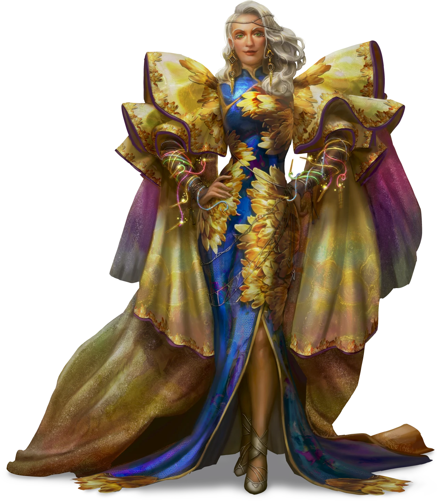

# Outside the Lines

> [!warning] Gamemaster
> #### Gamemaster's Summary
>
> This Social Event occurs when the party visits [[Cherish Ellerie]] in her office following their chance encounter. By speaking with Cherish, the characters can:
>
> - Be rewarded by Cherish.
> - Have a chance to glimpse [[House Salva]] ethos.
> - Meet [[Mistress Caberi]], the head of House Salva — and a Shard Goddess in disguise.
> - Given useful information for the next part of their investigation in [[Flotsam]]. Depending on when they visit Cherish, the nature of this information changes.
>
> This Event is depicted using the "Cherish's Office" Level of the [[Vista: Ordain Interiors]] Vista.

> [!quote] Read Aloud
> Cherish’s office is a gallery of labor and luxury, a mixture of fine furniture covered in samples of cloth, bolts of silk, and rolling racks of fine clothing awaiting examination. The center of the space is dominated by a large table covered in papers bearing patterns and sketches of clothing.
>
> Cherish looks up from a sketch, smiles with genuine warmth, and gestures you in.
>
> > Hello! Welcome!
>
> She gestures to her office, and the state of things.
>
> > Please excuse the clutter, I've got a lot on right now, so things are a bit… eh, scattered.

### Cherish's Gratitude

> [!quote] Read Aloud
> She gestures toward the racks of clothing bearing every hue and style one can imagine.
>
> > There, those racks — choose what pleases you. Consider it my thanks, and a remedy for what the paint monsters ruined.

> [!info] Social
> #### Fine Clothing
>
> Each character gains one set of [[Clothes, Exquisite]]. Keeping or reselling is at the player’s discretion.
>
> - Characters with **Knowledge: Crafts** recognize that many are hand-worked masterpieces that demanded long hours and rare skill to create. Many feature materials that were likely very expensive to procure, such as rare gems, metal fixtures, or specialty textiles.
> - Characters with **Knowledge: Trade** note that these outfits would be worth hundreds of gold to the right buyer. Coinwealth, Marlstone, or Koto Springs would be more favorable districts to sell in.
> - **Path: Cosmopolitan Fashionista** characters realize the materials used to make these items were likely sourced through Salva’s routes and markets, allowing the trading house to profit twice over.

> [!question] Q&A
> **Q:** Where'd these clothes come from?
>
> **A:**
>
> > Samples and trials from Ordain’s finest designers — pieces that did not make next season’s final procession. Many are one-of-a-kind. If a piece does not suit you, sell it. They do me more good in your hands than gathering dust.

> [!question] Q&A
> **Q:** Shouldn't the clothing be returned?
>
> **A:**
>
> > No. These were granted to House Salva and placed in my care. Designers know that inclusion in our season carries a cost. The garments are payment toward a chance at favor.

> [!info] Social
> #### Social Immobility
>
> **Culture: Ordani** characters, **Path: Cosmopolitan Fashionista** characters, and characters with **Knowledge: Politics** note that House Salva’s taste can begin or end a career; their word sets fashion for the city. The articles of clothing in Cherish's care all represent those who were deemed unfit for that blessing.

> [!question] Q&A
> **Q:** What does Salva do?
>
> **A:**
>
> > We make Ordain, Ordain. From raw fiber to woven cloth to finished tapestries, garments, and flooring, Salva shepherds all of it from field to loom to market.

> [!info] Social
> #### Market Control
>
> **Path: Cosmopolitan Fashionista** characters and characters with **Knowledge: Trade** recognize Salva’s near-captive market here. Most weavers and tailors must deal through Salva to sell in Ordain, or to have enough material to work at scale.

### Caberi's Arrival

> [!abstract] Mistress Caberi
> **[[Mistress Caberi]]**
>
> Level 1 · Unknown Unknown
>
> 

> [!quote] Read Aloud
> A hush falls as the lacquered door behind you opens, and Cherish inclines her head toward the arrival. A moment later she stiffens and sharply turns to address the new arrival. When she speaks, her surprise is immediately apparent.
>
> > Mistress Caberi, hello! This is an unexpected surprise!
>
> Caberi releases a little giggle of amusement at Cherish's awkwardness.
>
> > My dear, I heard that you encountered a bit of chaos in the streets and I wanted to come visit. Ordain has had enough of grim surprises as of late, and I wanted to be sure you were okay. But first, who are your guests?
>
> Cherish pivots to look at you and says:
>
> > Utterly fine, thanks to my guests, whom I'll let handle introductions on their own!
>
> Caberi graces you with a smile so bright and powerful that it causes a warmth to bloom in your chest. She says nothing, instead waiting for you to introduce yourselves.

The players should be encouraged to introduce their characters before moving on.

> [!info] Social
> #### Head of Salva
>
> Any character who makes a successful **Society (DC 14)** check recognizes Mistress Caberi as both the current head of House Salva and the former Holy Speaker of the [[Cindaric Sages]], a position she held over four hundred years ago.
>
> - **Knowledge: Politics**: The character automatically succeeds on this check.
>
> Any character who makes a successful **Arcana (DC 15)** check recalls rumors about Mistress Caberi claiming that she is a being of immense power, perhaps even a [[Shard Gods]]. Her remarkable longevity is often cited as one of the reasons for this rumor persisting.
>
> - **Knowledge: Legends**: The character automatically succeeds on this check.

### Speaking With Mistress Caberi

> [!warning] Gamemaster
> #### Mistress Caberi's Identity
>
> Mistress Caberi is secretly a powerful godlike being known as the [[Soul of Fashion]]. Reference her entry in the [[Deities]] journal for more information.

> [!question] Q&A
> **Q:** What do you do in House Salva?
>
> **A:**
>
> Caberi smiles brightly at the question.
>
> > My dear, I herd visionaries toward greatness! I keep the city's looms from tangling, and make sure all within Ordain remain inspired by the efforts of House Salva! Also, many, many, many meetings.

> [!question] Q&A
> **Q:** What are your aspirations for Salva?
>
> **A:**
>
> There is a spark of excitement in Mistress Caberi's eyes at the question.
>
> > I have great aspirations for Salva. Long it has busied itself with all things woven, but I consider that just one thread in the great tapestry of life. I would have us weave all art together, dance and music, painting and sculpture, every thread becoming part of a bright tapestry that celebrates the act of turning inspiration into creation.

> [!info] Social
> #### Sensing Caberi's Agenda
>
> Any character who makes a successful **Deception (DC 14)** check intuits a sense of genuine fondness for artists, creation, and creativity. Mistress Caberi seems to hold a reverence for creation that borders on religious.
>
> - **Critical Success**: The character notes that such an expansion holds no small measure of strategic consolidation as well. House Salva already tightly controls Ordain's fashion industry, and Caberi's plan would fold even more lucrative fields into that empire.

### Meeting Before Mixed Media

If the party chooses to meet with Cherish before completing the [[Mixed Media]] Event, she can lend them some insight into the artist she suspects is responsible for the mural.

> [!quote] Read Aloud
> Cherish’s eyes narrow thoughtfully.
>
> > So, about the mural, I suspected that I knew the artist, so I poked around and it looks an awful lot like Varinna's style. She works in Flotsam upriver, has a little studio there. What's odd, though, is that she's currently under contract to grace several Salva walls with her art.

> [!question] Q&A
> **Q:** Don't you have people for this?
>
> **A:**
>
> Caberi smiles.
>
> > Not in the painter’s world, no. Our own agents would stir gossip and draw attention. You, however, are new threads, unnoticed, not yet worked into the grander tapestry of Salva.
>
> Cherish nods in agreement, adding:
>
> > The moment Salva starts officially investigating this, it'll draw attention, and I'd rather not do that. I've already arranged for the mural to be removed, I don't want more people being attracted to it before it's gone.

> [!question] Q&A
> **Q:** What happens if Varinna's guilty?
>
> **A:**
>
> Cherish, regretful but firm:
>
> > Her contracts would be ended at once, of course. She can't expect to bite the hand that feeds her and continue getting fed.
>
> Caberi adds:
>
> > We would likely pursue slander in the Hallows as well, since her artwork could be considered an attack against our good name and interests.

> [!question] Q&A
> **Q:** What happens if Varinna's innocent?
>
> **A:**
>
> Caberi brightens.
>
> > Then we ask a better question — who wore her mask? The city is large, but not boundless. We will find the hand holding the brush if we but look hard enough. Or, you will, to be more precise.

### Meeting After Mixed Media

If the party chooses to meet with Cherish after completing [[Mixed Media]], they receive different information as Cherish has pursued her own investigation in the meantime.

> [!quote] Read Aloud
> Cherish moves to claim a journal off her table and flips it open to a bookmarked page.
>
> > I thought that the mural's art looked familiar, and I couldn't figure out where I'd seen it before. I remembered that we have a couple in-progress murals on Salva properties, and turns out the art style matches! The artist in question is Varinna. Turns out that Varinna is currently on contract with us to grace several Salva properties with her art. It seems unlikely she'd bite the hand that feeds her, though, so I kept digging.
> >
> > As expected, magic pigments are common in Ordain, for both paints and dyes, but one stands out: Falar. He operates a paint shop in Flotsam as well, quite near Varinna’s place in fact. He would know her style’s bones if he wished to copy them.
>
> Caberi pipes up:
>
> > Ah, Falar, Falar, yes, I know that name. If it's who I think it is, he was an adventurer of some renown in his youth. I wonder how he ended up a paint monger in Flotsam...
>
> Cherish looks surprised.
>
> > I didn't expect you to know him... but yes, that's all correct. I'm not sure how he ended up a paint seller, but I do think he has reason to hold a grudge: he briefly contracted with Salva some years back, but was fired.

> [!warning] Gamemaster
> #### Absolving Varinna
>
> At this point, the party can offer any evidence they have in favor of Varinna.
> If they examined Falar's in-progress mural in [[Color Commentary]] and studied Varinna's art in [[Mixed Media]], they can point out that the styles are similar, but different in key ways.
>
> - If they [[Mixed Media]] in [[Mixed Media]], they would know she has a plausible alibi over the last several days, which is why she couldn't have been responsible.
> - Additionally, if the party [[Mixed Media]] in [[Mixed Media]], they can confirm that Varinna isn't the culprit.

> [!question] Q&A
> **Q:** Why was he fired from Salva's mural work?
>
> **A:**
>
> > From what I can tell about the records, we — House Salva, that is — couldn't agree on the murals' content. There aren't any details about what the issue was, specifically, but it seems he brought a case before the Hallows. Of course, it didn't go anywhere.

> [!question] Q&A
> **Q:** He took you to the Hallows?
>
> **A:**
>
> > He took Salva to the Hallows, yes.
>
> Cherish checks her notes.
>
> > From what I found, he petitioned for reimbursement for time and materials spent on the project, and when House Salva denied him, he took the claim to court, but the case was dismissed by the magister overseeing it.
>
> Caberi, candidly, notes:
>
> > Salva has some friends in the Hallows. They likely saw to it the case didn't get far.

> [!question] Q&A
> **Q:** Isn't that unethical?
>
> **A:**
>
> Caberi's gaze softens.
>
> > The Hallows' job is making sure that Ordain isn't harmed by frivolous or damaging court cases, and the Trading Houses are an integral part of Ordain. Not every quarrel deserves a hearing. If true harm had been done, the Hallows would have heard it, I'm sure.

> [!info] Social
> #### Privilege
>
> Any character who makes a successful **Deception (DC 15)** check senses a sincere belief in civic stability buttressing House privilege.

> [!question] Q&A
> **Q:** Falar was an adventurer?
>
> **A:**
>
> Caberi's gaze softens.
>
> > Indeed he was. Briefly famous in his youth, too, thanks to his work as an adventurer. He was also quite fun to be around, as I recall. There was more than one dreadful gala saved by his clever little illusions. What a pity that he just disappeared into obscurity and didn't do more things of note.

### Contracted Work

Once the party has finished talking with Cherish and is ready to leave, she has a final offer:

> [!quote] Read Aloud
> Cherish says:
>
> > Before you go, I want to make you an offer to incentivize resolution on this issue. That is to say: I want you to capture the culprit to be handed over to the Hallows, or uncover their identity and provide me some hard proof I can go to the authorities with myself.
> >
> > You do that, and I'll make sure you're compensated for your time and effort.

> [!question] Q&A
> **Q:** How much are you willing to pay?
>
> **A:**
>
> > That depends on how things pan out. If you can find me evidence of who is responsible, or convince them to stop, I'll pay you two-hundred and fifty gold. If you can capture them, or convince them to surrender so they can be brought to justice properly, I'll go as high as five-hundred gold.

### Concluding the Event

> [!warning] Gamemaster
> #### Next Steps
>
> Once the party is done speaking with Cherish and Mistress Caberi, they need to head to Flotsam. If this was the first stop after [[Drawing Attention]], then they are just starting the investigation, and their next Event should be [[Mixed Media]]. If they met Cherish after visiting Flotsam for the first time, then they are heading back to confront Falar, and their next Event will be [[A Sketchy Situation]].
