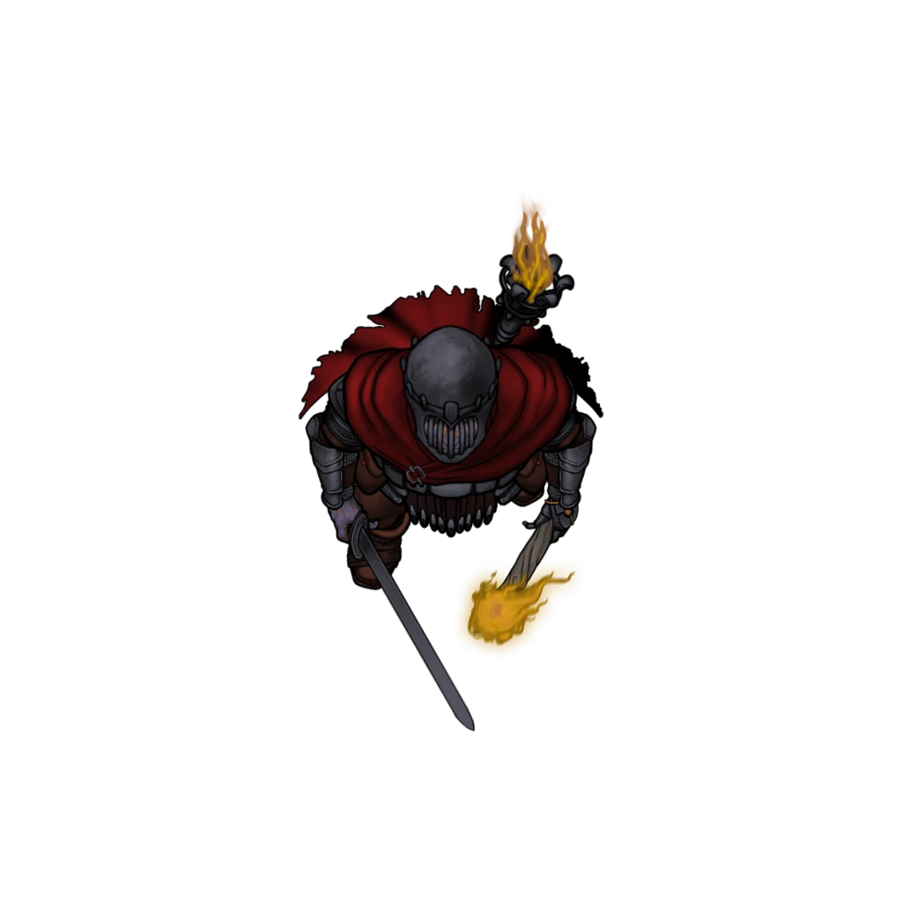
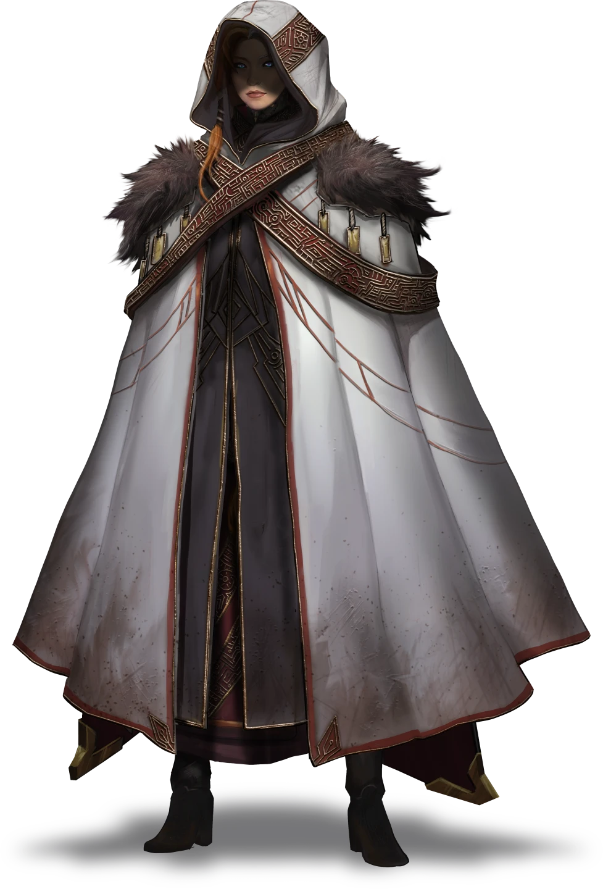

# A Conflagration of Lumé

> [!warning] Gamemaster
> #### Gamemaster's Summary
>
> This Social Cvent allows the party to gain insight about the looming undead threat from the champion of [[Lumé]] known as [[Luna Karrowrath]]. In this event, the characters can:
>
> - Explore the [[Performer's Plaza]] district of Ordain, where they'll meet Luna Karrowrath and her cadre of [[Flameguard Crusader]] at a bonfire gathering.
> - Compete with the Flameguard Crusaders in a test of skill with ranged weaponry.
> - Learn a brief account of the history of undead in [[Aterica]] and the [[Arctus Plateau]].
> - Participate in the communal bonfire ceremony, which intends to bless the Flameguard before they set off on a crusade to the shadow-haunted [[Barrows]].
> - Speak with and spot other denizens of the Arctus Plateau who happen to be attending the event, like the mysterious Sanguinary [[Avwynn Taol]].

### The Lumek Bonfire

If the party wishes to discuss the intricacies of undeath with Luna Karrowrath and her Flameguard allies, they must locate the so-called champion of Lumé among her people, a courteous but protective group of foreigners from the Lumek lands west of the Arctus Plateau. Known for their shared lifelong mission to eradicate the scourge of undeath wherever they find it, these warriors may have insight for the party — if the characters can ingratiate themselves with the outsiders first.

The Lumek bonfire at Performer's Plaza is a gigantic pyre of open flame, and is attended by 24 [[Flameguard Crusader]] and their leader [[Luna Karrowrath]], along with a half-dozen Ordani citizens who appear to be allies and confidants of the foreign group.

The characters must gain the favor of one of the Flameguard warriors, who will subsequently introduce them directly to Luna.

> [!abstract] Flameguard Crusader
> **[[Flameguard Crusader]]**
>
> Level 1 · Unknown Unknown
>
> 

> [!tip] Exploration
> #### Surveying the Scene
>
> If they desire more information, the party can examine the bonfire from afar before they approach. The following skill checks can provide some additional details.
>
> Any character who succeeds on a **Society (DC 12)** check is somewhat familiar with the [[Lumek]] culture, and had heard of the righteous [[Flameguard]] and their holy mission to fight the undead. The character is knowledgeable of the Lumek's war against the [[Moiran]] [[Ossarchate]] north of the Firelands.
>
> - **Path: FlameguardMilitia**: The character automatically succeeds.
> - **Ancestry: Lumek**: The character gains **+2 Boons**.
> - **Knowledge: Undeath**:The character gains **+2 Boons**.
> - **Critical Success**: The character is familiar with Luna Karrowrath as a person of import in Lumek society, and has heard about some of the champion of Lumé's exploits.
>
> Any character who succeeds on a **Arcana (DC 11)** check is well-versed in the origin story of the shard goddess Lumé and her holy mission against the undead.
>
> - **Path: FlameguardMilitia**: The character automatically succeeds.
> - **Ancestry: Lumek**: The character gains **+2 Boons**.
> - **Knowledge: Undeath**: The character gains **+2 Boons**.
> - **Knowledge: Rituals**: The character gains **+2 Boons**.
> - **Critical Success**: The character recognizes this celebration as one of the famed Lumek bonfire ceremonies, which they may have heard about or seen before. These bonfires are known to honor the shard goddess Lumé and her holy quest to vanquish the evil of undeath.
>
> Any character who succeeds on a **Deception (DC 12)** can sense that while the Lumek warriors celebrating here tonight are a cautious lot, their attention is mostly focused on the celebration itself and the various actions that support it. They appear mostly at ease, absorbed in the moment, and supremely confident.
>
> - **Knowledge: Warfare**: The character gains **+2 Boons**.
> - **Knowledge: Rituals**: The character gains **+2 Boons**.
> - **Critical Success**: The carefree nature of this moment feels hard-won from such a hardy group of slayers as these Lumek warriors gathered today. There is a distinct focus to the revelry.
>
> Any character who succeeds on a **Awareness (DC 18)** check is able to spot one warrior that stands out from the rest on the opposite side of the bonfire, nearly hidden by the throng of revelers. This battle-scarred warrior exudes an aura of experience, and still wears some of her plate armor — a steel alloy covered in esoteric symbols. This is Luna Kerrowrath, absorbed in conversation with a few of her closest Flameguard allies. The moment seems unapproachable without some dramatic interruption.
>
> - **Knowledge: Warfare**: The character gains **+2 Boons**.

Once the party decides to approach the Lumek for conversation, read the following aloud:

> [!quote] Read Aloud
> As you draw closer to the bonfire, a few of the Lumek revelers look up to see who might have the audacity to join their group. And then another. And another. And suddenly you feel the weight of dozens of scrutinizing eyes upon you. But the music and the dancing doesn't stop. And the party rages on.
>
> One of the Fej warriors stands to greet you as you pass, a mug of ale held firmly in his meaty right hand. There is an unmistakable air of sass in the bald fellow's voice.
>
> > You lost, friends?
>
> Another Lumek warrior stands to join him, a Vrjnhar woman with exquisite tattoos of fire on her face.
>
> > Maybe they've finally found their way. These folks look like good company to me, Iskar.
>
> She addresses you directly with a grin on her otherwise intimidating face.
>
> > And you don't want to make me a liar, now do you?

> [!info] Social
> #### Meeting the Flameguard
>
> If the party wants to meet with Luna Karrowrath, they'll need to first ingratiate themselves with the other Flameguard Crusaders who've assembled here for the bonfire.
>
> The two Crusaders who stand to greet the party are Iskar (Chaotic Neutral, Lumek Fej, he/him) and Thala (Chaotic Good, Lumek Vrnjhar, she/her), and they are willing to exchange a few pleasantries with the characters if the party is suitably reverent to the moment. Thala and Iskar are most willing to discuss the following:
>
> - The nature of the bonfire as a ceremony in service to the shard goddess Lumé, the Flame Warden, which they celebrate so that it might bless them on a crusade ahead.
> - The ongoing war between the Lumek Flameguard and the Moiran forces of undead.
> - Current affairs in Ordain and the Arctus Plateau.
>
> #### An Audience with Luna Karrowrath
>
> If the party asks for an audience with Luna Karrowrath, they'll have to convince Thala and Iskar (or another Firebrand) that they won't be wasting the champion of Lumé's time.
>
> Any character who succeeds on a **Deception (DC 15)**, **Intimidation (DC 20)**, or **Diplomacy (DC 13)** check is able to convince Thala or Iskar to introduce them to Luna.
>
> - [[Charm Person]]: Targeting Thala or Iskar with the listed spell automatically succeeds.
> - **Path: FlameguardMilitia**: The character gains **+2 Boons**.
> - **Knowledge: Undeath**: The character gains **+2 Boons**.
> - **Knowledge: Rituals**: The character gains **+2 Boons**.
> - **Attunement: Ragen**: The character gains **+2 Boons**.
> - **Holy Symbols**: Clerics or paladins who use a [[Holy Symbol]] of Lumé as their divine spellcasting focus gains **+2 Boons**.
> - [[The Blockaded Bridge]]: Characters who adequately describe their encounter with Luna during the events of [[The Blockaded Bridge]] also have advantage on this check.
>
> Additionally, any character who relates a rousing story about a previous encounter with an undead creature automatically succeeds on these checks. Appropriate encounters include:
>
> - The Skallith horde from the [[Sanctuary of Death]] event at Corpin Sanctuary
> - The Vampyre Spawn encounter during [[The Secret Autopsy]]
> - The Sodden Corpses of the [[Harrowed Crossing]] event
> - The encounter with Tethra Shùl and her Horrendors in [[A Brush With Death]]
> - Any other appropriate encounters.
>
> After the characters have successfully convinced the Flameguard Crusaders that their motives are valid, they're granted an audience with Luna Kerrowrath, the Flame Warden's venerated champion.

As the party approaches Luna Kerrowrath at the opposite side of the bonfire, read the following aloud:

> [!quote] Read Aloud
> The gregarious crusader grabs you by the shoulder and steers you through the crowd of her merry-making cohorts, who regard you with a mixed array of amusement and incredulity. Within a moment, you stand before a makeshift dais, upon which is seated an impressive Fej paladin clad in rune-covered armor.
>
> Thala leans in to speak something into the armored woman's ear. The battle-scarred Fej takes a sip of her ale, smiles a curious smile, and beckons your group to join her. As soon as you're close enough, she addresses you directly with a voice as smoky as the night sky above the plaza bonfire.
>
> > Thala tells me you wish to discuss the scourge of the Evernight? Well, that is certainly a story with which I am most familiar …
>
> The Lumek warriors around you scoff and chuckle with grim jocularity.
>
> > But tell me: what do you adventurers have to offer the Flameguard? This is a sacred night, and we must be selective of the company we keep. Assurances don't come quickly in my line of work. I need more than idle tales of boogeymen on your road to the big city.
>
> The armored captain stands and finishes her last sip of ale. She reaches down to a pile of javelins nearby, and holds one aloft. With a flash in Luna's eye, the tip of the missile becomes wreathed in a nimbus of flame.
>
> > I'd like to see you prove your worth before I seat you at my table. Choose your champion. A test of mettle is in order tonight. The Flame Warden is watching. Are you ready?

> [!abstract] Luna Karrowrath
> **[[Luna Karrowrath]]**
>
> Level 10 (Boss) · Fej Justiciar
>
> 
>
> Clad in battle scarred Lunaran steel armor covered in the symbols of the Flameguard and the goddess Lumé, this Fej warrior has been through countless battles, and her intense, haunted gaze only reinforces this. She carries herself with an uncharacteristic grace for someone so heavily armored. Even the immense mace strapped to her back doesn't seem to slow her down.

If the party members want to continue their tête-à-tête with Luna, they'll need to participate in her impromptu contest of fortitude and ranged skill. However, for better or worse, only one of the player characters will compete in this Lumek challenge.

### A Test of Skill

As part of the ceremony, the Lumek warriors partake in tests of skill and strength, inviting the party to challenge themselves by joining the trials. This event presents a way to learn about - and hopefully establish a rapport with - the Lumek Firebrands who will return as allies in [[Unknown]].

> [!quote] Read Aloud
> With her flaming javelin in one hand, Luna grabs a curious stuffed sack and leads you to an area at the perimeter of this section of the plaza. She reaches into the sack and produces a misshapen skull, humanoid but vaguely deformed with fangs.
>
> > We encountered these foul wretches north of Nain along the river. Undead shamblers, hungry for flesh. Now, they're kindling for the Flame Warden's fire.
>
> Luna tosses the skull to Iskar, who's taken place closer to the bonfire. The bald warrior tosses the undead skull, and — in the blink of an eye — Luna hurls the flaming javelin with lightning-fast precision. The missile skewers the skull and sends it hurtling into the bonfire, where it crackles and sparks like dry moss. Luna turns to you and holds out another flaming javelin.
>
> > I'd like to see you prove your worth before I seat you at my table. Now, choose your own champion. A test of mettle is in order tonight. The Flame Warden is watching.

> [!danger] Hazard
> #### Skulls for the Flame Warden
>
> The party must appoint one character to accept Luna's challenge to hit a skull with a ranged javelin attack and send it flying into the bonfire, all while the heat from the burning javelin threaten to burn the character's arm.
>
> The character who takes up the javelin — known as the party's champion — must succeed on a `[[/save con 15]]` or else take `[[/roll 1d4 fire]]` damage each turn they hold the javelin.
>
> The target skull has an AC of 15, and has 1 hp.
>
> The party's champion has 3 chances to hit the skull. If the party's champion fails to hit the skull, Luna Karrowrath will humor the party with a brief conversation, but the characters will fail to win the favor of the Flameguard this day.

If the party wins the skull shooting challenge, Luna congratulates the party and invites them to participate in the ceremony. Read the following aloud:

> [!quote] Read Aloud
> The skull pops and crackles like a kindling in the bonfire, and the crowd of Lumek warriors cheer in unison to celebrate your steady aim. Luna strides forward and touches her forehead to yours, muttering a prayer to her goddess:
>
> > By the Hearthslayer's hand. The Flameguard could use an aim like that against the legions of the Everdark. Welcome to the party, friends. Please, eat, drink, and be merry! Lumé commands it!
>
> Before you know it, Lumek revelers are jamming food and drink into your hands, and the ceremony swirls around you like a beautiful storm of song and dance and firelight.

> [!warning] Gamemaster
> #### Event Outcome: Lumé's Blessing
>
> If the party's champion succeeds during the Flameguard contest of skill and mettle, the characters gain a temporary boon from the shard goddess Lumé. Mark the "Lumé's Blessing" Event Outcome above.

#### Akon Attunement: Lumé's Blessing

The party's champion succeeds during the Flameguard contest of skill and mettle, they advance their **Attunement: Akon (+1)** at the conclusion of the event.

If the party fails to win the skull shooting challenge, Luna admonishes the party's lack of skill and champion spirit, but she invites the party to watch the ceremony and share in the bounty of food and drink that is being enjoyed this evening. Read the following aloud:

> [!quote] Read Aloud
> A few muffled jeers make their way through the crowd as Luna strides forward and puts a hand on your shoulder.
>
> > It seems the Hearthslayer's hand does not guide you this evening, friends. Perhaps you don't have what it takes to run with the Flameguard. But fear not, you're still welcome at my table. Please, make yourselves comfortable and enjoy the simple rewards this night has to offer.
>
> Before you know it, Lumek revelers are putting food and drink into your hands, and the ceremony swirls around you like a beautiful storm of song and dance and firelight.

### The Ceremony Begins

With Luna's contest of skill and mettle out of the way, the party can enjoy the bonfire ceremony and the amenities it has to offer. During the celebration, they'll be able to continue their conversation with Luna about the rising undead threat.

> [!info] Social
> #### A Conversation with Luna Karrowrath
>
> Once the festivities begin, Luna Karrowrath is more than willing to share additional information about the Flameguard and their mission against the undead scourge of the Moiran Blood Barons. Some conversation points include:
>
> - A brief history of her triumphs and tribulations as a champion of the shard goddess Lumé.
> - An account of her company's journey to Ordain, and the trials they've faced along the way.
> - An explanation of the bonfire ceremony, which is intended to grant favor to their impending journey to the Arcturian Barrows, where they are avowed to confront the rising undead menace in the region.
>
> Whether the party's champion managed to succeed at the contest of skill and mettle or not, Luna invites the characters to take up arms with the Flameguard and pledge their assistance to the company of Firebrand warriors on their mission to the Barrows.
>
> Any character who succeeds on a **Deception (DC 13)** is able to confirm the authenticity of Luna's narrative, and finds the champion of Lumé to be a remarkably honest person in general.

> [!warning] Gamemaster
> #### Event Outcome: Pledged Assistance
>
> If the characters choose to pledge their assistance to Luna and the Flameguard in the days to come by offering to aid them on their quest to the Barrows, mark the "Pledged Assistance" Event Outcome above. The party's loyalty to the Flameguard's cause will reward them with help and opportunities of their own from time to time.

#### Ragen Attunement: Pledged Assistance

If the party pledges their assistance to Luna and the Flameguard, each character advances their **Attunement: Ragen (+1)** at the conclusion of the event.

#### Aura Attunement: Withheld Assistance

If the party refuses to assist Luna and the Flameguard, each character advances their **Attunement: Aura (+1)** at the conclusion of the event.

> [!tip] Exploration
> #### On the Peripheral
>
> Throughout the course of the Flameguard ceremony, the party will have a few opportunities to notice moments and persons of interest among the crowd.
>
> Characters with a **`[[/skill passive perception 13]]`** or who succeed on a **Awareness (DC 15)** check are able to notice a familiar face among the crowd: [[Avwynn Taol]], whom they most likely met at Corpin Sanctuary during the events of [[Corpin Arrival]].
>
> However, as soon as one or more of the characters notice Avwynn at the edge of the plaza, in the blink of an eye she's gone. A quick investigation or pursuit yields no results; wherever she went, she's well beyond the party's reach at this time.

> [!abstract] Avwynn Taol
> **[[Avwynn Taol]]**
>
> Level 12 (Boss) · Human Mystic
>
> 
>
> Tall, regal, and confident, this human woman carries herself with certainty and exudes a powerful confidence back with a steely, unwavering calm. Her icy blue eyes glimmer sharply against black sclera, betraying some hint of non-human ancestry, or perhaps magical twisting in her blood.

### Concluding the Event

> [!warning] Gamemaster
> #### Next Steps
>
> There is no downstream event following this one. If they have yet to do so, the party is free to learn more about the [[Soul Cycle]] of Ember by visiting the Temple of [[Sockets]] in the [[Temple Ward]] district of Ordain for the events of [[Bickering Priests]].
