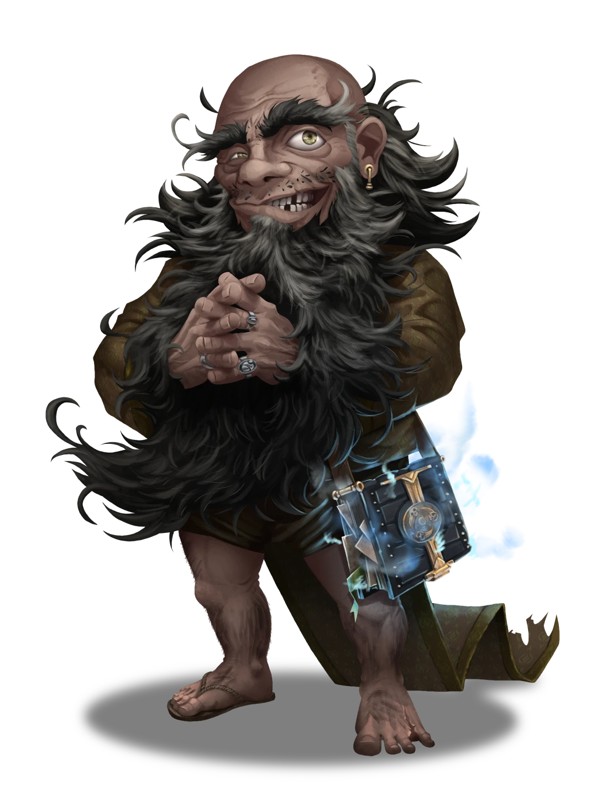

# Bickering Priests

> [!warning] Gamemaster
> #### Gamemaster's Summary
>
> This Social Event introduces the party to the Temple of Sockets in Ordain's [[Temple Ward]], along with the tenets and beliefs of the Elder God [[Sockets]]. In this event, the characters can:
>
> - Experience first-hand the wonders of the Temple of Sockets, the Arctus Plateau's single-most important monument built in honor of death and Ember's mysterious [[Soul Cycle]].
> - Observe a conversation between [[Conaris Haid]], the High Priest of Sockets, and the necromancer Shard God [[Sionia]].
> - Choose to align their beliefs with the absentminded Conaris Haid or the increasingly-suspicious Sionia, or otherwise take a neutral stance.

### Meeting Conaris Haid

Following her conversation with [[Conaris Haid]], [[Sionia]] promptly leaves the Temple of Sockets to head back to her temporary residence in the [[Numinous Shrines]] district of Ordain. The party has just enough time to observe her in this fleeing moment, but she won't stop for anything.

> [!abstract] Sionia
> **[[Sionia]]**
>
> Level 1 · Unknown Unknown
>
> 

Meanwhile, the absentminded High Priest of Sockets lingers in his rectory. He's eager to proselytize and preach the tenets of Sockets to the characters, and immediately assumes that religion is their reason for being here.

> [!abstract] Conaris Haid
> **[[Conaris Haid]]**
>
> Level 1 · Unknown Unknown
>
> 

> [!info] Social
> #### A Conversation with the High Priest
>
> Conaris Haid is eager to praise the word of the elder god of death to whoever is diligent enough to listen to his ramblings. But the party has questions of their own for the absentminded priest.
>
> Following each question from the party, a successful **Diplomacy (DC 15)** or **Deception (DC 13)** check is required to keep Conaris from rambling his way on to a different topic of conversation.
>
> - [[Calm Emotions]]: A character casting this spell with Conaris as a target gains **+2 Boons**.
>
> Additionally, any character who succeeds on a **Society (DC 15)** or **Arcana (DC 15)** check is somewhat familiar with the elder god Sockets and has basic knowledge of the Soul Cycle. A character who succeeds on one of these checks has advantage on any Charisma skill checks made to interact with Conaris Haid, thanks to their enhanced ability to banter with the absentminded priest.
>
> - **Knowledge: Gods**: The character gains **+2 Boons**.
> - **Knowledge: Souls**: The character gains **+2 Boons**.
>
> After a series of brief introductions, the High Priest steers conversation towards the following:
>
> - What brings the party to the great city of Ordain.
> - The religious practices of any characters of faith in the party, particularly those who wield divine magic.
> - The tenets of [[Sockets]] and his faith, which include reverence for the [[Soul Cycle]] and admonition of the reviled magic known as [[Magic and Spellcraft]].
> - Daily life here at the [[Ordain Gazetteer]], and the reverent duties of its priests and acolytes.
>
> Any character who succeeds on a **Deception (DC 13)** check can readily tell that the madcap antics of the High Priest and his eccentric nature are totally authentic, and supposes that even Conaris himself is unaware of precisely which direction his freewheeling mind will travel next.
>
> Additional conversation points are detailed below, in the High Priest's own words.

> [!question] Q&A
> **Q:** About the Pale Woman:
>
> **A:**
>
> The High Priest guffaws and wriggles his brows in overwrought annoyance.
>
> > "That scandalous spellslinger is none other than Sionia, the Nir'ae necromancer who became a god. Her antics are troublesome, to say the least. She isn't precisely welcome here, because we can't trust her to respect the Soul Cycle, which means she doesn't respect my church. Sometimes I think she means well, but her methods are disturbing. Unholy, if you ask me. And you did. [Humph!]
> >
> > But based on that look on your face, my answer wasn't good enough. Just go and ask her for yourself! I hear she's sneaking around the Numinous Shrines when she isn't haranguing my priests."

> [!question] Q&A
> **Q:** About Sockets:
>
> **A:**
>
> > "The Keeper of Souls is a benevolent chap. I quite like him myself. Sure, he can be cantankerous and more stubborn thank a yarnac in a snowstorm, but he's a god of his word. From here to Eternas, the efforts of Sockets make a difference in the lives of every soul on Ember. We pray to Sockets because he holds a true place for us in the Cosmos. And his majesties can be seen every day. We live, we die, and the Heart of Ember beats on. The Deathless one helps us keep the beat, so we might keep on dancing."
>
> A smile streaks across the old priest's face as his eyes fill with pride.

> [!question] Q&A
> **Q:** Regarding the Soul Cycle:
>
> **A:**
>
> > "All souls are birthed from a single flicker of energy within the Heart of Ember, which joins our mortal body once we're born. When we die, our living souls journey to the Bonelands — the domain of Sockets himself — where we linger for as long as the Deathless one desires. Some of us have unfinished business and remain tethered to Ember's soil, while others are free to drift back to the Heart of the living planet much sooner. But such things are not for us to say. As Sockets wills it, so it will be."

> [!question] Q&A
> **Q:** Regarding Undead on Ember:
>
> **A:**
>
> The High Priest's brow furrows with concern.
>
> > "These are dark days, indeed, when the sanctity of the Soul Cycle has become so threatened that such foul, undying creatures can lurk within the confines of rotten flesh — their minds full of venom and hate, if they have minds at all. The Cindarics and their Burnished Hand allies will no doubt be valuable friends for the adherents of Sockets in the days to come. The Heart of Ember is sacred to us all."

> [!question] Q&A
> **Q:** About the Temple's Services:
>
> **A:**
>
> > "We serve the tenets of Sockets here, and pay homage to his philosophy. Naturally, this means we offer a variety of services that cater to the spirituality of Ember's people and their fates. Just don't expect us to raise your loved ones from the dead. Once they escape their mortal cages, so to speak, it's up to ol' Sockets to determine what's next."

Ultimately, the High Priest seems unhinged and amusing, but altogether unhelpful. When it's all said and done, Conaris abruptly invites the characters to leave.

> [!quote] Read Aloud
> The High Priest jolts up and claps his ringed hands in satisfaction.
>
> > Now, my dear friends, it's up to YOU to spread the good word of Sockets to the people of Ordain and beyond. It's becoming all so clear to me now! This is precisely what brought you here in the first place. THIS is your calling! The will of the Deathless one is a mysterious force indeed, but I can see the look of the faithful in your eyes, my young friends. Imagine that! New acolytes when you least expect it. Now, hurry along. We've a ceremony on the hour that needs desperate attention from yours truly. Have a good day, and we'll see you soon enough.
>
> And with that, the scatterbrained Conaris Haid bumbles off and out of the chamber, a trail of unanswered questions following behind him.

#### Orbis Attunement: Befriend Conaris Haid

Each character who manages to befriend Conaris Haid during this encounter advances their **Attunement: Orbis (+1)** at the conclusion of the event.

#### Cora Attunement: Offend Conaris Haid

Each character who manages to offend Conaris Haid during this encounter advances their **Attunement: Cora (+1)** at the conclusion of the event.

### Concluding the Event

The party should come away from this event with enough curiosity to track down Sionia, who has a more applicable viewpoint on the emerging undead phenomena.

> [!warning] Gamemaster
> #### Next Steps
>
> The characters will need to pursue a conversation with the Shard God of Necromancy herself if they want to fully understand what might be happening with (or to) Ember's delicate Soul Cycle.
>
> The party must journey to the nearby [[Numinous Shrines]] district for the events of [[Numinous Rendezvous]], during which they can speak with Sionia.
