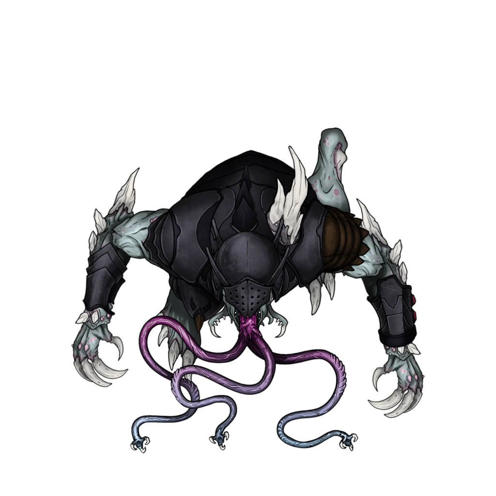
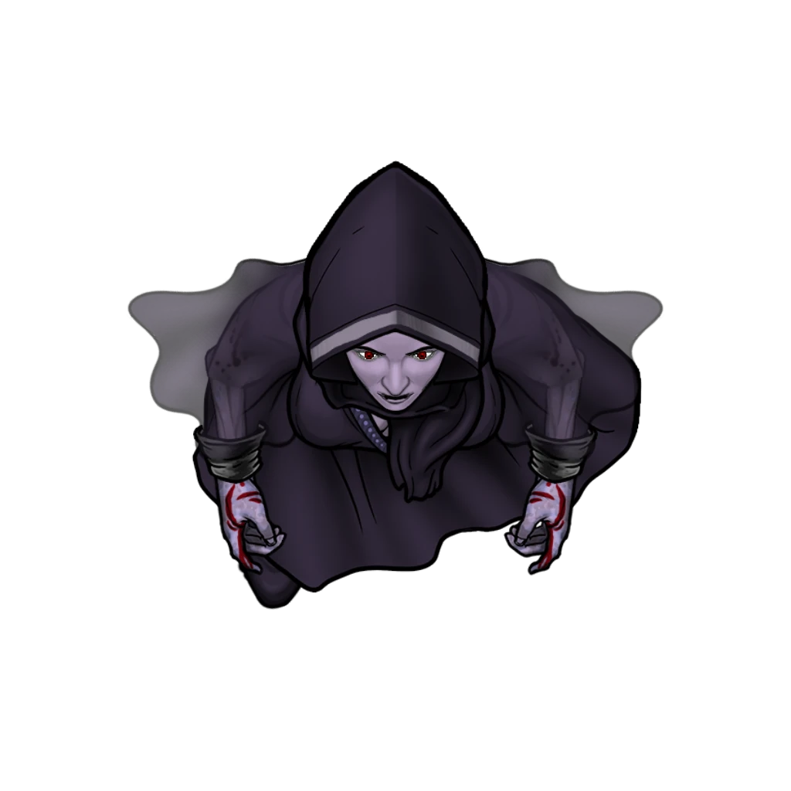
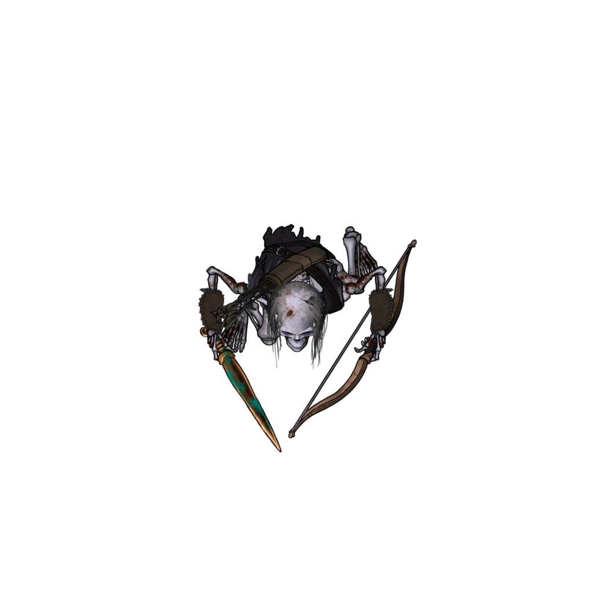
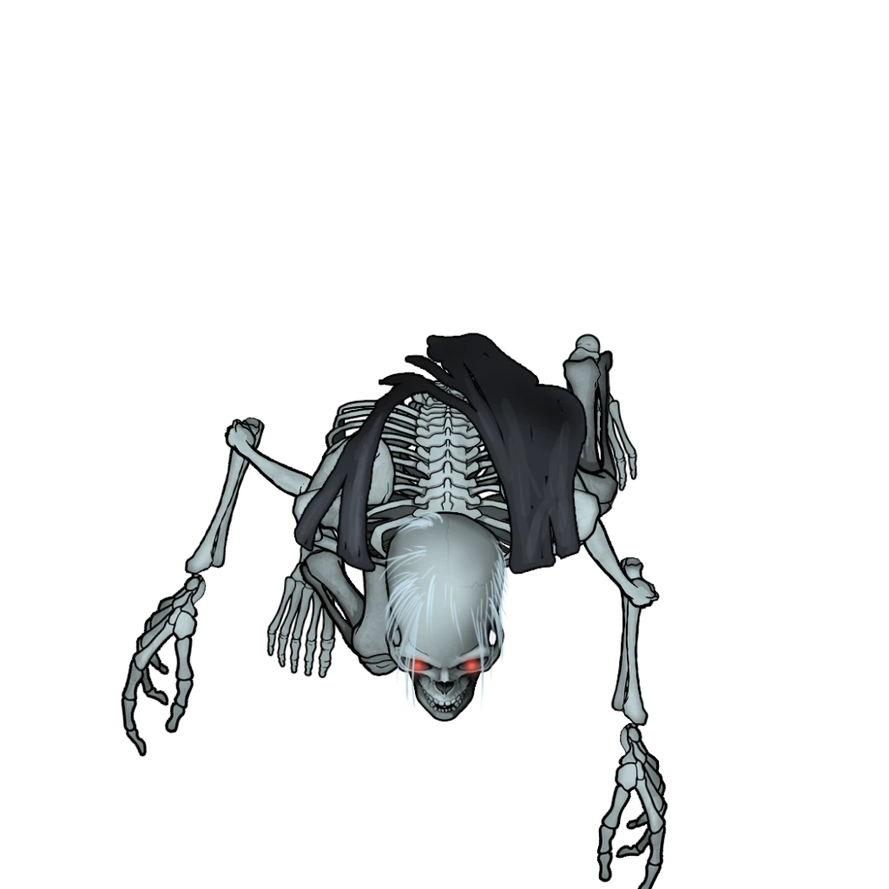
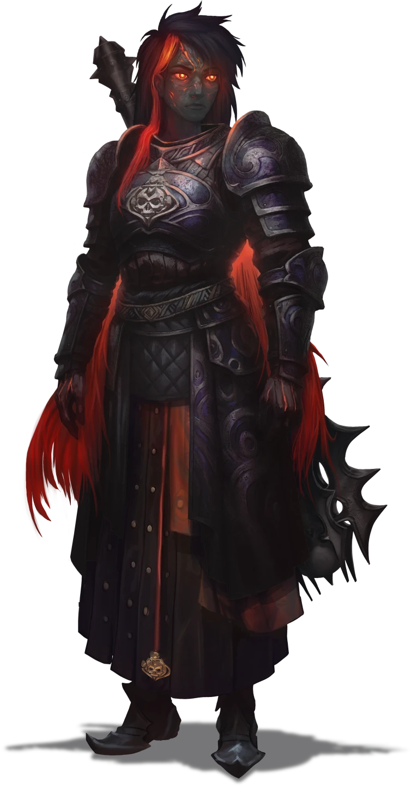

# Grave Assignments

> [!warning] Gamemaster
> #### Gamemaster's Summary
>
> This Combat Event takes the party to the [[Burial Grounds]] two miles northeast of Ordain, where their quest for undead evidence is interrupted by a lethal encounter with an undying blood-drinker and a horde of skeletal minions. In this Event, the characters can:
>
> - Explore the dungeon level of the Burial Grounds with their ally [[Sin Marmot]] in search of physical remains of the undead creatures they previously encountered in Westgate and Fallbrook.
> - Survive a dangerous fight with a vampiric [[Corpuleth]] and a horde of [[Skallith]] minions, brought to life by a furtive necromancer — the Blood Baroness [[Amelia Naxan]] — who disappears without a trace before the battle begins.
> - Examine the various remains once combat has concluded, comparing their thoughts with those of the Lumek warrior [[Luna Karrowrath]] — who arrived just in time to help stem the tide of the fight.
>
> #### Lurking Skallith
>
> The Skallith and Crumbling Skallith tokens on the map are intended to appear during combat but not a moment sooner, and should remain hidden from the characters as they initially make their way through the Burial Grounds. The various Skallith will be revealed during turn 3 of the party's combat with the Corpuleth.
>
> #### Point of No Return (Chapter 3)
>
> This event serves as a point of no return for certain Chapter 3 main quests. Once the characters complete this event, they can no longer continue or complete the events of [[Disgraced House]] and [[Spreading Sickness]].

### Exploring the Burial Grounds

Once the party reaches the Burial Grounds, they must journey into a subterranean annex to look for the remains of the undead creatures they previously encountered in Westgate and Fallbrook. A full description of the Burial Grounds location can be found in the [[Burial Grounds]] area walkthrough.

The party will journey overland through the Burial Grounds until they reach the Cindaric Crematorium featured on the Ordain Burial Grounds area map, which they will approach from the southwestern edge of the map. The characters will be able to explore the cemetery exterior at their leisure before approaching the interior section, where the Cindaric facility lies waiting.

This first section of exploratory gameplay will likely be slow and uneventful, unless the characters happen to be fond of grave-robbing. Several opportunities for such skullduggery will present themselves as the party makes their way through the overgrown cemetery grounds.

Refer to the Burial Grounds area walkthrough for additional information on what is contained in the various mausoleums and other points of interest on the map, including slight details about roving patrols of Cindarics and other Ordani gravekeepers who work the Burial Grounds in regular intervals.

### The Thing in the Catacombs

The combat of this event begins in earnest when the party reaches the subterranean [[Funeral Hall]] where the sacred Cindaric cremation rites are performed. Here, they'll encounter the [[Corpuleth]] — a gruesome vampiric horror brought to life by the Blood Baroness [[Amelia Naxan]].

Parties who failed to kill the necromancer [[Evesso]] during the [[Sanctuary of Death]] event will recognize the warped countenance of the Corpuleth as none other than the disgraced Ashka necromancer himself, subjected to this twisted prison of undying flesh at the hands of his powerful mistress.

> [!warning] Gamemaster
> #### If Evesso Was Previously Destroyed
>
> Evesso's appearance here is dependent on the previous outcome at [[Corpin Sanctuary]]. If the party managed to completely destroy the Ashka necromancer's physical form during the events of [[Sanctuary of Death]], the Corpuleth will otherwise have been created from a different, unnamed [[Ashka]] minion from Amelia Naxan's untold ranks of underlings.

Once the party opens one of the doors to the [[Funeral Hall]], read the following aloud:

> [!quote] Read Aloud
> A strange scene is unfolding on the platform suspended above the pit … A large humanoid clad in dark armor is hunched over one or more cadavers on the floor. All you can hear above the din of the roiling magma deep below is a vicious, bony crunch followed by horrible squelching.
>
> As your presence becomes known to this hulking entity, it turns slowly to survey your group. And much to your horrifying surprise, this large humanoid cradles the withered body of Ordan — the undead Harrower you killed in Fallbrook — in its prodigiously inhuman claws. Three prehensile tongues are wrapped around the dead soldier's decrepit form, and the large creature appears to be gorging itself on the corpse's foul ichor.
>
> The large creature steps aside briefly to reveal a cloaked feminine figure hiding behind it, some hooded woman of mystery robed in black, who you barely get a glimpse of. With a maddening chuckle that will echo throughout your mind for eternity, the alluring lady begins to disintegrate — her seductive form stretching, folding, and breaking apart into a crimson mist, coalescing above the armored brute like some vaporous, bloody cloud. A face of pure evil appears in this mist, fanged and fiendish and unforgettable. It mirrors the woman's maddening chuckle, before dissipating into thin air above the pit.
>
> The armored humanoid drops the Harrower's lifeless corpse and prepares to greet you, fangs and prehensile tongues first.

The necromancer Amelia Naxan appears during this encounter for a brief moment, but she disappears before the characters will have an opportunity to confront her. Depending on their circumstances and understanding, they may not even recognize who or what they're dealing with. Combat swiftly begins after the readaloud above.

> [!abstract] Corpuleth
> **[[Corpuleth]]**
>
> Level 1 · Unknown Unknown
>
> 

> [!abstract] Amelia Naxan
> **[[Amelia Naxan]]**
>
> Level 1 · Unknown Unknown
>
> 

> [!danger] Hazard
> #### Corpuleth Tactics
>
> Once combat begins, the Corpuleth will attempt to target multiple characters with its [[Hematic Spray]] from a distance before closing in for melee. As soon as this ability is recharged, the Corpuleth will use this ranged attack again from the most strategic position it can take at the time.
>
> The Corpuleth is extremely aggressive, and won't hesitate to attack weaker targets, making use of its [[Ravenous Agility]] to quickly close the distance on the area map.
>
> As the Corpuleth closes in, it will utilize the 10-foot reach of its [[Prehensile Tongues]] from afar before the inevitable use of [[Multiattack]] against adjacent targets. If and when the Corpuleth takes excessive damage, it will attempt to replace missing hit points with its [[Bloody Gorge]] attack against enemies it has [[Grappled]].
>
> If the characters attempt to fight the Corpuleth near the edge of the magma pit in the Funeral Hall, the Corpuleth may attempt to shove one or more of the characters into the pit (whether the character is grappled or not).
>
> The Corpuleth is ravenous and feral, and will fight to the death.
>
> #### Precarious Armor
>
> Be sure to keep an eye on the critical hits and damage-per-turn taken by the Corpuleth. If the [[Precarious Armor]] feature is triggered, you'll need to manually adjust the Armor Class of the Corpuleth accordingly for the rest of the combat by un-equipping the creature's [[Moiran Plate Armor]] and [[Moiran Helm]].
>
> Additionally, we recommend you manually adjust the Corpuleth's dynamic token by removing the appropriate Equipment layers, including the Helm, Pauldrons, Chest, and Wrists.

> [!warning] Gamemaster
> #### Skallith Attack!
>
> On round 3 of combat, a contingency of supplemental enemies appears in the exterior section of the Burial Grounds, consisting of: 12 [[Crumbling Skallith]], one regular [[Skallith]], and one special Skallith armed with a [[Warhammer +1]] (labeled "Warhammer Skallith" on the area map token).
>
> These tokens will remain hidden until this time. You'll need to manually reveal these enemies at the top of round 3, before or after the readaloud featured below.
>
> #### Looting the Magic Weapon
>
> We've assigned a Warhammer +1 as the Warhammer Skallith's magic weapon (which we consider to be a powerful tool against Ember's skeletal undead), but we encourage you to substitute the Warhammer (if necessary) for another +1 melee weapon that is guaranteed to be be martially advantageous or narratively copacetic for one or more of the party members.

> [!quote] Read Aloud
> The earth begins to shake and the sound of crumbling rock echoes through the halls of the Cindaric Crematorium. Looking out to the cemetery field, the source of this commotion quickly becomes evident … Much to your dismay, a dozen or more skeletal warriors appear to have clamored their way out of their stony, moss-covered graves. These reanimated corpses lunge to horrible life and start rushing towards your group, armed to the rotten teeth with rusty blades and foul intentions.

> [!abstract] Skallith
> **[[Skallith]]**
>
> Level 1 · Skallith Commonfolk
>
> 
>
> You behold the terrifying appearance of a reanimated humanoid skeleton, whose decrepit bones remain dreadfully assembled, despite the lack of sinew and flesh. This loathsome skeletal creature wields a timeworn blade, and a rotted shortbow is slung across its bony back.

> [!abstract] Crumbling Skallith
> **[[Crumbling Skallith]]**
>
> Level 0.5 (Minion) · Skallith Commonfolk
>
> 
>
> You behold the terrifying appearance of a reanimated humanoid skeleton, whose decrepit bones remain dreadfully assembled, despite the lack of sinew and flesh. This loathsome skeletal creature wields a timeworn blade, and a rotted shortbow is slung across its bony back.

> [!danger] Hazard
> #### Skallith Tactics
>
> The Skallith are relative simple-minded and will rush into combat with the characters wherever they are when these skeletal minions appear at the top of Round 3. Optimally, this means charging headlong into the Cindaric Crematorium to assault the party in a pincer attack with the Corpuleth. The Skallith will fight to the death.
>
> If the characters attempt to fight any of the Skallith near the edge of the magma pit in the Funeral Hall, the Skallith may attempt to shove one or more of the characters into the pit.

> [!warning] Gamemaster
> #### The Champion of Lumé Appears!
>
> During combat with the Corpuleth and Skallith minions, [[Luna Karrowrath]] will make a surprise appearance to either help the party during their most desperate hour or help the characters celebrate their hard-earned victory.
>
> Luna immediately appears when one of the following conditions are met:
>
> - Two or more party members (including Sin Marmot) have the [[Unconscious]] condition or have died.
> - The Corpuleth is reduced to 20 hit points or has died.

When the time is right for Luna to appear, read the following aloud:

> [!quote] Read Aloud
> Just then, the flickering glow of orange firelight draws your attention to a new source of illumination here in the cemetery … You turn to see the familiar silhouette of Luna Karrowrath on the misty horizon, her war mace held high in both hands, wreathed in the holy flame of her goddess. She lets loose a furious battle cry before rushing headlong into the fray:
>
> > By the sacred flame of Lumé, these unholy abominations shall be destroyed!

> [!abstract] Luna Karrowrath
> **[[Luna Karrowrath]]**
>
> Level 10 (Boss) · Fej Justiciar
>
> 
>
> Clad in battle scarred Lunaran steel armor covered in the symbols of the Flameguard and the goddess Lumé, this Fej warrior has been through countless battles, and her intense, haunted gaze only reinforces this. She carries herself with an uncharacteristic grace for someone so heavily armored. Even the immense mace strapped to her back doesn't seem to slow her down.

> [!danger] Hazard
> #### Luna Karrowrath Tactics
>
> Luna's primary objective during the battle is to assist other characters. She'll rush to [[Stabilize]] any characters who've become unconscious as a result of damage taken by enemies.
>
> If all party members are conscious and active, Luna will use the [[Help]] action to assist the character who needs it most.

> [!info] Social
> #### When the Smoke Clears
>
> Once combat has ended, the party can have a conversation with Luna. The Champion of Lumé is eager to discuss the following topics:
>
> - Her timely arrival was the result of a premonition — a vision of ill omens and loathsome undying monsters in the flames compelled her to seek out this place as soon as possible.
> - The Corpuleth encountered here is remarkably similar to the servants of the Blood Barons, but Luna and her Flameguard have never seen anything like it before.
> - While the characters were away, major changes have rocked Cindarin Temple and its sages: Jon Vastil, the beloved Holy Speaker, is dead from natural causes.
>
> If the party describes the necromancer they saw at the beginning of the encounter, Luna offers up her own suspicions for consideration: this "Pale Necromancer" reminds her of the Blood Baron Amelia Naxan herself.
>
> - Naxan's presence in the Arctus Plateau, no matter how fleeting, is a bad omen for the people of Ordain.
> - Luna recommends the characters prepare their minds and polish their steel for an excursion into Moiran territory to confirm the identity of this pale necromancer.

> [!tip] Exploration
> #### Examining the Remains
>
> Any character who succeeds on a **Society (DC 13)** check is able to confirm the origin of the Corpuleth's dark plate armor as Moiran, and is able to surmise that it was crafted by the talented blacksmiths of the Blood Barons far to the west.
>
> - **Knowledge: Warfare**: The character gains **+2 Boons**.
> - **Knowledge: Undeath**: The character gains **+2 Boons**.
>
> Any character who succeeds on a **Arcana (DC 13)** or **Wilderness (DC 15)** check is able to positively identify the Corpuleth as an undead creature with remarkable physiological similarities to the [[Vampyre Spawn]] they encountered in Westgate.
>
> - This creature was evidently once humanoid, an Ashka who likely earned Amelia Naxan's ire and (as a result) this horrible fate. If his physical body wasn't already destroyed during prior combat with the party, this is what has become of the necromancer [[Evesso]] — who the characters may recognize from their encounters at [[Corpin Sanctuary]].
>
> - **Knowledge: Forensics**: The character gains **+2 Boons**.
> - **Knowledge: Undeath**: The character gains **+2 Boons**.
>
> Whether or not the characters succeed with their own investigation of the remains, they must collect one or more **Undead Samples** to take back to Sionia in the Numinous Shrines district.
>
> - Appropriate Undead Samples include the intact limb or entire corpse of an undead creature raised by Amelia Naxan's necromancy: the Corpuleth, the Harrower, the Vampyre Spawn, or one or more Skallith.
> - Although the Harrower wasn't encountered during the battle here, the profaned corpse of the derelict Burnished Hand Protector known as Ordan can be found among the remains — drained of its posthumous ichor by the bloodthirsty Hematophage.

> [!info] Social
> #### The Dead Speak
>
> Characters who cast the [[Speak with Dead]] spell can communicate with one or more of the cadavers found in the catacombs, provided they weren't one of the corpses resurrected as Skallith or the previously encountered Harrower and Vampyre Spawn.
>
> - A description of what Amelia Naxan was doing before the characters arrived.
> - An account of the dead Cindaric known as Vaelen Moss, the Vampyre Spawn who attacked the party at Traveler's Rest in Westgate.
> - General information about the Burial Grounds and the various rites and rituals conducted here.

> [!warning] Gamemaster
> #### Event Outcomes
>
> Once the characters loot physical remains (aka Undead Samples) from the slain corpses of one or more undead creatures (including the Corpuleth, Skallith, and the half-eaten remains of the Harrower or Vampyre Spawn), check the "Remains Retrieved" Event Outcome at the top of the page.
>
> If the characters loot the Moiran Helm worn by the Corpuleth after its death, check the "Helmet Procured" Event Outcome at the top of the page.
>
> Should the characters manage to accurately describe the "Pale Necromancer" to Luna Karrowrath or identify Amelia Naxan on their own, check the "Necromancer Identified" Event Outcome at the top of the page.

#### Heart Attunement: Corpuleth Slain

If the party manages to successfully defeat the Corpuleth in combat, each character advances their **Attunement: Heart of Ember (+1)** at the conclusion of the event.

#### Signara Attunement: Undead Remains Retrieved

If the party manages to retrieve the remains of more than one type of undead creature, each character advances their **Attunement: Signara (+1)** at the conclusion of the event.

#### Akon Attunement: Necromancer Identified

The first character to successfully identify the furtive necromancer as the Blood Baron Amelia Naxan advances their **Attunement: Akon (+1)** at the conclusion of the event.

#### Abyss Attunement: Helmet Procured

Any character who takes possession of the Corpuleth's Moiran Helmet advances their **Attunement: The Abyss (+1)** at the conclusion of the event.

### Secondary Objective

As the party explores the Burial Grounds, they have the opportunity to complete Sionia's "Secondary Objective" task of placing the 5 [[Ken Crystal]] throughout the cemetery (as assigned to the characters during [[Numinous Rendezvous]]).

> [!tip] Exploration
> #### Placing Sionia's Ken Crystals
>
> If the party took up Sionia's secondary task, they'll become aware of precisely where to place the wondrous items as they explore the Burial Grounds. You'll help guide this experience as the characters encounters various locations on the area map.
>
> Whenever a character holding one of the Ken Crystals comes within 15 feet of what Sionia referred to as "the proper places," the Ken Crystals will vibrate ever-so-slightly with arcane energy. When ready, they must speak the command phrase as instructed:
>
> > Eyes for the Deathbringer
>
> Appropriate locations to install the Ken Crystals include:
>
> - [[Anrak Mausoleum]]
> - [[Tomb of Spectra's Chosen]]
> - [[Lamplighter's Rest]]
> - [[Ashvale Mausoleum]]
> - [[Antechamber]]
> - [[Chamber of Remembrance]]
> - [[Embalming Room]]
> - [[Funeral Hall]]
>
> Each of the 5 Ken Crystals must be placed at least 50 feet away from the other crystals. If a character attempts to place Ken Crystals too close to each other, they won't vibrate with arcane energy until the proper distance has been traveled.
>
> Whenever a Ken Crystal is successfully installed, it becomes wreathed in a dark nimbus of divination and illusion magic before disappearing from plain sight — seemingly vibrating out of our reality and into another, altogether unseen one.

The first time one of the characters attempts to install one of the Ken Crystals in the Burial Grounds, read the following aloud:

> [!quote] Read Aloud
> As you speak Sionia's command phrase, the crystal shard begins levitating from your hand and thrums rapidly with arcane energy. Space and time pulse around the ken crystal as it begins vibrating out of the visual spectrum. A moment later, it's as if the crystal has dissolved into the very fabric of reality here, where — invisible to the naked eye — it will await the Lonely Goddess' remote command.

> [!warning] Gamemaster
> #### Event Outcome: Eyes for the Deathbinder
>
> Once the characters have successfully installed all 5 of Sionia's Ken Crystals in the Burial Grounds, check the "Eyes for the Deathbinder" Event Outcome at the top of the page.

#### Mayis Attunement: Eyes for the Deathbinder

Any character who successfully installs one of Sionia's Ken Crystals advances their **Attunement: Mayis (+1)** at the conclusion of the event.

### Concluding the Event

Once the party is ready to depart the Burial Grounds, two downstream events await them: [[Spirited Revelations]] at the Numinous Shrines, and [[Speaker Silenced]] at Cindarin Temple. The former will provide them ample opportunity to follow up with Sionia about the undead remains they've collected, while the latter will propel the entire order of Cindaric Sages into a most uncertain and tumultuous future.

Sin is particularly interested in what Sionia has to say about the undead creatures the party has recently faced, and is eager to follow up with the Shard Goddess. The encounter at Corpin Sanctuary remains a solemn surprise, no matter which event the characters happen to trigger first.

> [!warning] Gamemaster
> #### Next Steps
>
> Once the undead here in the Burial Grounds have been defeated, the party must collect one or more samples of undead remains for delivery to Sionia, who awaits them in the [[Numinous Shrines]] for the events of [[Spirited Revelations]].
