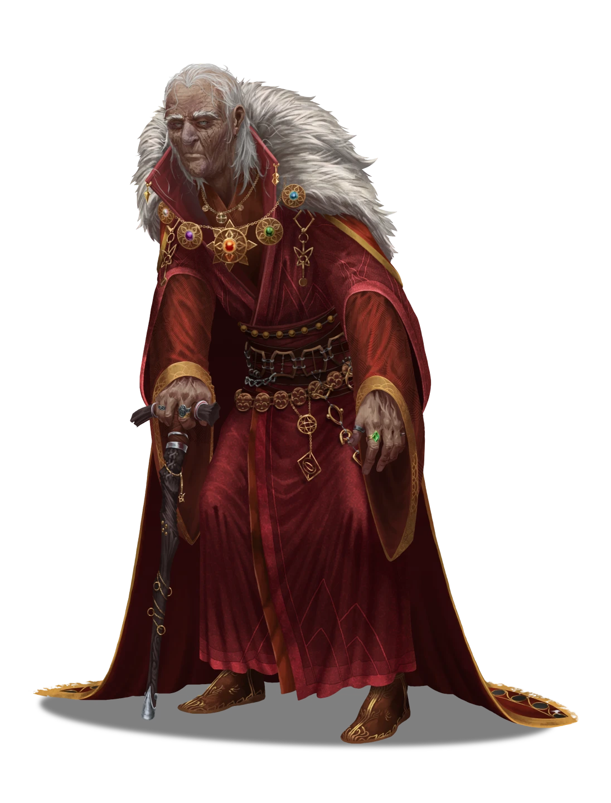

# Sagacious Initiation

> [!warning] Gamemaster
> #### Gamemaster's Summary
>
> This Social Event invites the party to witness Sin Marmot's initiation into the ranks of the [[Cindaric Sages]] at the legendary [[Cindarin Temple]] in Ordain. In this Event, the characters can:
>
> - Listen to a commemoration speech by the Holy Speaker [[Jon Vastil]], who welcomes and blesses the new set of Cindaric Initiates — including the druid [[Sin Marmot]].
> - Speak with [[Steros Kraver]] of the Burnished Hand, who invites the party to visit his recruitment office at Veneration Hall in Lower Ashvale.
> - Speak with the Second Sage [[Lilla Arien]], who assigns Sin Marmot her first tasks as a fledgling Cindaric.
>
> #### Portraying Lilla Arien
>
> It is essential during this event that Second Sage Lilla Arien be portrayed as a kind, honest, and authentic person. Subsequent quest events in this campaign arc will require the party to view her as a trustworthy ally, and that trust begins in earnest here and now.

### Exchanging Pleasantries

Once the party reaches Cindarin Temple and spots their ally Sin Marmot, they have a few scant moments to join Sin near the front of the crowd and discuss whatever they wish. After the characters have had ample time to exchange pleasantries with Sin and her fellow initiates, the ceremony proceeds.

> [!abstract] Sin Marmot
> **[[Sin Marmot]]**
>
> Level 2 · Keth Cindaric Aspirant
>
> 
>
> A Keth with a friendly demeanor and wide blue eyes and a strange half-mask that covers her mouth. She seems to view everything around her with an air of wondrous innocence but her keen glances also suggest the ability to read any given situation quickly and she may be more capable than she appears at first glance.

Consult the skill checks in "Reading the Crowd" below to determine if the characters already know anything regarding what's about to transpire. Read the following aloud when you're ready to proceed:

> [!quote] Read Aloud
> Just now, the resonant chime of a gong captures everyone's attention. Upon the dais, a wizened Sage begins to address the crowd. This is none other than Jon Vastil — the Holy Speaker himself. You note the benevolent assuredness behind his timeworn voice.
>
> > Welcome, honorable sages and initiates alike, to this most hallowed of ceremonies. A new class of Cindarics joins us today, on the heels of strange calamities throughout our beloved Plateau. And these initiates could not come at a better time. Threats of phantasmal creatures have been whispered as far-off as Helkas, and you've all no doubt heard of the incident at Corpin Sanctuary.
>
> The Holy Speaker motions to a handsome, bronze-clad warrior to his left, who looks upon the crowd with a distinct air of humility.
>
> > Thanks to the courageous diligence of Steros Kraver and his Burnished Hand soldiers, Corpin Sanctuary survived a most gruesome assault at the foul hands of necromancy.
>
> Vastil then gestures to a younger Ordani sage on his right, an austere fellow with a hint of Kivahr lineage.
>
> > And it goes without saying, but say it I must: the noble Vinarith, while humble in his ambitions, has been paramount in the Temple's efforts to attract new recruits to our important work here. Many among you have joined our ranks thanks to Vinarith's efforts.
>
> Yet another sage stands idly nearby, her accomplishments apparently overlooked. This Signborn woman disguises her omission with casual nod of resignation as the Holy Speaker continues.
>
> > Our order grows; and with it, so does our ability to heal the sick and mend the wounded. Ember itself seethes with a wound of its own, inflicted by whatever hides behind this necromancy. The work of the Cindarics is more important today than ever. YOU play a pivotal role in that work, my dear sages, from our most seasoned veterans to our newest initiates.
> >
> > And so now, we begin the sacred rites that have been passed down to us since the time of Adonia.
>
> After a quick gesture, the two Sages who flank the Holy Speaker step forward with ceremonial accoutrements. Vinarith swings a censer like a pendulum, plumes of incense smoke wafting from within, while the Second Sage holds a crystal-crowned scepter aloft and raises her voice in song. The crowd joins her as the vermillion crystal atop the rod begins to glitter with arcane magnificence.
>
> > Children of the cosmos come,
> > and hearken to the Heartblood's song.
> > Cindaric, we stand, our fates hand in hand
> > till Ember's last flames have been fanned.
>
> The chorus of Sages continues for several stanzas as the melodic chants fill the majestic eaves of the sanctuary with song. Sin smiles at you with hard-earned satisfaction.

> [!tip] Exploration
> #### Reading the Crowd
>
> The characters can attempt to discern the intentions of the various sages (whether before, during, or after Jon Vastil's speech and Lilla Arien's Cindaric hymn).
>
> A series of respective **Deception (DC 13)** skill checks reveal various details while observing each NPC during the sacred rites, as described below.
>
> - **Knowledge: Intrigue**: The character gains **+2 Boons**.
>
> - **Jon Vastil:** The Holy Speaker's intentions seem as pure as freshly driven snow, and the pride he feels for his fellow Cindaric Sages and their benevolent mission is unmistakable. Surely, there isn't a single inauthentic bone in the old man's body.
> - **Vinarith:** The steward seems eager to please the Holy Speaker and win the admiration of his fellow Cindarics. He conducts his role in the sacred rites with learned precision and utmost determination. There is a distinct air of responsibility about him.
>   - **Critical Success**: Vinarith observes the Holy Speaker and the Second Sage with keen attention during the rites, as if simultaneously supervising and learning from them. His surveillance is direct, but nonchalant.
> - **Lilla Arien:** If her body language is any indication, the "Second Sage" seems somewhat defeated by the lack of attention she received during the Holy Speaker's speech, but her overt sense of duty outshines this disappointment. She seems perfectly at home here in Cindarin Temple among her fellow sages.
>   - **Critical Success**: In addition to her personal role in the ceremony, Lilla pays considerable attention to the throng of Cindaric sages and initiates during the rites. Her observance seems considerate and matronly.
> - **Steros Kraver:** The stoic commander of the Burnished Hand is full of pride and personal satisfaction this day. His bearing is haughty with an air of casual contempt, like a lion amongst a clowder of house cats.
>   - **Critical Success**: Despite a certain amount of respect for the moment that his inherent sense of professionalism demands, Steros seems a bit bored by the initiation ceremony, and eager for the proceedings to end.
> - **Sin Marmot:** The young druid is beside herself with eager anticipation and dutiful reverence. She seems mindful, present, and full of hopeful potential. Her eyes scan the sages on the dais like a dedicated scholar lost in study.
> - **Other Cindarics:** At least a hundred sages are gathered here for the initiation rites, and the collective vibe among them is one of gratification and fulfillment. Some light anxiety dances about the room in the eyes of a few hopeful initiates, and nearly all of the experienced sages exude intentions that are both warm and welcoming.
>
> #### Studying the Ceremony
>
> A successful **Arcana (DC 13)** check allows a character to surmise certain details pertaining to the ritual accoutrements used by the Cindarics during the ceremony:
>
> - The scepter held aloft by Lilla Arien is an enchanted holy relic, and that the crystal that sits atop its head is most likely a [[Ascendancy]], laced with preternatural magic from the Heart of Ember.
> - The censer held by Vinarith is an item of similar Cindaric import, and the sacred incense is laced with powdered Heart Fragment.
>
> - **Path: Cindaric Initiate**: The character gains **+2 Boons**.
> - **Knowledge: Artifacts**: The character gains **+2 Boons**.
>
> **Society (DC 13)** or **Arcana (DC 13)** The character is familiar with the basic history of the [[Cindaric Sages]] and their founder Adonia's role in the original settlement of [[Ordain]].
>
> - **Path: Cindaric Initiate**: The character gains **+2 Boons**.
> - **Knowledge: Rituals**: The character gains **+2 Boons**.
> - **Critical Success**: The character is familiar with the Cindaric ceremony at hand, and is able to sing along with the hymn. The character can also identify the two sacred relics used in the ceremony as the **Scepter of Accordance** and the **Heartblood Censer**. At your discretion, the character may gain advantage on tangential skill checks with various Cindarics who witness their sincere participation.

> [!abstract] Jon Vastil
> **[[Jon Vastil]]**
>
> Level 1 · Unknown Unknown
>
> 

> [!abstract] Vinarith
> **[[Vinarith]]**
>
> Level 12 (Boss) · Human Cindaric Sage
>
> 

After the ceremony and song, the party has a few brief moments before they're approached by Steros Kraver and Lilla Arien (separately, in succession). If and when the characters attempt to engage with Jon Vastil or Vinarith, they are quickly intercepted by Steros, who is eager to invite them to the Burnished Hand barracks in a clandestine attempt to assess their respective motives and skill levels.

### The Protector's Invitation

Following the initiation ceremony, Steros Kraver descends the dais into the crowd and subsequently approaches the party to discuss potential recruitment with the Burnished Hand. He will interrupt the party with timeliness as soon as they attempt to break away from the crowd.

> [!quote] Read Aloud
> As the crowd of Cindarics swirls about you, you can't help but notice the armored warrior from the dais has decided to stride forward to greet you himself. Sages and initiates alike make way for the distinguished solider, who commands an air of respect as he marches through the busy room. He addresses you without hesitation.
>
> > Welcome to Ordain, friends. You don't quite have the look of typical Cindaric hopefuls about you. Tell me, what brings such able-bodied allies to the cloistered halls of Cindarin Temple?

> [!abstract] Steros Kraver
> **[[Steros Kraver]]**
>
> Level 8 (Boss) · Human Fighter
>
> 
>
> This remarkably spruce warrior is clad in an impressive suit of aged bronze armor. The etching of a symmetrical crimson hand with roots like an ancient oak is emblazoned on the breast piece, and a lavish fur cloak is draped upon the matching pauldrons. A shock of long white hair frames this bearded soldier's handsome face, which is decorated with utter discernment. He wields a mighty greataxe as tall as he is, and equally as deadly.

> [!info] Social
> #### A Conversation with Steros
>
> Steros is most likely aware of the party's involvement in the fight against Evesso at Corpin Sanctuary, and this encounter provides a moment of reconnection. Considering the timely arrival of the characters at Corpin and their tangential involvement here at Cindarin Temple, Steros is not simply interested in the party's motives — he's curious about their capabilities as potential soldiers for the Burnished Hand. Conversation points include the following:
>
> - If the characters are noticeably upset or concerned about the tense investigation of Corpin Sanctuary by the Burnished Hand, the commander will quickly attempt to diffuse that tension.
> - Steros will ask Sin about her desires to join the Cindaric Sages, with a genuine sense of curiosity.
> - Steros will compliment the characters according to their most visually apparent traits or qualities in an effort to flatter them.
> - As one of Ordain's most trusted security officers, Steros makes a general inquiry about the party's motivations while visiting the city, particularly when it comes to their career pursuits.
> - Before taking his leave, Steros invites the party to visit the Burnished Hand barracks in [[Lower Ashvale]] at least one day from now, where they might discuss potential employment opportunities. (This invitation leads to the [[Helping Hands]] event). *"The doors of Veneration Hall are always open to qualified recruits."*
>
> **Deception (DC 15)** It's easy enough to discern that Steros is flattering the characters in an attempt to disarm them. He seems personally responsible for the Cindarics and their city, and his evaluation of the party is a part of that duty.
>
> **Society (DC 15)** The character is familiar with the location and various details of the Lower Ashvale district nearby, including one or more local contacts or celebrities of worthy repute.
>
> #### Meeting Steros for the First Time
>
> If the party didn't meet Steros Kraver during the events of [[Crumbling Sanctuary]], they may be meeting him here for the first time. Refer to the "Enclosing Hand" exploration block in [[Corpin Condemned]] for potential conversation points about Steros and the Burnished Hand.

### Sin's Assignment

Once Steros Kraver has departed, Lilla Arien approaches Sin and the party to provide the young initiate with her first assignment. The Second Sage is willing to entertain any question Sin or the characters might have about these duties and the Cindaric Order itself.

> [!quote] Read Aloud
> As the moment idles, a kind voice rises above the din.
>
> > Those Cindaric robes suit you, Initiate Marmot. I trust you and your friends enjoyed the ceremony?
>
> You look up to see the Second Sage, Lilla Arien, who steps forward with a proud smile that matches the satisfaction in her eyes. Her spectral Signborn hands clasp together in matronly reverence as she addresses the young initiate once more.
>
> > Sin, you'll be pleased to know you've been approved for your first assignment. Old City Library in Scholar's Nook is in dire need of your expertise with Lepidoptera. It seems the lower archives are on the verge of being subsumed by a colony of moths. And you seem like just the druid for the job.

> [!abstract] Lilla Arien
> **[[Lilla Arien]]**
>
> Level 8 (Boss) · Signborn Cindaric Sage
>
> 
>
> A signborn woman with a round, friendly face that belies the stress she carries. Her gray skin contrasts with her bright blue eyes, rosy cheese, and messy head of white hair. Short, pale blue horns curve softly from her forehead. She is clad in the ornate robes of the Cindaric order.

> [!info] Social
> #### A Conversation with Lilla
>
> The Second Sage is genuinely interested in Sin's progress as a Cindaric initiate, as well as the overall wellbeing of her companions. Lilla will idle with the party for a brief time, with conversation points about the following:
>
> - Brief details about Sin's assignment at the Old City Library in Scholar's Nook, which will include the ethical handling and safe extrication of the moth colony in the building's lower archives.
> - General information about the [[Cindaric Sages]] and their role as spiritual custodians of [[Ordain]] and its people.
> - If pressed, the Second Sage provides her opinion about the Burnished Hand and their role during the incident at Corpin Sanctuary. Lilla's thankful for the militant order's protection in trying times, but she thinks they overstepped their bounds at Mial Mountain. Steros is a capable, if brusque, leader; and it wasn't his decision to march to Corpin Sanctuary — it was an edict by Jon Vastil.
> - Sin expresses gratitude to Lilla that she's finally able to embark on her journey as a Cindaric, but also some frustration that the party's encounter with the undead at the Nain river crossing hasn't been taken more seriously — particularly given the incident at Corpin Sanctuary.
> - Additional dialogue options for Lilla Arien regarding various subjects can be found in the [[Sage Advice]] event, but she currently has dozens of initiates to attend to (and relatively little time to do it).
>
> **Deception (DC 13)** It's easy to tell that Lilla Arien is one of the most authentic people in Ordain, let alone among the Cindaric Sages. Sincere to the core of her being, Lilla's words ring true and her emotions feel remarkably genuine.
>
> **Society (DC 15)** The character is familiar with the location and various details of the [[Scholar's Nook]] district on the eastern edge of town, including one or more local contacts or celebrities of worthy repute.
>
> After meeting with Lilla, Sin offers the party a brief tour of Cindarin Temple before saying her temporary goodbyes.

### Concluding the Event

Despite the party's efforts or intentions, the Holy Speaker Jon Vastil and his steward Vinarith are unavailable for counsel or conversation at this time.

Sin can provide the characters with a short tour of the premises before they decide to leave, but access to Cindarin Temple's most private areas is rather limited. Once the party is ready to leave, they may go about their business in whatever fashion they choose. Sin Marmot remains here at Cindarin Temple to prepare for the duties ahead.

> [!warning] Gamemaster
> #### Next Steps
>
> At the moment, the party is aware of only one option for their next steps: they've been invited to visit Steros Kraver at Veneration Hall in [[Lower Ashvale]] for the events of [[Helping Hands]].
>
> Unbeknownst to the characters at this time, Sin Marmot will provide an additional route of investigation in three days when she reaches out to the party during the events of [[A Message from Sin]]. For the time being, the party will continue their adventures without her.
