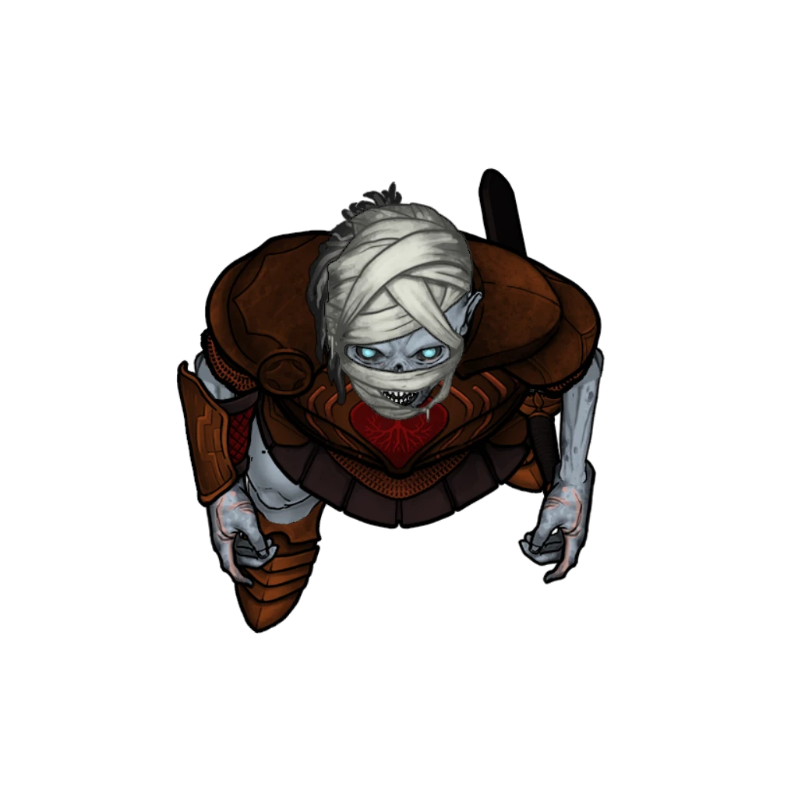

# The Derelict Protector

> [!warning] Gamemaster
> #### Gamemaster's Summary
>
> This Combat Event pits the party against a new undead adversary within the confines of a small Ordani town house. In this event, the characters can:
>
> - Investigate the [[Fallbrook]] apartment for signs of the derelict protector derelict Burnished Hand Protector named Ordan.
> - Survive a quick and brutal combat scenario with Ordan, who has become a loathsome undead creature known as a [[Harrower]] following his apparent death.
> - Choose whether or not to reveal the truth of what happened here to the Burnished Hand (including the protector named Vance) and/or the Cindaric Sages.
>
> This event will occur on the [[Ordain Flats]] biome area map, using the "Apartment Block" composition.

#### Early Access Work in Progress

This event uses an Ordain Flats biome area map for the Derelict Protector's townhome apartment. This particular composition of the Ordain Flats area map does not (yet) have any Walls defined for its buildings. This is a known limitation that will be resolved as we switch our biome-specific area maps to use Scene Levels in Foundry VTT version 14.

### Outside the Apartment

> [!tip] Exploration
> #### Examining the Apartment Exterior
>
> Characters with a `[[/check prc 16 passive format=long]]` or characters who search outside the apartment and succeed on a **Awareness (DC 13)** check are able to notice the following:
>
> - There is no sign of foul play outside.
> - Footprints of the same booted foot can be found around the front threshold, leading to and from the door.
> - The subtle yet distinct odor of carrion rot lingers on the air.
>
> - **Knowledge: Forensics**: The character gains **+2 Boons**.
> - **Knowledge: Crime**: The character gains **+2 Boons**.
> - **Critical Success**: The character can spot [[Ordan's Key]] hidden above the top jamb of the door's stonework, and can hear the faint sound of flies buzzing.
>
> A successful **Wilderness (DC 13)** check is able to date the most recent booted footprints leading to the front door as roughly four days old. Any other footprints are impossible to place based on their age, worn from time and weather as they are.
>
> Any character who casts the [[Detect Evil and Good]] spell while searching the apartment's exterior is able to sense the location of the [[Harrower]] inside, who is seated in the dark towards the rear. It's particularly easy for the character to sense Ordan this way while looking through the glass windows and the front door.

> [!danger] Hazard
> #### Locked Door
>
> The front door to Ordan's apartment is locked. A successful `[[/check dex 18]]` check using Thieves' Tools is required to pick the lock, which can also be unlocked via [[Ordan's Key]] (found above the door jamb).

### Inside the Apartment

Once the party gains access to the apartment interior, they have a brief moment to survey the scene before their encounter with Ordan the [[Harrower]] begins.

> [!quote] Read Aloud
> The first thing you notice as you step into the darkened apartment is the fetid smell of rotten flesh, followed by the sound of a soft, staccato buzzing. Your eyes drift to a limp form on the floor — the withered cadaver of a large dog, desiccated and swarming with house flies. The scene here is a gruesome one, marked by motionless heat.
>
> Before you have a chance to search the apartment any further, a brittle voice croaks out from the back of the room, where an armored figure is seated in the dark. The table before them is decorated with rotten, abandoned food.
>
> > I don't recall summoning any visitors to my home this evening … but you'll suffer all the same.
>
> The armored figure you presume to be Ordan stands to reveal his countenance. No longer human, the derelict protector has become something apparently new and entirely accursed. The abrupt sound of a longsword leaving its sheath is the last thing you hear before battle erupts in the confined apartment.

> [!abstract] Harrower
> **[[Harrower]]**
>
> Level 1 · Unknown Unknown
>
> 

> [!danger] Hazard
> #### Harrower Tactics
>
> The Harrower will most likely lead with a [[Multiattack]] salvo of ranged [[Oblivion Beam]] or melee [[Thanatic Blade]] attacks.
>
> If and when adversaries close in for melee, the Harrower will target the strongest among them with the [[Bestow Curse]] spell, followed by a [[Withering Touch]] attack.
>
> As far as other [[Spellcasting]] is concerned, bold or haughty characters will quickly become the targets of the irksome Harrower's [[Command]] spell, and enemies who attempt to bolster their abilities with their own magic will become the swift targets of [[Dispel Magic]].
>
> The Harrower fights gruesomely to the death, and as unfairly as possible.

> [!warning] Gamemaster
> #### Innocent Bystanders
>
> The [[Ordani]] and [[Arcturian]] placed on the area map are not intended to participate in this combat encounter, unless you deem their involvement a suitable measure for your game. Once combat begins, any innocent bystanders such as these will run away from the conflict as soon as they become aware of it.
>
> If the combat somehow lasts for more than 10 rounds or spills out into the city at large, you can choose to have 1 or more [[Burnished Hand Protector]] arrive to help contain the battle and put the minds of other locals at ease.

> [!tip] Exploration
> #### Examining the Corpse
>
> Any character who succeeds on a **Awareness (DC 12)** check while searching the corpse of the Harrower is able to confirm it as the worldly remains of Ordan, the Burnished Hand Protector they were sent to check up on — confirmed by etchings on his longsword as well as personal accoutrements around the apartment.
>
> - **Knowledge: Forensics**: The character gains **+2 Boons**.
> - **Knowledge: Crime**: The character gains **+2 Boons**.
> - **Critical Success**: There are no apparent wounds on the corpse aside from those inflicted by the party and its vile, withered hand. Whatever strange and accursed force was the cause of this morbid transformation remains a distinct mystery.
>
> Any character who succeeds on a **Arcana (DC 16)** or **Wilderness (DC 16)** check can confirm the nature of the Harrower's corpse as an undead creature, recently risen from the grave.
>
> - **Knowledge: Forensics**: The character gains **+2 Boons**.
> - **Knowledge: Undeath**: The character gains **+2 Boons**.
> - **Critical Success**: The loathsome monster slain here today displayed qualities and attributes quite unlike any undead creature in recorded history.
>
> Any character who casts the [[Detect Magic]] spell to examine the corpse notices a dissipating aura of Necromancy magic, which grows less intense by the second.

Despite the previous conclusion of [[Helping Hands]], the party is free to return to Veneration Hall in Lower Ashvale to share news of their encounter here with Vance, Steros, or the other Burnished Hand Protectors.

### Concluding the Event

> [!warning] Gamemaster
> #### Next Steps
>
> Should they desire more information, the party can seek counsel with the Second Sage [[Lilla Arien]] at Cindarin Temple during the recurring event known as [[Sage Advice]].
>
> If the party has completed both [[The Derelict Protector]] and [[The Secret Autopsy]] their next visit to visit Lilla Arien will direct them to [[Performer's Plaza]] for [[A Conflagration of Lumé]].
