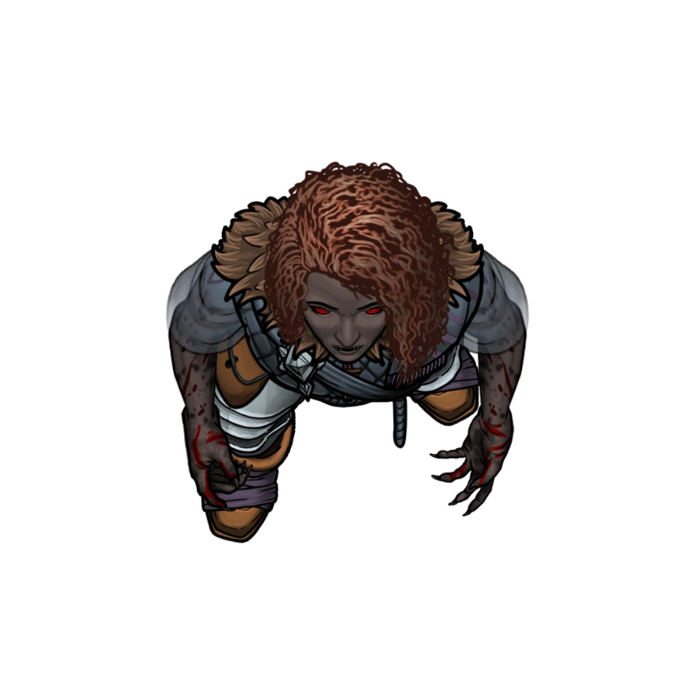

# The Secret Autopsy

> [!warning] Gamemaster
> #### Gamemaster's Summary
>
> This Combat Event pits the party and [[Sin Marmot]] against an undead creature in one of Ordain's hallowed healing houses. In this event, the characters can:
>
> - Meet Sin Marmot at the [[Traveler's Rest]] healing house in [[Westgate]] to conduct a clandestine autopsy on a corpse, one that has been marked with strange wounds.
> - Fight the newly-reanimated corpse, which springs to life as a [[Vampyre Spawn]] as it kills a helpless Cindaric named Menedaeus.
> - Investigate the remains of the bloodthirsty creature for additional clues.
> - Speak with the other Cindaric Sages about what's happened here.

### Exploring Traveler's Rest

Once the party reaches Traveler's Rest, they'll be ushered into the downstairs [[Examination Room]] by their ally Sin Marmot to perform the titular autopsy, with limited ability to explore other basement areas along the way. A full description of the [[Traveler's Rest Basement]] and corresponding [[Traveler's Rest Healing House]] locations can be found in the [[Traveler's Rest]] area walkthrough.

### Examining the Corpse

After the party has entered through the [[Basement Entrance]] and had a moment to gather their wits, Sin directs them to the [[Examination Room]], where the [[Cindaric Adherent]] Menedaeus and the eponymous autopsy awaits them.

> [!quote] Read Aloud
> Sin leads you down the basement hallway and into a medical examination room, where an autopsy table awaits with its solemn contents: the cadaver of some unfortunate Ordani who has just recently died. The young man has been undressed, but a white sheet covers most of his pale and harrowed form. His eyes are closed in eternal repose, and a grim quietude hangs about the chamber.
>
> A thirty-something Cindaric quickly slides into the room, wearing a few wrinkles on his troubled brow. He addresses your group in a hushed voice.
>
> > Thank you for your timely arrival, friends. I am Menedaeus. The Second Sage says you and initiate Marmot can be trusted with this timely endeavor, which we wish to keep somewhat quiet. You see, the nature of this particular death eludes us. And the city doesn't need another excuse for panic. Your group has seen peculiar things on the road to Ordain that many of us have not. Please, take a look for yourselves.
>
> Menedaeus pulls back the sheet to reveal a collection of wounds on the cadaver — three circular lesions on the dead man's chest. At a glance, these injuries are unlike anything you've seen before, but they demand a closer look.

The party is invited to investigate the corpse itself for clues about what might have caused the citizen's untimely death.

> [!info] Social
> #### A Conversation with Menedaeus
>
> The Cindaric named **Menedaeus** (NG, Ordani Human, he/him) is normally a wry fellow, but much of his sarcastic wit has been displaced by curiosity and trepidation in this particular moment. Dressed in the familiar robes of a [[Cindaric Adherent]], he's been appointed as the local contact for this job by Lilla Arien herself, and is eager to see it through.
>
> As the party begins taking a closer look at the corpse, Menedaeus provides them with some details about the body:
>
> - The victim was a fellow Cindaric named Ardus Tohl, who was assigned to Traveler's Rest this week after a stint on funerary duties in the Burial Grounds. An orphan from birth, Ardus was a lifelong Cindaric who kept to himself but was respected by all. He seemed fine when he reported for duty yesterday morning.
> - Lilla herself conducted a thorough search of Ardus Tohl's dormitory chambers at Cindarin Temple and his station at the Burial Grounds to no avail. No clues were left behind.
> - The Second Sage is worried that panic could spread among the initiates, and is keen on figuring this problem out on her own with the help of the party and a few trusted Cindarics.
> - During his time as a healer at Traveler's Rest, Menedaeus has seen many peculiar wounds and illnesses — from bites to diseases, and everything in between — but the wounds on Ardus resemble nothing he's ever seen.
>
> A successful **Deception (DC 13)** check verifies the claims made by Menedaeus as truthful (as far as he knows), and confirms his own earnest desire to see this predicament resolved.

> [!tip] Exploration
> #### Performing the Autopsy
>
> The characters are invited to examine the corpse posthaste for clues about what might have caused poor Ardus to suffer an untimely death. Some details are obvious:
>
> - The three wounds look nearly identical in nature, and are located on the victim's chest, a few inches above his left breast. The wounds are circular, nearly the size of a gold piece, and are situated within a couple of inches of each other.
> - The wounds look like red rings, similar to the sores left by ringworms, but much more intense.
>
> Any character who succeeds on a **Awareness (DC 14)** or **Medicine (DC 14)** check is able to determine the following:
>
> - The wounds themselves appear to be circular bites caused by a round mouth lined with fangs, like that of a lamprey.
> - There are no signs of poison or standard contagion.
> - The victim's body has undergone a few atypical changes that are incongruous with standard post-mortem deformations: Ardus' skin is remarkably pale (almost translucent), his eyes have grown milky with cataracts, and rigor mortis has yet to set in.
> - The body reeks of a loathsome musk, but doesn't quite resemble the smell of rotting flesh.
>
> - **Knowledge: Forensics**: The character gains **+2 Boons**.
> - **Knowledge: Undeath**: The character gains **+2 Boons**.
> - **Critical Success**: The wounds appear somewhat clustered, and equal in measure, as if inflicted simultaneously.
>
> Characters who succeed on a **Arcana (DC 17)** check can correlate some of these observations with the supernatural qualities of undead creatures.
>
> Any character who casts the [[Detect Magic]] spell to examine the corpse notices a pervasive aura of Necromancy magic, which grows alarmingly more intense by the second.
>
> The [[Detect Evil and Good]] spell identifies the so-called corpse as an undead creature. If and when this occurs, jump to the moment of the "Surprise Attack!" described below.

### Surprise Attack!

As the party is conducting their investigation, the proceedings are interrupted when the corpse lurches to life as a bloodthirsty undead creature — a Vampyre Spawn wrought by foul necromancy. The reanimated Ardus Tohl immediately attacks the unsuspecting Menedaeus, who suffers his own untimely fate. A battle is afoot for the characters, who must slay the undead creature before it wreaks further havoc.

> [!warning] Gamemaster
> #### Spawning the Vampyre Token
>
> A tile has been placed on the area map to represent the body of Ardus Tohl, as seen in the [[Examination Room]] on the central examination table. When the time is right, you can manually trigger the appearance of the hidden [[Vampyre Spawn]] token via the "Interact with Objects" menu.
>
> The "Awaken Vampyre Body" interactable will allow you to both 'Awaken Vampyre' and 'Reset Body' as needed. We recommend you trigger the 'Awaken Vampyre' configuration the moment you start reading the following text aloud for the players.

> [!quote] Read Aloud
> Just then, an unholy rasp emanates from the dead body of Ardus Tohl, who gruesomely lurches back to life in the blink of an eye. Before you can react, the corpse has its hideously fanged mouth wrapped around the neck of Mededaeus, who shrieks in terror as a gout of his blood is sprayed across the room — and your faces — in a sheeted fan of sanguine horror.
>
> There's no time to waste, and there's no mistaking what's next: this pallid monster seeks to wrap its fangs around YOU …

> [!abstract] Vampyre Spawn
> **[[Vampyre Spawn]]**
>
> Level 1 · Unknown Unknown
>
> 

> [!danger] Hazard
> #### Vampyre Spawn Tactics
>
> Menedaeus is killed outright in a "surprise attack" round preceding the initiative roll.
>
> Once combat begins, the Vampyre Spawn will immediately make use of its [[Leap]] or [[Deathless Agility]] bonus actions to reposition itself for a tactical advantage, all while utilizing its [[Spider Climb]] to traverse ceiling or wall terrain beyond standard melee reach.
>
> The Vampyre Spawn will try to attack the character with the least number of hit points, excluding Sin Marmot as a potential candidate, dishing out a steady application of [[Multiattack]] each round with as many [[Claw]] and [[Bite]] attacks as possible.
>
> Newly reborn, this particular Vampyre Spawn can be portrayed as slightly more feral and unhinged than normal, and will fight to the death here in the back room of Traveler's Rest.

> [!tip] Exploration
> #### Examining the Aftermath
>
> Once the smoke of battle has cleared, the party can examine the Vampyre Spawn's remains for a few final clues before leaving the remaining cleanup in the capable hands of Sin and the Cindaric Sages who work here.
>
> Any character who succeeds on a **Arcana (DC 14)** or **Wilderness (DC 14)** check can confirm the nature of the reanimated corpse as an undead creature, freshly risen from the grave.
>
> - **Knowledge: Forensics**: The character gains **+2 Boons**.
> - **Knowledge: Undeath**: The character gains **+2 Boons**.
> - **Critical Success**: The corpse of Ardus Tohl can be identified as one of the various types of [[Vampyres]] spawn created by the Moiran Blood Barons, who dwell in their dark and native wastelands to the west.
>
> Additionally, any character who succeeds on a subsequent **Society (DC 18)** check is somewhat familiar with the [[Ossarchate]] and their legacy of necromancy.
>
> The bottom line: minions of the Blood Barons are rarely (if ever) seen outside of the night-laden Bonelands where they reside.
>
> - **Knowledge: Undeath**: The character gains **+2 Boons**.
>
> #### What About Menedaeus?
>
> Attempts to save Menedaeus from his untimely fate are unsuccessful. However, Sin Marmot will attend to his corpse once combat has ended, and will immediately beseech the characters for help placing the cadaver in a dignified position on one of the stone slabs or steel carts in the basement.
>
> Any character who succeeds on a **Medicine (DC 13)** or **Arcana (DC 16)** check can confirm with some assurance that whatever disease or curse is responsible for creating the vampyre spawn wasn't transmitted to Menedaeus himself.
>
> - **Knowledge: Forensics**: The character gains **+2 Boons**.
> - **Knowledge: Undeath**: The character gains **+2 Boons**.
>
> Once this event has concluded, Sin will take on the responsibility of informing the Cindarics of Traveler's Rest about what happened here, and what has become of poor Menedaeus.

### A Report for Lilla Arien

Sin has much to share with the Second Sage after the events here at Traveler's Rest come to a close. But first and foremost, Sin is eager to help treat any wounds that were inflicted against her fellow party members during their combat with the Vampyre Spawn.

After a brief moment, Sin addresses the characters directly with a suggested plan of action:

> [!quote] Read Aloud
> With a sigh of relief, Sin Marmot procures a handkerchief and wipes a streak of blood from her exhausted face.
>
> > Well, that was a bit surprising, wasn't it? I suppose I have a few points of discussion for Lilla after all this. Don't worry about the mess here — the other sages can help me clean this up. But how do you feel about a meeting at Cindarin Temple? Tomorrow morning, perhaps? That'll give me a chance to soften the blow a bit with my own report. Plus, I could use a little one-on-one time with the Second Sage.
> >
> > I can't help but think I'm already picking up a certain kind of reputation here in Ordain. But I also can't thank you all enough for everything you've done for me so far. "Birds of a feather fly farthest together," as they say.

> [!info] Social
> #### Vibe Check with Sin
>
> Sin is happy to exchange a few pleasantries with the rest of the party as the moment lingers, but she's clearly eager to finish taking care of business here.
>
> Any character who succeeds on a **Deception (DC 13)** check can readily tell that Sin harbors a bit of worry behind her eyes. She's eager to take some deserved credit for stopping the monstrous attack before it got any worse, but she's obviously concerned about what comes next.

Once the characters are ready to depart, Sin offers a final word:

> [!quote] Read Aloud
> Sin clasps her hands in a display of thanks before quietly opening the back door.
>
> > See you on the morrow, friends. Try to get some rest. I'll be sleeping with one eye open tonight.

### Concluding the Event

> [!warning] Gamemaster
> #### Next Steps
>
> If the party hasn't experienced the events of [[Helping Hands]] and [[The Derelict Protector]], they're free to do so at this time.
>
> Once [[The Derelict Protector]] and [[The Secret Autopsy]] have both been completed, the characters are encouraged to visit Cindarin Temple for a meeting with [[Lilla Arien]] and the events of [[Sage Advice]].
