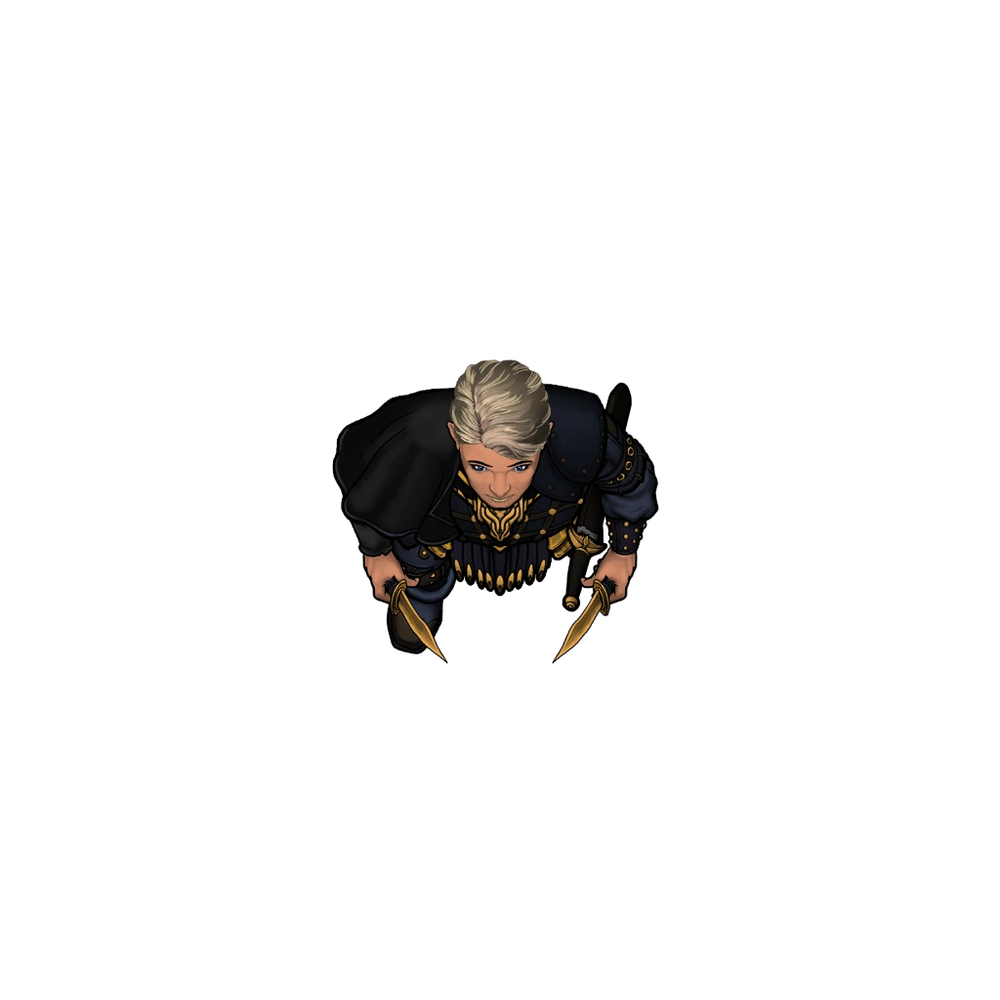
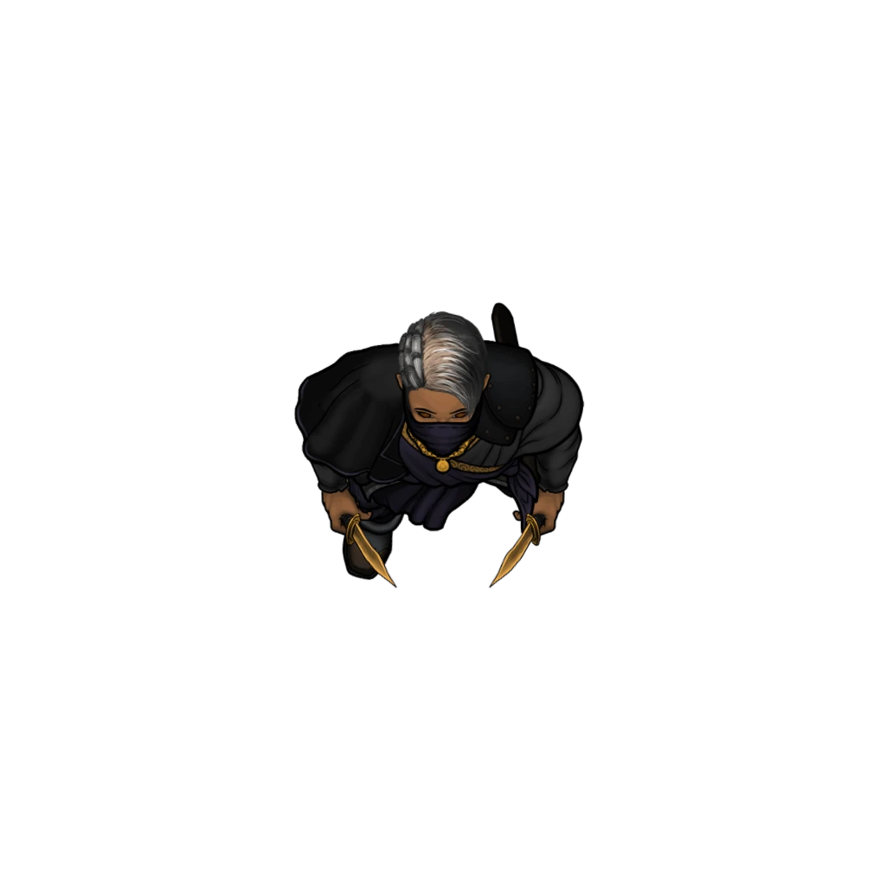
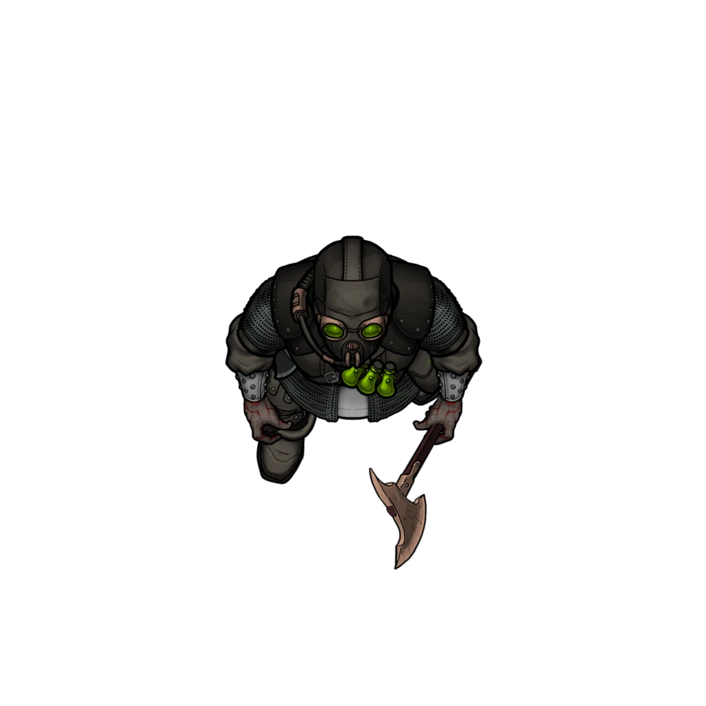

# Midnight Meeting

> [!warning] Gamemaster
> #### Gamemaster's Summary
>
> This combat event is a trap and an ambush. While the assembled civilians are the primary targets, the party is an expected arrival that the assembled enemies are prepared to deal with once and for all. In this event, the characters can:
>
> - Survive an ambush by the Wandren Tracer known as [[Brynna Verocorrt]] and her [[House Wandren]] allies.
> - Discover the identities of the various Mutagist conspirators throughout the city.
> - Learn that an attack is being launched on the Veiled Chain while they are at the meeting.
>
> #### Point of No Return (Chapter 3)
>
> This event serves as a point of no return for certain Chapter 3 main quests. Once the characters complete this event, they can no longer continue or complete the events of [[Disgraced House]] and [[Smoldering Cinders]].
>
> #### Challenge Level
>
> This event is balanced for a level 5 party. A group of level 4 heroes can be successful but will need to employ careful strategy. If the party is not yet level four, it would be advised for them to seek other challenges and revisit this event later.
>
> #### Area Walkthrough
>
> This event's gameplay transitions to the "[[Bronze Rask Theater]]" scene where the this event transpires. A complete room-by-room description of its environment occurs there is detailed in the [[The Bronze Rask Theater]] area walkthrough. Text related to this event's core narrative is retained in this event and should be referenced alongside the walkthrough.
>
> This area has several special rules and gameplay expectations, so it is advisable to review the [[Gameplay Details]] page either before or during the party's exploration of the location.

### Spotting the Ambush

> [!tip] Exploration
> #### Danger in Plain Sight
>
> Characters need to make a successful **Awareness (DC 15)** check to notice that there are people in the crowd who are paying more attention to them than the speech. Characters with **Knowledge: Crime** or **Knowledge: Intrigue** have advantage on this checks.
>
> They will have three chances before Brynna finishes her speech to the crowd, and springs the trap. Characters that fail all three checks don't notice that they are being surrounded by potential threats, and will be surprised when combat begins.
>
> Characters that succeed on at least one roll suspect something is off and are not surprised.

### Brynna's speech

Brynna begins her speech to the gathered people:

> [!abstract] Brynna Verocorrt
> **[[Brynna Verocorrt]]**
>
> Level 1 · Unknown Unknown
>
> 

> [!quote] Read Aloud
> Brynna stands before the crowd.
>
> > Thank you for coming, tonight is going to be a important turning point in the fate of Ordain, and I think you can all feel it.
> >
> > This city used to be great once, it used to look after its people, it used to care about more than its nobility and coffers. Once, the Hallows keep order, the Cindarics kept us fed and healthy, and the Trading Houses made sure we had work.
> >
> > Now? None of that. The Ordinate and its Veiled Chain, it's secret agents want to control us, watch us, make sure we don't step too far out of line. The city doesn't care about you, especially if you can't give something back to it.

The party should be given their first chance to spot danger here. They should also be prompted to take actions if they have any.

> [!quote] Read Aloud
> Readaloud paragraph text.
>
> > The Cindarics promised healing, but there’s sickness festering in the burns and no sanctuary in their temples. You’re left to sleep on cold cobblestones, because the stables and inns won't make room for you or your livestock.
> >
> > You're forced to watch your loved ones suffer because the city’s too busy catering to the rich and powerful.
> >
> > The Hallows say they are working for the good of all of Ordain, but what have they done? Crime and misery are beginning to choke the streets, thieves and merchants bleed everyone with impunity. They let you suffer, ignored and voiceless.

The party should be given their second chance to spot danger here. They should also be prompted to take actions if they have any.

> [!quote] Read Aloud
> > Arcturians, when you fled the flats, when you brought your children and elders looking for shelter, did the city welcome you with open arms? No! Everything is rations, every little piece of help and aid they hand out is carefully measured to keep you wanting more.
> >
> > It's bad enough you're here, displaced, suffering, but I hear them blaming you for the loss of crops and livestock, as though you wished for bandits, and sickness and monsters to destroy everything you and your families worked for!
>
> She paces before the gathering, voice growing fierce.
>
> > We will not suffer their indifference. We will not be manipulated and used! We will not be silenced! We will not be subordinate. We will unite and be heard. It's time the city listened to those it thought could be ignored.

The party should be given their third and last chance to spot danger here. They should also be prompted to take actions if they have any. After the next narrative block the combat begins.

> [!warning] Gamemaster
> #### Hunter or Hunted?
>
> Depending on how the party handled events to get here they will have a slightly different narrative block and encounters ahead of them.
>
> #### Part Used Direct Methods
>
> If either [[Agitation in Foxlairs]] or [[Crowds in Palisade Cross]] are true the party used overt methods to gather information, and the conspirators know the party is coming. Use the **Cover Blown** narrative block and enemy composition.
>
> #### Party Remained Discreet
>
> If both [[Agitation in Foxlairs]] and [[Crowds in Palisade Cross]] are true then the party chose discretion and haven't shown their hand yet. They'll still get caught in the ambush, but no special plans have been made for them. Use the Cover Intact narrative block and enemy composition.

### Cover Blown

> [!quote] Read Aloud
> She stops to look over the crowd.
>
> > To those of you who want to join our cause directly, who want to take direct action, and place themselves on the front line of this fight, join me on the stage so we might stand together!
>
> A small group of people move up to the edge of the stage to stand with Brynna. She smiles down at them, leaning down to shake a few hands before turning back to the crowd.
>
> > To the rest of you: I promise you that this won't end until we band together… and as for the Veiled Chain and their spies among us…
>
> She locks eyes with you directly.
>
> > Don't think that we haven't be watching the watchmen. Your days of skulking through the spying on the people of Ordain are coming to an end!
>
> Several people in the crowd around you throw back their hoods, and draw steel, angling their weapons at you.

> [!abstract] Wandren Tracer
> **[[Wandren Tracer]]**
>
> Level 1 · Unknown Unknown
>
> 

#### Orbis Attunement: Cover Blown

If the party manages to blow their cover, each character who participates advances their **Attunement: Orbis (+1)** at the conclusion of the event.

### Cover Intact

> [!quote] Read Aloud
> She stops to look over the crowd.
>
> > To those of you who want to join our cause directly, who want to take direct action, and place themselves on the front line of this fight, join me on the stage so we might stand together!
>
> A small group of people move up to the edge of the stage to stand with Brynna. She smiles down at them, leaning down to shake a few hands before turning back to the crowd.
>
> > To the rest of you: I promise you that this won't end until we band together… but you'll still have a chance to play your part for the good of Ordain.

#### Primordis Attunement: Cover Intact

If the party manages to maintain their cover, each participating advances their **Attunement: Primordis (+1)** at the conclusion of the event.

### Springing the Trap

> [!quote] Read Aloud
> Immediately after she says this a pair of armored, gas-mask wearing figures walk out onto the stage carrying bombs. A moment later they ignite and throw the bombs into the crowd, the projectiles sputtering and hissing as they fly. Both go off immediately, dispersing blasts of gas which stings the eyes and burns the throat!
>
> You watch as some people begin to wobble on their feet and fall over, hitting the ground in heaps and going still. Others double over, coughing and trying to cover their faces.
>
> As the crowd begins to panic and attempt to escape the smoke you see armed fighters pouring into the room to corral the crowd as the grenadiers prepare more bombs to subdue the crowd.

> [!abstract] Mutagist Grenadier
> **[[Mutagist Grenadier]]**
>
> Level 1 · Unknown Unknown
>
> 

> [!abstract] Wandren Patroller
> **[[Wandren Patroller]]**
>
> Level 1 · Unknown Unknown
>
> 

Once the fight begins, refer to [[Main Floor]] in the [[The Bronze Rask Theater]] area walkthrough.

### After the Fight

Once the encounter has been completed, refer to [[Main Floor]] in the [[The Bronze Rask Theater]] area walkthrough if the party wants to search the area. However, if the party wants to immediately leave to check on the Veiled Chain, they can, and this is a reasonable decision.

The party can return to the theater at a later time to resume searching the area if they want. The location will be deserted, with any dead bodies removed, and the doors locked once again. However, discoverable items will remain.

#### Abyss Attunement: Brynna Escapes

If Brynna Verocorrt manages to escape during or after the conflict, each character advances their **Attunement: The Abyss (+1)** at the conclusion of the event.

### Concluding the Event

> [!warning] Gamemaster
> #### Next Steps
>
> Once the fight has ended, and the party is ready to move, they should report back to the Veiled Chain about the events that transpired here.
