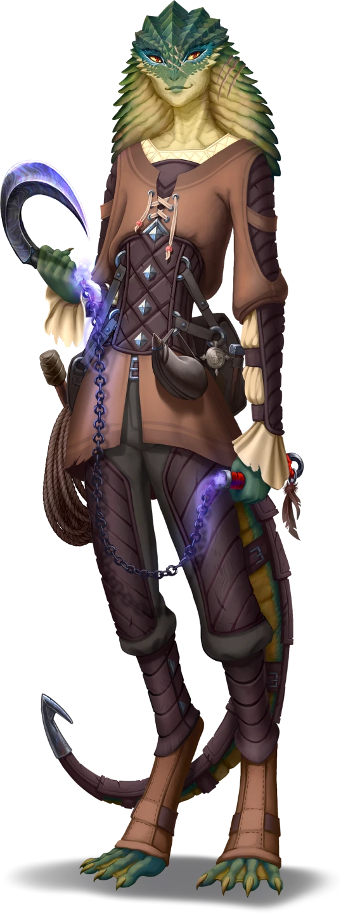

# An Auspicious Acquaintance

> [!warning] Gamemaster
> #### **Gamemaster's Summary**
>
> This Social Event introduces the party to the adventurer [[Fernis Ossa]] — a good friend to [[Agraband Swift]] and famed member of the [[Anachraenum]] — who approaches the characters on the streets of [[Ordain]] with a timely request for assistance. In this Event, the characters can:
>
> - Meet Fernis Ossa and learn about her storied past, including her shared history with Agraband Swift of the [[Strayhearth Caravan]].
> - Learn about Fernis' concerns regarding the current stewardship of the [[Anachraenum]], and consider whether or not to aid her with an investigation into the matter.
> - Decide whether or not to help Fernis in her attempt to reclaim [[Toothbreaker Hideout]] from its current occupants — a gang of lawless ruffians led by a marauder named [[Raster Thorn]].
>
> This Event is depicted using the "Residential Corridor" Level of the [[Vista: Ordain Streets]] Vista.
>
> #### Essential Main Quest
>
> This Event marks the proper beginning of an important Main Quest arc. If the party initially avoids conversation with Fernis Ossa during this Event, it will be essential for Fernis to approach the characters elsewhere (under different circumstances) to engage them with her timely proposition.

### Approached by a Stranger

Fernis Ossa has approached the party to beseech their aid in a concerning matter, and can offer the characters the sponsorship they need to join the Anachraenum in exchange for assistance. But first, they much gain each other's trust, and find a more appropriate place to discuss the situation at hand.

> [!abstract] Fernis Ossa
> **[[Fernis Ossa]]**
>
> Level 1 · Unknown Unknown
>
> 

Fernis introduces herself to the party, saying:

> [!quote] Read Aloud
> > Tide's blessing, and thank you for stopping. I apologize for accosting you unexpectedly, but this seemed the simplest way to make contact. My name is Fernis Ossa. Our mutual friend Agraband Swift said I could count on you for a friendly ear, if not an adventurous heart.
> >
> > Please, can we step into a cafe or tea room nearby, where we might speak in a more private environment?
>
> She points towards the sign of a cozy tea room a short distance down a side street, a simple establishment that looks neither offensive nor exceptionally inviting.

> [!info] Social
> #### Who Goes There?
>
> Because of Fernis Ossa's surreptitious approach, the party might be suspicious of her when they initially meet. Any character who succeeds on a **Deception (DC 11, Passive)** check can tell that Fernis is being honest with her narrative accounts and current intentions.
>
> - **Path: Caravanner**: The character automatically succeeds, as exploits of Agraband and Fernis are legendary among those who travel the caravan roads.
> - **Culture: Ordani**: The character gains **+2 Boons** on this check, because nearly everyone in Ordain has heard about Fernis Ossa — the original champion of the Expedition Challenge.
> - **Critical Success**: The character can tell that the scope of Fernis Ossa's concerns are greater than she has hinted here at the onset of her meeting with the party, and that her request for a meeting is most certainly worthy of their time.
>
> Any character who makes a successful **Awareness (DC 12, Passive)**check is able to notice a metallic clasp on Fernis Ossa's tunic, fashioned into a distinctive symbol — an ornamental compass with curved blades forming an A-shape behind its cardinal points. A glimmering jewel is set into the center of the compass rose.
>
> Any character who also makes a successful**Society (DC 16, Passive)**check can recognize this as the symbol of the [[Anachraenum]], Ordain's scholastic guild of lore-seeking treasure hunters.
>
> - **Culture: Ordani**: The character automatically succeeds on this check.
> - **Knowledge: Artifacts**: The character automatically succeeds on this check.
> - **Knowledge: Legends**: The character gains **+2 Boons** on this check.
>
> Any character who makes a successful **Society (DC 15)** check while examining Fernis Ossa's peculiar clothes can recognize the style as one consistent with the ancient [[Sedyri]]. Despite the age of the lost culture the designs of these garments are based upon, Fernis' loose clothing appears relatively new, and intentionally made for functional versatility.
>
> - **Knowledge: Ancients**]: The character automatically succeeds on this check.
> - **Knowledge: Arts**]: The character automatically succeeds on this check.
> - **Path: Cosmopolitan Fashionista**: : The character gains **+2 Boons** on this check.
>
> #### Conversation with Fernis
>
> Here on the open streets of Ordain, Fernis is willing to discuss the following topics:
>
> - Her personal history as a member of the Anachraenum, the first champion of the original Expedition Challenge, and best friend to [[Agraband Swift]].
> - How she located the party and why.
> - Proof of her friendship with Agraband.
> - Her desire to find a more private place to speak about urgent matters at hand.
>
> Specific dialogue for Fernis Ossa during this initial exchange is detailed below.

> [!question] Q&A
> **Q:** Who are you?
>
> **A:**
>
> > My name is Fernis Ossa. I'm a ranking member of the Anachraenum — an adventurous organization of scholars and explorers headquartered here in Ordain — and a good friend of Agraband's. He told me of your own adventures, and urged me to keep an eye out for your imminent arrival.

> [!question] Q&A
> **Q:** About Agraband?
>
> **A:**
>
> > To be honest, Agraband is more than a dear friend; he's my oldest mentor. We worked together years ago as part of a group — not unlike your own — that initially came together out of necessity, but was galvanized by cosmic agendas far more powerful than our own convenience.

> [!question] Q&A
> **Q:** How did you find us?
>
> **A:**
>
> > I'm something of a skilled wayfinder, and Agraband told me to keep an eye out for your group, as mutual friendships go. So, I called in a favor with a friend in the Veiled Chain who keeps an eye on noteworthy people who spend time in the city. And your group is making a name for itself.
>
> She nods in respect to the accolades that have preceded you.

> [!question] Q&A
> **Q:** Evidence of your claims?
>
> **A:**
>
> > I don't blame you for being cautious. If it helps, perhaps I can share a note from Agraband himself …
>
> Fernis produces a tiny parchment scroll wrapped in a braid of silver hair and hands it out for to you inspect.
>
> Opening the scroll, you notice the telltale handwriting of your friend Agraband Swift, along with his signature at the bottom. The note reads:
>
> > "My young storyteller,
> >
> > These new friends of mine are special. Our journey from Casla-Brava was not without incident, and these adventurous souls proved themselves to be true friends of the Strayhearth Caravan, through thick and thin (and trust me, lass — there were plenty of both).
> >
> > I have no doubt these slayers will be skeptical upon meeting you, so please present them with this note as a token of our boundless accord. Hello, my friends! If you're reading this, and listen closely enough, you'll hear my song on the restless wind. Moons guide you, friends; and I'll see you on the long morrow.
> >
> > — Agraband Swift"
>
> Indeed, as you listen to the soft din of the city, you can almost hear the whimsical croon of that old raconteur somewhere nearby. Whether a figment of your imagination or not, the mere thought of his smile brings a familiar warmth to your heart.

Beyond these initial topics, Fernis is not willing to discuss her agenda in a public environment, and insists the party join her in a more discreet setting to further the conversation. Scrutiny of the note from Agraband reveals it to be the genuine article.

> [!warning] Gamemaster
> #### Scene Transition
>
> Once the party is ready to accompany Fernis to the tea room for conversation, mark the following outcome as complete, which will automatically transition the Event to take place on the appropriate level of the corresponding Vista.

`[[/outcome accompanied]]`

#### Early Access WIP

This Event is intended to transition to a "Teahouse Interior" Level of the [[Vista: Ordain Interiors]] Vista, but that scene has not yet been developed.

### A Proposition Over Tea

> [!quote] Read Aloud
> You follow your new acquaintance across the street and into the unassuming shelter of the tea room, where Fernis ushers you towards a discreet booth in the back — far away from the prying eyes of people outside. Once you settle in, a server swoops in with a piping hot kettle and enough teacups for the whole party, and is gone again in an instant. Fernis leans forward across the table to share a few more clandestine words with you, taking obvious care to speak in hushed tones no one else can hear.
>
> > I appreciate you taking the time for this little meeting of ours. And as much as I would like to ease into things and get to know more about each of you, I think it's best if I get straight to business …
> >
> > The Anachraenum is in trouble. The kind of trouble that extends far beyond the walls of All-Fable Keep. The signs are clear, but the cause is not.
> >
> > Agraband tells me you're a capable group, but — more importantly — he says you're trustworthy. And trust is quite hard to come by these days. Simply put, I need your help uncovering an element of treachery within the Anachraenum. Treason is afoot, and it must be brought to light. However, in order to carry out this investigation, you'll need to actually join the guild first.
> >
> > If you help me with this investigation, I vow to help you in return. With my sponsorship, you can gain access to knowledge and resources that only the Anachraenum can offer. Additionally, I can help set you up with a base of operations here in Ordain — a location that is currently secret, well positioned, and remarkably defensible. Everything a party of intrepid adventurers like yourselves might need if you want to make an impact in the city. Not to mention, this membership will provide you access to the Expedition Challenge. You need a sponsor, I need some bravado.
> >
> > So … what do you say?

With plenty of questions left unanswered, Fernis is poised to clarify any details the party might need her to discuss — from the obvious to the obscure.

> [!info] Social
> #### Gathering Information
>
> In addition to the conversation topics presented in "Who Goes There?" above, Fernis is eager to discuss the ins and outs of what she does (and doesn't) know about the so-called treasonous situation brewing within the ranks of the Anachraenum. Topics of discussion include (but are not limited to) the following:
>
> - The death of the previous guildmaster, Veron Longspear, who was suspiciously killed last year. Since the attack, guild operations have slowly changed for the worse under the direction of guildmaster [[Arcos Sarinland]].
> - How this year's Expedition Challenge is the culmination of a recent recruitment drive, one that prioritizes the quantity and ambition of Anachraenum hopefuls over the quality of their research.
> - Details about the [[Toothbreaker Hideout]] (which Fernis always refers to as the "Concourse Hideout"), and how it was a valuable base of operations for the Anachraenum before it was marauded by the Toothbreakers.
>
> Fernis is willing to share any of the narrative information detailed in her biography, but tends to volunteer information she deems relevant to the party's mission. If the characters make an overt and genuine attempt to get to know her better, Fernis may be willing to share a few more intimate details.

> [!warning] Gamemaster
> #### Flawed Perspectives
>
> At this point, Fernis only has a partial account of the narrative that threatens to upend the Anachraenum, and her perspectives on the matter are imperfect. Here are a couple of the ways that Fernis either has a misunderstanding of the situation or has been emotionally compromised:
>
> - Fernis is still mourning the recent loss of guildmaster Veron Longspear, and she still harbors regret about the disolution of the Skywarders.
> - Fernis harbors a somewhat obsessive amount of distrust for the new guildmaster, Arcos Sarinland — who she believes is responsible for a deterioration of Anachraenum values, and who might be to blame for the betrayal of Veron Longspear.
>
> It is important while portraying Fernis to present these details as information that Fernis believes to be true, rather than as absolute statements of fact. While Arcos Sarinland may be responsible for some changes in the guild, in truth, he is out of his depth with a leadership position that he is not well suited to hold. Fernis has an incomplete perspective and a flawed outlook in this regard, although her suspicions are important motivation for advancing the plot this quest.

> [!question] Q&A
> **Q:** What trouble?
>
> **A:**
>
> > Our former guildmaster, Veron Longspear, was an exceptional leader, and our guild's reputation flourished under his oversight. He was mysteriously slain last year during an expedition to the Ruinous Crags, a clandestine mission that only a handful of guild members knew about. It's clear to me now that he was betrayed, even if no one else is willing to see the truth of it.
> >
> > Since then, under the leadership of guildmaster Arcos Sarinland, the Anachraenum has started to take on contracts for coin as much as for knowledge. The guild has also been aggressively recruiting new members, regardless of their experience. Meanwhile, guild leaders have all but ignored the big questions surrounding Veron Longspear's death; and we simply keep on exploring and accumulating treasures for Ordain's wealthiest collectors, as if nothing ever happened.
> >
> > Some might simply chalk it up bad leadership, but I suspect there's something much deeper at stake here.

> [!question] Q&A
> **Q:** How to investigate?
>
> **A:**
>
> > In short, I want **you** to join the Anachraenum as full members, so you can monitor the situation from inside the guild.
> >
> > Before you object, this plan isn't as crazy as it sounds … at least not anymore. Previously, you needed to put in a few years of hard work and research to join the Anachraenum. These days, it seems like anyone who's willing to crack open a sealed tomb can be offered a badge.
> >
> > Perhaps you've heard rumor about the upcoming Expedition Challenge? Arcos has revived an old tradition and molded it into a glorified recruitment event. Precisely why Arcos wants to bolster the guild's numbers remains to be seen, but this does leave the door open for your party to join up — despite your relative lack of experience.

> [!question] Q&A
> **Q:** Why join the Anachraenum?
>
> **A:**
>
> > As fledgling members of the Anachraenum, you'd be eligible for assignments from Arcos and other guild leaders. With an assignment or two in your pocket, you should be able to position yourselves closer to Arcos, and start putting together what really happened to Veron.

> [!question] Q&A
> **Q:** The Expedition Challenge?
>
> **A:**
>
> > The contest will commence in a few days, but there is still time for guild members to join. I'll drop off a referral for you post haste — Adelyne and the others shouldn't give you any trouble once it's official, even for relative unknowns like yourselves. However, once we take the Concourse Hideout back, you'll still need to visit All-Fable Keep to complete your registration in person.
> >
> > The Expedition Challenge is an old tradition, and features a series of deadly gauntlets that will truly test the mettle of those who wish to join the treasure-hunting elite.
> >
> > You won't need to actually **win** the challenge, of course. You need only finish. And while I urge you to stay as safe as possible while navigating the contest's hazards, there are magical protections in place to help keep you alive. Still, you may want to keep your recklessness to a respectable level.

> [!question] Q&A
> **Q:** A base of operations?
>
> **A:**
>
> > Ah, yes — the Concourse Hideout. It was a terrific home for me and the Skywarders, my old adventuring group. All-Fable Keep can be a bit stuffy sometimes; and it's safe to say that not all of our missions were sanctioned by the guild. Sometimes, you just need a place to call your own.
> >
> > Time and estrangement had their way with the Skywarders, and we disbanded many moons ago. The Concourse Hideout was left empty, and in the time since then, a local gang of marauders and cutthroats known as the Toothbreakers moved in and took the hideout as their own. We left it empty for too long, and now it's fallen into the wrong hands.
> >
> > The Concourse used to be a quaint riverside district full of charm and whimsy. But since the Toothbreakers moved in a few years ago, the neighborhood has suffered a slow decline, including an exodus of businesses and residents alike. These days, it's little more than a ghost town.

> [!question] Q&A
> **Q:** The Toothbreakers?
>
> **A:**
>
> > Waerd marauders who hail from the Lowland Kingdoms from far to the south, the Toothbreakers are little more than a ruthless gang of thugs who've strangled life out of the Concourse turning it into their own petty fiefdom. Led by the villainous Raster Thorn, the gang's calling card is their intimate relationship with scalemaws, vicious reptilian beasts that absolutely thrive in the underground waterworks of the Concourse. The Toothbreakers won't be easy to defeat; but if the tales of your exploits are true, I think you stand a chance.
> >
> > Local authorities have been ineffective against these rogues. Even the shrewd investigators of the Veiled Chain can't seem to make much headway. Fortunately, I know precisely where to find them — and I can even provide you with some helpful tips for gaining access.

> [!tip] Exploration
> #### Strategy Session
>
> The Toothbreakers would have set up operations within a derelict district of the city called the concourse where they are attempting to exert total control. Any character who makes a successful **Society (DC 14, Passive)** check suspects they may be formidable, but since they are not actively at war with any other organization they could be taken by surprise by swift action.
>
> - **Knowledge: Crime**: The character automatically succeeds on this check.
> - **Culture: Ordani**: The character gains **+2 Boons** on this check.
> - **Critical Success**: The character is very familiar with the Toothbreakers.
>
> Additionally, any character who succeeds on a **Wilderness (DC 13)** check is familiar with [[Scalemaw]], and knows some information presented in their biography.
>
> - **Culture: Waerd**: Explanation of why the character automatically succeeds.
> - **Knowledge: Beasts** : Explanation of why the character gains **+2 Boons**.

> [!info] Social
> #### A Few Tips from Fernis
>
> After describing the mission at hand, Fernis summarizes the tactical challenges that the party will face while assaulting the [[Toothbreaker Hideout]]. Fernis suggests three possible methods of entry, along with their associated strengths and weaknesses:
>
> **The Front Entrance**
>
> If the party wants to talk or fight their way in, Fernis describes the location of the main entrance to the complex, a locked metal gate off the side of a canal path.
>
> **The Waterworks**
>
> If the party prefers a more subtle approach, Fernis provides intricate instructions for how to navigate the network of canals and tunnels that make up the subterranean waterworks underneath the Concourse. The Toothbreaker Hideout is accessible via these tunnels.
>
> **Taken Captive**
>
> Fernis reluctantly suggests a third option, that the party allow themselves to be taken prisoner to be used as combatants in an underground fighting ring that Raster hosts.
>
> The party does not need to decide which approach to take right away, as this will be determined in the subsequent event when they visit [[The Concourse]] district of Ordain.

> [!question] Q&A
> **Q:** The front entrance?
>
> **A:**
>
> > If you prefer a direct route, I can provide you with directions to the main entrance to the hideout. It is quite secure, and you should expect it to be well-guarded at all times; but if you want to try and bluff your way in or kick down the front door, those are valid options.
> >
> > For what it's worth, there's also a culvert right next to the main entrance that leads to an interior dock. You might have a bit more luck using the culvert than the door, but the decision is yours.

> [!question] Q&A
> **Q:** The waterworks?
>
> **A:**
>
> > If you want a more subtle approach, you can enter the complex via the canals. This is the path I would personally recommend — but discretion was **my** preferred tactic, and it need not be yours. The canals are a bit difficult to navigate, terrain-wise, and you'll be vulnerable here if you don't remain undetected.

> [!question] Q&A
> **Q:** Captive fighters?
>
> **A:**
>
> > There is one other approach you might consider, although I'm reluctant to even mention it …
> >
> > The Toothbreakers are known to force captives to fight in a bloodsport arena that they've set up somewhere in the hideout. You could, if so desired, allow yourselves to be taken prisoner. This would allow you to gain access to the inner sanctums of the hideout, but you'd have to figure out a way to free yourselves from captivity (and most likely recover your weapons in the process). It's a big gamble, and I don't want to see you folks wind up as chum scalemaws. After all, we've only just met.
>
> She offers you a sly wink and a smile, introducing a bit of levity to an otherwise tense moment.

### Concluding the Event

If the party is convinced to accept Fernis' proposal, mark the following outcome as complete and, when ready, conclude this event.

`[[/outcome accepted]]`

> [!warning] Gamemaster
> #### Next Steps
>
> The party has two main courses of action for the continuation of this Quest:
>
> - If the party accepts Fernis Ossa's request for aid, they can help her plan the reclamation of [[Toothbreaker Hideout]] in Ordain's desolate [[The Concourse]] district during [[Reclaiming the Concourse]].
> - The party can visit [[All-Fable Keep]] in a few days for [[The Challenge Begins]], and participate in a formal kick-off of the Expedition Challenge while registering for the contest.
>
> Although the party can begin these Events in the order of their choice, we recommend you subtly encourage them to complete [[Reclaiming the Concourse]] prior to [[The Challenge Begins]], as it will potentially reward the characters with their first [[Stronghold]].
