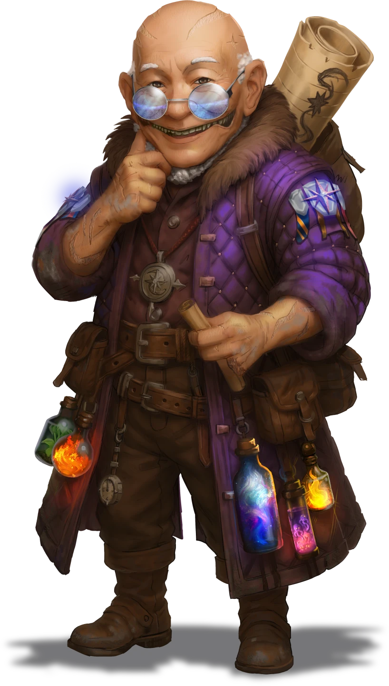

# The Challenge Begins

> [!warning] Gamemaster
> #### Gamemaster's Summary
>
> This Social Event occurs at [[All-Fable Keep]] in Ordain, where the party can participate in the opening ceremonies of the [[Anachraenum]] famed Expedition Challenge. In this Event, the characters can:
>
> - Gain some preliminary instructions and insight from Loremistress [[Adelyne Goss]].
> - Receive some advice from their sponsor [[Fernis Ossa]].
> - Take possession of the [[Frozen Tear]], a valuable Magic Item given to them by the [[Star Mages]] [[Eveis Brightstone]] in an effort to help keep them alive during the challenge.
> - Meet a half-dozen other teams of competitors in the Expedition Challenge, including the [[Fulgurite Blades]] from [[Curious Party]].
> - Listen to an opening address from Guildmaster [[Arcos Sarinland]], along with an initial set of clues for the challenge — hints as to where they might fine one of three Challenge Keys needed to open the [[Chamber of Agaseros]] beneath All-Fable Keep.
>
> This Event is depicted using the [[The Arctus Plateau]] Region Map.

### Arrival in the Hall

As the party enters the hall, the characters are stopped and provided brief instructions by loremistress Adelyne Goss. They have only a few moments to speak with her before she goes about her official business.

> [!quote] Read Aloud
> As you make your way through the hall, you are stopped by the outstretched arm of loremistress Adelyne Goss. She holds forth a clip board with a registration form attached, upon which is written the names of several adventuring parties and their chosen point-of-contact.
>
> > Ahem. You'll need to sign in. Oh, and be sure to speak with the Star Mage over there before you leave.
>
> She points across the room to a large female figure hovering mid-air, an alluring Carrow spellcaster, who seems right at home here despite the lack of an aqueous environment.

> [!abstract] Adelyne Goss
> **[[Adelyne Goss]]**
>
> Level 1 · Unknown Unknown
>
> 

> [!info] Social
> #### A Brief Conversation with the Loremistress
>
> The party does not have long to speak with Adelyne Goss, as she appears equal measures of busy, irritated, and impatient.
>
> Any character who makes a successful **Diplomacy (DC 16)** check is able to convince Adelyne to stop and speak with them for a quick moment . On a failed result, Adelyne is only willing to provide the briefest instructions for the party (see "What do we do?" below).
>
> - **Culture: Waerd**: The character automatically succeeds on this check.
> - **Knowledge: Warfare**: The character gains **+2 Boons** on this check.
>
> Adelyne is reluctantly willing to discuss the following topics, in very brief detail:
>
> - What the characters must do next to complete their registration for The Expedition Challenge.
> - Who the so-called Star Mage is: an Anachraenum spellcaster known as [[Eveis Brightstone]].
> - Scant information about the guildmaster [[Arcos Sarinland]].
> - How she's simply too busy for this conversation or idle chatter.
>
> As soon as she can, Adelyne Goss disappears once more into the throng of adventurers gathered here, on the hunt for another problem to solve.

> [!question] Q&A
> **Q:** What do we do?
>
> **A:**
>
> > Sign your party's name on the dotted line, along with your preferred point of contact. I honestly don't care if you don't have a leader, we just need a name.
>
> She offers you the briefest of moments to comply.
>
> > Good, thank you. Now, please move further into the hall. I have quite a lot to handle today and no time for idle chatter. Good luck. You're going to need it …

> [!question] Q&A
> **Q:** The Star Mage?
>
> **A:**
>
> Adelyne points towards the hovering Carrow spellcaster on the other side of the hall:
>
> > You'll need to speak with Eveis Brightstone over there, the city's resident Star Mage. She has a magic item for each of you known as a "frozen tear," which will help keep you alive during the challenge. Each participant must equip their own tear before starting the competition, so be sure to speak with her when you have a moment.

> [!question] Q&A
> **Q:** Who is Arcos?
>
> **A:**
>
> > Sigh ... Arcos is the guildmaster. The head of the Anachraenum? I trust you actually know where you are right now …
>
> Her words are playful, despite the overt disdain for your curiosity.
>
> > Arcos will address everyone in a few moments, and the Expedition Challenge will officially begin.

As soon as they has the party's registration, Adelyne will attempt to turn away and go about her business. What happens next is up to the characters themselves.

> [!warning] Gamemaster
> #### Flexible Encounters
>
> The following sections of this Event can be presented or completed in any order. Allow the party to mingle with the characters assembled in the hall and approach these interactions in whatever order interests them.
>
> - [[The Challenge Begins]]
> - [[The Challenge Begins]]
> - [[Meeting the Star Mage]]
> - [[The Challenge Begins]]

### A Sponsor's Advice

Fernis Ossa is here, reveling in the excitement of the moment while interacting with various hopefuls that have gathered in the hall. When the party spots Fernis, they can take a few moments to beseech their sponsor for advice about the challenges to come.

> [!abstract] Fernis Ossa
> **[[Fernis Ossa]]**
>
> Level 1 · Unknown Unknown
>
> 

> [!info] Social
> #### Conversation with Fernis
>
> The party has a brief moment to speak with Fernis before she redirects her attention to the other groups that are gathered here today. Fernis is eager to provide her new friends with some timely advice, including the following topics:
>
> - The party's next steps for participation in the Expedition Challenge.
> - Whether or not Fernis is able to assist the party during the contest.

> [!question] Q&A
> **Q:** What should we do?
>
> **A:**
>
> Fernis looks somewhat amused by the question:
>
> > Well, just … mingle. If you've yet to receive them, Acros will provide instructions on what the challenge entails soon enough. For the time being, I suggest you take this opportunity to get to know some of the other contestants. You'll also need to speak with Eveis, the Star Mage.

> [!question] Q&A
> **Q:** Can you help us?
>
> **A:**
>
> > I technically could, but I won't. That is to say, I shouldn't. There's enough scrutiny on me already for sponsoring your group.
>
> She lowers her voice to a slight whisper.
>
> > Our ultimate goal is for your group to gain the confidence of Arcos, so he might trust you with guild assignments sooner than later. He won't assign you with an operation until you've proven your merit. Participation in the Expedition Challenge is a major step in that direction.

### Investigating The Competition

The party is free to explore the main hall of All-Fable Keep, and can observe or speak with the other parties who plan to participate in the Expedition Challenge. Several adventuring parties have gathered here, and the characters may spot some familiar faces among the crowd.

> [!info] Social
> #### The Fulgurite Blades
>
> The party may have previously encountered the [[Fulgurite Blades]] during [[Lightning in a Bottle]] and/or [[Lightning Strikes Twice]]. This group of ambitious Anachraenum adventurers are gathered at the center of the hall, boasting a level of assuredness that might suggest they own the place (if everyone didn't already know better).
>
> **[[Sajor Velex]] (Neutral, Ordani Nir'ae, she/her)**
>
> This skilled wizard is the stoic leader of the Fulgurite Blades, and has a passion for investigating ancient [[Aedir]] ruins.
>
> **[[Rorhim Iron-Cask]] (Neutral, Maziran Cor'ak, he/him)**
>
> This fighter of considerable strength and power is unofficially the Fulgurite's second-in-command, following Sajor's trusted lead.
>
> **[[Kazra Steelshift]] (Lawful Neutral, Mysterious Kivahr, she/her)**
>
> The chief scribe and priest of the Fulgurite Blades, Kazra wears the colors and symbolism of the Elder Goddess [[Spectra]], the Goddess of Magic.
>
> **[[Leeph]] (Chaotic Neutral, Arcturian Thornling, he/they)**
>
> An excitable and mischievous scout, Leeph "the Thief" is the newest member of the Fulgurite Blades, and has very little impulse control.
>
> Sajor is in her element as a stoic, strong, and commanding member of an established group of Anachraenum guildmembers. If the party attempts to speak with the Fulgurite Blades, Sajor addresses them directly:
>
> > Oh, of course you're here. We don't have any time to exchange pleasantries at the moment. I'm sure the guildmaster will address us any time now … I hope you came ready to lose, because the Fulgurite Blades are winning this contest. Mark my words.

> [!info] Social
> #### The Coin's Edge
>
> The Coin's Edge is a rowdy group of adventurers who dream of themselves becoming the next great Wayfinders of the Anachraenum. These hopefuls are generally motivated by prospects of wealth and fame, and revel in the excitement that comes with the reclamation of lost treasures from forgotten places.
>
> **Arik of Tumblestones (Chaotic Good, Oaken Vrjnhar, he/them)**
>
> This headstrong warrior is the de facto leader of the Coin's Edge, and loves a sharp blade as much as a good drinking contest.
>
> **Ellyne Lantress (Lawful Neutral, Cascillian Altyra, she/her)**
>
> A formal naval navigator, Ellyne has made a smooth transition to life as an arcane spellcaster, and has a strong proclivity for the occult.
>
> **Vaul do'Ramel (Neutral Evil, Bejak Kivahr, he/him)**
>
> Despite his larger size, Vaul is a prodigious cutpurse and sneakthief. There isn't a lock on Ember he's afraid to pick.
>
> **Whimsy Flicket (Chaotic Neutral, Ordani Keth, they/them)**
>
> This footloose bard is also an adherent to the Shard God [[Thoma]], whose divine intervention has saved the Coin's Edge from calamity more than once.
>
> If the party approaches the Coin's Edge and attempts to speak with them, Ellyne will turn and say:
>
> > Oh, a fresh set of faces! Well met! We are the Coin's Edge … trainees of the Anachraenum, one and all. We're so eager to get this challenge started. Even if we don't win, we can't wait to finish and join the guild as full members! Are you excited for the contest to begin?

> [!info] Social
> #### The Salt Breakers
>
> The Salt Breakers are a trio of young glory hunters who hail from the town of [[Pryor]]. Feeling stifled by the salt mining industry of their hometown, they decided to seek out their fortunes by making their way to Ordain to join the Anachraenum. The characters may have already encountered the Salt Breakers during [[An Upcoming Challenge]].
>
> **Blister Brass (Neutral Evil, Arcturian Human, he/him)**
>
> This brawny human has burly, muscular arms and thick black hair. His short, messy beard has been shaven into a boxy shape, and he wears a combination of weathered leathers and mining tools. A large pickaxe hangs on his back.
>
> **White Bark (Chaotic Evil, Arcturian Thornling, they/them)**
>
> This Thornling is adorned with barbed skin as white as the salt from his hometown. White Bark is equipped with a variety of mining tools and leather harnesses, and a pyrefly lantern hangs from one of his thorny hips.
>
> **Maisie Vanrod (Neutral Evil, Arcturian Signborn-Wirrun, she/her)**
>
> Maisie has white skin and fur, coupled with the addition of two etherial Signborn arms, as red as the surface of Ragen itself. Her expression stoic. But the long, barbed spear in her hand suggests she's ready to spring into combat at a moment's notice.
>
> If the party approaches the Salt Breakers and attempts to speak with them, Blister Brass will turn and say:
>
> > We have no interest in speaking with you. Leave us alone.

> [!info] Social
> #### The Lanterns
>
> The Lanterns are a group of timid scholars who've banded together to take on the Expedition Challenge. They are keenly aware of their lack of physical prowess, and the entire group is interested in joining the Anachraenum so they can access the boundless knowledge contained within the Amaranthine Archives.
>
> **Coal Kestral (Lawful Good, Lumek Ashka-Fej, they/them)**
>
> TO DO.
>
> **Shanara Waeax (Neutral Good, Tayan Drakon, she/her)**
>
> TO DO.
>
> **Losten Vax (Chaotic Good, Ordani Human, he/him)**
>
> An intellectual and perpetually nervous scholar.
>
> **Ratchet (Neutral Good, Mysterious Hulg'run, they/them)**
>
> The sardonic tinkerer of the group, Ratchet is naturally gifted in the ways of artifice and the study of magic items.
>
> The party can approach the Lanterns and attempt to speak with them. If the party met Losten Vax during the [[Scholar in Need]] event and calmed his anxiety, he will turn to the chracters and say:
>
> > It's you! Well, hello again! This is such an exciting moment, isn't it? I'm so glad you managed to make it to Ordain as well. I doubt our little band of scholars will have much chance at actually winning the competition; we intend to take things quite slowly and carefully, ourselves. But good luck to you!
>
> If the party encountered failed to calm Losten Vax during [[Scholar in Need]], he will remark:
>
> > Oh, it's you! Well … this is a bit awkward. I have to say, I sincerely thought you were bandits last time we met. I suppose I was a bit hasty in my trepidation, but one can never be too safe while traveling alone … I hope you understand.
>
> If the party has not previously met Losten, he will greet them by saying:
>
> > Hello there. We are the Lanterns, a humble group of scholars and truthseekers. The rest of the parties here seem rather … ambitious. We plan on taking our time, and keeping our heads in the process. One can never be too careful out there in the wilds. Best of luck to you!

> [!info] Social
> #### Mug & Cap
>
> Mug & Cap are two young troublemakers from the [[Lowlands]] who have joined the Expedition Challenge for the thrill of it all. They have little interest in becoming full members of the Anachraenum, but they do relish the chance to win prizes and compete with other capable groups.
>
> **Mug (Neutral, Waerd Kiska-Wirrun, he/him)**
>
> Mug likes to play the "bad cop."
>
> **Cap (Neutral, Waerd Thornling, they/them)**
>
> Cap likes to play the "good cop."
>
> If the party met Mug & Cap during [[Troublemaking Duo]]:
>
> > With a groan, Mug turns to you and winces. Well, it seems we were right — you did end up joining the Expedition Challenge after all. It's a shame you came all this way to lose. Good luck out there …
>
> If the party has not met Mug & Cap, the duo will introduce themselves with a nod:
>
> > If you're looking for this year's winners, you came to the right place. Mug & Cap, at your service. So, would you like an autograph now, or after we've won the contest?

#### Cora Attunement: Meeting the Competition

If the party manages to meet all 5 of the other groups who've gathered to participate in the Expedition Challenge (The Fulgurite Blades, The Coin's Edge, The Salt Breakers, The Lanterns, and Mug & Cap), each character advances their **Attunement: Cora (+1)** at the conclusion of the event.

### Meeting the Star Mage

During this visit to All-Fable Keep, the party is encouraged (and required) to speak with the mesmerizing figure of Eveis Brightstone, the resident custodian [[Star Mages]] of Ordain, who will present the party with a [[Frozen Tear]] — an important Magic Item that will help keep the characters alive amidst the Expedition Challenge's many hazards.

> [!abstract] Eveis Brightstone
> **[[Eveis Brightstone]]**
>
> Level 1 · Unknown Unknown
>
> 

> [!quote] Read Aloud
> The majestic carrow regards your group with an expectant smile as you approach.
>
> > Another bright group eager to join the Anachraenum, I see. My name is Eveis Brighstone, and I hail from the Rhivan Star Academy far to the southwest. Like other members of the Academy, I am a Star Mage — a student of the arcane, and augur of the cosmic unknown. By the grace of the moons and my position here at All-Fable Keep, I can provide timely aid to hopeful contestants like yourselves …
>
> The mage starts slowly gesticulating with her upper left hand, which gathers blinding speed as her fingers weave a complex pattern in the air. With a tiny popping sound, a small crystalline item appears, floating gently above the folds of her palm.
>
> > This is a Frozen Tear. It will help steel you against the worst dangers the Expedition Challenge has to offer. Keep the Tear close to you at all times, for it will activate if you lose consciousness, or whenever you feel the need to call upon its protections.
>
> Eveis hands one of these Frozen Tears to each of you, all of them conjured from thin air. The small gemstone feels cold to the touch, but not uncomfortably so. And somehow, you feel as if you can trust this tiny bauble with your life.

> [!info] Social
> #### Meeting Eveis Brightstone
>
> Despite her natural warmth and friendliness, Eveis is deliberate in her attempts to maintain a professional relationship with various contestants of the Expedition Challenge. Nevertheless, she addresses characters with the kind of assuring smile that only an older sister or friend can muster. Eveis' participation in the Expedition Challenge is relatively minor, but she still cares deeply about her role in protecting Anachraenum hopefuls.
>
> Eveis is eager to discuss nearly any topic under the sun, but is especially interested to exchange the following information:
>
> - Personal details, including her role as a duly-appointed representative of the [[Star Academy]] of [[Rhivan]], and her life as a surface-dwelling [[Carrow]].
> - Various details about the [[Star Mages]] and their organization.
> - The Anachraenum and its current leadership, alongside scant details about the Expedition Challenge itself.
> - Observations about [[Fernis Ossa]].
> - Observations about [[Arcos Sarinland]].
> - Her relationship with [[Spectra]], the [[Elder Gods]] of Magic.
> - Properties of the [[Frozen Tear]] she provided to each party member.
>
> Any character who makes a successful **Awareness (DC 13)** check can tell that Eveis is sincere about her concerns for the safety of others, and that she views her role with the Anachraenum as an important, somewhat matronly one.
>
> - **Attunement: Mayis**: The character gains **+2 Boons** on this check.
> - **Path: Academy Dropout**: The character gains **+2 Boons** on this check.

> [!question] Q&A
> **Q:** Who (or what) are you?
>
> **A:**
>
> > Eveis Brightstone is my name. For nearly thirty years, I've been a Custodian Star Mage for the city of Ordain. One of my primary duties is relegation of the arcane gate at Lumiere Wharf, which can only be used with the proper Academy permits in hand (provided by yours truly, of course).
> >
> > I see you are fascinated by my appearance … I am carrow, and my life is lived far from the aquatic realms of my progenitors. Indeed, my people maintain a strict cultural secrecy, and it is forbidden for those who travel outside our lands to discuss it much. Although I miss my people dearly, they are rather extreme in their viewpoints, and I simply cannot agree with everything they believe. Here, my philosophies — and those of the Star Academy — can make a real difference.

> [!question] Q&A
> **Q:** The Star Mages?
>
> **A:**
>
> > We come from the Rhivan Peninsula, far to the southwest of Ordain. We are experts in space, the stars, and magical knowledge — and we've been active throughout Ember since our founder discovered a way to traverse vast distances in an instant.
> >
> > The Star Mages maintain a network of portals and gates that connect many major locations and cities throughout the world, but we also guard them against misuse. Unfortunately, not just anyone can walk through a gate to visit the Star Academy and the Gate Nexus located there. We tend to maintain a neutral position on regional politics, and follow a policy of non-interference with most aspects of the places we visit.

> [!question] Q&A
> **Q:** The Anachraenum?
>
> **A:**
>
> > The guild is simply a wonderful organization, don't you think? Their allegiance to antiquity is admirable, and their historical acumen is unrivaled. Not to mention the protection services they provide for the people of the Arctus Plateau and beyond. We're lucky to have the Anachraenum in our midsts, and I'm honored to have a special place in the organization. It soothes my heart to know I can lend a hand (or four) wherever I'm able.

> [!question] Q&A
> **Q:** The Frozen Tear?
>
> **A:**
>
> > The Frozen Tear is a lovely little bauble, although it requires precise calibration for the helpful magic it holds. Should you fall unconscious during your trials, or decide to activate the item yourself, the Tear will shield you from harm by way of a magical stasis field. This stasis field can last up to four days, and can only be used at the three locations that hold the various Keystone Challenges, in addition to the contest's final dungeon — the Chamber of Agaseros.
> >
> > We provide a Frozen Tear to all contestants of the Expedition Challenge, but the application of the wondrous item is rather limited outside of the competition. Take care of this glittering trinket, as it may save your life one day soon.

> [!question] Q&A
> **Q:** Fernis Ossa?
>
> **A:**
>
> > Fernis is an old friend. We have known each other for many years. In fact, I myself identified the exotic weapon she now wields when she first brought it here for study. Fernis is ... quite capable. Indeed, I struggle to name a more trustworthy ally than she.

> [!question] Q&A
> **Q:** Arcos Sarinland?
>
> **A:**
>
> > The current guildmaster is an odd little fellow. He seems a bit out of his depth to me, but — by all accounts — he's doing his best. Only time will tell if "his best" is good enough.

> [!question] Q&A
> **Q:** The Elder Goddess Spectra?
>
> **A:**
>
> > Spectra is not only my patron goddess, she's the embodiment of magic itself. I consider myself quite fortunate to encounter her from time to time, whether amongst her favorite Academy haunts or here in Ordain on official Elder Goddess business.
>
> Eveis smiles at the thought.
>
> > Spectra appears to those who care to look. Perhaps, one day, you will meet her as well.

### The Opening Speech

Once the party has been given enough time to meet with the various groups in the hall (including Fernis Ossa, the rival parties, and Eveis Brightstone), guildmaster Arcos Sarinland properly kicks off the Expedition Challenge with a speech to the crowd:

> [!quote] Read Aloud
> Just now, a loud tapping starts to echo throughout the hall, desperate to cut above the cacophony of idle chatter. Instead of hushing their voices, the crowd offers more volume, and the two noises slowly rise in intensity before a curious BOOM pierces the massive chamber, silencing all. Everyone can readily see the origin of this report: the glittering residue of a thaumaturgy spell settles upon Eveis, who gestures broadly and demonstratively towards an older Keth scholar above a podium at the northern end of the hall. This is none other than Arcos Sarinland, the Anachraenum's guildmaster.

> [!abstract] Arcos Sarinland
> **[[Arcos Sarinland]]**
>
> Level 1 · Unknown Unknown
>
> 

> [!quote] Read Aloud
> The guildmaster bows with his entire body, beaming with pride and gratitude towards the massive congregation of contestants assembled before him.
>
> > Thank you all! And thank you, Eveis, for getting everyone's attention!
>
> All eyes are affixed upon the short Keth at the podium, who seems a little out of place in certain respects. Despite his broad smile, the guildmaster appears tired, and his words reveal a subtle nervousness.
>
> > As you all know, the Anachraenum is once again hosting its glorious Expedition Challenge! This event will test every skill you hopeful guild members have at your disposal, and will put you face-to-face with fierce enemies, uncanny traps, and ingenious puzzles that will test your mettle and then some! Should your party succeed in winning the Expedition Challenge, full memberships in the Anachraenum will be your reward — along with a heavy pouch of gold, and access to the Amaranthine Archives and the trove of magical relics we hold there.
> >
> > And so, a few things to mention before we begin … Groups may complete the first three events in any order. If you find yourself in mortal danger, please do not hesitate to use the Frozen Tears provided to you by the ever-wonderful Eveis Brightstone. There is no shame in accepting a little help, and it will not affect your score, only slow you down a touch! But it's worth mentioning … extra points will be awarded for speedy completion, so move swiftly!
>
> Various members of the crowd start to chatter amongst themselves, eager to discuss the challenging matters at hand.

The party and others here in the hall have the briefest of moments to chat amongst themselves before Arcos Sarinland continues his address, which offers three clues to the contestants (regarding the location of the Challenge Keys) along with the basic rules of the competition.

> [!quote] Read Aloud
> Arcos pauses to catch his breath, and makes sure he still has everyone's attention before nodding mostly to himself and moving on.
>
> > Finally, to the heart of the matter! To win the challenge this year, teams will need to find, travel to, and complete the challenges at three specially prepared Keystone Challenges. I will give three clues for each now to help you get started.
>
> Arcos clears his breath with a definative "ahem" and glances down a piece of paper that he clutches:
>
> > Where distant waves serenade against the towering stone, Lantyr's descent bathes golden grasses with her lambent glow. There, tower-builders carved a noble dwelling in the earth. Not stranded nor abandoned, a key for those who breach its hall and prove their worth.
> >
> > Be not offended when forced to wander through thorny twists of this meander. Descend below the auric plains to tread where waters fill the gorge. Brave the onyx monster's ground with maw agape to to paths unknown. Giants marked the yawning way and there your key waits to be found.
> >
> > Destine's finger stretches out through mesmerizing sanguine boughs. Seek our quarry where falls its head, your challenge lies beside our winter stead. Some here may know it well. Guard your minds but bare your knowledge and find the key through wit or courage.
>
> He draws a deep breath as if pleased with his deliverance, and smiles broadly once more.
>
> > Once you have the keys from the end of every Keystone Challenge, return here to All-Fable Keep and complete the final challenge in the Chamber of Agaseros beneath our feet! Be the first to do it all, and you win! Remember, runners-up will receive most of the rewards that winners get, such as full membership and gold, but in smaller amounts, of course. So try your best even if you're behind! And that’s it. With my little speech complete, the second Expedition Challenge of the Anachraenum has begun! Good luck, one and all!
>
> With his speech complete and the challenges beginning, several things happen at once. The Fulgurite Blades begin immediately dashing towards the door, while the group called Lantern's Road gather in a circle and begin talking quietly among themselves. Mug and Cap run up to Arcos, shouting questions towards the guildmaster. The Salt Breakers are shouting loudly at each other, exclaiming their theories without regard for secrecy.

### Interpreting the Clues

The party now has three mysterious clues that will help them locate the associated Keystone Challenges, including directions to the respective location of each Challenge Key. The characters can try to gain some insight from other people around them, but the party will ultimately have to solve this trio of riddles on their own.

> [!info] Social
> #### Gathering Information
>
> The party can attempt to gather additional details about the three clues provided by Arcos, but their efforts are ultimately unsuccessful, for various reasons:
>
> - The other competitors are tight-lipped about their own plans.
> - Anachraenum leaders like [[Eveis Brightstone]], [[Fernis Ossa]], or [[Adelyne Goss]] give the clandestine elements of the competition the reverence they deserve.
> - Locals and visitors are relatively ignorant of such things, except perhaps for learned Ordani and Arcturian scholars — who have all taken an informal oath of non-interference to support the guild.

> [!tip] Exploration
> #### The First Challenge Clue
>
> > Where distant waves serenade against the towering stone, Lantyr's descent bathes golden grasses with her lambent glow. There, tower-builders carved a noble dwelling in the earth. Not stranded nor abandoned, a key for those who breach its hall and prove their worth.
>
> Any character who makes a successful **Wilderness (DC 14)**check recognize that "distant waves cascade against towering stone" sounds like the dramatic bluffs of the [[Sarin Strand]].
>
> - **Culture: Arcturian**: The character automatically succeeds on this check.
> - **Knowledge: Seafaring**: The character automatically succeeds on this check.
> - **Path: Caravanner**: The character gains **+2 Boons** on this check.
>
> Any character who also succeeds on a successive **Deception (DC 14, Passive)** check realizes that "not stranded" may be a subtle caution that the precise location is not in the Sarin Strand, but perhaps nearby.
>
> Any character with a **Science (DC 13, Passive)** is able to recognize that "Lantyr's descent bathes golden grasses" must mean an area of the [[Golden Flats]] to the west.
>
> - **Knowledge: Cosmology**: The character automatically succeeds on this check.
> - **Path: Caravanner**: The character automatically succeeds on this check.
> - **Knowledge: Weather**: The character gains **+2 Boons** on this check.
>
> Any character who makes a successful [[/skillCheck society 14]check can recognize that "the tower-builders" refers to the ancient [[Aedir]], suggesting the clue is found within some Aedir structure or ruin.
>
> - **Knowledge: Aedir**: The character automatically succeeds on this check.
> - **Knowledge: Ancients**: The character gains **+2 Boons** on this check.
>
> Any character with a **Awareness (DC 14, Passive)** is able to notice that the Salt Breakers are leaving in a hurry, and can overhear Blister Brass excitedly mutter something that sounds a lot like "the Strand."
>
> - **Knowledge: Intrigue**: The character gains **+2 Boons** on this check.
> - **Critical Success**: Blister can clearly be heard to say, "It has to be that ruined dig site in the bluff over the Strand!"

> [!tip] Exploration
> #### The Second Challenge Clue
>
> > Be not offended when forced to wander through thorny twists of this meander. Descend below the auric plains to tread where waters fill the gorge. Brave the onyx monster's ground with maw agape to to paths unknown. Giants marked the yawning way and there your key waits to be found.
>
> If the party has completed [[Growing Pains]], the characters will immediately recognize "thorny twists of this meander" as a potential reference to the brambles of the [[Splinter Canyons]] west of Ordain.
>
> Any character that makes a successful **Wilderness (DC 14)**check is able to recognize "descend below the auric plains to tread where waters fill the gorge" as likely referencing the Splinter Canyons.
>
> - [[Fighting the Current]] **completed**: The character automatically succeeds on this check.
> - **Path: Caravanner**: The character gains **+2 Boons** on this check.
> - **Critical Success**: The character notes that the periodic water surge that fills the Splinter Canyons originates from the northern reaches where its central crevasse is deepest.
>
> Characters who make a successful **Society (DC 15)**check are able to identify "Giants marked the yawning way" as perhaps an ancient waystone of the Shent or other giant culture.
>
> - **Knowledge: Shent** : The character automatically succeeds on this check.
> - **Knowledge: Ancients**: The character gains **+2 Boons** on this check.
>
> A character with **`[[/skill awareness 14 passive]]`** check surmises that "brave the onyx monster's ground with maw agape to to paths unknown" may likely refer to a creature's lair in a cave mouth or subterranean entrance.
>
> - **Knowledge: Subterranea**: The character automatically succeeds on this check.
> - **Knowledge: Monsters**: The character gains **+2 Boons** on this check.
> - **Critical Success**: The character also spots the references in the clue to "paths" and "way," which may have something to do with the [[Pathways]].

> [!tip] Exploration
> #### The Third Challenge Clue
>
> > Destine's finger stretches out through mesmerizing sanguine boughs. Seek our quarry where falls its head, your challenge lies beside our winter stead. Some here may know it well. Guard your minds but bare your knowledge and find the key through wit or courage.
>
> Any character that makes a successful **Wilderness (DC 14)**check theorizes that "Destine's finger" likely refers to the River Destine or one of its tributaries, while "mesmerizing sanguine boughs" likely refers to the [[Bloodwoods]] north of Ordain.
>
> - **Knowledge: Tracking**: The character automatically succeeds on this check.
> - **Culture: Arcturian**: The character gains **+2 Boons** on this check.
> - **Critical Success**: The phrase "falls its head" could reference the river's headwaters, a waterfall, or both.
>
> Any character with **Awareness (DC 15, Passive)**check notices the use of the word "quarry" in the clue, and correlates it to the [[Repurposed Quarry]] located north of Ordain.
>
> - [[Emergence]] **completed**: The character gains **+2 Boons** on this check.
> - **Culture: Ordani**: The character gains **+2 Boons** on this check.
> - **Knowledge: Subterranea**: The character gains **+2 Boons** on this check.
>
> Any character who makes a successful **Arcana (DC 15)**check considers the phrase "Guard your minds but bare your knowledge" to be implying some sort of test of intellect.
>
> - **Knowledge: Legends**: The character automatically succeeds on this check.
> - **Attunement: Orbis**: The character gains **+2 Boons** on this check.
>
> The clue "some here may know it well" indicates that other Anachraenum members are familiar with this location. Any character that asks Adelyne, Fernis, or another veteran Anachraenum member about this clue while making a successful **Diplomacy (DC 15)**check is able to learn that the party should "seek Krator's Hall," but no further information is obtained.
>
> - **Knowledge: Intrigue**: The character gains **+2 Boons** on this check.
> - **Critical Success**: The Anachraenum NPC will provide the character with the precise coordinates of [[Krator's Hall]], with scant details about the location.

### Concluding the Event

"The Challenge Begins" concludes when the party has gathered all of the information they can, including the three clues from Arcos Sarinland and whatever details they gleaned from other adventurers and their fellow competitors.

> [!warning] Gamemaster
> #### Next Steps
>
> With clues from Arcos in hand, the the party must visit three locations throughout the [[Arctus Plateau]] to gather their respective Challenge Keys.
>
> - The [[Maze Challenge Key]] can be found at the [[Bramble Maze]] during [[Amazing Brambles]].
> - The [[Trial Challenge Key]] can be found in [[Jekeroka Villa]] during [[Manufactured Trial]].
> - The [[Well Challenge Key]] can be found at [[Krator's Hall]] during [[Hidden Campsite]].
>
> There is not a specific time limit for these three Events, nor do the Challenge Keys need to be collected in a specific order.
