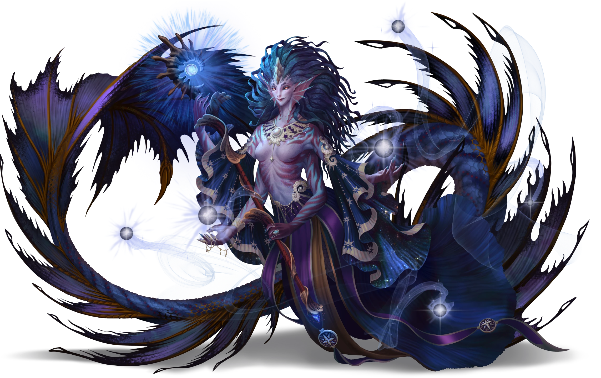

# The Wayfinder's Gauntlet

> [!warning] Gamemaster
> #### Gamemaster's Summary
>
> This Combat and Exploration Event takes place in the [[Chamber of Agaseros]], a mysterious dungeon complex beneath [[All-Fable Keep]] that the [[Anachraenum]] has used for centuries to train and challenge their members — and which serves as the final test of the Expedition Challenge. In this Event, the characters can:
>
> - Navigate the three levels of the Chamber of Agaseros and survive their various hazards, challenges, and enemies — including [[Anachraenum Aetherial]], [[Shade of Agaseros]], and one final encounter with a [[Vespian Hydral]].
> - Compete directly against the [[Fulgurite Blades]] during their efforts to reach the [[Main Reservoir]].
> - Emerge victorious and report their triumph to Loremistress [[Adelyne Goss]].
>
> This Event is depicted using both the [[The Arctus Plateau]] Region Map and the [[Chamber of Agaseros - Entrance]] Area Map.

### The Chamber Threshold

The antechamber that adjoins the front doors of the Chamber of Agaseros is not particularly interesting. However, the door itself is mesmerizing in its complexity and magical artifice. Furthermore, the Star Mage [[Eveis Brightstone]] awaits contestants here, eager to provide them with brief guidance about the final challenge ahead.

As the party approaches, you can read them the following:

> [!quote] Read Aloud
> > Greetings, heroes! I hope you are hale and healthy!
>
> Eveis seems genuinely pleased that you succeeded with the three previous trials, as her reserved demeanor has been replaced with one of genuine excitement and pride.
>
> > Congratulations are in order — I see you have managed to gather all three of the challenge keys! You'll need them to open the doors to the Chamber of Agaseros ahead, but I would warn you to be cautious when approaching the threshold itself. Hold out the keys ahead of you, and the doors should open for you without issue.

> [!abstract] Eveis Brightstone
> **[[Eveis Brightstone]]**
>
> Level 1 · Unknown Unknown
>
> 

> [!info] Social
> #### Conversation with Eveis Brightstone
>
> Eveis waits outside the Chamber to provide those entering with some measure of safety, and kindly offers the following details during a brief conversation:
>
> - The Chamber is extremely dangerous, and — while it has been prepared for the Expedition Challenge to some extent — the Chamber has a "mind of its own," and it will try to kill the party if they are careless and try to push ahead too quickly.
> - She can provide no additional help for the party beyond these few final encouraging words, nor can other members of the Anachraenum.
> - If one or more of the characters have already used their [[Frozen Tear]], Eveis confirms that they cannot receive additional Tears for aid.
>
> Any character who makes a successful **Diplomacy (DC 13)** check can glean a little more information from Eveis: the Chamber is defined by a series of increasingly dangerous challenges.
>
> - **Path: Academy Dropout**: The character gains **+2 Boons** on this check.
> - **Critical Success**: Eveis tells the character that they are not the first group to arrive with all three Challenge Keys in hand, and suggests that they may very well meet these rivals somewhere inside the Chamber.

> [!question] Q&A
> **Q:** Can you provide assistance?
>
> **A:**
>
> > I'm afraid not, dear ones. You must attempt this challenge on your own.

> [!question] Q&A
> **Q:** Are more Frozen Tears available?
>
> **A:**
>
> > The Frozen Tear would have likely been quite useful inside the Chamber, but I imagine it has already served you well. Unfortunately, I cannot provide you with additional treasures to ensure your safety.
> >
> > However, that is precisely why I am here … If you happen to fall, I will try to intervene before it's too late. But you'll need to start your exploration of the Chamber over from scratch, so to speak.

Once the exchange with Eveis Brightstone is complete, she leaves the party to their own devices, and maintains a distance of 20 feet or more from the Chamber doors.

> [!tip] Exploration
> #### Examining the Chamber Doors
>
> The chamber doors stand as a masterpiece of magical construction, decorated with layers upon layers of runic symbols from various cultures.
>
> Any character who makes a successful **Arcana (DC 16)** check while examining the Chamber doors can recognize that the threshold is laced with powerful and extraordinary magic. There also seem to be minor mistakes in the construction, which suggest the enchantments might be unstable.
>
> - **Knowledge: Artifacts**: The character automatically succeeds on this check.
> - **Knowledge: Rituals**: The character gains **+2 Boons** on this check.
> - **Critical Success**: The character also recognizes that the doors are trapped with a magical trap of some kind, which likely affects anyone trying to enter without all three Challenge Keys.
>
> A character who casts the [[Detect Magic]] Spell on the doors can detect the presence of Evocation magic on the doors and the runes that decorate them.
>
> Any character who makes a successful **Society (DC 13)** check knows the Chamber doors were crafted by mortal hands.
>
> - **Knowledge: Aedir**: The character automatically succeeds on this check.
> - **Knowledge: Shent**: The character automatically succeeds on this check.
> - **Knowledge: Cosmology**: The character gains **+2 Boons** on this check.
> - **Critical Success**: The character can recognize the presence of Aedir and Shent runic symbols on the doors, which suggests they are also connected to (and draw energy from) the moons and Inner Realms.
>
> Any character who makes a successful **Awareness (DC 13)** check can identify several large scratches or grooves on the floor in front of the Chamber doors, which suggests they are used with regularity.
>
> - **Knowledge: Forensics**: The character gains **+2 Boons** on this check.
> - **Critical Success**: The character also locates an errant auburn leaf on the floor, which can be correlated to the Fulgurite Blade known as Leeph "the Thief."

> [!danger] Hazard
> #### Lightning Rune Trap
>
> The Chamber doors are trapped with a magical lightning glyph.
>
> The trap is triggered when any character attempts to open the Chamber doors without first holding the [[Maze Challenge Key]], [[Well Challenge Key]], and [[Trial Challenge Key]] aloft.
>
> If triggered by the party, each character risks taking damage from **Runic Explosion (Hazard 4, Reflex, Health)**.

### Entering the Chamber

> [!warning] Gamemaster
> #### Entering the Chamber
>
> When the party is ready to enter the [[Chamber of Agaseros]], mark the outcome below — which will trigger a Scene transition that relocates to the characters into [[Chamber Foyer]] on the [[Chamber of Agaseros - Entrance]] Area Map.

`[[/outcome entered]]`

> [!danger] Hazard
> #### Surviving the Gauntlet
>
> The party's objective within the Chamber of Agaseros is to complete the gauntlet and defeat the [[Vespian Hydral]] in the [[Main Reservoir]].

#### Luxarum Attunement: Completing the Challenge

If the party manages to defeat the Fulgurite Blades in addition to the chamber's challenges, each character advances their **Attunement: Luxarum (+2)** at the conclusion of the Event.

Alternately, if the party is defeated by the Fulgurite Blades after they complete the chamber's challenges, each character advances their **Attunement: Luxarum (+1)** at the conclusion of the Event.

### Concluding the Event

> [!warning] Gamemaster
> #### Milestone Progression
>
> Completing this Event earns the party 1 [[Milestone Progression]], potentially advancing them in Level.
>
> #### Next Steps
>
> After the party defeats the Vespian Hydral, they must journey back to [[All-Fable Keep]] for [[Closing Ceremonies]], where they characters will claim victory as champions of the Expedition Challenge.
