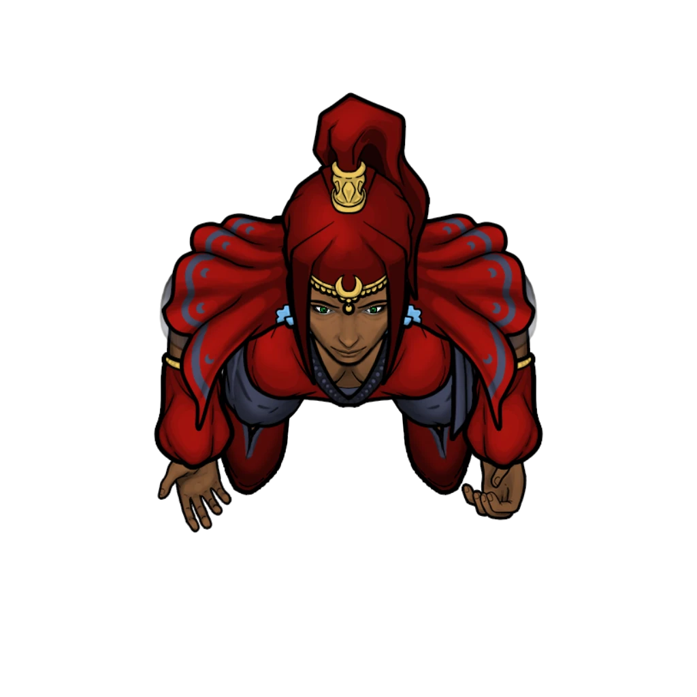

# Answers From On High

> [!warning] Gamemaster
> #### Gamemaster's Summary
>
> This Social Event invites the party to visit the Temple of Sockets in Ordain's [[Temple Ward]], where they can learn about [[Agraband Swift]] condition from the temple's absentminded high priest. In this Event, the characters can:
>
> - Arrive at the Temple of Sockets just in time to witness a sacred funeral ceremony led by [[Conaris Haid]], the scatterbrained High Priest of [[Sockets]].
> - Gain various perspectives on Ember's [[Soul Cycle]], depending on how they observe the funeral ceremony (and whether or not they participate).
> - Learn various details about life as a [[Death and Soulbound]] character.
>
> This Event is depicted using the "Solemn Service" Level of the [[Vista: Temple of Sockets]] Vista.
>
> #### Prerequisites
>
> [[Agraband Swift]] must be a member of the [[Party]] for this Event to occur.

### Warm Welcomes

In hopes of solving the mystery of Agraband's affliction, the party visits the Temple of Sockets in [[Temple Ward]], where the High Priest [[Conaris Haid]] is found conducting a funeral rite for a dead warrior.

Before the characters have an opportunity to speak with Conaris, they'll have to let the ceremony transpire. Meanwhile, a helpful young Acolyte of Sockets named **Eston Veld** (Neutral Good, Ordani Nir'ae, he/him) steps in to provide Agraband and the party with a helping of local hospitality.

> [!info] Social
> #### A Brief Word with Eston
>
> Mop-headed and tender-eyed, young Eston is eager to help answer any questions the characters might have, as long as they maintain a certain amount of decorum and keep their voices to a low and respectful volume. Indeed, greeting visitors is part of Eston's duties, but he is only willing to provide complete strangers with the basic details about the deceased — preferring to focus on the tenets of Sockets and the temple itself. Details that Eston is able to discuss include (but are not limited to):
>
> - The ceremony here today for Xaros Halfblade, which is a typical funerary rite for adherents of Sockets.
> - A brief account of his history as an acolyte of the God of Souls.
> - A few words on Conaris Haid as the leader here at the Temple of Sockets.
>
> Any character who makes a successful **Deception (DC 13)** check can readily tell that Eston is righteously above board with his information, as honest a newfound friend as one could hope to meet.
>
> Specific dialogue options for Eston are featured below.

> [!question] Q&A
> **Q:** What's happening here?
>
> **A:**
>
> > I take it you didn't know the deceased? You've come here at a solemn time, friends. This ceremony you see before you is a traditional display of funeral rites for the late Xaros Halfblade — a warrior of the Burnished Hand, and a lifelong devotee of Sockets. After all these years, it seems the march of time was his greatest enemy. But as you can see, he made a few friends along the way. We should all be so lucky.
> >
> > As is our tradition, friends and family are invited to leave a token of remembrance on the dais, which will be interred with Xaros in his mausoleum space. Their stories of the Halfblade will help shepherd his spirit to Eternas, where Sockets himself resides.

> [!question] Q&A
> **Q:** Who are you?
>
> **A:**
>
> The young cleric bows ever-so-slightly to oblige you with a formal introduction.
>
> > Stacker Highwell, at your service. I've been studying here beneath Master Haid for three cycles now, and each day is more surprising than the last. I grew up in Trader's Corner, but I prefer the quietude of Temple Ward.
>
> He takes a look around the massive sanctuary, whose visitors have grown sparse since the funeral's conclusion.
>
> > The relative solitude is rather inspiring. And you don't even have to leave the city! I remember visiting this place when I was younger and falling in love with the architecture and the austerity and the audacity of it all. Besides, helping folks out — safeguarding the souls of mortals, and what not — it helps me sleep at night.

> [!question] Q&A
> **Q:** What about Soulbound?
>
> **A:**
>
> > Soulbound? I'm afraid I know very little of the subject, other than some silly rumors and tall tales. You'd be better off discussing such things with Master Haid.

> [!question] Q&A
> **Q:** An audience with Conaris Haid?
>
> **A:**
>
> > I can certainly provide you with an introduction to Master Haid, but you're on your own after that. The High Priest can be rather … cantankerous when he wants to be.
>
> Eston leans in for a whisper.
>
> > Some of us think it's all an act. I don't really know what I think, personally. But you'd do well to placate Master Haid's … agitations. "A smooth stone sharpens the blade," as they say.

> [!tip] Exploration
> #### Participating in the Ceremony
>
> If the party understands (or deduces) how they can participate in the ceremony, their choice about whether or not to leave a token of remembrance for Xaros will determine precisely how Conaris Haid will treat them at the start of their conversation (as detailed in "An Audience with Conaris" below).

### The Keeper's Canticle

The characters have arrived in time to witness the funeral rites of **Xaros Halfblade** (Lawful Good, Ordani Human, he/him), a veteran soldier of the [[Burnished Hand]] who has recently perished of natural causes at the respectable age of 80 years old.

> [!info] Social
> #### Funeral Rites
>
> Despite his allegiance with the Burnished Hand and their [[Cindaric Sages]] allies, Xaros was raised from adolescence as an adherent of Sockets, and has been an upstanding member of this temple for nearly seven decades.
>
> The funeral is attended by six [[Ordani]], two [[Burnished Hand Protector]], a [[Cindaric Sage]], three or more wandering Priests of Sockets (including Acolyte Eston), and the High Priest [[Conaris Haid]] himself.

> [!abstract] Conaris Haid
> **[[Conaris Haid]]**
>
> Level 1 · Unknown Unknown
>
> 

> [!abstract] Burnished Hand Protector
> **[[Burnished Hand Protector]]**
>
> Level 5 · Human Protector
>
> 
>
> You regard a heavily-armored Ordani warrior, whose bronze splint mail gleams with a gorgeous russet luster. A symmetrical crimson hand with the roots of an oak tree decorates this soldier's chest piece, and the well-oiled longsword at their side looks poised and ready for action.

> [!abstract] Cindaric Sage
> **[[Cindaric Sage]]**
>
> Level 8 (Elite) · Human Cindaric Sage
>
> 
>
> This scholarly healer is clad in garments of bright gold and lush crimson, the colors of the famed Cindaric Sages of the Arctus Plateau. Their shoulders and tunic are marked with the familiar four-leafed diamond that signifies the Cindaric order, and their hands are marked and calloused by the wholesome abrasions of honest labor. The sage regards you with a benevolent smile.

> [!abstract] Ordani
> **[[Ordani]]**
>
> Level 1 · Human Commonfolk
>
> 
>
> This person is stylishly dressed in layers of bright cloth with intricate patterns and differing weights, creating a lavish ensemble of texture and color. Their garb is accented with silvers and golds, and minor gems which glitter in the light, making them appear all the more dazzling.

If one or more of the characters attempt to observe the funeral ceremony more closely (of their own accord), read the following aloud:

> [!quote] Read Aloud
> You take a moment to observe the ceremony, and your attention is quickly drawn to the odd little clergyman near the dais — a true character if you've ever seen one, who administers these sacred rites like he was conducting some frenetic orchestra. Taking a magnificent tome from his side, he addresses the mourners with a wild and raspy tenor.
>
> > If it were up to me, I'd walk you all hand-in-hand to the gates of Mort'oliss myself. But life isn't fair. And neither was the late Xaros. He cheated me at cards in the game hall more than once.
>
> A few of the mourners snicker with brief amusement, thankful for the moment of levity.
>
> > Nevertheless, I always respected the man! A fine warrior, and a good friend. The Keeper tells us to "safeguard the passage of souls." And so we shall, one story at a time, as our traditions afford. Tell us, friends, family, and foes —
>
> He jokingly inspects each of the mourners, before cracking a crooked smile.
>
> > Who was Xaros to you? Let your memories guide his way!
>
> A young mourner steps forward as the wild-eyed clergyman raps his fingers on the lectern. Clutching a flower close to her chest, she softly mutters a few solemn words of remembrance as the others look on in silence.

> [!tip] Exploration
> #### Observations
>
> Any character who makes a successful **Awareness (DC 13)** check is able to notice the following details:
>
> - The Cindaric Sage in attendance seems to be more of an observer than a participant.
> - A couple of the Ordani Citizens also seem to bear a striking familial resemblance to the late Xaros, and their sorrows appear the most palpable.
> - The silver broadsword that lies next to Xaros is shorter than it would normally be, displaying a jagged, broken tip. This is likely how he earned the name "Halfblade."
>
> - **Critical Success**: The character also notices that each of the mourners appears to hold a trinket or heirloom in anticipation — tokens of remembrance. Additionally, they notice that there is no lingering smell of rot here, with or without the incense that burns throughout the temple.
>
> Any character who makes a successful **Deception (DC 15)** check correctly assume that these trinkets are offerings for the deceased. Perhaps they'll be left next to Xaros's corpse near the conclusion of the ceremony.
>
> Additionally, any character who makes a successful **Arcana (DC 12)** check confirms the nature of this ceremony as the standard funeral rites for adherents of [[Sockets]], the God of Death. The presence of the Cindaric Sage here is part of a local accord.
>
> - **Knowledge: Rituals**: The character gains **+2 Boons** on this check.
> - **Critical Success**: The character understands that the standard funeral procedures for citizens of Ordain involve cremation in the Burial Grounds, where offerings are left for the deceased during a sacred ritual. Since Xaros was an adherent of Sockets, his remains will likely be interred somewhere in the Burial Grounds mausoleums (along with the trinkets left here by the mourners).
>
> Alternately, any character who makes a successful **Society (DC 13)** check immediately identifies the priest above the dais as Conaris Haid, the High Priest of Sockets, a character of some renown in the great city of Ordain (if not the Arctus Plateau in general). His vagabond vestments and erratic behavior gives him away, as does the sacred tome of Sockets at his side.
>
> - **Knowledge: Legends**: The character gains **+2 Boons** on this check.
> - **Critical Success**: The character has also heard a tale or two regarding the triumphs of Xaros Halfblade, and can readily attest to the late warrior's honor and acumen with a sword. Xaros was said to adore games of chance when he wasn't spinning about his fabled broken blade (a detail that can assist the players during the "Circuitous Logic" skill challenge featured below).

### An Audience with Conaris

When the ceremony comes to a close, the party will finally have an opportunity to speak to Conaris Haid via an introduction from Eston:

> [!quote] Read Aloud
> As the service winds down and some of the mourners start to disperse, the wizened old clergyman takes his leave and begins making his way towards a corridor lined with offices. Acolyte Eston steps lively after tossing you a quick nod.
>
> > Master Haid! Master Haid! You have some visitors.
>
> The High Priest pivots on his shoeless foot with the precision of a clock, turning to face you with a maniacal gleam of curiosity in his eye.

If one or more of the characters participated in the ceremony by leaving a token of remembrance for Xaros, Conaris continues with the following:

> [!quote] Read Aloud
> The old man cracks a toothy grin.
>
> > The Keeper's chosen turn up whenever I least expect them. But then again, the old codger does like to keep me on my toes! Tell me, friends, what service do you seek in the house of Sockets? Say that five-times-fast.
>
> You notice Eston has slipped away to his other duties, leaving you alone with the High Priest.
>
> > Now, where were we? You were about to dedicate your swords to the Temple, if I'm not mistaken …

On the other hand, if the characters simply stood by during the ceremony, Conaris addresses them with the following:

> [!quote] Read Aloud
> The old man shuts his book with a heavy CLAP!
>
> > I've no time for naysayers or lollygagging today! State your business, and make it good — or be gone with you!

If the characters have already met Conaris during the course of the [[Bickering Priests]] Event, he also has the following to say (based on the outcome of that Event):

> [!question] Q&A
> **Q:** [[Bickering Priests]]
>
> **A:**
>
> Just then, a knowing look crosses the High Priest's face, followed by a moment of fond recognition. He snaps his fingers with enthusiastic aplomb.
>
> > Welcome back, my young disciples! I see the word of Sockets has been ringing in your ears. Why else would you return for a visit so soon? Perhaps you missed ol' Conaris, eh?
>
> The aged cleric shoots you an avuncular wink.

> [!question] Q&A
> **Q:** [[Bickering Priests]]
>
> **A:**
>
> Just then, a knowing look crosses the High Priest's face, followed by a moment of distasteful recognition. He crosses his arms in disapproval.
>
> > Well, well, well … Sionia's sycophants have come to trouble ol' Conaris a bit more, eh? If you're here to simply rouse the rabble, you're in for a rude awakening.

> [!info] Social
> #### A Conversation with Conaris Haid
>
> If the party can manage to successfully steer Conaris Haid through the haphazard conversation, the High Priest will offer them a few details about Agraband's condition, including (but not limited to) the following:
>
> - Agraband's transition to a [[Death and Soulbound]] after his untimely death.
> - The metaphysics of becoming Soulbound.
> - The hazards of being Soulbound.
> - The nature of a Soulbound's Unfinished Business.
>
> Specific dialogue options for Conaris Haid are featured below.
>
> #### Skill Challenge: Circuitous Logic
>
> In order to keep Conaris Haid's attention on track during this particular conversation, the party must succeed on three or more of the following skill checks, effectively completing one after each response Conaris has to offer.
>
> - **Deception (DC 13)** to offer Conaris a compelling lie.
> - **Deception (DC 13)** to successfully judge what Conaris is interested in discussing.
> - **Awareness (DC 13)** to provide some additional clues about Agraband's situation that pique the High Priest's curiosity.
> - **Diplomacy (DC 13)** to successfully coax Conaris toward another topic.
> - **Arcana (DC 13)** to adequately relate the impact of Agraband's condition on the Soul Cycle and vice versa.
>
> - **Left Token of Remembrance:** The character automatically succeeds on this check if they participated in the funeral ceremony and left a token of remembrance.
>   - If the token of remembrance the character left was a gaming set (such as [[Dice]], [[Dragonchess]], [[Playing Cards]], or [[Three-dragon Ante]]), it counts as two successes for the skill challenge.
>
> When making any of the above checks:
>
> - [[Bickering Priests]]: The character gains **+2 Boons** on the check.
> - [[Bickering Priests]]: The character gains **-2 Banes** on the check.
>
> If the characters have trouble succeeding on these skill checks, Agraband himself will step forward in an attempt to steer the conversation.
>
> - **Reveals Wound:** Agraband automatically succeeds on the Charisma {Persuasion} check.

> [!question] Q&A
> **Q:** Agraband's Condition?
>
> **A:**
>
> The High Priest takes his first good look at Agraband since you arrived.
>
> > What's this!? There is a distinct aura about you, sir. But yet … you live. How came this curious conundrum to be?
>
> Agraband pulls back his tunic to reveal the lambent wound, which casts a pale glow upon Haid's wizened face. His eyes grow wide with curiosity. After you take a moment to explain what happened at The Pit Trap, the old clergyman continues.
>
> > You, my friend, are now Soulbound. By the will of Sockets, Ember itself, or some other force, your soul has been consigned to remain here — far beyond the walls of Eternas — until your unknown purpose has been served.

> [!question] Q&A
> **Q:** What are Soulbound?
>
> **A:**
>
> > Soulbound are people of Ember whose souls remain tethered to their mortal forms after death. The precise origin of this phenomenon is a mystery, and Sockets — the old goat — won't give up his secrets.
>
> The High Priest procures the magnificent tome from his side, a holy book bound in dark leather and clasps of electrum. It radiates a soft blue light as he thumbs towards a page in the middle, which bears an encyclopedic diagram of a Nir'ae and their disparate soul, surrounded by esoteric characters scribed in a magical language.
>
> > As far as we know, the first Soulbound appeared some time after The Shattering, and historians have recorded relatively few of their kind in the centuries that followed. It is a rare occurrence, prescribed by unseen forces, and guided by the divine will of Sockets — the Keeper of Souls or not. He doesn't claim ownership of the phenomenon!
>
> Haid gestures at the iconography of the grand temple sanctuary that surrounds you, before leveling his gaze back towards Agraband.
>
> > Soulbound endure here on Ember in order to realize a cosmic destiny of sorts — something we adherents of Sockets refer to as "unfinished business" (rather affectionately, I might add). No one knows precisely what this unfinished business might be, even the afflicted themselves. It is incumbent upon each Soulbound to find and fulfill their own destiny. Not many of them do.
>
> A curious look crosses the old man's face, a not-so-subtle mix of concern and enthusiasm.

> [!question] Q&A
> **Q:** Can a Soulbound die?
>
> **A:**
>
> > They've already died, youngblood! But I take your meaning, ahem.
> >
> > Your friend's wound has a level of intensity that we refer to as a Soulmark. With each new death, the intensity of the Soulmark grows and grows and grows — until it's too much for the afflicted to bear, let alone the rest of us. Most of these cosmic vagabonds either pass on the next time they "die" or they become wraiths, shades, or worse (if they're allowed to reach that level of abject inhumanity, that is). There are many who would rather see a Soulbound prematurely … hallowed, before it comes to that. Any good cleric of Sockets must be prepared to do that, even.
> >
> > Perhaps it's best you actually finish this business of yours, Mister Agraband. Whatever it is. Even I can't protect you forever.

Conversation unrelated to Agraband's plight might include the following.

> [!question] Q&A
> **Q:** Zira Hestidero and The Undaunted?
>
> **A:**
>
> The old priest's brow is quickly furrowed, and his eyes narrow with speculation.
>
> > I'm not really an enthusiast of public spectacle. But if these so-called Solar Games help the people relieve some tension, then who am I to disavow it?
> >
> > I hear The Undaunted are cruel in their athleticism, and that Zira Hestidero's allegiance to the shard god Ku'arta is to blame. They seem to have earned their name.

> [!question] Q&A
> **Q:** The Shard God Ku'arta?
>
> **A:**
>
> Haid marks the air with a profane gesture and curses beneath his breath.
>
> > Mark my words: any "god" who would champion the ideals of torment and suffering is no proper ally of mine. A true friend is one who protects!
> >
> > This all reminds me of the time I found myself in the middle of a Tayan mercenary pit with nothing more than a shield and a smile to protect my shiny bum …

### Concluding the Event

> [!warning] Gamemaster
> #### Next Steps
>
> Having gained some newfound insight about Agraband's Soulbound condition, the party is left to investigate what might be the subject of the bard's so-called "unfinished business."
>
> In order to complete Agraband's unfinished business, the party will need to learn more about Zira Hestidero and The Undaunted by attending one of the local Solar Games, which take place twice a week at Grand Kalion Stadium in [[Arena Ridge]]. The [[Game Day]] Event describes the full details of this encounter.
>
> Additionally, the trip to the Temple of Sockets has increased local awareness about Agraband and his situation. The [[Cost of Living]] Event is now likely to trigger as the characters traverse the [[Ordain Flats]].
