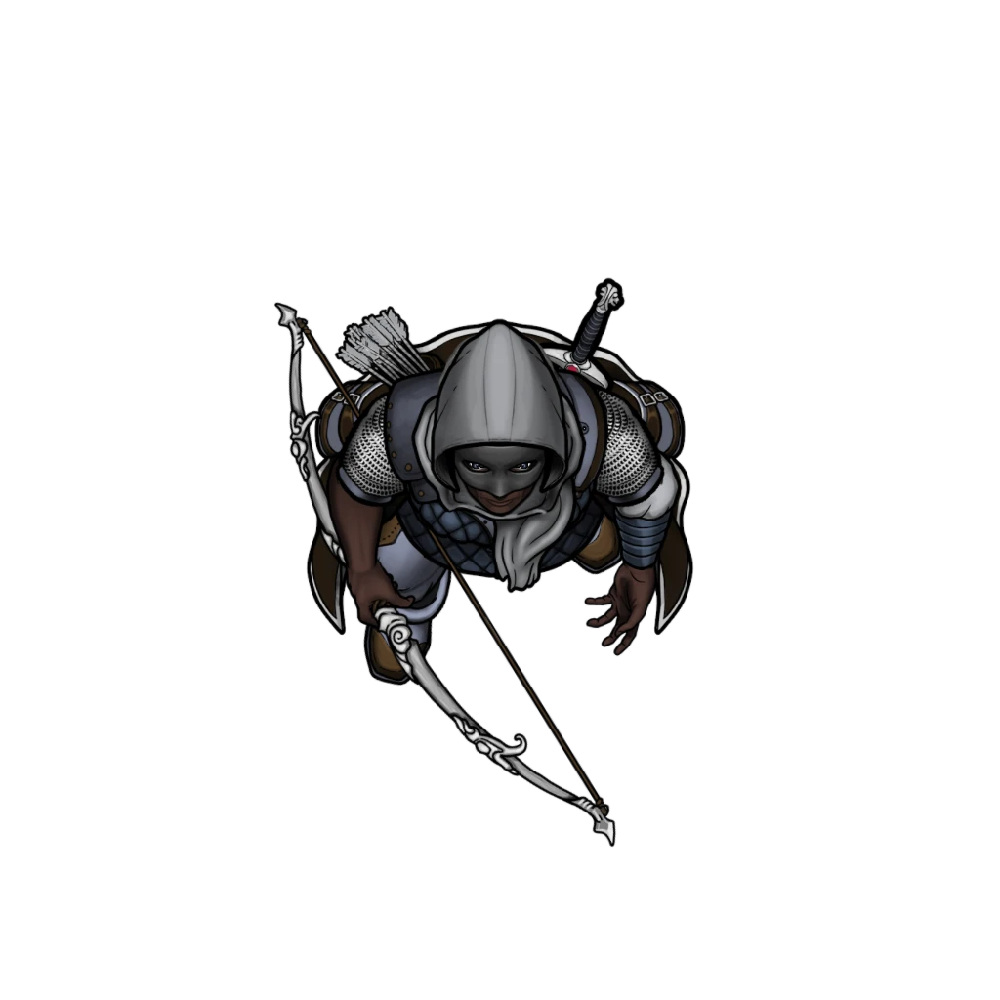
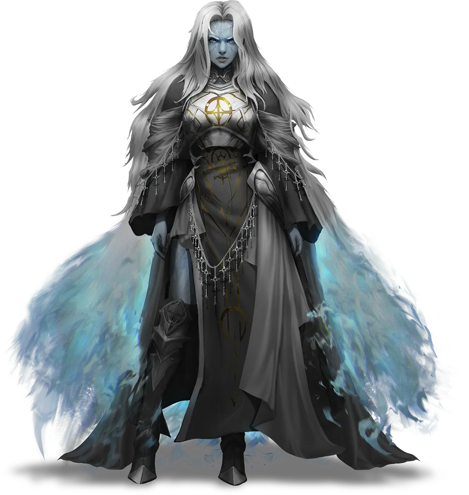

# Cost of Living

> [!warning] Gamemaster
> #### Gamemaster's Summary
>
> This Combat and Social Event takes place in one of several possible hexes either adjacent to the [[Temple Ward]] or to [[Arena Ridge]]. During this Event, the characters can:
>
> - Protect [[Agraband Swift]] from six [[Thayloc Courser]] who wish to arrest him.
> - Either defeat the Coursers on their own, or rely on the timely arrival of the Shard Goddess [[Sionia]] to help win the conflict.
> - Choose whether to befriend the Thayloc Coursers or deceive them.
>
> This Event is depicted using the [[Ordain Spires]] Area Map.
>
> #### Prerequisites
>
> [[Agraband Swift]] must be a member of the [[Party]] for this Event to occur.

### Ambushed!

As the Event begins, the characters are immediately beset by six Thayloc Coursers in the back alleys of the Ordain Flats district they happen to be traversing at the time. Even if the party avoids being surprised by the Coursers, [[Agraband Swift]] will start the encounter with the Incapacitated condition but is still able to speak.

> [!abstract] Thayloc Courser
> **[[Thayloc Courser]]**
>
> Level 1 · Unknown Unknown
>
> 

> [!danger] Hazard
> #### Thayloc Courser Tactics
>
> The 6 [[Thayloc Courser]] have been following the party for some time now (after their ally's mortal encounter with Zira during [[Status Effects]]), and are here now to abduct Agraband using nonlethal force.
>
> Each Thayloc Courser has **+2 Boons** on their initiative roll.
>
> At the start of combat, all Thayloc Coursers will use their Bonus Action to cast [[Shield of Faith]] on themselves. Then, the 2 Thayloc Coursers closest to Agraband will move toward him, grapple him, and attempt to drag him away.
>
> Over the course of combat, the Thayloc Coursers will prioritize the following actions and abilities:
>
> - In melee, the Thayloc Coursers will use [[Cunning Action]] to &Reference[Disengage apply=false], then use their [[Multiattack]] Action, prioritizing either [[Radiant Shot]] to deal extra damage or [[Disabling Shot]] to slow enemies, per the tactical situation.
> - From range, the Thayloc Coursers will use their [[Multiattack]] Action, prioritizing either [[Radiant Shot]] to deal extra damage or [[Disabling Shot]] to slow enemies, per the tactical situation.
>
> The Coursers can be convinced during combat to halt their attack if 2 or more characters can succeed on one of the following skill checks: **Deception (DC 18)**, **Diplomacy (DC 16)**, or **Intimidation (DC 20)**.
>
> - **Knowledge: Undeath**: The character gains **+2 Boons** on these checks.
> - **Cleric of Thayloc:** The character gains **+2 Boons** on these checks upon presenting their holy symbol or otherwise demonstrating a suitable act of faith (such as divine spellcasting) to prove their allegiance.
>
> #### Agraband's Abduction
>
> Ultimately, the party cannot fail this combat scenario, even if they seem to be losing the fight — and Agraband Swift won't actually be getting kidnapped any time soon.
>
> If the Thayloc Coursers manage to **Incapacitate** 2 or more party members during the conflict (or render them **Unconscious**), the Shard Goddess [[Sionia]] will arrive with immaculate timing on the subsequent turn in an effort to help the characters win the fight. Please refer to the first readaloud beneath "Sionia's Arrival" for additional details about this dramatic moment and its impact on the combat sequence.

### Sionia's Arrival

The party's altercation with the Thayloc Coursers is succeeded by the timely arrival of the Shard Goddess [[Sionia]], who will either: a) immediately join the battle to help the characters save Agraband from abduction, b) arrive after the Coursers have already been routed by the characters on their own, or c) arrive when the characters and the Coursers are engaged in civil discussion.

If the party requires Sionia's intervention to win the battle (i.e. as soon as 2 or more party members have been incapacitated by the Thayloc Coursers), read the following aloud:

> [!quote] Read Aloud
> Just when all feels lost, the battlefield erupts in a blinding flash of blue and silver light, along with the stirring of a cold breeze. You instinctively shield your senses from this lambent flare, and as they come to, you become aware of someone new here in the alley with you.
>
> A radiant woman with long silver hair stands above Agraband and his would-be kidnappers, a beautiful and otherworldly figure clad in shining silver armor and exquisite argentine garments. She holds your attackers in thrall, and they seem to look upon her alluring countenance with equal measures of hatred and fear; slowly, they drop their weapons and stand back from the captive Agraband. The radiant woman speaks to you all.
>
> > Please, lower your weapons. There will be no further bloodshed here today.
>
> With a simple wave of her hand, a feeling of calm begins to settle upon the place. You can't quite explain this change in demeanor, but you're certain powerful magic has something to do with it. She continues, addressing the bowmen directly.
>
> > Your lord Thayloc is a god of retribution, and a just one at that, but this storyteller is no threat. In fact, his tale is ordained to be told. I've a sense of this bard's future writ upon the moons and stars, and he has much more in common with your cause than you Coursers might expect. I offer an accord.
>
> Another wave of her hand casts aside Agraband's silver bonds, and the injuries of those wounded among you begin to heal right before your very eyes. The bowmen all lower their weapons and reluctantly stand aside.

If the party manages to rout or defeat the Thayloc Coursers on their own, Sionia arrives to speak with them as soon as the damage from a killing blow strikes one of the Coursers.

> [!quote] Read Aloud
> Just as you deal a fatal blow to the bowman, the battlefield erupts in a blinding flash of blue and silver light, along with the stirring of a cold breeze. You instinctively shield your senses from this lambent flare, and as they come to, you become aware of someone new here in the alley with you.
>
> A radiant woman with long silver hair stands between Agraband and his would-be kidnappers, a beautiful and otherworldly figure clad in shining silver armor and exquisite argentine garments. She holds your humbled attackers in thrall, and they seem to look upon her alluring countenance with equal measures of adoration and fear; slowly, they drop their weapons and stand down. The radiant woman speaks to you all.
>
> > Please, lower your weapons. There will be no further bloodshed here today.
>
> With a simple wave of her hand, a feeling of calm begins to settle upon the place. You can't quite explain this change in demeanor, but you're certain powerful magic has something to do with it. She continues.
>
> > The honorable Thayloc is a god of retribution, and a just one at that, but this storyteller is no threat. In fact, his tale is ordained to be told. I've a sense of this bard's future writ upon the moons and stars, and he has much more in common with the Silver Bowman's cause than you Coursers might expect. I offer an accord.
>
> Another wave of her hand casts aside Agraband's silver bonds, and the injuries of those wounded among you begin to heal right before your very eyes. The remaining bowmen lower their weapons and reluctantly stand aside.

If the party manages to befriend the Thayloc Coursers before Sionia's arrival:

> [!quote] Read Aloud
> Just then, a cold and peculiar breeze sweeps through the alley — briefly obscuring your senses as it stirs up dust devils of detritus and billows your garments and hair. As you regain your composure, you notice that the bowmen look southward at something (or someone) behind you, which holds their attention with rapt abandon.
>
> A radiant woman with long silver hair approaches, a beautiful and otherworldly figure clad in shining silver armor and exquisite argentine garments. She holds your humbled attackers in thrall, and they seem to look upon her alluring countenance with equal measures of adoration and fear. The radiant woman speaks to you all.
>
> > I'm pleased to see there was no real bloodshed here today. Your two groups have much more in common than you might expect.
>
> An overt feeling of calm begins to settle upon the place. You can't quite explain this change in demeanor, but you're certain powerful magic has something to do with it. She continues.
>
> > The honorable Thayloc is a god of retribution, and a just one at that, but this storyteller is no threat. In fact, his tale is ordained to be told. I've a sense of this bard's future writ upon the moons and stars. I offer a further accord, and some insight about this man's condition.
>
> The bowmen sheathe their weapons and reluctantly stand aside.

> [!abstract] Sionia
> **[[Sionia]]**
>
> Level 1 · Unknown Unknown
>
> 

> [!info] Social
> #### Advice from the Lonely Goddess
>
> Having magically become aware of Agraband's Soulbound condition herself, Sionia has decided to intervene — not only to get a better look at the Soulbound herself, but to help steer the party towards a greater understanding of Agraband's situation and the nature of undeath itself in Ember.
>
> If the characters are suitably polite with their conversation, the Shard Goddess can provide the party with additional details about Soulbound and necromancy, including (but not limited to):
>
> - The metaphysical nature of a [[Soulbound]]'s Unfinished Business.
> - How [[Death and Soulbound]] become spiritual “magnets” for certain arcane and Abyssal entities of the Cosmos.
> - The differences and similarities between Soulbound and other "standard" undead creatures (like Skallith, Wraiths, and more).
> - The nature of [[Magic and Spellcraft]].
>
> Specific responses to a handful of topics are provided at length below. Additionally, the party may already be familiar with Sionia if they met her during the course of the [[Numinous Rendezvous]] quest event in [[Smoldering Cinders]].

> [!question] Q&A
> **Q:** Your story?
>
> **A:**
>
> > I am Sionia, a shard god who some have come to know as the Deathbinder. Others know me as the Lonely Goddess. But you may call me Sionia. My life as a shard god has been a relatively short one by Ember's standards, and my concerns are largely the same as they were prior to my ascension. Ultimately, my past is unimportant. It is our actions that define us, don't you agree?
> >
> > I've come to the Arctus Plateau in search of answers about the mounting threat of suspicious necromancy in the region. Your friend is not the first denizen of the Arctus Plateau to become Soulbound in recent months, and it troubles me to consider what kind of cosmic unrest might be at the heart of these matters.

> [!question] Q&A
> **Q:** Your philosophies regarding Soulbound?
>
> **A:**
>
> > Soulbound are curious creatures, caught between life and death. "The Lost Children" I call them. I'll admit, I find their role in the Soul Cycle fascinating, and worthy of further study. Which is no doubt why I came here today — to get a better look at our friend Agraband Swift here.
>
> She regards the wizened bard with a strong measure of curiosity, but there is a measure of unmistakable respect in her eyes.
>
> > Mr. Swift, your stories will leave an immeasurably profound impact on the world whenever you happen to leave us. But these Coursers of Thayloc have a right to be concerned — the scores of Soulbound that have come before you have not all met their ends with grace and resolution. Many turned to wraiths, some turned to suicide, none survived. But there is a grander purpose for your subsistence, of that I have no doubt.

> [!question] Q&A
> **Q:** About Necromancy and Souls?
>
> **A:**
>
> > My philosophy is simple: souls are the domain of Sockets, and are the immutable stuff of the Cosmos; but the physical remains we leave behind are nothing more than shells. Just as a transmuter can shape flesh to stone with ethical consideration, necromancy can transform a corpse into a semblance of life, or it can twist the soul itself, corrupting it completely. Soulbound are neither of these, and something else entirely.

> [!question] Q&A
> **Q:** Regarding Thayloc?
>
> **A:**
>
> > The Silver Bowman is a powerful ally against those undead that threaten to harm the world and its people, but his methods can be rather direct…
>
> She regards the Coursers among you with a slightly knowing grin.
>
> > However, Thayloc is also known as the "Swiftbolt" for a reason. He is relentlessly courageous and quick to act. Thayloc maintains the trust of the people in a world that increasingly needs the kind of protection his servants offer. Admittedly, the two of us have a rather strained relationship, and his followers do not trust me.
>
> She smiles as the bowmen stare, brows crossed, with odd expressions akin to disgust on their faces.

> [!question] Q&A
> **Q:** Zira Hestidero?
>
> **A:**
>
> For the first time since meeting her, Sionia's brow furrows with slight confusion.
>
> > I must admit I know relatively little of this Zira Hestidero you speak of, other than her accolades and status as one of the city's most incendiary personalities. "The champion you love to hate," I've heard her called in some circles. But as to what motivates this Zira Hestidero, I know not — other than her allegiance to the shard god Ku'arta. The affairs of mortals gain as much purchase in my mind as necessary, and there are more important matters at hand.
> >
> > As for Ku'arta himself, our common hatred of the Ossarchate and the Blood Barons unites us, but the God of Torment is a cruel and unreliable ally — sequestered far to the west.

Once Sionia and the party have adequately exchanged words and wisdom, the Shard Goddess takes her leave:

> [!quote] Read Aloud
> The wind in the alley begins to stir again with the same cold breeze you felt when Sionia arrived. Her hair and cloak rustle in the current, as do your own.
>
> > I fear the time has come for me to take my leave. Other matters require my immediate attention. But I trust you will keep our exchange close to heart, and remember this accord when fate calls upon us all.
>
> The Lonely Goddess nods and waves to you before walking away, deeper into the alley. As you watch her leave, Sionia's physical form shimmers as she walks unseen within the city, like some storybook phantom or ghost. And just like that, she's gone.

### A Covenant

> [!info] Social
> #### Parley with the Coursers
>
> Any character who makes a successful **Deception (DC 18)**, **Diplomacy (DC 16)**, or **Intimidation (DC 20)** check is able to convince the Thayloc Coursers to stand down from their course of attack and join the party in amicable conversation.
>
> - **Knowledge: Undeath**: The character gains **+2 Boons** on this check.
> - **Cleric of Thayloc:** The character gains **+2 Boons** on this check upon presenting their holy symbol or otherwise demonstrating a suitable act of faith (such as divine spellcasting) to prove their allegiance.
>
> Once the party has successfully established a rapport with the Coursers, they can discuss a few topics relevant to the mission at hand, as well as some general details about their service to the Shard God Thayloc and their place in Ordani society. Subjects include (but are not limited to) the following:
>
> - Thayloc's role in Ember and philosophies on the Soul Cycle.
> - The paranormal nature of various undead creatures, including Soulbound and other anomalies.
> - Details about Ordain and its people, including scant information about Zira Hestidero and The Undaunted.
>
> Specific responses to a handful of topics are provided at length below.

> [!question] Q&A
> **Q:** Your mission?
>
> **A:**
>
> > We are Coursers of the shard god Thayloc, sworn to honor his mission to destroy the undead scourge that plagues Ember and its people. Some clerics wave censers in cozy temples; our church is wherever we find the undying or the monstrous.
>
> They take a quick look at Agraband Swift and his supernatural wound.
>
> > Your friend is no longer a mortal man. He's become something else entirely, and he is beginning an unfortunate journey into the arms of undeath that must be halted before he becomes a risk — by any means necessary.

> [!question] Q&A
> **Q:** Your service to Thayloc?
>
> **A:**
>
> As you mention the god these bowmen serve, you notice a couple of them make a reverent, almost ritualistic gesture that looks akin to the breaking of a reed … or an arrow.
>
> > We serve the Silver Bowman, Thayloc, and carry our weapons into battle against the undead and those who would summon such evil creatures into being. Lives of loss and vengeance bring many of us to worship the Swiftbolt, but his doctrines are for all, and his divine stewardship of Ember is one of the greatest boons the Cosmos has ever known.
> >
> > Of all Ember's necromancers, only the shard goddess Sionia has earned a place of immunity from Thayloc's wrath. Although her methods are inscrutably vile, her aims are wrought with honor — or so we trust, according to Thayloc's divine word.

> [!question] Q&A
> **Q:** Your concerns regarding Soulbound?
>
> **A:**
>
> The bowmen cast a few quick glances towards Agraband at the mention of Soulbound before one of them speaks.
>
> > Everyone's time must come. And while Soulbound maintain a physical form that resembles the mortal shell, their souls have already been compromised — and must rejoin the Heart of Ember to endure without corruption. The journey to Mort'oliss is inevitable. How we choose to get there defines us. The time has come for your friend here to make his own choice.

> [!question] Q&A
> **Q:** The threat of undeath?
>
> **A:**
>
> > The malevolent tide of undeath began after the time of The Shattering, when forces of the Shroud began disrupting the ebb and flow of Souls on Ember. Since then, a steady rise of that tide has threatened the natural order, and we stand ready to defend it.
> >
> > The undead can vary widely in form and function — from the lowliest specter to the most powerful of vampyres — but they all suffer from the same cosmic malady of corruption and spiritual decay. It seems Agraband Swift has been granted divine protection, which we will strive to honor. If he is no threat, we will certainly find such elsewhere.
> >
> > So tell us friends, will you stand with Thayloc against the undead tide? Will you pledge yourself to join us as siblings-in-arms?

> [!question] Q&A
> **Q:** Zira Hestidero and The Undaunted?
>
> **A:**
>
> The bowmen offer you a somewhat quizzical look at the mention of the arena champion's name.
>
> > The Solar Games are fine recreation for the people of Ordain, but these athletes have relatively little to do with our affairs as acolytes of the Swiftbolt. Is there an element of necromancy we should be worried about as far as these so-called Undaunted are concerned?

> [!warning] Gamemaster
> #### A Covenant with Thayloc
>
> If the party agrees to take up arms with Thayloc's Coursers and join the Silver Bowman's church as fellow worshipers or allies, one of the characters will be gifted a [[Silver Bowman's Symbol]] [[Potion of Healing]] from one of the acolytes.
>
> Check the [[Cost of Living]] outcome below, and read the following aloud:

> [!quote] Read Aloud
> One of the Coursers, an older-looking fellow, removes the cloak pin from his cowl and holds it out towards you as a token of this covenant. It appears to be made of silver, fashioned into the likeness of a bow with a broken arrow.
>
> > Take this. It will serve as a symbol of our accord. Thayloc welcomes you into his fold, and you can trust us as allies in the days to come. Although our meeting began as a conflict, you've proven yourselves to be people of integrity. We are sorry for any wounds you've suffered, physical or otherwise.
> >
> > Now, we take our leave. May your arrows fly true and your bows never break.
>
> With that, the silver-bow clerics retreat back into the shadows as swiftly and quietly as they appeared.

> [!warning] Gamemaster
> #### Refusing the Covenant
>
> If the party defeats Thayloc's Coursers in battle or refuses their offer to become allies of Thayloc's church of undead hunters, they will have made some erstwhile enemies of the clerics.
>
> Check the [[Cost of Living]] outcome below, and read the following aloud:

> [!quote] Read Aloud
> Once Sionia has departed, the would-be kidnappers hastily retreat into the back alleys of Ordain, clutching their wounds and nursing their pride. And just like that, the silver-bow clerics are gone as quickly as they arrived.

#### Heart Attunement: Allies to Thayloc

Each character who chooses to strike a covenant with the Thayloc Coursers advances their **Attunement: Heart of Ember (+1)** at the conclusion of the Event.

`[[/outcome parley]]`

#### Abyss Attunement: Enemies of Thayloc

Each character who chooses to deceive or defy the Thayloc Coursers advances their **Attunement: The Abyss (+1)** at the conclusion of the Event.

`[[/outcome combat]]`

### Concluding the Event

> [!warning] Gamemaster
> #### Milestone
>
> Completing this Event earns the party 1 [[Milestone Progression]], potentially advancing them in Level.
>
> #### Next Steps
>
> Once the party has satisfied their appetite for conversation with Sionia and/or the Thayloc Coursers, they should return to their investigation of Zira Hestidero and The Undaunted.
>
> The party will most likely continue on their journey to [[Arena Ridge]] to trigger the [[Game Day]] Event, which can only trigger during daylight hours.
>
> However, if they've already completed that Event, the characters can proceed with their investigation by visiting the [[Smokerie]] for [[Early Retirement]] or [[Orchard Lanes]] for [[The Old Flame]].
