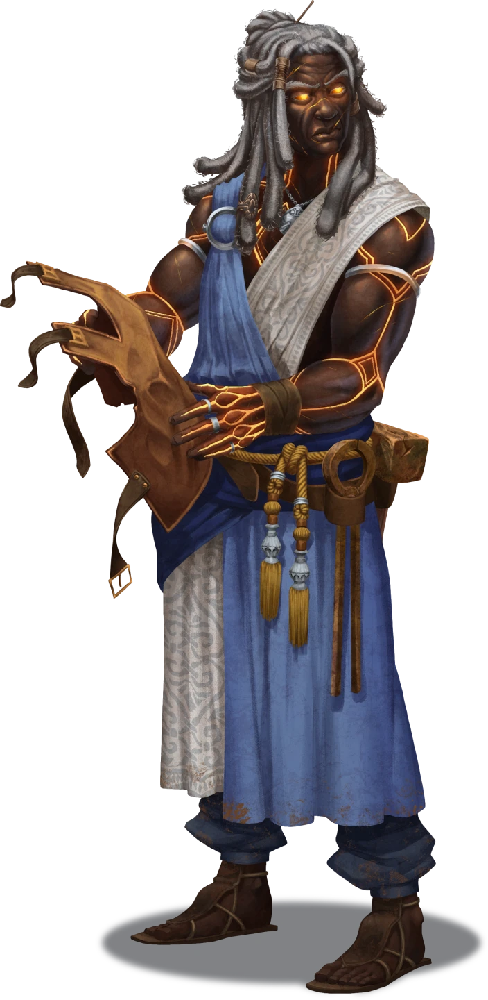

# Early Retirement

> [!warning] Gamemaster
> #### Gamemaster's Summary
>
> This Social Event takes the party to the [[Smokerie]] district in northwestern Ordain, in search of a retired member of [[Zira Hestidero]]'s Undaunted — the athlete-turned-smithy named [[Brackus von Tet]]. In this Event, the characters can:
>
> - Visit Brackus von Tet's forge in the Smokerie, where the blacksmith is hard at work crafting arms and armor.
> - Gain Tet's allegiance by proving their bravado, via both their crafting skills and their intentions to thwart Zira Hestidero.
> - Learn two key details about the adventure ahead: the location of The Undaunted's hidden lair beneath Grand Kalion Stadium, and a secret that might help them navigate the lair's maze-like central section.
>
> This Event is depicted using the "Blacksmith's Workshop" Level of the [[Vista: Ordain Interiors]] Vista.
>
> #### Prerequisites
>
> [[Agraband Swift]] must be a member of the [[Party]] for this Event to occur.

### Untarnished Munitions

When the Event begins, Agraband and the party have arrived at the forge of the former Solar Games athlete Brackus von Tet. Brackus is hard at work and suffers no fools, but if the characters can convince him that their quest for vengeance against Zira Hestidero is righteous and true (and display some flourishes of their skill while doing it), the proud smithy will provide them with some much-needed information about how to find the secret underground lair of his erstwhile gang.

> [!abstract] Brackus von Tet
> **[[Brackus von Tet]]**
>
> Level 1 · Unknown Unknown
>
> 

> [!info] Social
> #### A Conversation with Brackus
>
> The party is here in search of details about Zira Hestidero and The Undaunted, including precisely how and where to find them. However, Brackus von Tet isn't particularly forthcoming with his secrets. If the characters want to learn about the blacksmith's past, they'll need to convince him to share his most intimate details.
>
> Despite his stoic nature, Brackus is still an entrepreneur, and is certainly willing to discuss the most casual details of his past with potential customers. Topics of such general conversation include (but are not limited to) the following:
>
> - The various weapons and armor for sale here at the shop, alongside discussions of repair services and custom orders.
> - Current affairs in Ordain, with an emphasis on The Smokerie.
> - A brief account of his history as a Solar Games athlete, with a focus on the actual sport and the cultural zeitgeist that surrounds it.
>
> Any character who makes a successful **Deception (DC 13)** check is able to interpret Brackus' overall demeanor as one of apprehension, the caution of an experienced mind.
>
> - **Critical Success**: The character notices that Brackus operates in a constant "threat assessment" mode, and has been sizing up each of the party members since they walked in.
>
> Any character with a `[[/skill perception 15 passive format=long]]` or who makes a successful **Awareness (DC 13)** check is able to notice a peculiar detail: Brackus is missing half of the middle finger on his right hand.
>
> - **Critical Success**: The character also notices that Brackus makes constant but casual attempts to hide the old wound from plain sight.
>
> Any character who makes a successful **Society (DC 18)** check is aware of the story behind the missing finger (although they might be shy on particulars): Brackus lost the finger in a championship match, when Zira was compelled to forcefully remove a magic ring from his hand after he broke a leg halfway down the field. Zira's brutal and hasty strategy resulted in The Undaunted winning the match, but also led to some ongoing friction between the two athletes.
>
> - **Knowledge: Legends**: The character gains **+2 Boons** on this check.
>
> #### Down to Business
>
> If one or more of the characters ask Brackus about his tenure with The Undaunted under Zira Hestidero's leadership, he's willing to speak on subjects that are public knowledge, but a certain amount of convincing is necessary if the characters want Brackus to share the information they seek.
>
> Any character who makes a successful **Diplomacy (DC 14)** or **Deception (DC 16)** check is able to convince Brackus that their intentions are aligned with his own (perhaps by explaining the dire situation that awaits Agraband if his business remains unfinished), but they'll still need to adequately impress the smithy with a display of skill or bravado (see "A Display of Intentions" below).
>
> - **Knowledge: Souls**: The character gains **+2 Boons** on this check.
> - **Knowledge: Undeath**: The character gains **+2 Boons** on this check.
> - **Present** [[Sash of the Undaunted]]: The character gains **+2 Boons** on this check if they present this sash to Brackus, found during the [[Status Effects]] Event.
> - **Recount Missing Finger Story:** The character gains **+2 Boons** on this check if they mention Brackus' finger and can recount how it was lost.
>
> Some initial answers Brackus might provide for certain questions are detailed below, and hint at pertinent information that will only be elucidated upon later.

> [!question] Q&A
> **Q:** Can you tell us about Zira and The Undaunted?
>
> **A:**
>
> Brackus turns back to his work at the mention of his old comrades, notably disinterested in the subject.
>
> > What's there to say about Zira Hestidero that hasn't already been said? She's a local hero (or villain, based on who you ask), worth her weight in sponsorships and then some. High rollers call her "The Sure Bet" for a reason. She's good at what she does, with or without Ku'arta on her shoulder.
> >
> > As far as the team goes … I don't keep up with sports much these days. I try to remember the good times, and we had a few.

> [!question] Q&A
> **Q:** Your time in the Solar Games?
>
> **A:**
>
> Brackus swallows a small measure of disappointment before proceeding.
>
> > From what they tell me, I was pretty good in my time. A few injuries later, I found myself staring down the rusty pike of middle age. Thought it might be best to put my talents to work elsewhere.
> >
> > You watch the games? Believe it or not, I don't make it over to the arena much these days.

> [!question] Q&A
> **Q:** Your wounded finger?
>
> **A:**
>
> > This? An old wound from the arena, nothing more.

> [!question] Q&A
> **Q:** The Undaunted's secret lair?
>
> **A:**
>
> The smithy lets out a slight chuckle beneath his breath.
>
> > Secret lair, huh? Somebody's been listening to the tall tales of street rats a little too much. Save your fantasies for the Anachraenum.

> [!info] Social
> #### What Brackus Won't Say
>
> Any character who makes a successful **Deception (DC 13)** check can readily tell that Brackus is holding back some information, and that there's likely more to the mention of a "secret lair" than he currently indicates. He's also hiding something about the wounded finger (a story he won't tell without proper convincing).

### A Display of Intentions

Once the characters have managed to convince Brackus that their intentions are just (whether via appealing to his disdain for Zira or by detailing the undead transformation that might befall Agraband), the smithy's demeanor shifts a bit from apprehension to amused scrutiny. His life after the Solar Games has been a relatively lonely one, and this is one of the first times some potential allies have presented themselves.

With a new frame of mind on hand, Brackus has a small test for the party to pass, if indeed they value his insider knowledge about The Undaunted's secret lair.

> [!quote] Read Aloud
> A look of what you might call recognition or awareness replaces the smithy's apprehensive scowl, and he takes a brief moment to size up your group with a prideful gusto he hasn't displayed since you walked in.
>
> > I'll admit, when you first walked in, all I saw was a group of slack-jawed Solar fans. But it sounds like there's a little more truth to your story than most. Tell you what: if you can prove how swift or strong your hands are, I'll point you towards Zira. And I don't mean a display of martial arts …
>
> Brackus tosses a handful of unfinished blades in your direction, which clang upon the stone floor in metallic cacophony.
>
> > Grab a hammer. If you can beat at least one of these ingots into proper shape within a half hour, you'll prove you have the strength and stamina it takes to tussle with the Undaunted. Who knows? Perhaps you're not as green behind the ears as you look.
>
> The smithy shoots you a wry grin before turning back to his work.

> [!tip] Exploration
> #### The Blacksmith's Test
>
> Any character who wants to participate in Brackus' test needs to grab a hammer (located nearby), one of the incomplete blades (there is one for each party member, including Agraband), and an anvil (there are at least 3 of these located in the shop).
>
> A character who succeeds on at least three of the following skill checks while spending 15 minutes or more to forge a blade is able to fashion a weapon that is good enough for the blacksmith's test.
>
> - **Athletics (DC 13)** to show proper strength and form.
> - **Deception (DC 13)** to hide an inadequacy or omission.
> - **Awareness (DC 13)** to pick the best materials.
> - **Awareness (DC 13)** to keep the embers appropriately hot.
> - **`[[/skill sleightofhand 13]]`** to display advanced technique.
>
> While making any of the above checks:
>
> - **Knowledge: Crafts**: The character gains **+2 Boons** on the check.

Once a character has achieved enough successes, Brackus steps in to continue the conversation with a measure of avuncular satisfaction.

> [!quote] Read Aloud
> As you hold the weapon aloft, Brackus steps over to admire your handiwork, an unmistakable look of satisfaction in his eyes.
>
> > Well, it looks like there's more to you than meets the eye, my friend. I can't imagine a charlatan sticking around to beat some decent sense into that blade, let alone putting enough sweat into the job to make it worthwhile. Color me convinced.
> >
> > Now that I can trust you've got the right reasons on your side, tell me: what can I do to help?

> [!question] Q&A
> **Q:** Your falling out with Zira?
>
> **A:**
>
> Brackus holds up his right hand, displaying a half-digit instead of a full middle finger, and regards the amputation with some frustration.
>
> > My respect for Zira ended the day she decided to sever my fucking finger in order to win a match. With moments left to spare, as I lay bleeding on the platform with a broken leg, she obliterated my finger so she could snatch up the Ring of Speed I was wearing. And I might have grown the damn thing back if the eldritch blast wasn't laced with dark magic …
> >
> > You see, something foul has crept into Zira's spellcasting, something nebulous and unpredictable. Something I didn't like, and wouldn't be a part of. She treats her teammates like mad dogs, and (somehow) in return they idolize her.
> >
> > As far as I'm concerned, it's not too late for Zira to learn a good lesson about who she really is to the people of Ordain … from somebody who's willing to teach her. She's a tyrant, who needs to be humbled. And if I can't do it myself, the least I can do is point you in the right direction.

> [!question] Q&A
> **Q:** What motivates Zira and The Undaunted?
>
> **A:**
>
> > The earliest days of the team were somewhat unremarkable. I myself joined alongside Zira years ago, when the Solar Games were still in their infancy. And as our little gang from The Smokerie gathered numbers and strength, we started winning matches. But winning was never enough for Zira, and her pact with Ku'arta slowly became the centerpiece of our world — whether we wanted it to or not.
> >
> > Everything changed when we discovered the Sanctuary beneath Arena Ridge. Zira claims a vision from Ku'arta led her to the place, but speculation endures. Located deep within the Kalion Underworks, this Temple of Ku'arta had lurked for centuries unseen — forbidden and condemned by the citizens of Old Ordain. So, at Zira's behest, we infiltrated, renovated, and occupied the place as our own, establishing a furtive location we could call home.
> >
> > But the proximity to Ku'arta's paradigms only exacerbated Zira's mania. She's not just some all-star athlete — she's a dangerous warlock who serves a malevolent shard god. And the Undaunted (whether they realize it or not) are simply her acolytes in this quest for power. No championship is worth the price one must pay for such fealty.

> [!question] Q&A
> **Q:** Where to find The Undaunted's lair?
>
> **A:**
>
> Brackus produces a dull marble from a lockbox nearby and holds it out for you to take.
>
> > This trinket will help you find your way. The closer you get to the Temple of Ku'arta in the Kalion Underworks, the more brightly this enchanted marble will glow. You'll have found the corridor when the light is as bright and bold as the flame-colored hem of Ku'arta's cloak. The Underworks can be accessed via one of the aqueducts that surrounds Grand Kalion Stadium. Just don't get lost down there.

An [[Underworks Guidestone]] is now in your possession.

> [!question] Q&A
> **Q:** Any other details?
>
> **A:**
>
> > The old temple is a strange and curious place, with architecture that's been designed to both impress and confound. A maze-like structure sits between the underworks and the temple sanctuary, a contraption that once served as an obstacle course for arena trainees. Now, it's a security measure against those who might visit the temple uninvited.
> >
> > A phantom of old Ordain serves as a watchdog of sorts for the area, the undying spirit of a warrior known as Regus Halamattrix. This slayer once served Ku'arta as a loyal acolyte, and through some manner of ritual or pact, he now serves Zira and her lofty ambitions. If you can't defeat this specter in battle, perhaps you can appeal to a memory of his past.

> [!tip] Exploration
> #### Obtaining the Kalion Underworks Key
>
> By the end of this conversation, Brackus von Tet should hand over the [[Underworks Guidestone]] to one of the party members (presumably, the character who passed the skill challenge in "The Blacksmith's Test").
>
> If the encounter with Brackus goes poorly, you may choose to allow the party to attempt to steal the Kalion Underworks Key from the blacksmith's shop (if they can manage to find it). A successful **Awareness (DC 16)** check is required to locate the lockbox, followed by a successful **`[[/skill thief 18]]`** check or **Athletics (DC 22)** check to open it.

### Concluding the Event

> [!warning] Gamemaster
> #### Next Steps
>
> When the characters are satisfied with the level of detail they've gained from Brackus (or become discouraged by their lack thereof), they're free to pursue other leads or follow up on the information they've learned here today.
>
> If the party learned the right information from Brackus, they can now locate the secret entrance to Zira Hestidero's subterranean hideout in [[Arena Ridge]], triggering the [[Running the Gauntlet]] Event.
>
> Alternatively, the party can journey to the home office of [[Helice Korsos]] in [[Orchard Lanes]] for [[The Old Flame]], where they'll gain corresponding information about The Undaunted's hidden lair.
