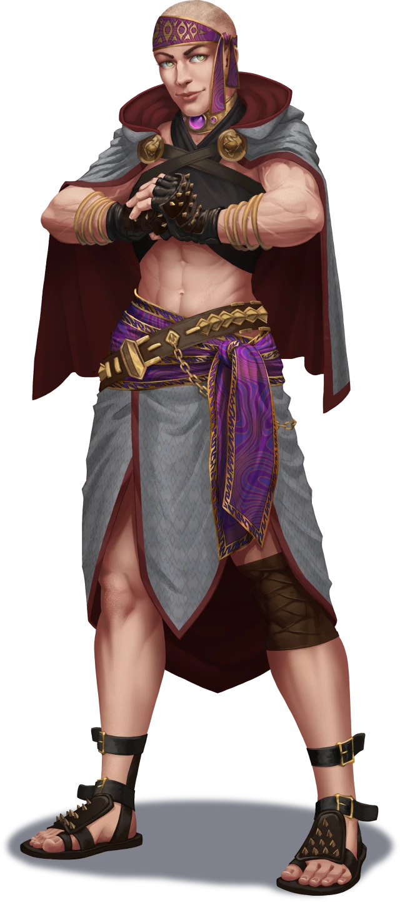
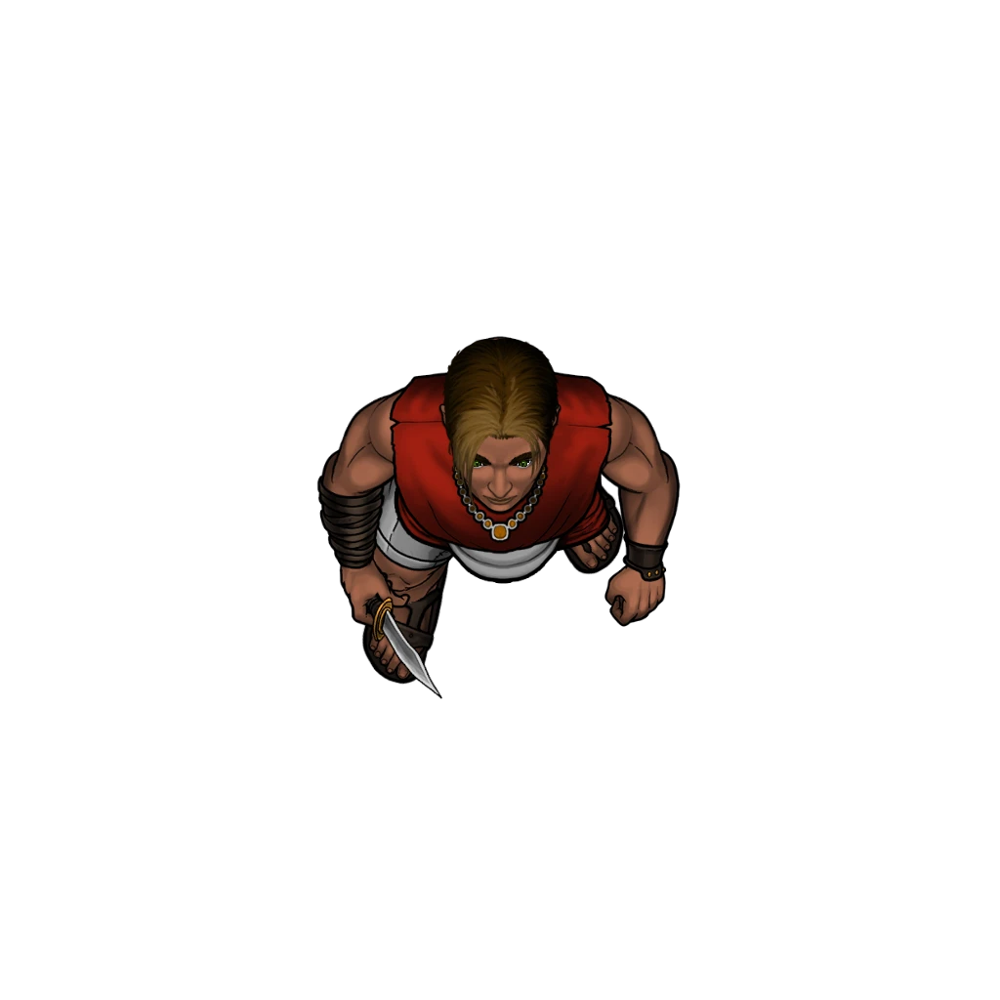
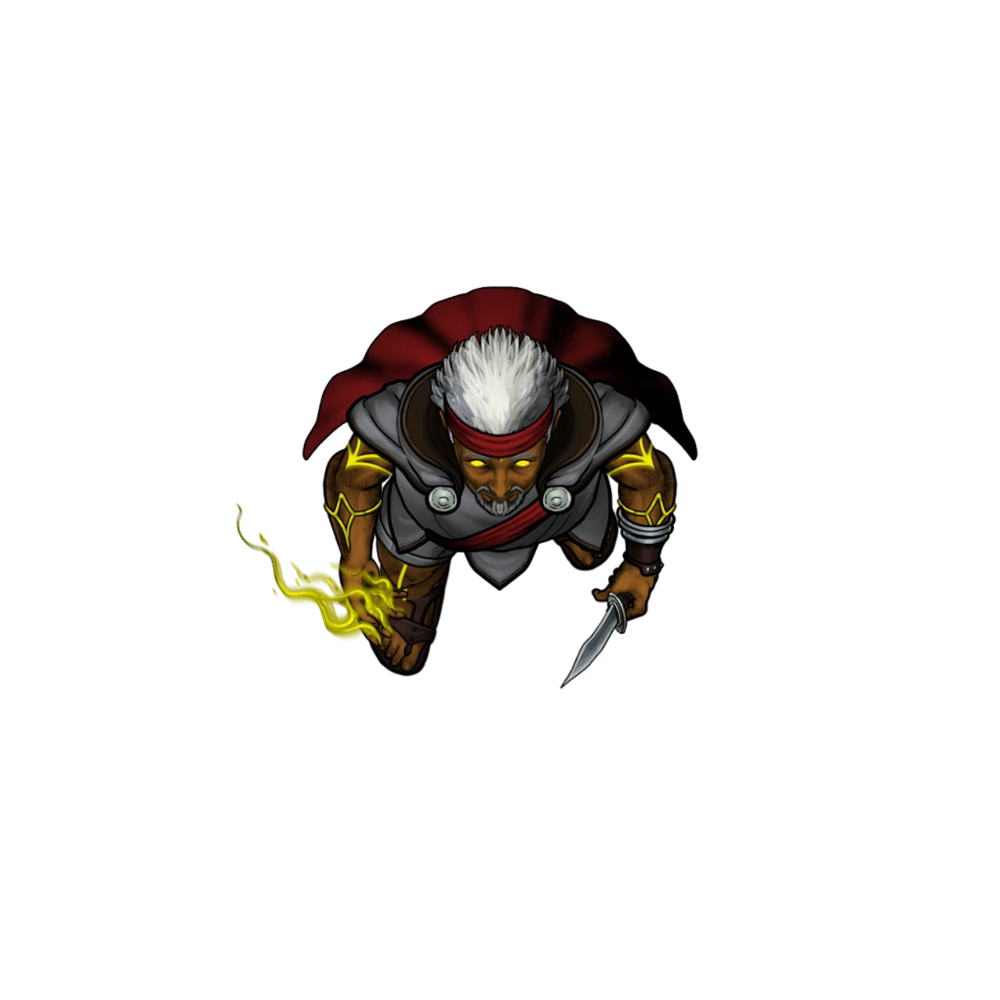
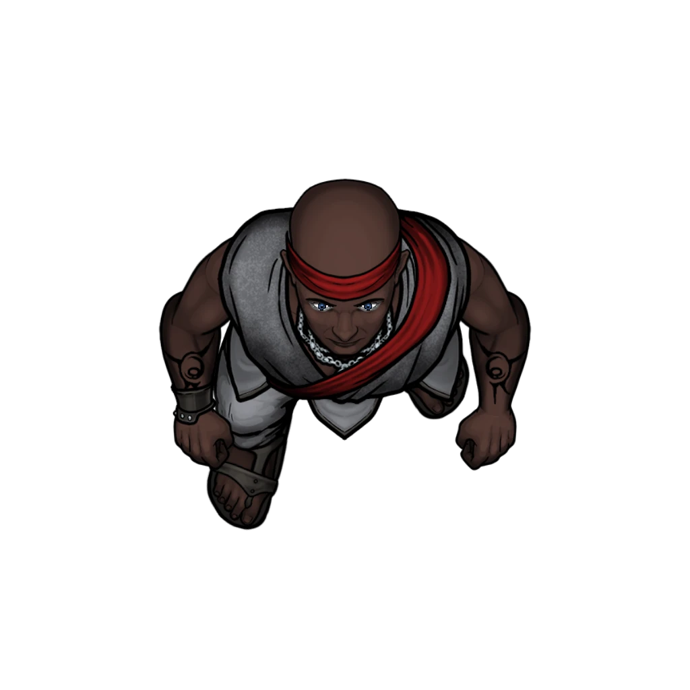

# Status Effects

> [!warning] Gamemaster
> #### Gamemaster's Summary
>
> This Combat Event brings the party to the [[Smokerie]] district of Ordain, where they must infiltrate [[Pit Trap]] nightclub in search of Agraband Swift's nephew Jorey. In this Event, the characters can:
>
> - Gain access to The Pit Trap alongside [[Agraband Swift]].
> - Explore the nightclub's interior while searching for [[Jorey Swift]] and his Undaunted cohorts, including their leader [[Zira Hestidero]].
> - Witness Agraband's untimely murder by Zira, and survive a chaotic dance floor battle against her Undaunted Adepts while she escapes.
> - Investigate Agraband's mysterious resurrection after the smoke clears.
>
> #### Prerequisites
>
> [[Agraband Swift]] must be a member of the [[Party]] for this Event to occur.
>
> #### Area Walkthrough
>
> The party begins in the [[The Pit Trap]] Scene, where the central gameplay of this Event transpires. A complete room-by-room description of the club environment and the gameplay that occurs there is detailed in the [[Pit Trap]] Area Walkthrough.
>
> In addition to the details provided in the Area Walkthrough, there are two key moments during exploration of the venue where Event-specific gameplay should occur:
>
> 1. When the party interacts with the doorman Marth Holbrook from the [[Front Alley]] to gain access to the [[Entrance]] area.
> 2. When the party spots Jorey and Zira from the [[Dance Floor]], and Agraband attempts to gain access to the [[Private Mezzanine]].

### Casing the Joint

Once they gain entrance to The Pit Trap's interior, Agraband and the party must survey the scene in an effort to locate Jorey and The Undaunted. Read the following aloud as the characters make their way through the front foyer:

> [!quote] Read Aloud
> As soon as you step through the front door, you find yourself shoulder-to-shoulder with other patrons of this moody dance hall, who all come, go, and linger with supreme leisure or unbridled enthusiasm. A cacophony of dance music and idle chatter consumes this place, which pulses with life — a kind of frenzied, unapologetic abandon that sways to the rhythm of human connection, rife with kinetic heat and sexual tension.
>
> Making your way into the main room, you notice unmistakable smells of illicit substances alongside the musky reek of sweat and the sweetly acrid scents of alcoholic libations. There are so many people packed into this warehouse, it will be a miracle if you can actually find young Jorey Swift among them.

> [!tip] Exploration
> #### Reading the Room
>
> Any character with a `[[/skill perception 20 passive format=long]]` or who makes a successful **Awareness (DC 18)** check is able to spy a young man that matches Jorey's description in the VIP section of the club, which is situated on the northern catwalk.

> [!info] Social
> #### Gathering Information
>
> Alternately, the first character who makes a successful **Awareness (DC 16)** check while gathering information from the crowd is able to learn about Zira and The Undaunted's regular placement in the VIP section.
>
> - **Knowledge: Intrigue**: The character gains **+2 Boons** on this check.
> - **15 gp Bribe:** The character gains **+2 Boons** on this check.

> [!abstract] Zira Hestidero
> **[[Zira Hestidero]]**
>
> Level 1 · Unknown Unknown
>
> 

> [!abstract] Jorey Swift
> **[[Jorey Swift]]**
>
> Level 1 · Unknown Unknown
>
> 

> [!abstract] Undaunted Adept
> **[[Undaunted Adept]]**
>
> Level 1 · Unknown Unknown
>
> 

> [!abstract] Undaunted Trainee
> **[[Undaunted Trainee]]**
>
> Level 1 · Unknown Unknown
>
> 

### Murder on the Dance Floor

As Agraband and the party make their way towards the [[Private Mezzanine]] section of the club, Zira Hestidero intervenes — setting the characters on a most unexpected course of action. During the altercation, Agraband is slain, and Zira subsequently makes a hasty escape while four of her Undaunted Adepts soak up the damage.

> [!warning] Gamemaster
> #### Music: The Pit Trap (Intense)
>
> When Agraband begins his confrontation, trigger the intense arrangement of the Pit Trap music:  **Music: The Pit Trap - Intense**
>
> This track can also be used to overwrite the default combat music if the GM prefers to keep the Pit Trap theme playing once combat breaks out.

> [!quote] Read Aloud
> After spotting Jorey on the far side of the venue, Agraband turns to you with a measure of assurance.
>
> > Those rascals on the mezzanine must be the Undaunted, and I'd wager the comely lass with the buzz cut is Zira Hestidero, their infamous captain. She looks like a reasonable lady to me. And a stranger is just a friend you haven't met, right?
> >
> > Give me a moment. I'd like to say hello to Jorey myself, and perhaps we can simply be done with this business, once and for all.
>
> Agraband pats you on the shoulder and approaches the mezzanine steps, ascending after a brief word with a bouncer who mans the velvet rope. As Agraband makes his way to their executive table, Zira stands to greet the bard with a level of confidence that borders on abject hubris. You subtly inch closer yourself, but two Undaunted bruisers who stand guard here tighten their ranks, keeping you squarely on the far side of the velvet rope for the time being.
>
> As Zira and Agraband meet, the self-assured athlete embraces your ally like a long-lost family member. Jorey looks on with quizzical anticipation, a measure of uncertainty on his face. Following the embrace, Zira whispers something into Agraband's ear; but the muted conversation is simply too far away for you to hear a word. Even if you could read lips, Zira's mouth is hidden behind the folds of Agraband's cloak. If only you could see the bard's face to get some kind of read on the moment …
>
> As you strain to look more closely at this furtive exchange, a stupefying gout of blood sprays across Zira's face. With a forceful kick, she sends Agraband tumbling backwards over the mezzanine rail. His body hits the dance floor, and the crowd around you erupts in chaos. A manic frenzy consumes the nightclub, and Zira slips away in the blink of an eye as her Undaunted cohorts step forward to bar your way.

> [!danger] Hazard
> #### Fight!
>
> Combat breaks out between the party and the 4 [[Undaunted Adept]] who are present here. Zira is ushered out of the club by the Undaunted Initiates as combat begins — they are impossible to track down or locate, no matter how the characters attempt to do so. Additionally, Agraband has been slain, acting as a dead character for the duration of the fight (see "Aid for Agraband" below for more details).
>
> #### Undaunted Adept Tactics
>
> The 4 [[Undaunted Adept]] have **+2 Boons** on their initiative rolls, and employ effective teamwork to take down their opponents.
>
> At the start of combat, at least 1 of the Undaunted Adepts will cast the [[Hold Person]] spell in an effort to help Zira escape, targeting characters closest to the Private Mezzanine section and the location's various exits. At least 1 of the Undaunted Adepts will target multiple characters with the [[Bane]] spell in an overt attempt to hinder their effectiveness.
>
> Over the course of combat, the Undaunted Adepts will prioritize the following actions and abilities:
>
> - In melee, the Undaunted Adepts will take advantage of their [[Lethal]] and [[Pack Tactics]] features to maximize damage dealt by their [[Dagger]].
> - From range, the Undaunted Adepts will cast [[Eldritch Blast]] to damage enemies, or [[Hex]] on enemies they anticipate will engage in melee on the following round.
> - Whenever able, the Undaunted Adepts will use improvised weaponry and the Scene terrain to their advantage (including the crowd of [[Ordani]] patrons).
>
> These four Undaunted Adepts who remain to combat the party will fight to the death, driven by the Shard God Ku'arta's discipline of dangerous brinksmanship.

> [!tip] Exploration
> #### Aid for Agraband
>
> The characters may attempt to rescue, heal, or diagnose Agraband during the course of combat, but their efforts are ultimately ineffective. Characters who take a moment to examine the wound can assess some of the following details.
>
> Any character who makes a successful **Awareness (DC 15)** check determines that Agraband is not breathing, and has likely perished from his multiple wounds.
>
> - **Knowledge: Forensics**: The character gains **+2 Boons** on this check.
> - **Adjacent to Agraband:** The character gains **+2 Boons** on this check.
>
> Any character who makes a successful **Medicine (DC 13)** check can readily tell that Agraband has already died from his fatal wounds (including the laceration and the fall), and cannot be healed or stabilized.
>
> - **Knowledge: Forensics**: The character gains **+2 Boons** on this check.
>
> Healing and stabilization spells or spell-like abilities (including magic items) have no effect on Agraband's condition. Only the [[Reincarnate]], [[Resurrection]], [[True Resurrection]], and [[Wish]] spells have the power to bring Agraband back from this certain death (all of which are out of the party's reach).
>
> Any character who makes a successful **Arcana (DC 15)** check can corroborate these details, recognizing the subtle presence of some curious metaphysical process.
>
> - **Knowledge: Souls**: The character gains **+2 Boons** on this check.

### When the Smoke Clears

Once the Undaunted Adepts have been defeated in combat, the battle concludes, and another revelation awaits the party: Agraband lives! Read the following aloud when the time is right:

> [!quote] Read Aloud
> You take a moment to assess the situation … The Undaunted thugs lay defeated before you. Scattered patrons and Pit Trap employees poke their heads out to survey the damage. Meanwhile, Zira and Jorey are nowhere to be seen.
>
> An unexpected voice breaks the silence as Agraband stirs back to life.
>
> > I feel like I missed something.
>
> The old bard coughs and struggles to get to his feet. As he does, you expect a flood of crimson fluid to pour out from his wound. Instead, a flood of pale light spills into the room, pulsing from the jagged laceration like a star in the night sky.
>
> > Correct me if I'm wrong, but I don't think this is particularly normal.
>
> Agraband looks to you in hazy disbelief and goes weak in the knees, overwhelmed with lethargy.

> [!tip] Exploration
> #### Agraband's Condition
>
> With the heat of battle no longer a distraction, the party can attempt to examine Agraband once more. The characters don't quite understand that Agraband has become [[Soulbound]] at this time, but they might have an inkling that his condition is related to mystical matters of the body and soul — these details are easy to perceive, but hard to comprehend.
>
> Any character who makes a successful **Medicine (DC 12)** check can readily tell that Agraband still needs traditional healing to fully recover from his injuries, but remains baffled by the true nature of the strange, lambent knife wound. Although he was momentarily unconscious (if not confirmed to be dead), he is back on his feet of his own accord.
>
> - **Critical Success**: The character posits that a professional healer might be the best course of action to ensure Agraband's timely recovery.
>
> Any character who makes a successful **Arcana (DC 15)** check is confident that the wound is magical in nature, but is unaware of the specific arcane qualities that such a wound might have. The character posits with some assurance that only the most powerful spells known to magic-users will be able to illuminate the realities of this arcane mystery.
>
> - **Knowledge: Souls**: The character gains **+2 Boons** on this check.
>
> Any character who makes a successful **Arcana (DC 12)** check has no insight to offer about Agraband's situation, but is fully aware of the fact that death is the domain of [[Sockets]], the elder god of souls.
>
> - **Knowledge: Legends**: The character gains **+2 Boons** on this check.
> - **Knowledge: Souls**: The character gains **+2 Boons** on this check.
> - **Critical Success**: The character has heard tales about a legendary priest of Sockets who lived well beyond his years to finish a specific crusade, but details about this undying hero are scant.
>
> #### Gathering Evidence
>
> Any character with a `[[/skill insight 12 passive format=long]]` or who makes a successful **Deception (DC 14)** check is able to identify the value of gathering some evidence of the altercation that happened here today. Worthy pieces of evidence include:
>
> - A crimson [[Sash of the Undaunted]] looted from one of the defeated enemies.
> - A rune-marked [[Focus Stone]] looted from one of the defeated enemies.

> [!info] Social
> #### Gathering Information
>
> The party might also want to ask any remaining patrons or Pit Trap employees about what transpired here (including where they might find Zira and other members of The Undaunted). However, the patrons and the staff are equally unhelpful.
>
> Any character who makes a successful **Awareness (DC 15)** check while spending at least 15 minutes canvassing the Pit Trap for information is able to turn up the following:
>
> - The Undaunted are scheduled for a match of the Solar Games later this week at Grand Kalion Stadium.
> - Nobody knows where Zira and the other Undaunted athletes reside, and people who ask too many personal questions about the group tend to find themselves on the wrong side of Zira's discretion.
>
> - **Knowledge: Intrigue**: The character gains **+2 Boons** on this check.
> - **Knowledge: Legends**: The character gains **+2 Boons** on this check.

### Concluding the Event

> [!warning] Gamemaster
> #### Next Steps
>
> The most natural course of action is for the party to take Agraband to one of Ordain's most esteemed Healing Houses. Agraband (or one of the characters) suggests they head to Traveler's Rest in Westgate, close to where the Strayhearth Caravan is parked outside the city gate.
>
> The party must quickly travel to [[Traveler's Rest]] in the [[Westgate]] district of Ordain, triggering the [[Swift Healing]] Event.
