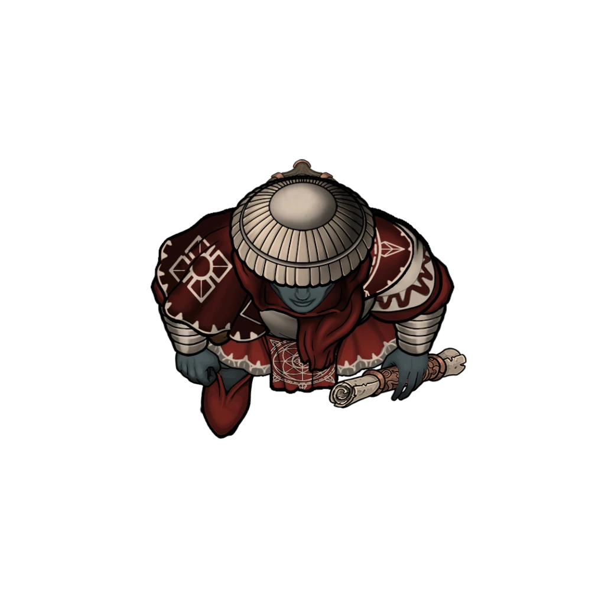

# Swift Healing

> [!warning] Gamemaster
> #### Gamemaster's Summary
>
> This Exploration and Social Event takes place at [[Traveler's Rest]] within the [[Westgate]] district of Ordain, where the party attempts to help [[Agraband Swift]] receive some timely healing after the deadly encounter in [[Status Effects]]. In this Event, the characters can:
>
> - Pay for assorted healing services from the [[Cindaric Sages]] who operate Traveler's Rest, including help for Agraband.
> - Gather some general details about Agraband's [[Soulbound]] condition, including some brief research in the [[Library]].
> - Speak with the various [[Cindaric Sage]], [[Cindaric Adherent]], and patrons of Traveler's Rest in search of useful information.
>
> #### Prerequisites
>
> [[Agraband Swift]] must be a member of the [[Party]] for this Event to occur.
>
> #### Area Walkthrough
>
> The party begins in the [[Traveler's Rest Healing House]] Scene, where the central gameplay of this Event transpires. A complete room-by-room description of the healing house environment and the gameplay that occurs there is detailed in the [[Traveler's Rest]] Area Walkthrough.

### Aid for Agraband

The party escorts [[Agraband Swift]] to the nearby [[Westgate]] district, where the healing house known as [[Traveler's Rest]] is likely to have the medicines he needs and the professionals to administer them.

When they reach Traveler's Rest, the party enters via the [[Main Office]], where a Cindaric attendant awaits the arrival of visitors and patients in need.

> [!abstract] Cindaric Adherent
> **[[Cindaric Adherent]]**
>
> Level 3 · Human Cindaric Initiate
>
> 
>
> This scholarly healer is clad in garments of bright gold and lush crimson, the colors of the famed Cindaric Sages of the Arctus Plateau. Their shoulders and tunic are marked with the familiar four-leafed diamond that signifies the Cindaric order, and their hands are marked and calloused by the wholesome abrasions of honest labor. The sage regards you with a benevolent smile.

> [!info] Social
> #### Cindaric Hospitality
>
> The young Cindaric on duty here is **Sefton Smythe** (Lawful Good, Ordani Human, he/him), a studious-but-scatterbrained Cindaric Adherent who is well on his way to becoming a proper sage. While the party waits for the arrival of a sage, Sefton can assist them with a brief discussion on a variety of topics, including (but not limited to) the following:
>
> - The services provided at Traveler's Rest.
> - The role of the Cindaric Sages throughout Ordain, including their various bases of operation (like Cindarin Temple and other Healing Houses).
> - His personal journey as a Cindaric, which is actually a family legacy handed down from his father (and his father before him).
>
> **Healing Services**
>
> Traveler's Rest offers a variety of magical and mundane healing services, including an array of spellcasting with costs as described in the [[Lifestyle Expenses]] section of the basic rules. Spells the Cindaric Sages are known to cast for their patrons include:
>
> - [[Resistance]]
> - [[Cure Wounds]]
> - [[Detect Poison and Disease]]
> - [[Healing Word]]
> - [[Lesser Restoration]]
> - [[Protection from Poison]]
> - [[Dispel Magic]]
> - [[Protection from Energy]]
> - [[Death Ward]]
>
> Lodging at Traveler's Rest under the benevolent care of the Cindarics provides the benefits of a Comfortable lifestyle at the cost of 3 gp per day.
>
> - Any character who takes a Long or Short Rest while lodging here gains **+2 Boons** on their next saving throw.

After roughly 3-5 minutes have passed, the party will be joined by an experienced Cindaric Sage named **Thessandra Vale** (Neutral Good, Ordani Kivahr, she/her), a matronly healer who tends to dish out her timely advice with a heavy dose of pragmatism.

> [!quote] Read Aloud
> Moments later, another Cindaric steps into the room, bringing an air of calm with her. This lithe Kivahr woman is clad in the fineries of a Cindaric Sage, and she addresses your group with the tranquil assurance of a practiced healer.
>
> > Whatever ailments have brought you here, we greet you with open arms and a readiness to serve. Tell me, how can we help you during this time of need?
>
> Agraband dutifully stands and pulls his tunic to one side. The light from his injury spills out into the office, and the sage — at once measured and sedate — grows as wide-eyed and incredulous as young Sefton beside her.
>
> > Come with me. Let's take a closer look at you.

> [!abstract] Cindaric Sage
> **[[Cindaric Sage]]**
>
> Level 8 (Elite) · Human Cindaric Sage
>
> 
>
> This scholarly healer is clad in garments of bright gold and lush crimson, the colors of the famed Cindaric Sages of the Arctus Plateau. Their shoulders and tunic are marked with the familiar four-leafed diamond that signifies the Cindaric order, and their hands are marked and calloused by the wholesome abrasions of honest labor. The sage regards you with a benevolent smile.

> [!info] Social
> #### The Sage's Examination
>
> Thessandra leads Agraband and any interested party members towards the Infirmary, where she helps Agraband lie down for an examination. Sefton aids her in these efforts, while gathering a few medical accoutrements for imminent use.
>
> Thessandra's 15-minute analysis of Agraband's confounding wounds is brief but thorough. Ultimately, she's able to offer very little insight into the precise cause for this rare, supernatural condition. Some key learnings include:
>
> - After an application of the [[Cure Wounds]] spell (and [[Lesser Restoration]] for safe measure), Agraband's wound is effectively healed.
> - A peculiar aura of radiant magic surrounds Agraband, but it isn't nearly as potent as the nimbus of eldritch energy that would typically identify the undead.
> - With no recourse via physical medicine, Thessandra eventually posits that an alternative solution may be found among the various priests and clerics of Ordain's [[Temple Ward]].
>
> Furthermore, because the Cindarics can't provide more substantial aid to Agraband (with measurable results), they only require a payment of 50 gp for the Cure Wounds spell. The other immediate care they provide him is free of charge.
>
> A few specific dialogue options for Thessandra are provided below.

> [!question] Q&A
> **Q:** Your Story?
>
> **A:**
>
> The sage continues working as she speaks, her eyes on the matter at hand.
>
> > Thessandra Vale, at your service. I've been mending wounds here at Traveler's Rest for the better part of six years. And I've never seen anything quite like this …
> >
> > I make it a point to not ask our patrons too many unnecessary questions about how or why they end up in our care here, but a few details usually go a long way. If you'd like to share.
>
> The silence lingers as she waits for any insight you might have to offer.

> [!question] Q&A
> **Q:** Agraband's Wound?
>
> **A:**
>
> She proceeds to study the bard's injury with supreme focus.
>
> > By all accounts, this wound should have been fatal. Your perseverance is an inexplicable conundrum, Master Swift! I've mended your flesh as much as possible, and cast out any lingering poisons, but this luminous scar of yours endures — and is no doubt supernatural in its nature. I fear there is something elusive at work here that my magic can't deter.

> [!question] Q&A
> **Q:** Necromancy and Reviled Magic?
>
> **A:**
>
> She shoots you a sharp glance, full of scrutiny.
>
> > Spells that draw upon the power of the Abyss or the corruption of undeath are abhorrent to the natural order of things. They have no place in Ordain, or elsewhere for that matter. I trust you understand the dire perils of necromancy, and the evils it portends.

> [!question] Q&A
> **Q:** Other options?
>
> **A:**
>
> > I regret we can't provide you with more explicit answers about this condition of yours, Master Swift. It sits somewhere beyond the ken of our understanding, and I've seen quite a few ailments in my time.
> >
> > The presence of a radiant aura is most puzzling. Perhaps you might consider a visit to Temple Ward, where the places of worship are full of priests and clerics with greater acumen about such things. Seek out Conaris Haid at the Temple of Sockets, but mind the old fool's madcap ways.

### In Pursuit of Answers

During or after Agraband's treatment, the characters can explore Traveler's Rest in search of information — whether regarding Agraband's condition or the lingering concern of Jorey's alliance with Zira Hestidero and The Undaunted.

> [!tip] Exploration
> #### Gathering Information
>
> Any character who makes a successful **Awareness (DC 13)** check while speaking with the Cindarics or patients of Traveler's Rest can obtain one of the following pieces of information (roll `[[/roll 1d4]]` to determine):
>
> 1. The Undaunted compete twice a week in the Solar Games at Grand Kalion Stadium: Wednesdays and Saturdays, during daytime hours.
> 2. The Undaunted have a reputation for playing exceptionally rough, pushing their opponents (and the rules) to the limit.
> 3. The competitions at Grand Kalion Stadium weren't always as civilized as they are now; bloodsport was commonplace in the arena long ago.
> 4. Zira Hestidero is known for burning bridges, and has lost a few friends on her way to the top.
>
> - **Knowledge: Crime**: The character gains **+2 Boons** on this check.
> - **Knowledge: Intrigue**: The character gains **+2 Boons** on this check.
>
> #### Hitting the Books
>
> Alternatively, the party can search the various tomes located in the Traveler's Rest [[Library]] for medical and/or spiritual answers about Agraband's condition.
>
> Any character who takes at least 30 minutes to search the library and makes a successful **Awareness (DC 13)** check is able to locate one of the following pieces of information, in the following order:
>
> 1. The Elder God [[Sockets]] created Soul Transference during Creation as he believed souls should move on from their mortal lives, experience an afterlife in [[Mort'oliss]], and come to terms with their existence before finally passing on to become one with Ember itself.
> 2. [[Elder Gods]], certain [[Shard Gods]], and the progenitor species of the Inner Realms — [[Tyraphem]], [[Casia]], and [[Fiend]] — possess the ability to "claim" souls.
> 3. Followers and believers of [[Alar]]'s "Eternal Soul" concept maintain that the best way to safeguard the cosmos and an individual experience is to try and live forever instead of moving on after death.
>
> - **Knowledge: Legends**: The character gains **+2 Boons** on this check.
> - **Knowledge: Souls**: The character gains **+2 Boons** on this check.

> [!info] Social
> #### A Word with Agraband
>
> The party will likely wish to confer with their wounded ally before making any decisions about their next steps or possible courses of action. And while Agraband is certainly concerned about his own health, he's more worried about his relationship with Jorey and what the aftermath of the party's encounter at The Pit Trap might have in store for them. Topics that Agraband might wish to discuss at this time include (but are not limited to) the following:
>
> - Whether or not his supernatural wound was somehow caused by Zira herself.
> - Jorey's role in The Undaunted, considering the lengths Zira went to in order to keep him shielded from Agraband.
> - Agraband muses that, if all else fails, a visit to see The Undaunted at their next Solar Games competition might be a suitable course of action.
>
> Any character who makes a successful **Deception (DC 13)** check is able to verify the legitimacy of Agraband's claims and the honesty of his intentions.
>
> Specific dialogue options for Agraband's post-recovery conversations are detailed below, but one thing persists throughout his ongoing assessment of the situation: a pervading sense of confusion, which grows easier to manage with each new day.

> [!question] Q&A
> **Q:** Your wound?
>
> **A:**
>
> At the mention of his wound, Agraband absent-mindedly reaches out to caress the scar tissue with his fingertips, a look of contemplation streaking its way across his furrowed brow.
>
> > It's quite strange … the laceration doesn't precisely feel like any wound I've ever suffered before. It doesn't seem to hurt, at least not in a normal way. There is a dull ache, perhaps, but nothing severe.
> >
> > I recall the flash of a dagger blade, then a spray of blood as Zira did the deed. As experienced as I am with the arcane, I don't recall noticing any spellcraft or similar chicanery. But then again, the ways of illicit nightclub patrons are not my own. Maybe I simply didn't get a proper look at whatever happened up there. But I wonder what other tricks this Zira Hestidero has up her sleeves …
> >
> > Although the specialists here have come up short with explanations, I personally fear a curse or some other arcane malady has been foisted upon me by that comely scoundrel. I suppose time will tell.

> [!question] Q&A
> **Q:** What about Jorey?
>
> **A:**
>
> > I barely got a good look at the lad before the incident. And in the chaos of the moment, I failed to see him leave. Did you get a good look yourselves?
> >
> > I wonder what I must have done to incur such wrath from the boy. Absence makes the heart grow colder, it seems.

> [!question] Q&A
> **Q:** Potential next steps?
>
> **A:**
>
> Agraband regards his strange wound once more as he addresses you with a small measure of anxiety.
>
> > I suppose we should seek answers about this strange affliction, wherever we may find them. If the traditional Cindaric healers of Traveler's Rest can't afford us answers, perhaps an occult specialist or holy dignitary can.

### Concluding the Event

> [!warning] Gamemaster
> #### Next Steps
>
> Once the party has been granted enough time to scour Traveler's Rest for information, they are free to go about their business — which likely includes further investigation about Agraband's collective plights.
>
> From here, the party has two key options in their pursuit of answers: they can either venture to the Temple of Sockets in [[Temple Ward]] for the [[Answers From On High]] Event, or journey to Grand Kalion Stadium in [[Arena Ridge]] (during daytime hours) for the [[Game Day]] Event.
