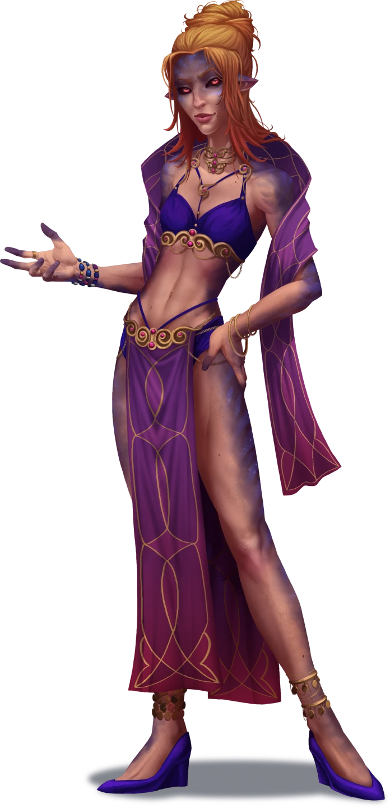

# The Old Flame

> [!warning] Gamemaster
> #### Gamemaster's Summary
>
> This Social Event takes the party to the [[Orchard Lanes]] district in southwestern Ordain, in search of a mystic known as [[Helice Korsos]], who is said to be the former lover of [[Zira Hestidero]]. In this Event, the characters can:
>
> - Visit Helice Korsos' home in Orchard Lanes, where the warlock of [[Vesper]] runs a small business as a spellcaster and fortune-teller for hire.
> - Gain Helice's allegiance by proving the virtuousness of their intentions, via both their conversation skills and one of the mystic's own auguries.
> - Learn two key details about the adventure ahead: the location of The Undaunted's hidden lair beneath Grand Kalion Stadium, and a tactic that can help them defeat Zira Hestidero in battle.
>
> This Event is depicted using the "Mystic's Apartment" Level of the [[Vista: Ordain Interiors]] Vista.
>
> #### Prerequisites
>
> [[Agraband Swift]] must be a member of the [[Party]] for this Event to occur.

### The Korsos Connection

When the Event begins, Agraband and the party have arrived at the home of Helice Korsos, a spellcaster-for-hire known for her astute divinations and abilities as an empath. Helice is also the scorned lover of Zira Hestidero, and is all-too-familiar with some of her former partner's secrets. If the characters can convince Helice that their motives are pure, the compassionate mystic may provide them with some helpful details about how to find The Undaunted's secret underground lair.

> [!abstract] Helice Korsos
> **[[Helice Korsos]]**
>
> Level 1 · Unknown Unknown
>
> 

> [!info] Social
> #### A Conversation with Helice
>
> The party is here in search of details about Zira Hestidero and The Undaunted, including precisely how and where to find them. However, Helice Korsos has no intention of telling perfect strangers about the peculiarities of her private life. If the characters want to learn about the mystic's past with Zira, they'll need to convince her to share her most intimate details.
>
> Helice is used to running a business out of her home, and is willing to entertain the standard array of questions one might expect from a potential customer. Topics of such general conversation include (but are not limited to) the following:
>
> - The characters themselves (including Agraband) and any needs they might have for professional spellcasting services.
> - Current affairs in Ordain, with an emphasis on Orchard Lanes.
> - A brief account of her history as a spellcaster, with a focus on her current pact with the Casia known as Vesper, but including details about her time as a servant of Ku'arta.
>
> Any character who makes a successful **Deception (DC 13)** check is confident of the honesty behind Helice's intentions, and understands the inviting warmth of this place to be an integral part of both her nature and her business.
>
> - **Critical Success**: There is a slight element of suspicion in Helice's eyes, countered by the assurance of her body language. She feels safe, even when a group of strangers is in her home.
>
> Any character who makes a successful **Arcana (DC 14)** check is drawn to various elements around the room: the wares and components that line the shelves, the crystal ball situated on the rear table, the curious lantern overhead, and the choker that hangs upon Helice's neck.
>
> - **Knowledge: Rituals**: The character gains **+2 Boons** on this check.
> - **Critical Success**: The lantern and the necklace are of particular interest, with subtle runes of Conjuration and Abjuration magics decorating them respectively.
>
> Any character who examines the necklace and makes a successful **Deception (DC 15)** or **Awareness (DC 15)** check identifies it as a potential gift or heirloom from Zira, based on how Helice can be seen absent-mindedly touching it each time her former lover's name is mentioned.
>
> Alternatively, any character who casts the [[Detect Magic]] spell here in Helice's apartment is able to spot the following:
>
> - Most of the potions, components, and trinkets that line the shelves here subtly radiate the various auras of nearly every arcane tradition known to Ember.
> - The spherical lantern hanging overhead in the room displays the distinct auras of Conjuration and Illusion magics (see "Safety Measures" below for more details).
> - An unassuming Crystal Ball at the back of the room radiates a strong aura of Divination magic.
> - The necklace around Helice's neck radiates a strong aura of Abjuration magic. Any character who examines the necklace and makes a successful **Deception (DC 15)** or **Awareness (DC 15)** check identifies it as a potential gift or heirloom from Zira, based on how Helice can be seen absent-mindedly touching it each time her former lover's name is mentioned.
>
> #### Down to Business
>
> If one or more of the characters ask Helice about her relationship with Zira Hestidero, she's willing to speak on subjects that are public knowledge, but a certain amount of convincing is necessary if the characters want Helice to share the information they seek.
>
> Any character who makes a successful **Diplomacy (DC 14)** or **Deception (DC 16)** or **Intimidation (DC 18)** check is able to convince Helice that their intentions are aligned with her own (perhaps by explaining the dire situation that awaits Agraband if his business remains unfinished), but they'll still need to pay homage to the spellcaster's services (see "Fortune Favors the Bold" below).
>
> - **Knowledge: Souls**: The character gains **+2 Boons** on this check.
> - **Knowledge: Undeath**: The character gains **+2 Boons** on this check.
> - **Present** [[Focus Stone]]: The character gains **+2 Boons** on this check if they present this stone to Helice, found during the [[Status Effects]] Event.
> - **Mention Helice's Necklace:** The character gains **+2 Boons** on this check if they mention Helice's necklace and can accurately describe its significance to her.
>
> Some initial answers Helice might provide for certain questions are detailed below, and hint at pertinent information that will only be elucidated upon later.

> [!question] Q&A
> **Q:** What can you tell us about Zira and The Undaunted?
>
> **A:**
>
> A forlorn look crosses the mystic's face, but only for a moment.
>
> > Zira. The name I'll never escape. There was a time when the sound of that name could stop my very heart from beating in my chest. But that time has passed.
> >
> > From the looks on your faces, it was the rumor mill that brought you to my doorstep. But I'm afraid I haven't seen or heard from Zira in well over a year. Her team, her … thugs … are precisely what this city needs them to be: dispensable. That arena is made to grind people into pulp for the amusement of others, and it isn't what I'd precisely call a "good time."

> [!question] Q&A
> **Q:** Your history as a warlock?
>
> **A:**
>
> > Indeed. A subject worth discussing with potential customers.
>
> Helice casually adjusts the choker around her neck and motions towards your surroundings.
>
> > Vesper's patronage has provided me with a good life, and my connection to her is strong. But I'd also like to think that my own arcane talents are worth the price they command. Life is harsh and unpredictable. Since adolescence, I've sought to lessen the burdens of others with my magic. The struggle need not be so strict and persistent. We're in this together, after all. But, a girl still needs to make a living …
> >
> > I have a variety of arcane enchantments, illusions, divinations and otherwise at my disposal, if you have the coin to purchase them.

> [!question] Q&A
> **Q:** About Ku'arta as an arcane patron?
>
> **A:**
>
> A mix of regret and discernment cloud her countenance.
>
> > In a previous life, I myself made a pact with Ku'arta, the great tormentor. But that pact has been severed for quite some time now, and we're all better for it.

> [!question] Q&A
> **Q:** About Vesper as an arcane patron?
>
> **A:**
>
> > Mother Mask can be a tireless inspiration for those who seek the comforts of her embrace; but her Primordial sponsorship comes with its fair share of … unexpectedness. Vesper is a wise, if sardonic, teacher. But then again, I suppose a warlock's connection to their patron is like any intimate relationship — full of cloying specificity and idiomatic regret.
> >
> > We are all unique individuals, after all, and should be treated as such. I suppose that's part of Vesper's plan for me, the proliferation of that insight, one spell at a time.

> [!question] Q&A
> **Q:** The Undaunted's secret lair?
>
> **A:**
>
> Helice stifles something between a scoff and a chuckle.
>
> > If you're looking for secrets about Zira's merry band of rogues, you've come to the wrong warlock. Zira's love of the arena is precisely why she has no place here.
> >
> > It's a massive amphitheater, built upon countless layers of old Ordain. One could get lost down there. Perhaps a divination from Mother Mask is in your near future … if you have the coin, that is.

> [!info] Social
> #### What Helice Won't Say
>
> Any character who makes a successful **Deception (DC 13)** check can readily tell that Helice is holding back some information about her relationship with Zira.
>
> - **Critical Success**: There's likely more to the topic of warlock patrons than Helice currently admits, particularly in regards to her own past with Ku'arta and Zira's current connection to the Shard God.

> [!danger] Hazard
> #### Safety Measures: Magical Lantern Trap
>
> The lantern that hangs overhead in the parlor here is enchanted with a darkness trap (plus a dimension door getaway). When the command word is spoken, the lantern releases the following:
>
> - The [[Darkness]] spell, with the table at the center of the room as the target.
> - The [[Dimension Door]] spell, with Helice as the target.
>
> Helice uses the Dimension Door spell to teleport to a safe location nearby, like a Noticerie house or the front room of the Sweet Reliefs tavern, where she can seek the timely aid of other locals.

### Fortune Favors the Bold

Helice has no intentions of sharing her most intimate secrets with the party at this time, but an element of divine intervention (via a message from her fey patron Vesper) is soon to change her mind. First, the characters must enlist Helice's standard spellcasting services — namely, by paying her for an augury or other divination. Unbeknownst to Helice and the party, this straightforward ritual will lead to a revelation.

After the characters have had a moment for pleasantries and to survey their surroundings, read the following aloud:

> [!quote] Read Aloud
> With a dramatic wave of her hand, Helice conjures a quartet of tiny magical lights, which dance about the room before drawing your attention to a crystal ball located on a rear table. The alluring warlock approaches the arcane relic and speaks:
>
> > If you seek answers, then answers we shall find. People travel miles upon miles for a glimpse at Vesper's divinations, and tend to leave with more insight than they brought with them. The prices of my services are standard, but charity has been known to grace this chamber from time to time.
> >
> > So, what manner of spell can I weave for you? An augury perhaps, if not a pure divination?

> [!tip] Exploration
> #### A Reading from Helice
>
> If the characters want more information from Helice, they'll need to pay for a professional [[Augury]] from the warlock.
>
> Helice is willing to reduce the 200 gp price of the spell for any of the following reasons:
>
> - The first character to make a successful **Diplomacy (DC 16)** or **Deception (DC 16)** check is able to convince Helice that this arcane reading is purely in service to their mutual goals, cutting the price in half to 100 gp.
>
> - **Knowledge: Rituals**: The character gains **+2 Boons** on these checks.
>
> - If the characters looted a [[Focus Stone]] during the [[Status Effects]] event, they can present it to Helice for a 100 gp discount.
> - Characters with **Attunement: Primordis** Rank 1 are favored by Vesper to benefit from the aid of her warlocks, and Helice is willing to cast the spell for a discount at 100 gp.
> - Characters with **Attunement: Primordis** Rank 2 or higher are cosmically "chosen" by Vesper to benefit from the aid of her warlocks, and Helice is willing to cast the spell for free.
> - Alternately, Helice is willing to accept a trade for a magic item of equal or greater value (with discretion).

Once the terms are settled, Helice begins her Augury ritual. Read the following aloud:

> [!quote] Read Aloud
> With one hand on her crystal ball, Helice begins to gesticulate with the other, weaving the somatic components of an augury spell as her bracelets jangle upon her lithe wrist. Strange arcane syllables escape her lips, carried by the timeless weight of magical words.
>
> The lights glow dim as the crystal ball begins to seethe with a dull arcane brilliance, and Helice addresses you directly:
>
> > Through depths of inner realms we peek to walk upon the path you seek. Tell me, what course of action do you wish to divine with Vesper's wisdom?

After the augury's omen has been revealed to the party, read the following aloud:

> [!quote] Read Aloud
> Just then, all the lights in the parlor momentarily surge with a brief and blinding intensity before all goes dim. As your eyes adjust to the shaded room, you notice that Helice is caught in some kind of seizure or episode — her eyes roll into the back of her head and she speaks with an otherworldly voice quite unlike her own, a gravelly voice that reminds you of the roar of wildfire:
>
> > Guide this bard to paths unseen, inspired by divinity.
>
> The normal light returns to the room, and Helice appears to casually shake off the episode with a deep breath and a knowing nod. She opens her eyes and addresses you once more.
>
> > Vesper has offered you a gift of divination. No cost is required for this spell. Tell me, what clarity do you seek as we turn to Mother Mask for answers?

> [!tip] Exploration
> Following the Augury (and her subsequent vision from Vesper), Helice offers to cast the [[Divination]] spell for free.
>
> Whatever the party's intentions, Agraband speaks up to recommend that they divine one of the following pieces of information during the ritual:
>
> - If they haven't managed to learn the location of the secret entrance from [[Brackus von Tet]] during the [[Early Retirement]] event, the Soulbound bard strongly advises they do so at this time.
> - Alternately, if they already possess a [[Underworks Guidestone]], Helice can ask whatever question the characters deem most important to the mission ahead.

> [!question] Q&A
> **Q:** Your falling out with Zira?
>
> **A:**
>
> > We met each other as teenagers, orphaned and alone, with hearts full of determination and heads full of daydreams. I saw something in Zira the first time I laid eyes on her. She's … immaculate. But she's also lost, adrift in her own self-righteous ambitions.
> >
> > We had a few great years together. We shared everything, our hopes, our talents, even our pact with Ku'arta. Looking back now, this thing that brought us closer together would end up being the end of us. The further Zira delved into eldritch lore and forbidden secrets, the less I came to recognize the woman I fell in love with. Victory was more important to her than our relationship; conquest, at any cost. So, I drew a line in the sand, and she walked away. I said goodbye to Ku'arta, and lost my lover along the way.
> >
> > It's no easy thing, turning your back on a shard god. And I'd wager this never-ending mess with Zira is part of my punishment.

> [!question] Q&A
> **Q:** What motivates Zira and The Undaunted?
>
> **A:**
>
> > Zira is motivated by one thing, and one thing alone: power. It's as simple as that. And the impressionable street rats on that team of hers are fools if they believe she holds any true care for them. Ku'arta is called the "God of Torment" for a reason — he's a sick bastard, who would drive an infant to bite its own mother's breast.
> >
> > And beyond her allegiance to Ku'arta, Zira has an unhealthy obsession with lore and legends about The Shattering. She had a small collection of illicit heirlooms and antiques that she obtained through questionable means, all of which reeked of bad energy. The more of those relics she brought into our home, the more I could discern a madness in her eyes. And this is a lust no lover can satisfy, I assure you.

> [!question] Q&A
> **Q:** Where to find The Undaunted's lair?
>
> **A:**
>
> Helice whispers an incantation while removing one of the marble-shaped gemstones from her necklace, which loses its luster before your very eyes.
>
> > The power of Vesper compels us. This stone will light your way.

A [[Underworks Guidestone]] is now in your possession.

> [!question] Q&A
> **Q:** Any other details?
>
> **A:**
>
> > Familiarity breeds contempt, as they say. Zira's hubris is her strongest asset, and her greatest weakness. If you can challenge her sense of pride, you may be able to manipulate her with some measure of success.
> >
> > I'd also urge you to use caution when searching any private effects of hers. My Zira loves a good trap.

> [!tip] Exploration
> #### Obtaining the Kalion Underworks Key
>
> By the end of this conversation, Helice Korsos should hand over the [[Underworks Guidestone]] to one of the party members.
>
> If the encounter with Helice goes poorly, you may choose to allow the party to attempt to steal the Kalion Underworks Key from her apartment (if they can manage to find it). A successful **Awareness (DC 16)** check is required to locate the locked jewelry box, followed by a successful **`[[/skill thief 18]]`** check or **Athletics (DC 22)** check to open it.

### Concluding the Event

> [!warning] Gamemaster
> #### Next Steps
>
> When the characters are satisfied with the level of detail they've gained from Helice (or become discouraged by their lack thereof), they're free to pursue other leads or follow up on the information they've learned here today.
>
> If the party learned the right information from Helice, they can now locate the secret entrance to Zira Hestidero's subterranean hideout in [[Arena Ridge]], triggering the [[Running the Gauntlet]] Event.
>
> Alternatively, the party can journey to the forge of [[Brackus von Tet]] in the [[Smokerie]] for [[Early Retirement]], where they'll gain corresponding information about The Undaunted's hidden lair.
