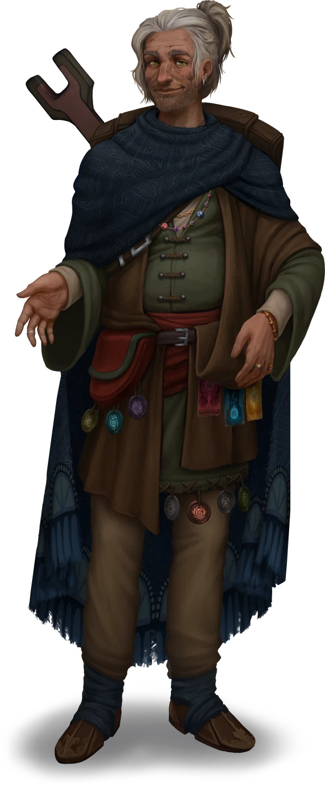

# The Troubled Caravaneer

> [!warning] Gamemaster
> #### Gamemaster's Summary
>
> This Social Event takes place within the [[Ordain Flats]], and reunites the party with their old ally [[Agraband Swift]] — who is in timely need of a security detail for a sensitive (and potentially dangerous) errand. In this Event, the characters can:
>
> - Learn about Agraband's activity since the [[Strayhearth Caravan]]'s recent arrival in [[Ordain]], along with a few details about his untold past.
> - Decide whether or not to accept Agraband's job offer, which will task them with serving as casual bodyguards during a trip to the rough-and-tumble [[Smokerie]] district.
> - Learn a few minor details about what the other members of the Strayhearth Caravan have been up to (if they've yet to do so).
>
> This Event is depicted using the "Residential Corridor" Level of the [[Vista: Ordain Streets]] Vista.

### Strayhearth Reunited

The party is approached by their ally [[Agraband Swift]] while traversing the neighborhoods of the Ordain Flats. Despite his warm nature, the old caravanner seems troubled, and is eager to catch up with them before sharing additional details regarding a furtive plight.

> [!abstract] Agraband Swift
> **[[Agraband Swift]]**
>
> Level 3 · Human Caravaneer
>
> 
>
> A lute is slung across the back of this aged human clad in an odd yet practical assortment of clothing and jewelry. The seasoned bard wears the salt-and-pepper locks of his long hair pulled back into a high half ponytail. His wide smile and calm demeanor lend him an air of experienced confidence, and a certain glint in his eye evokes the mirthful spirit of a beloved uncle. It's clear this man could spin a worthy tale at a moment’s notice.

> [!info] Social
> #### Catching Up with Agraband
>
> Agraband is eager to hear stories from the characters about what they've been up to, and is happy to indulge a few brief tales of his own. Some of this small talk includes (but is not limited to):
>
> - Where the characters happen to be lodging while in Ordain and what they've been up to.
> - A few notable Ordani landmarks, such as the many wonders of the Waterfront Bazaar in [[Flotsam]], [[Performer's Plaza]] (where Agraband first plied his trade as a bard), and any other districts the party shows interest in.
> - A couple of brief anecdotes about Strayhearth encounters along the road to Ordain, like a timely run-in with a group of refugees from northern [[Skybrush]] and a brief scuffle with a small gang of bounty hunters mounted on [[Jobri]].
>
> Additionally, the characters may be curious about what the other members of the Strayhearth Caravan have been up to in recent days (if not weeks). Even if the characters show no initial interest, Agraband himself is likely to share a few anecdotal details about various rumors he's heard regarding the sundered company — with stories about [[Lyla Cevher]], [[Sin Marmot]], [[Ankarist]], and [[Clipper]] in particular.
>
> As Agraband shares these tales of the Strayhearth compatriots, any character with a `[[/skill insight 12 passive format=long]]` or who makes a successful **Deception (DC 14)** check is able to tell that the bard is keeping something from them: a source of anxiety and consternation, somewhat unusual traits for the worldly bard.
>
> Ultimately, Agraband uses the relative scarcity of the disparate Strayhearth allies to broach a new topic of rather personal concern: a plight involving his estranged nephew, Jorey Swift. Once this shift in narrative occurs, please refer to "Agraband's Plight" below for additional details.

> [!question] Q&A
> **Q:** Your Story Since Helkas?
>
> **A:**
>
> > Our jaunt from the Forest of Stone to the marble walls of Westgate was relatively uneventful, unless we count that cadre of scurvy bounty hunters we encountered near Lake Jinro, or the group of refugees on their way from Skybrush.
> >
> > The refugees had been displaced from Skybrush on account of a freak accident that had spooked a few of its citizens, a few families on the outskirts of town in particular. We offered them passage to Ordain, and they kept mostly to themselves. Proud folks, and fine people, but humbled by their circumstances.
> >
> > The bounty hunters were another story altogether. Thankfully, Clipper was able to pacify their aggressive inclinations by offering them a discount on a few arcane baubles. We've no idea who they were really looking for, or why. And we didn't bother to ask.
> >
> > As for me, I'm happy to spend a few days back in my hometown. After all, I have more than a few travel companions to catch up with!
>
> The old bard gestures proudly to your group and smiles with familial recognition.

> [!question] Q&A
> **Q:** Lyla Cevher's Story?
>
> **A:**
>
> > It seems House Cevher has its hands full these days with an assortment of troubles. Young Lyla has no doubt been swept up in the calamities herself, buried under paperwork and bureaucracy at the House Cevher Tradeway in Quarry Run.

> [!question] Q&A
> **Q:** Sin Marmot's Story?
>
> **A:**
>
> > I understand Sin has acclimated herself to the ways of the Cindaric Sages. Life at Cindarin Temple certainly has its perks, as opulent as the old edifice is (and as well-funded as the Cindarics can be). Perhaps I should pay the sages a visit sometime. The sacred pyreflies dance in the atrium at night, and it's a wonderful sight to behold.

> [!question] Q&A
> **Q:** Ankarist's Story?
>
> **A:**
>
> > Our friend Ankarist has been able to return to his duties for the Veiled Chain. Word about town suggests some kind of pending investigation regarding a strange illness, but I've yet to discuss it with the headstrong Drakon himself.

> [!question] Q&A
> **Q:** Clipper's Story?
>
> **A:**
>
> Agraband looks off towards the city's western gate, where the Strayhearth Caravan awaits his inevitable return.
>
> > Clipper is holding down the fort, so to speak, stationed at the caravan with a few other company regulars. I know they enjoy the good banter and resourceful opportunities the city has to offer, and Westgate is a fine hub for such activity. Should you need any equipment or information that the city itself can't provide, I'm sure our gregarious Signborn friend would treasure a visit from you all.

### Agraband's Plight

Once the party has had ample time for small talk and pleasantries, Agraband shifts the focus of the conversation to more important matters at hand.

> [!quote] Read Aloud
> Agraband's mood shifts as he addresses what's obviously been lingering on his mind since you met here on the street.
>
> > Truth be told, this visit isn't entirely a serendipitous one. I've actually sought you out, friends, because I need your help. However, my situation is a clandestine one, and a little privacy is in order before I relay the circumstances of my plight. Shall we?
>
> The old bard motions towards a nearby alcove, where a few public benches are flanked by municipal decoration — hedges and statues, in particular, which seem to provide ample seclusion for your conversation.

> [!info] Social
> #### The Caravaneer's Tale
>
> Once they've reached a suitable spot for secrecy, Agraband explains his situation:
>
> - He’s journeyed to the city in search of his estranged nephew [[Jorey Swift]], an audacious young man whose life has been a series of one reckless predicament after the next following the untimely death of his mother (Agraband's sister Selena).
> - It seems Jorey's latest cavalier undertaking may be the most dangerous yet: he's joined a team of daredevil exhibitionists known as The Undaunted, participants in the Solar Games of Grand Kalion Stadium in [[Arena Ridge]].
> - Reigning champions of their sport, The Undaunted are said to welcome the lonely, the outcast, and the foolhardy to their ranks — which are led by a fierce athlete known as Zira Hestidero. In recent months, the self-destructive antics of The Undaunted have started spilling into the streets of Ordain, and Agraband fears the worst for his impressionable nephew.
> - The Undaunted are known to frequent a seedy warehouse nightclub in the [[Smokerie]] district known as [[Pit Trap]].
>
> Once these details have been shared with the party, Agraband beseeches them for aid and presents them with an offer: if they will accompany him to the Pit Trap tomorrow night as a security detail, he'll gladly pay them  **50** each for their trouble (in advance).
>
> Any character who makes a successful **Deception (DC 15)** check is able to detect the honesty behind Agraband's statements.
>
> Enterprising characters can attempt to elicit a higher payment from their old pal. The first character who makes a successful **Diplomacy (DC 16)** or **Deception (DC 20)** check is able to convince Agraband to sweeten the deal with an additional  **20** each.
>
> Additional details and dialogue regarding Jorey and The Undaunted are featured below.

> [!question] Q&A
> **Q:** More About Jorey
>
> **A:**
>
> A look of unmistakable concern rushes to Agraband's face when you mention his nephew's name.
>
> > Jorey is my only surviving relative, and — were I here in Ordain more often — I'd like to think of myself as a surrogate father for the boy.
>
> He briefly chuckles beneath his breath.
>
> > "Boy," I say, as if he's still a kid. The "boy" is eighteen years old this year, and is hardly a child these days. But it's difficult to abandon the innocence I've foisted upon him. He's already been through so much, especially after the loss of his mother (my sister, Selena, who passed away nearly two years ago). One year in a soot-stained hostel with no real family seems to have undone seventeen years of good parenting. And perhaps it's my fault.
> >
> > Jorey deserves an easy life, full of good times and people who truly care. I don't want to see these Undaunted ruffians steal that opportunity from him. I at least want to have the conversation with him, face to face. But his team of champions is somewhat inseparable, it seems.

> [!question] Q&A
> **Q:** Your Sister's Story?
>
> **A:**
>
> > Selena was the best sister a scoundrel like me could ask for. Life wasn't easy for us as children, orphaned and alone, but at least we had each other. And while I invested what I received of our inheritance into the Strayhearth enterprise, Selena would spend her own wealth on building a family here in Ordain. But the best-laid plans of mortals are wrought with ruin, and our family has dwindled once more. Selena was killed in a simple accident while I was on the road nearly a year ago.
>
> Agraband's composure slips for the briefest of moments, the only time you've truly seen this man lose his cool since you first met.
>
> > Strange things, those accidents. While Jorey was at school, Selena slipped on the wet floor and cracked her head wide open on the kitchen floor. Gone, in a flash. Such a simple and sudden and absurd way to die. I made it back for her funeral, but — like a damned fool — I hit the road again as soon as I could. And I regret not being here for her son this past year the way she was always there for me.

> [!question] Q&A
> **Q:** The Undaunted?
>
> **A:**
>
> > I'm not much of a sports enthusiast myself, but the Solar Games are important to many folks here in Ordain — not only because they're exhilarating, but thanks to the way the games are structured using teams from various districts. The element of hometown pride is important, and the Undaunted — who mostly hail from the Smokerie district — seem to have captured the heart of the entire city with their brash antics and ceaseless victories.
> >
> > Beyond that, they've gained a reputation for causing trouble in certain parts of town, including every neighborhood between Arena Ridge and their home district. Further still, members of the Undaunted are known to retire from the sport a lot quicker than athletes from other teams … for one dubious reason or another.
> >
> > Their team captain is a local celebrity of sorts named Zira Hestidero, a Maziran gladiator known for her ostentatious attitudes and bombastic arcane flourishes. Ultimately, I fear this veritable scoundrel might not be the best influence on young Jorey, and I aim to find out.

#### Akon Attunement: Accepted Agraband's Offer

If the party accepts Agraband's offer, each character advances their **Attunement: Akon (+1)** at the conclusion of the Event.

`[[/outcome swiftOfferAccepted]]`

#### Aura Attunement: Refused Agraband's Offer

If the party refuses Agraband's offer, each character advances their **Attunement: Aura (+1)** at the conclusion of the Event.

`[[/outcome swiftOfferRefused]]`

### Concluding the Event

> [!warning] Gamemaster
> #### Next Steps
>
> If the characters decide to help Agraband, they have a couple of hours to gather their effects for a trip to the Smokerie, where the dim lights of the Smokestack await.
>
> The party must travel to the Smokerie district by midnight tonight, where they will provide a security detail for Agraband while he confronts Jorey and his new cohorts during the [[Status Effects]] Event.
