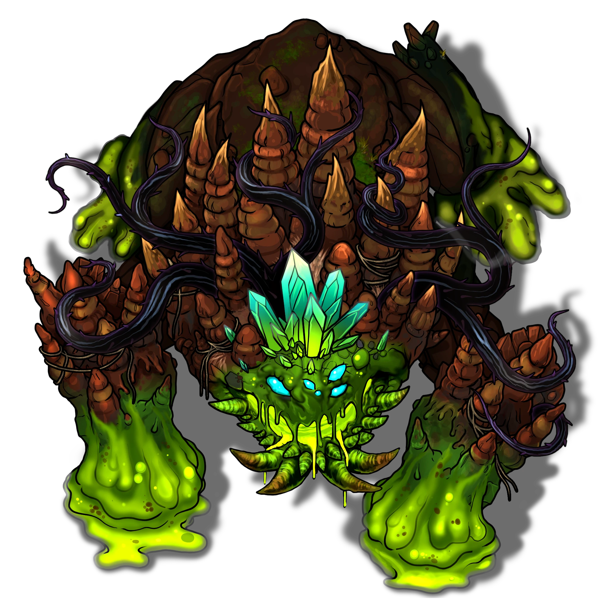

# Braving the Elements

> [!warning] Gamemaster
> #### Gamemaster's Summary
>
> This Combat Event occurs when the party rushes back to [[Ushna Dredging]] to confront the enraged stalagmaw [[Slaith]] that is threatening to escape its prison at any moment. [[Lake Orial]]. By breaking Slaith's bindings, the characters can:
>
> - Opt to free Slaith and let it rampage until [[Eamon Mariflor]] sacrifices himself to fell it.
> - Engage Slaith in an epic battle, demanding either overwhelming force or clever tactics.
> - Make a pivotal decision about whether to rebind Slaith as [[Terrane]] demands, or destroy it and send its essence back to Cora, forcing the Arctus Plateau to find a new source of agricultural abundance.
> - Discuss the ramifications of their choice with Eamon and Rala.
>
> This event occurs automatically when arriving at [[Ushna Dredging]] after completing the [[Wisdom of the Sages]] event.
>
> #### Area Walkthrough
>
> This Event is depicted using the [[Ushna Dredging Docks]] Area Map, described in detail in the [[Ushna Dredging Docks]] Area Walkthrough — though the extraordinary circumstances leave the docks clear of its usual Ushna inhabitants.

### Unbinding Slaith

To unbind the gargantuan monstrosity, the party need only submerge [[Terrane's Severing Shard]] in the silt of the lake bed. Eamon announces his intention to stand and fight alongside the party, while Rala rushes to the aid of his family and helps shuffle the last of the Ushnas away from the dock before the battle begins.

### Freeing Slaith

If the party frees Slaith's bindings, but chooses not to fight the terrible creature, instead letting it roam free and wreak havoc, read or paraphrase the following:

> [!quote] Read Aloud
> Without you there to stop it, the towering monstrosity emerges from the lake, and begins stomping the Ushna family home to pieces. Seeing no one there to stop the beast, Eamon Mariflor himself rushes to confront it, shouting and waving for bystanders to clear the way as he prepares his magic.
>
> Before long, Eamon's desperate stand becomes visible to everyone within miles of the lake. Storm clouds gather overhead, and lightning careens down from the sky, all traveling to the same point. For a moment, there is quiet. Then, a blinding flash of yellow and green explodes outward from where Eamon was last seen, with a sound like a thunderclap, earthquake, landslide, and hurricane all overlapping on a single point in space. For a time, nothing can be seen or heard behind the dazzling lights and cacophony of elements. Then … nothing.
>
> Where once there was Slaith, towering over the docks, there is now only shattered pieces of stone and earth, and around them, a crater. Eamon is nowhere to be seen. Slowly, cries of pain and anguish fill the empty air. Before long, Rala emerges, cradling a limp body.
>
> > Eamon … is gone. And my father …
>
> He bites his lip until it bleeds, and tears flow from his face as he stares down at the corpse he carries, before looking back up to you.
>
> > Go. Leave this place. Your cowardice, or villainy, or whatever it is that led you to abandon us, will be remembered for all time. At least … by those of us who survive.
>
> He is seized by wracking sobs, and has no interest in further dialogue with you.

Mark the following Event Outcome:

`[[/outcome freed]]`

With Slaith and Eamon dead, and the party shunned, the story of Disturbed Earth ends here.

#### Abyss Attunement: Slaith Freed

If the party frees Slaith, all party members advance their**Attunement: The Abyss (+1)** at the conclusion of the Event.

### Battling Slaith the Stalagmaw

If the party opts to fight Slaith, the battle begins as the creature hauls itself out of the waters of Lake Orial and moves implacably towards the shore, summoning minions to precede its advance.

> [!abstract] Slaith
> **[[Slaith]]**
>
> Level 12 (Boss) · Stalagmaw Gorger
>
> 
>
> This immense elemental is a heaving mass of slime and gray mud only vaguely shaped like some crawling titan with four limbs and a dripping maw of blackness. Ropes of corrupted sludge drag between its limbs and spill from cracks in its body. Its face is a crude, shifting thing, with hollow pits for eyes and a wide, sagging maw that leaks foul mud wherever it turns. The air around it smells of rot and sickness, and every movement leaves the ground stained, and poisoned in its wake.

> [!danger] Hazard
> #### In the Shadow of the Colossus
>
> Slaith begins in the water to the northwest of the dock, with 2 [[Obsidian Vine Outgrowth]] upon the lakeshore and 3 [[Mud Globlin]] thrown forward to lead the attack.
>
> #### Slaith Tactics
>
> Slaith is a violent servant of Slinerak, made bitter by centuries of imprisonment. It attacks without reservation and targets whoever most threatens its newfound freedom. During combat, Slaith exhibits the following behaviors and tactics:
>
> Each round, Slaith uses the [[Colossus of Slinerak]] talent in at least one of the following ways:
>
> - Slaith will use **Befoul Waters** to create a section of silt and mud infused with the power of Slinerak in one of four predetermined sections of the Area Map.
> - While standing within or adjacent to an active Region of Befouled Waters, Slaith uses either **Hurl Globlin** or @Action[Actor.tOoLvpL31LmVGQnx slinerakShapeClodmarl] to fashion a new elemental from the sludge, which joins the combat at Initiative count 1.
>
> Slaith has an impressive arsenal of features with which to threaten the party. As a powerful boss with advanced capabilities, we recommend taking time to familiarize yourself with its entire action set before combat. On its turn, Slaith prioritizes using:
>
> - **Extrude Vines** to position up to 2 [[Obsidian Vine Outgrowth]] on land to harass characters who linger by the shore.
> - **Crushing Leap** to suddenly relocate with a concussive blast that damages a group of clustered enemies.
> - When engaging a single foe, Slaith uses a combo of **Restraining Chomp** and **Thrash** to deal damage and leave the target **Restrained**, optionally adding **Headbutt** to further leave them **Staggered**.
> - Slaith is empowered with earthen magic from Slinerak, and will **Cast Spell** with **Coran Earthen Pulse** or **Coran Earthen Surge** to damage and Stagger enemies.
> - Accumulate Heroism as the battle progresses to unleash a devastating **Graviturgic Crush** attack, forcing enemies to cluster and become vulnerable to area-of-effect attacks.
>
> Outside if its turn, these additional features affect how Slaith behaves on the battlefield:
>
> - **Aftershock** to retaliate against creatures who attempt to attack it in melee.
>
> Terrane's magic prevents Slaith from feeling the battlefield using **Submerging Withdrawal**. If Slaith becomes threatened with death or re-imprisonment, it attacks ever more viciously, prioritizing any target that is most likely to constrain its freedom.
>
> #### Globlin and Clodmarl Tactics
>
> The [[Mud Globlin]] and [[Clodmarl]] that Slaith shapes using its Legendary Actions obey Slaith's commands instinctually, caring nothing for their own safety. More details on their tactics are presented in the earlier Event [[Muddy Waters]].
>
> #### Obsidian Vine Outrgowths
>
> The [[Obsidian Vine Outgrowth]] that Slaith extrudes are extensions of Slaith's own form and are directly under Slaith's control, although they have their own separate health pool and Initiative. Slaith uses them to harass spellcasters or ranged attackers, ideally forcing them closer to Slaith. More details on Obsidian Vine Outgrowth tactics are presented in the earlier Event [[The Root Issue]].

Slaith is a formidable foe, but the heroes have several tools at their disposal that can aid them during this climactic battle. Both [[Eamon Mariflor]] stands beside the heroes unless they forbid him from joining them. Additionally, an attentive party can use the environment of the Ushna Dredging Docks to counter some of Slaith's capabilities.

> [!danger] Hazard
> #### Purge the Water!
>
> Four storage tanks are mounted to the Dredger Docks, each holding nearly 4,000 gallons of a mixture of water and silt pumped up from the lakebed, awaiting refinement. The tanks are initially full. Each tank can be individually purged by activating a discharge valve, sprays the contents back into the lake. This discharge can disperse a section of Befouled Water that Slaith has created, nullifying Slaith's ability to shape elementals in that location.
>
> #### Drop the Claw!
>
> At the end of the crane is a great dredging claw that can be positioned using the tower crane and dropped on Slaith to break his crystalline crown. A character must expend an Action to rotate the crane and position the claw somewhere within the ring-shaped [[Dredging Claw]] region depicted in the Scene. Once positioned, the claw may be instantaneously dropped using an object interaction.
>
> If Slaith is directly underneath the claw's position, its crystalline crown is struck and breaks, causing Slaith to become **Stunned** until the end of its next turn. Furthermore, if the crown is broken, Slaith may no longer use **Graviturgic Crush** until the crystals regrow — a process which requires one week of time.
>
> #### Break the Crystals!
>
> Alternatively, the party can break the crystalline crown by mounting the beast's head — by running along the crane and leaping, using the [[Antigravity Stone]] from Terrane, or any other method — and making a single successful melee strike against Slaith, which lands on a fragile fault at the base of the crystals and produces the same effect as dropping the Dredging Claw.
>
> #### Eamon Mariflor Tactics
>
> Eamon Mariflor stands beside the party to face the earthen colossus. During combat:
>
> - He uses **Cast Spell** to attack elementals which threaten the party's backline.
> - If Slaith manifests a section of Befouled Water that the party does not clear on their own before Eamon's turn in the subsequent Round, Eamon will clear it himself by casting the **Icy Surge** spell.
>
> On his turn after seeing Slaith fashion at least one elemental from the befouled mud of Lake Orial, Eamon will shout out advice to the party:
>
> > Purge the befouled mud before it can be shaped into yet more elementals!
>
> Similarly, after observing Slaith use **Graviturgic Crush**, he will loudly shout:
>
> > I believe it's controlling gravity with those crystals on its head. Smash them! Use the claw!
>
> If **Weakened** or **Broken**, Eamon tries to disengage from whatever is actively attacking him and to seek cover within one of the nearby buildings — though Eamon will not flee the battlefield entirely, and continues to provide supportive magic.
>
> Even if Eamon is incapacitated, it is recommended the Gamemaster not allow him to die, as his actions are important to the remaining story of "Disturbed Earth." However, the Gamemaster may choose to allow it, if they are prepared to improvise the Quest's resolution.
>
> #### Rala Ushna Tactics
>
> While Rala does not appear directly as an Actor in the Scene, as he is busy helping the Ushnas get farther from the docks, if the party is in danger of losing the combat, the Gamemaster may optionally have him contribute supportive magic from afar — using **Cast Spell** with the Life rune to revive downed party members.

### Deciding Slaith's Fate

Once Slaith has been defeated, it is time for the party to decide what to do with the colossal creature. Before they make their decision, they are approached by an exhausted-looking Eamon with thoughts to share. Read or paraphrase the following:

> [!quote] Read Aloud
> A bedraggled Eamon hails you from inland.
>
> > Thank you for taking down that terrifying beast, and letting Rala and I focus on protecting the Ushnas. I suppose only one task remains …
>
> A troubled look crosses his face as he looks out at the collapsed body of Slaith.
>
> > I must say, my feelings on the matter have settled. The purpose of the agrimages is to support life on the Plateau in harmony with the natural world. Corrupted as Slaith may be, to imprison and siphon such a creature for all time … it goes against everything we stand for. I believe the beast must be sent back to Cora where it belongs, for the Corans to deal with as they will.

If the party has not convinced Terrane to take Slaith's place and continue to enrich Lake Orial, Eamon adds the following:

> [!quote] Read Aloud
> > As for the Plateau, I firmly believe that by interweaving science and magic — innovation and tradition — the agrimages have so much potential yet to be explored. In the end, it was your efforts that Slaith, and so it is your decision … but I would rather push myself and my fellow mages to innovate a solution then rely on the unending exploitation of a once-great Coran elemental.

### Binding Slaith

If the party decides to rebind Slaith, they need only use the silt of Lake Orial to copy the symbols shown by Terrane across the back of the beast. After they do so, read or paraphrase the following:

> [!quote] Read Aloud
> A great rumbling shakes the entire lakeside as ethereal green light pours out of the silt-symbols. The strokes of the symbols spread out across Slaith's body, growing like vines until the entire beast is bound in their light. The colossal creature begins to recede into the water, sinking through the very silt of the lakebed as water pours in to fill the space it leaves behind. And then, it is does. Slaith is returned to its prison, and if all is as Terrane promised, Lake Orial will once again play its vital role in feeding the many peoples of the Arctus Plateau — at the expense of Slaith's eternal siphoning.
>
> Eamon looks on with discomfort, quietly shaking his head and speaking without facing you:
>
> > I'll meet you all at the Earthen Henge to once again summon Terrane, and deliver payment to you there, as the Circle keeps its promises. I can only hope we are forgiven for what we have done here today.
>
> He walks off without another word, or even a glance in your direction.

Mark the following Event Outcome:

`[[/outcome imprisoned]]`

#### Cora Attunement: Renewing Slaith's Bindings

If the party renews Slaith's bindings, all party members advance their **Attunement: Cora (+1)** at the conclusion of the Event.

### Slaying Slaith

If the party decides to slay Slaith and send its essence back to Cora, they need only deliver a killing blow to the crystalline weak spot on the beast's head, which flickers with the faint light of the elemental's last remaining spark of Coran energy. Afterward, read or paraphrase the following:

> [!quote] Read Aloud
> As you obliterate the crystals on the beast's head, fissures open all across its battered body. Ethereal green light — tinged a sickly yellow — pours out of the cracks, until it eclipses your vision completely. A sound like a mountain splitting in half rings out across the lakeside, followed by the splash of waves crashing into a sudden vacuum. When your sight returns, the colossal monstrosity is nowhere to be seen — returned to Cora to rampage its surface, if Terrane is to be believed.
>
> Eamon looks on with pride.
>
> > You made the right decision. I will meet you at the Earthen Henge, and we'll face Terrane's judgement together — and I'll bring the much-deserved payment I promised.

Mark the following Event Outcome:

`[[/outcome destroyed]]`

#### Ragen Attunement: Slaying Slaith

If the party slays Slaith, all party members advance their **Attunement: Ragen (+1)** at the conclusion of the Event.

If the party has not convinced Terrane to take Slaith's place, Eamon adds the following:

> [!quote] Read Aloud
> > As for the agriculture in the Redrak Fields, we Arcturians are resourceful. We will find a way to feed the Plateau … and support the Ushnas too, as the Circle long-ago promised.

After the party finishes any ensuing discussion with Eamon, if they did not convince Terrane to take Slaith's place, they are approached by Rala to discuss the impact on the Ushna family. Read or paraphrase the following:

> [!quote] Read Aloud
> An exhausted and worried-looking Rala approaches after saying a quick goodbye to a couple straggling Ushna family members.
>
> > That earthquake sound I heard earlier … I assume you banished the creature back to Cora.
>
> Rala takes a long slow breath.
>
> > As an agrimage … I think you made the right decision. As an Ushna …
>
> He turns and looks over his shoulder at the Ushna family home, all centered around the very docks on which you stand.
>
> > What are we, without this place and its bounty? Moreover, what will we do? I am sure the Circle and the labor councils will continue to support as as we transition but … this is what my family knows. How will we contribute now? What role can we fill in the ecosystem of the Redrak Fields?

Rala is welcomes the party's thoughts on the matter, though if none immediately present themselves, he nods to the party, and returns to aiding his family in the cleanup efforts.

### Concluding the Event

> [!warning] Gamemaster
> #### Milestone
>
> Completing this Event earns the party 1 [[Milestone Progression]], potentially advancing them in Level.
>
> #### Next Steps
>
> If the party opts to free Slaith and let it rampage, the story of "Disturbed Earth" ends here.
>
> Otherwise, the party may complete the Quest by returning to the [[Earthen Henge]], receiving their rewards and discussing the consequences of their choice with Terrane, Eamon, Rala, and [[Krafton Lilifeld]] in [[To Judge and Be Judged]].
