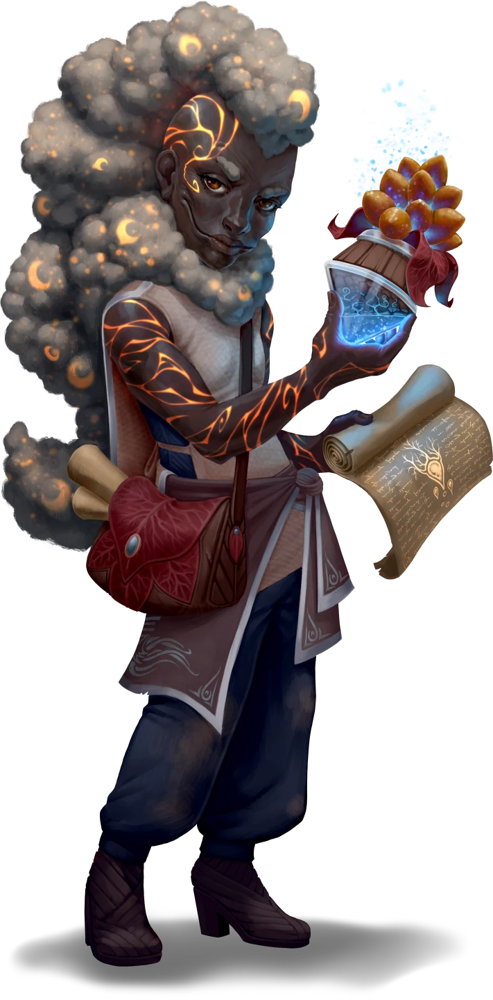

# Circling the Cause

> [!warning] Gamemaster
> #### Gamemaster's Summary
>
> This Social Event occurs once the party arrives in [[Rortwark]] after previously meeting [[Krafton Lilifeld]] caravan in [[Through the Grapevine]]. In this Event, the party attends a conference between Krafton Lilifeld, the agrimage apprentice [[Rala Ushna]], Steward of the [[Agrimage Circle]] [[Eamon Mariflor]]. By participating in this meeting, the party can:
>
> - Learn about the secret history of the Agrimage Circle and their covenant with the Korvathi sage, [[Terrane]].
> - Agree to retrieve a sample of [[Lake Orial]] mud from [[Ushna Dredging Docks]] for Eamon, and bring it to the [[Earthen Henge]] to summon Terrane.
> - Consider Krafton's request to travel to [[Lilifeld Vineyard]] and ensure its safety.
>
> This Event is depicted using the [[Agrimage Courtyard]] Level of the [[Vista: Redrak Fields]] Vista.

### Reuniting with Krafton

If the party has not been traveling alongside Krafton's caravan, they encounter him shortly after arriving to town. Read or paraphrase the following:

> [!quote] Read Aloud
> Before long, you spot Krafton Lilifeld's sprawling caravan, currently unloading supplies and assembling temporary market stalls, but surprisingly few locals seem interested in what they have to offer. You spy an uneasy expression on Krafton Lilifeld's face before he spots you in return, after which he quickly resettles his face into a broad grin.
>
> > I'm so glad you decided to join us after all! Come, help yourself to some refreshments, I insist!

### An Invitation from Rala

Rala invites the party to join him and Krafton at their meeting with Eamon Mariflor. If Rala has not been accompanying the party, he splits from Krafton's caravan and takes the party aside to talk; otherwise, Rala simply speaks to the party after Krafton goes back to his business.

> [!quote] Read Aloud
> Rala grabs his arm nervously.
>
> > It's almost time for Mr. Lilifeld and I's meeting with Eamon Mariflor, the Steward of the Agrimage Circle. He's always been a hero of mine … I thought I would be excited, but I'm mostly just terrified by what we've seen around the Redrak Fields.
> >
> > I'd much appreciate if you would join us. The more heads and hearts on this, the better.

### Meeting with Eamon

> [!abstract] Eamon Mariflor
> **[[Eamon Mariflor]]**
>
> Level 8 · Hulg'run Agrimage
>
> 
>
> Before you stands a short figure with dusky, gray hair shimmering with tiny magical stars and crescent moons. Glowing orange lines coil up his arms and over his face, making his skin look like a bed of cooling lava. His amber eyes seem to always glint with keen interest, and his wide, sharp-toothed smile is overtly friendly. He is dressed practically, and wears the mark of the Redrak Agrimage Circle pinned to his coat. He moves with lively energy.

> [!quote] Read Aloud
> Eamon greets Krafton and Rala, then glances towards you all.
>
> > I'm glad to see you've brought other capable hands along with you. I'm afraid to say we may need all the help we can get. Welcome, and please, take a seat.
>
> Eamon gestures to nearby wooden benches before continuing.
>
> > You must have seen those dead brown fields on your way in, yes? Well, they were a rich crimson just yesterday. Rala, I've been told you had concerns about the local ecosystem — it appears you were right. What have you all learned about this threat?
>
> Rather than speaking, Rala turns towards you, inviting you to share anything you have learned about the threat to the Redrak Fields during your travels.

Eamon and the others listen patiently to the party's explanation of their observations, and any potential connections the party has drawn.

> [!warning] Gamemaster
> #### Guiding the Investigation
>
> As the players share what they have learned, you are welcome to have Eamon ask follow-up questions. While doing so:
>
> - Avoid having Eamon share his own conclusions; he does so later in the Event.
> - Feel encouraged to ask leading questions which prompt the players to interrogate connections between the information they have gathered. Such questions can gently guide them towards the truth of the matter — that the influence of a [[Slinerak]]-corrupted elemental of [[Cora]] is poisoning the mud of Lake Orial, and summoning and provoking other lesser elementals — while still granting players the satisfaction of coming to those conclusions on their own.

The more information the party has gathered or intuited, the more clearly impressed Eamon is. Regardless, afterward, Rala shares his own information.

> [!info] Social
> #### Filling in the Gaps
>
> Rala shares any of the following observations that the party did not already share. Afterwards, the party has the opportunity to draw connections between what Rala shared, and anything they may already know.
>
> Rala explains any of the following not already shared by the party:
>
> - Reports across the Redrak Fields of attacks by earth and mud elementals that drip acid.
> - Reports across the Redrak Fields of attacks by strange vines of obsidian.
> - Increased frequency and intensity of those attacks over time.
> - Overnight crop die-offs all across the Redrak Fields.
> - By Rala's calculations, if the attacks and die-offs are not dealt with, the cascading consequences could cause nearly-irreversible collapse of the local ecosystem in a matter of months, if not weeks; if Rala shares this, Krafton breathes a worried sigh.

Once Rala has shared his information, the party has the opportunity to piece together a few potential connections; encourage them to share any conclusions they draw.

> [!tip] Exploration
> #### Connecting the Dots
>
> If they have not already come to these conclusions here or during prior Events, the party may draw the following connections.
>
> **Relation to Lake Orial**
>
> **Society (DC 12)** or **Knowledge: Alchemy** to recall that the nearby Lake Orial is dredged for magically enriched mud used as fertilizer across the Redrak Fields, suggesting a potential connection between the acidic mud of the elementals and the die-off of crops fertilized by that magical mud.
>
> - **Critical Success**: The character also recalls ancient accounts of the Lake Orial area once having been more barren, suggesting such fertile mud was not always a property of the lake.
>
> **Relation to Cora**
>
> **Science (DC 12)** or **Knowledge: Cosmology** to identify that elementals made of mud, earth, and obsidian could all plausibly originate from the moon of Cora — a place known for its creatures made of crystal and stone.
>
> **Relation to Slinerak**
>
> **Arcana (DC 15)** or **Knowledge: Gods** to identify — via the acidic elementals — the influence of [[Slinerak]], the corrupt Wild God of acid and rust who rules over the moon of Cora. The character may also speculate that Slinerak's influence perhaps compelled the elementals to behave so aggressively.

After Rala and the party are done speaking, Eamon shares his conclusions.

> [!quote] Read Aloud
> As Krafton tugs nervously on his beard, Eamon lets out a deep sigh.
>
> > This is even worse than I thought. I can only draw a single conclusion …
>
> Eamon's gaze falls away from you, and towards the ground — whether out of shame, or to inspect the earth that he has dedicated his life to tending to … you cannot tell. He whispers, as if speaking to himself:
>
> > The compact is failing.
>
> Krafton's hand stops threading through his beard, and Rala cocks his head. Eamon's eyes dart up, noticing their confusion, and he grounds himself before continuing.
>
> > What I'm about to share with you is a secret known only to the Steward of the Agrimage Circle, passed to me by my predecessor Kali Andrella before her much-deserved retirement. Do you swear to keep it in confidence?

Krafton and Rala swear immediately; after waiting for the party to follow suit, Eamon continues.

> [!quote] Read Aloud
> > The bountiful harvest of the Redrak Fields is more than the hard work done by the farmers of our labor councils, or the guiding hands of the Agrimage Circle, or the nutrients that wash down from the Bloodwoods and paint the fields in its hues.
> >
> > It is the result of an ancient compact, upon which the Agrimage Circle itself was founded. The magically-enriched mud that we dredge from Lake Orial is no accident of fate. It is a promise made by Terrane, a great Korvathi sage of Cora and an elemental of immense power, comparable even to that of a shard god.
> >
> > It has been a promise kept, it seems … until now.
> >
> > These earthen elementals bear signs of Slinerak — the fallen Wild God of acid and rust who wages a millennia-old war against Terrane's brethren to rule the great moon of Cora. If Slinerak's influence has found its way into the soil of Lake Orial that Terrane nurtures for us, then all of the Redrak Fields is at risk … and with it, the entire Arctus Plateau.
>
> There is a heavy silence as the weight of Eamon's words sinks in.

> [!tip] Exploration
> #### A World at War
>
> Hearing Eamon's story, the party may be able to piece together the following:
>
> - **Wilderness (DC 12)** or **Knowledge: Plants** to reason that if Slinerak were influencing the silt of Lake Orial, it should be detectable by looking for changes to the ecosystem of the lake itself.
> - **Society (DC 14)** or **Knowledge: Warfare** to conclude that based on historical precedent, if a powerful Korvathi like Terrane were to make a compact like this during amidst a war on Cora, it stands to reason she would expect something in return that aids the war effort.
> - **Arcana (DC 16)** or **Knowledge: Cosmology** to recall a esoteric account of a millennias-long war between Slinerak and Korvathi—and which indicated that this war has gone increasingly poorly for the Korvathi.

> [!quote] Read Aloud
> Eamon turns his gaze to the head of House Lilifeld:
>
> > Krafton, I ask that you please take a complete inventory House Lilifeld's grain stores, and devise plans for rationing, in the case that we cannot solve this crisis in time.
>
> Eamon then turns to face you all.
>
> > As for the rest of us, what we must do next is no small feat: for the first time in millennia, we must summon Terrane herself, and speak to her.
> >
> > I would ask on behalf of all the Plateau: can you lend me your hands in this matter?

If the players agree, Eamon details the task at hand.

> [!info] Social
> #### Combing the Lake
>
> Eamon wishes Rala and the party to go to [[Ushna Dredging]], the town responsible for harvesting the magically-enriched mud used by the agrimages to create soil for the Redrak Fields, retrieve a fresh barrel of the Lake Orial silt, and have Rala's yarnac Buttercup haul it to the [[Earthen Henge]], where the summoning ritual will be performed.
>
> [[Earthen Henge]]. Eamon can also share the following information:
>
> - The Lake Orial mud is needed both as a component in the summoning ritual, and so that Eamon can analyze it in an attempt to better understand the cause of this issue.
> - Terrane blesses the mud of Lake Orial in exchange for rare organic magical components and arcane cosmological lore that the Steward of the Agrimage Circle offers at a summoning every three centuries.
> - The compact is kept secret at Terrane's request.
> - Ushna Dredging is the home of the Ushna family — the family of Rala himself.
> - The resources of the Agrimage Circle are significantly taxed by recent environmental disasters and social conflicts across the Plateau.
> - The Earthen Henge is the original site of the compact, and still resonates with strange Coran influence — rocks float, and plants will not grow within the stone structure.
>
> Specific dialogue options for Eamon on the above topics are presented below this block.
>
> Any character who makes a successful **Diplomacy (DC 12)** check determines Eamon is earnestly providing every bit of information he can to aid investigation of this situation.
>
> #### Payment in Coin
>
> Eamon also notes that while the exchange of Lake Orial silt for the the Ushna's family's daily needs is one of mutual obligation rather than a monetary transaction, he understands the exceptional circumstances and is willing to open the Circle's coffers to pay the party.
>
> He offers a  **25** upon retrieval of a fresh barrel of Lake Orial mud. A party who declines this offer has the opportunity to advance their **Attunement: Heart of Ember**.

> [!question] Q&A
> **Q:** Why the Lake Orial mud?
>
> **A:**
>
> > The need is twofold. First, I have always believed the strength of the agrimages comes from the unity of magic and science, and I hope that my own analysis of a fresh sample might help us better understand the cause and potential consequences of this disaster.
> >
> > Second — and more importantly — it is a vital magical component in summoning Terrane, such that we might receive answers beyond anything us mortals could hope to uncover.

> [!question] Q&A
> **Q:** About the compact with Terrane?
>
> **A:**
>
> > Much has been lost to the ages, but I know this: Terrane blesses Lake Orial with mineral and magic-rich silt, vital to sustaining the agricultural output of the Redrak Fields.
> >
> > In exchange, every three centuries, the Steward of the Circle must go to the Earthen Henge and summon Terrane, bringing with them a rich offering of rare flora and organic magical components not found on inhospitable surface of Cora, along with whatever esoteric lore on cosmological phenomena the Circle has managed to locate since the last summoning.
> >
> > In truth, I am not quite sure why Terrane demands such offerings, and I've not had the chance to ask her— the last summoning was two centuries ago, and the next was not supposed to occur for one-hundred years.

> [!question] Q&A
> **Q:** Why is the compact secret?
>
> **A:**
>
> > By the request of Terrane herself. I have always assumed she would rather Slinerak and his servants not know of her business on Ember, but in truth, she never told us the reason, and I believe my predecessors dared not ask … perhaps this is a tradition we must break from when we summon her.

> [!question] Q&A
> **Q:** About the Agrimage Circle / why is the party needed?
>
> **A:**
>
> > I wish I could offer you more resources, but the Circle is sadly strung thin across the vine. Usually, countless agrimages would be here in this ancient meeting place, working together on this issue, but the last few years have seen so much strife — for the ecosystem and between various peoples of the Plateau. Agrimage Circle has traditionally offered counsel on both topics, but this has been a more taxing responsibility as of late — and also means I am much needed here in Rortwark.
> >
> > Still, there should be ways we can support you in this vital effort.

> [!question] Q&A
> **Q:** About Ushna Dredging?
>
> **A:**
>
> > The home of the Ushna family, and a cornerstone of a harmonious three part ecology: the Ushna dredgers, who supply the silt, our very own agrimages, who transform it into topsoil, and the Redrak Fields labor councils, who put it to use, and provide use the fruits of their labors to provide to both the Circle and the Ushnas.
> >
> > Ushna Dredging is also, I believe, the family home of young Rala Ushna here!
>
> The young Kivahr blushes pale yellow as he offers a small nod.

> [!question] Q&A
> **Q:** About the Earthen Henge?
>
> **A:**
>
> > It is the site where the ancient compact was first forged. Although it has fallen into disuse in the two centuries since Terrane was last summoned, even now it resonates with Coran influence. Plants refuse to grow within the strange swept circle of rock, and heavy stones float mid-air. You will see it yourself soon enough.

#### Heart Attunement: Payment Declined

If the party declines payment for retrieving the sample of Lake Orial silt, each character advances their **Attunement: Heart of Ember (+1)** at the conclusion of the Event.

If the party accepts the task, Eamon offers a final piece of magical assistance before departing.

> [!quote] Read Aloud
> Eamon's hands begin twirl through the air, leaving green trails as they do.
>
> > Before you go, let me offer you all something to aid you on your journey.

> [!tip] Exploration
> #### The Agrimage's Ward
>
> Eamon offers to ward the party with one of two possible wards; the party must choose collectively which to accept.
>
> The duration of the ward is determined by the most difficult connection that the party pieced together and shared with Eamon (prior to Eamon's explanation of the compact):
>
> - **The connection to Slinerak:** a fortnight.
> - **The connection to Lake Orial:** a week.
> - **The connection to Cora:** until nightfall the following day.
> - **None of the above:** until the next dawn.
>
> The more difficult the connection to intuit, the more enthusiastically Eamon describes his willingness to expend rare magical components to extend the ward's duration, *"in recognition of…"* whateverspecific information the party provided. The party may collectively choose between receiving the [[Ward of Stabilization]] or the [[Ward of Thunder]].

#### Cora Attunement: Ward of Stabilization

If the party chooses the [[Ward of Stabilization]], all party members advance their **Attunement: Cora (+1)** at the conclusion of the Event.

#### Signara Attunement: Ward of Thunder

If the party chooses the [[Ward of Thunder]], all party members advance their their **Attunement: Signara (+1)** at the conclusion of the Event.

### Krafton's Request

After the meeting, the shocked and worried Krafton requests the party's aid on a personal matter. Read or paraphrase the following:

> [!quote] Read Aloud
> As Eamon departs, Krafton stares on stunned, his characteristic smile nowhere to be found. Catching you looking, he tries to press it back onto his face, but clearly can't.
>
> > Well, this is a rather difficult situation, isn't it? I am …
>
> He chokes up, his forced joviality failing.
>
> > I can't help but think of what would happen to Ordain. Itinerant Ordani farmers returning to the city empty-handed. House Lilifeld unable to trade with the Redrak labor councils. Granaries empty, restaurants shuttered, whole districts starving. And my vineyard …
>
> His eyes go wide.
>
> > My vineyard! By the Heart, what if those vile creatures have found my vineyard?! Entire **decades** of effort, not to mention Lilifeld's very best farmhands and winemakers … can you go there and make sure everyone is safe? I'll pay handsomely, so long as you make haste!

> [!info] Social
> #### Tending the Vines
>
> Krafton offers the following payment for securing [[Lilifeld Vineyard]]:
>
> - **50** immediately if the party leaves for the vineyard within the hour.
> - An additional **25** if the party encounters hostile elementals there and repels them.

If the party accepts the task, mark the following Event Outcome:

`[[/outcome promise]]`

### Rala's Perspective

After Krafton, Rala approaches the party, and announces his intention to accompany them if he is not already, so long as the party plans to head for Ushna Dredging (before or after Krafton's vineyard).

Additionally, read or paraphrase the following:

> [!quote] Read Aloud
> Rala wraps his arms around the neck of his yarnac Buttercup, and rests his head against her as he speaks to you.
>
> > Skies and earth, I thought it would be bad, but this is so much worse than even I feared. We must get to Lake Orial soon.
>
> He buries his face in Buttercup's fur for a moment.
>
> > It will be … strange, to be home.

> [!info] Social
> #### The Prodigal Son
>
> Rala is worried both about the Redrak Fields, and about his first visit to his family home in quite a long time. He will hesitantly discuss the following topics:
>
> - While most Bejak are nomadic, the Ushnas long ago settled here, and their home is a waystation for traveling Bejak caravans.
> - Rala's family did not agree with his decision to leave, and he's not been back in some time, but feels that he must return now, to address this threat, and check on their safety.
> - That he feels the agrimages are responsible for holding Terrane to account, and ensuring the Arctus Plateau can continue to feed its people.
>
> Specific dialogue options for Rala on the above topics are presented below this block.

> [!question] Q&A
> **Q:** About Ushna Dredging?
>
> **A:**
>
> > My family home. Most Bejak are nomadic, but centuries ago, my ancestors chose to settle here. Now, it is part dredging operation, part residency, and part waystation for roaming Bejak caravans. It's beautiful. I don't regret my choices, but I do miss it.

> [!question] Q&A
> **Q:** About leaving/returning home?
>
> **A:**
>
> > After listening to all the Bejak travelers who stayed with us … the nomadic life of my ancestors called to me. I left as soon as I reached adulthood. But it was not well-received — the Ushnas are a close-knit, after all. And without a family caravan, I had to find my own way. The agrimages and their many Enclaves throughout the Plateau made for a natural choice, but to my family saw this as drifting farther from my Bejak roots, rather than closer.
> >
> > I have been … too ashamed to return home. It will be a strange reunion. But, no way around it. We must retrieve that sample for Mr. Mariflor. And while my family are capable enough of defending themselves, I'd also appreciate the opportunity to check on their safety.

> [!question] Q&A
> **Q:** About the compact / Terrane?
>
> **A:**
>
> > In truth, I'm less surprised than you might think. From my youngest years, I knew there was something special about Lake Orial. About the whole ecosystem here. It's part of what drew me to the agrimages. But to think the Circle is responsible for the compact … what an immense responsibility. One can only hope we are found deserving of bearing it.
> >
> > And I can't say I'm not intimidated to summon a great Korvathi sage and tell them they're falling short … but for the sake of Redrak … of the entire Plateau … we must.

### Concluding the Event

> [!warning] Gamemaster
> #### Next Steps
>
> Once the party has discussed the situation with Krafton and Eamon, they can:
>
> - Visit [[Ushna Dredging Docks]] to extract a fresh barrel of Lake Orial mud for Eamon during [[Dredging for Answers]].
> - Optionally, they may honor Krafton's request by travelling to and protecting [[Lilifeld Vineyard]] during [[Death on the Vine]].
