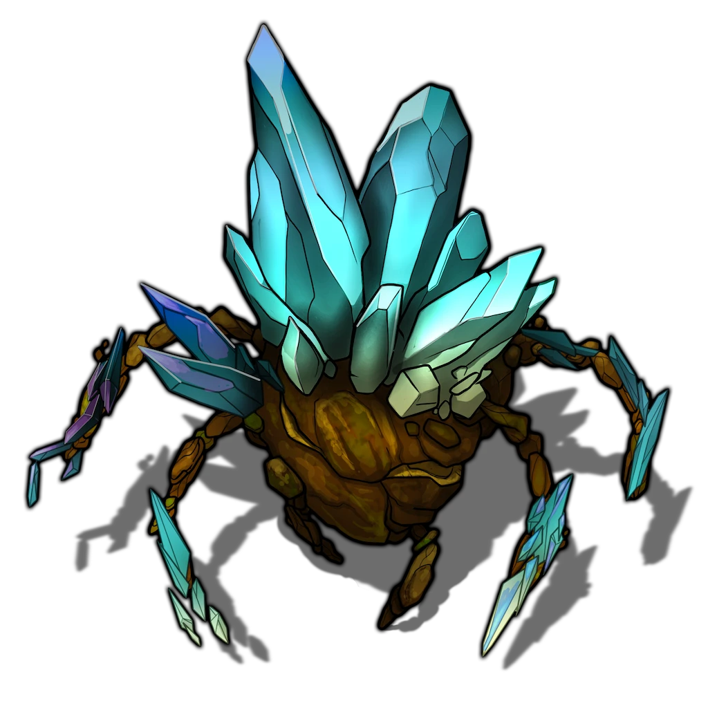
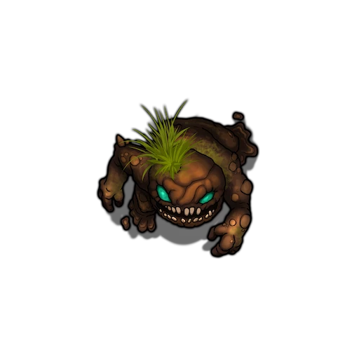
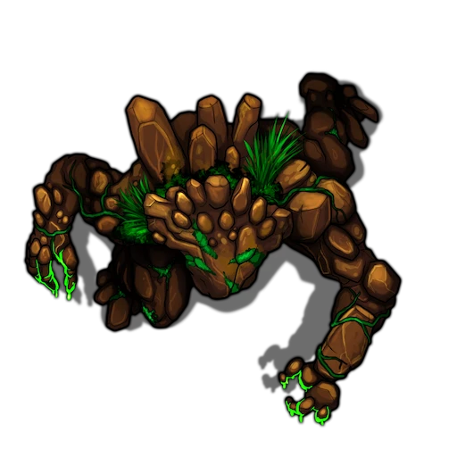

# Death on the Vine

> [!warning] Gamemaster
> #### Gamemaster's Summary
>
> This Combat Event occurs when the party visits [[Lilifeld Vineyard]], if during [[Circling the Cause]] they acceded to [[Krafton Lilifeld]] plea to check in on the vineyard and protect it from any hostile elementals. In this Event, the party discovers the vineyard under immediate threat from myriad elementals. Upon arrival, the characters can:
>
> - Repel the attack of aggressive elementals, most significantly a dangerous [[Crystallath]].
> - Protect the Krafton's staff and save whomever they can.
> - Save Krafton's elderly sommelier at Krafton's request.
> - Investigate the source of the elemental attack.
>
> This event is depicted using the [[Vineyard Attack]] composition of the [[Redrak Fields]] Vista.

### Battling the Elementals

Four hostile elementals have already climbed from the living tar pit near the center of the map, with more yet to come. Krafton's staff, meanwhile, desperately eye escape via the door of the main house to the south.

> [!abstract] Crystallath
> **[[Crystallath]]**
>
> Level 8 (Elite) · Crystallath Telekinetic
>
> 
>
> This large elemental's body is built from dark stone threaded with bright veins of crystal that glitter as they catch the light. Its form is humanoid, broken up by gems of various shapes and sizes jutting from its body. Despite its size, each step seems muted and light, pressing into the ground far less deeply than its bulk would require.

> [!abstract] Mud Globlin
> **[[Mud Globlin]]**
>
> Level 3 · Globlin Prankster
>
> 
>
> This stout, slumping creature is made from dark gray mud that flows through its vaguely humanoid form in slow, heavy folds. Its surface bubbles and pops as if stirred by some inner heat or foul reaction, sending up wet burps thick with the stench of rotting plants. Where it drags its stubby limbs across the ground, the mud leaves a clinging stain that blackens anything it touches.

> [!abstract] Clodmarl
> **[[Clodmarl]]**
>
> Level 5 · Stone Elemental Juggernaut
>
> 
>
> This elemental has the rough shape and bearing of a person, though up close there is no mistaking it for flesh and blood. Its body is made from dense clay and packed earth, with plates of stone fitted across its shoulders, chest, arms, and brow like armor. Its hands are heavy, blunt masses of hardened soil reinforced with stone, and look more like a mauls than hands. Each step it takes lands with the dull weight of a walking statue.

> [!tip] Exploration
> #### Recognizing the Elementals
>
> Any character who who makes a successful **Arcana (DC 16)** or **Science (DC 16)** check recognizes the creatures as Mud Globlins, a Clodmarl, and a Crystallath — elementals of [[Cora]]. The Mud Globlins are behaving in a characteristically nefarious manner, but Clodmarls and Crystallath are typically peaceful wanderers, known on rare occasion to even tend to the earth of the [[Redrak Fields]]. They are clearly agitated beyond reason by the influence of [[Slinerak]], the corrupted sovereign of Cora mentioned by [[Eamon Mariflor]].
>
> - **Knowledge: Elementals**: The character automatically succeeds on this check.

> [!warning] Gamemaster
> #### Operating the Tar Pits
>
> During this combat, new enemies spawn from a pit of living tar. This pit is represented by an Interactive Object on the Area Map. Use the **​** Interact With Objects tool and left-click on a living tar pit to bring up a menu with the following buttons:
>
> - **Open:** This button plays an animation which changes the look of the tar pit to show that it is active and able to produce elementals. Once opened, the two following buttons become available.
> - **Seal:** This button plays an animation which changes the look of the tar pit to show that it is no longer active and able to produce elementals. Once closed, only the **Open** button remains.
> - **Spawn:** After dragging the [[Mud Globlin]] Actor from the sidebar into the **Spawn Actors** list on the object's menu, press this button to spawn the associated new Actors on top of the tar pit.

> [!danger] Hazard
> #### A Wave of Mud
>
> The party arrives via a dirt road to find an onslaught of agitated elementals attacking Krafton's staff, led by a dangerous [[Crystallath]]. To begin combat:
>
> - Krafton's staff attempt to move from their current location outside a small shed, to the safety of the large house at the south end of the map.
> - Two [[Mud Globlin]] race towards Krafton's staff, and continue focusing their attacks on the staff during combat — requiring the party's intervention if they are to be saved.
> - The [[Crystallath]] and [[Clodmarl]] turn away from the staff, recognizing the party as the larger threat, move to attack the newcomers.
>
> At the beginning of each combat round after the first:
>
> - If there are no living [[Mud Globlin]], a one emerges from the living tar pit, if still active.
>
> #### Sealing the Tar Pit
>
> To stem the tide of Mud Globlins, the party must find a way to prevent elementals from forming inside of or climbing out of the pit, or otherwise rendering it inactive. This can be accomplished the following ways:
>
> - Freeze the pit by covering a substantial amount of its area with an area spell using [[Rune: Frost]].
> - Fill the pit with earth (or another inert absorbent material) approximately equivalent in volume to a Large creature (including the slain body of a Clodmarl or Crystallath).
> - Any sufficiently clever original solution.
>
> #### Krafton's Staff Tactics
>
> Krafton's four staff members sprint directly for the main house. After running up the stairs to the house, they move to safety inside it via the main door located at the top of the stairs between the firewood and barrels — represent this by removing their token from the map.
>
> #### Crystallath Tactics
>
> The Crystallath is a [[Telekinetic]] spellcaster with [[Cora Attunement (Rank IV)]], using its spellcraft to damage, hinder, or incapacitate opponents.
>
> - It will keep a distance from enemies, preferring to **Cast Spell** from near the 60 foot range of **Earthen Arrow** or **Kinetic Blast**.
> - It will use its Cora attunement to inflect Spells like **Coran Kinetic Blast** to inflict the **Staggered** Condition.
> - If approached by enemies, it will use [[Inflection: Push]] to knock them backwards.
> - If the Crystallath becomes cornered it will use **Telekinetic Flight** or **Submerging Withdrawal** to escape from harm.
>
> Agitated by Slinerak's corruption, the Crystallath will not retreat even if it becomes **Broken**, and it fights to the death. When it dies, the other elementals retreat, as per [[Death on the Vine]] below.
>
> #### Mud Globlin Tactics
>
> The Mud Globlins rush towards the vineyard buildings to attack Krafton's staff. They act as [[Pack Hunter]] and will coordinate to flank enemies, using **Tumble** to maneuver in close quarters. If the Mud Globlins are engaged directly, they:
>
> - They possess minor **Cast Spell** capabilities and will use **Earthen Fan** to spray multiple nearby foes with acid.
> - While they have Focus remaining, they will use a combination of **Distract**, **Scathing Mockery**, and **Dirty Tricks** to debilitate and harass foes.
> - If faced with a single opponent, they will use **Feinting Strike** in melee or **Strike** from distance with their [[Acrid Glob]].
>
> These corrupt and chaotic elementals will gleefully fight to the death and do not flee if **Broken**, only retreating if the [[Death on the Vine]] below are met.
>
> #### Clodmarl Tactics
>
> Each Clodmarl is a determined brawler who use a mixture of spells and physical brawn to subdue their opponents.
>
> - At range, they will position themselves to **Cast Spell** a **Earthen Ray** at a group of enemies.
> - Each turn they will advance to close distance towards their targets, using **Overrun** as soon as they get within range to do so.
> - In melee they will use **Grapple** to seize their opponents, **Strike** them with their caustic fists, **Headbutt** to leave them **Staggered**, and **Throw** them to assert battlefield control.
>
> If a Clodmarl becomes **Broken** or if it is close to **Dead**, it will instinctually try to use **Submerging Withdrawal** to retreat to a position where it can recover strength.
>
> #### Rala Ushna Tactics
>
> If the party is accompanied by [[Rala Ushna]], he joins them in the fight. During combat, Rala:
>
> - **Cast Spell** like **Ray of Life** and **Vital Surge**, typically taking his time by using the Compose inflection to conserve upon Focus and using **Refocus** when necessary.
> - Will create an **Ancestral Grove** and remain within it to strengthen his allies.
> - Uses the Earth rune offensively, but will stop once he realizes the elementals he faces are highly resistant or immune to Acid damage, at which point he will **Strike** with his talisman to deal Poison damage instead.
> - If the party has not yet faced [[Muddy Waters]] and learned how to seal the tar pits, once per combat round, offers the party ideas for sealing the tar pits, such as *"Perhaps we could freeze them?"* or *"If only we had something to soak up all the tar …"*
>
> If **Weakened** or **Broken**, Rala attempts to move as far from hostiles as possible while still within range to support the party with spellcasting. However, Rala will never leave the party to fight alone.
>
> #### Sinking Cart
>
> After each of the first 2 combat rounds, use the **​** Interact With Objects tool and left-click on the wine barrel-laden wagon in the southeast side of the map to move it farther into the tar pit, foreshadowing [[Death on the Vine]] below. Once the wagon is partially submerged, leave it in place to allow for the events of that story.
>
> #### Victory Conditions
>
> The the Crystallath dies, the other elementals — having been under its influence and leadership — all retreat, scampering back to the tar pit and melting back into tar, or fleeing away across the fields.

The aspects of the battle the party chooses to prioritize may grant one or more Attunement Points:

#### Luxarum Attunement: Destroying the Elementals

If the party destroys every elemental, letting none retreat, each character advances their **Attunement: Luxarum (+1)** at the conclusion of the Event.

#### Heart Attunement: Saving the Staff

If the party allows no more than a single staff member to die, each character advances their **Attunement: Heart of Ember (+1)** at the conclusion of the Event.

After the party finishes repelling the elementals, mark the following Event Outcome:

`[[/outcome saved]]`

### Saving Krafton's Sommelier

Immediately after the combat ends, Krafton and his caravan arrive. The head of House Lilifeld races across the field in a stumbling run.

Meanwhile, the elderly Humbolt Seld (Lawful Neutral, Arcturian Human, he/him) can be heard shouting from within a wagon full of wine barrels … which begins rapidly sinking into a tar pit! Read or paraphrase the following:

> [!quote] Read Aloud
> Surveying the wreckage, you hear the panicked shouting of an elderly voice within a wagon laden with wine barrels. The man clearly hid there from the elementals, before being buried under the shifting barrels and knocked unconscious — waking just in time for the pit to begin swallow the wagon faster than ever. Hearing the voice within, the recently arrived Krafton shouts in alarm.
>
> > By the Heart, that's Humbolt's voice! The old sommelier's much too frail to pull himself out — heroes, please rescue him, I'm begging you! Forget about the wine — throw it over if you have to, just save him!

If the party intends to rescue Humbolt with strength and manual dexterity while the strange tar pit rapidly pulls the wagon downward, they are faced with a series of obstacles — though other clever or heroic solutions may circumvent those challenges.

> [!warning] Gamemaster
> #### Animating the Cart
>
> Optionally, you may use the **​** Interact With Objects tool to animate the wagon's progress into the tar pit as the players attempt checks. Left-click advances the cart further into the tar, while right-click can be used to undo accidental progress.

> [!tip] Exploration
> #### Saving the Elderly
>
> To vault the tar and land safely on the uneven and shifting wagon.
>
> Any character attempting this must succeed on a **Athletics (DC 16)** check. If they fail, they are rendered **Prone** and fall into the acidic tar pit below.
>
> Once on the wagon, a character who makes a successful **Athletics (DC 14)** check can rapidly lift the constantly shifting barrels to free Humbolt from where he's buried.
>
> - **Critical Failure**: The character loses their grip on a barrel and drops it on Humbolt, knocking the man unconscious.
>
> Finally, if the character intends to jump back over the tar while carrying Humbolt, they must succeed on a **Athletics (DC 18)** check, or else they and Humbolt fall into the tar.
>
> #### Falling into the Tar
>
> Anyone who falls into the tar suffers from **Caustic Tar (Hazard 8, Acid, Fortitude)** before a mob of Krafton's other staff (or party members) rapidly arrive to pull the character out. This process takes too long for that character to participate in any other attempts to save Humbolt before he sinks.
>
> If the party fails to rescue Humbolt, he sinks up to his neck in the tar before Krafton's other staff manage to pull him out, then rush him inside to cleanse the tar and treat his acid burns.

If the party manages to prevent Humbolt from falling into the tar, he is immensely grateful — if conscious — and Krafton offers additional rewards.

### Getting Paid

The overwhelmed Krafton is incredibly grateful, and offers the party thanks and payment.

> [!quote] Read Aloud
> Krafton breathes heavily, exhausted and anxious.
>
> > Oh my. Oh my, oh my, oh my … I'm so glad you all were here, I can't imagine what would have happened without your valiant heroism. Please, take the promised payment, and know that you may call upon myself and my house for help in whatever capacity we may provide it.
> >
> > I apologize to cut our conversation short, but I must see to my staff — I truly wouldn't forgive myself if I didn't do everything I could to protect them from this terrible plague, and recompense them for whatever they have suffered in the line of duty!

Krafton provides the promised  **25** payment for defeating any elementals at the vineyard, as offered at the end of [[Circling the Cause]]. If the party saved Humbolt without allowing him to fall into the tar, Krafton offers another  **5** in thanks.

### Investigating the Attack

If the party speaks to Krafton's staff about the attack, they can provide clues to the threat's origin.

> [!info] Social
> #### The Dirt on the Attack
>
> If the party asks any of Krafton's staff about the events leading up to the attack, they reveal:
>
> - They were on break in the shed, having just finished laying down a fresh layer of [[Lake Orial]] mud-derived topsoil, shipped to them by the [[Agrimage Circle]]— a seasonal occurrence at the vineyard.
> - After hearing a loud noise, they went outside to find the vineyard overrun with vines of obsidian while elementals began climbing out of suddenly-opened tar pits.
>
> Any character who makes a successful **Diplomacy (DC 11)** check determines the terrified staff are sharing all they can think of, in the hopes that this never happens again.

### Concluding the Event

> [!warning] Gamemaster
> #### Next Steps
>
> Once the party has protected the vineyard, they may continue on with other tasks that [[Eamon Mariflor]] requires of them:
>
> - If they have not already done so, they must visit [[Ushna Dredging Docks]] during [[Dredging for Answers]] to extract a fresh barrel of Lake Orial Mud for Eamon's inspection and use in the rite to come.
> - If they have already retrieved the mud, they must reunite with Eamon at the [[Earthen Henge]] during [[Wisdom of the Sages]].
