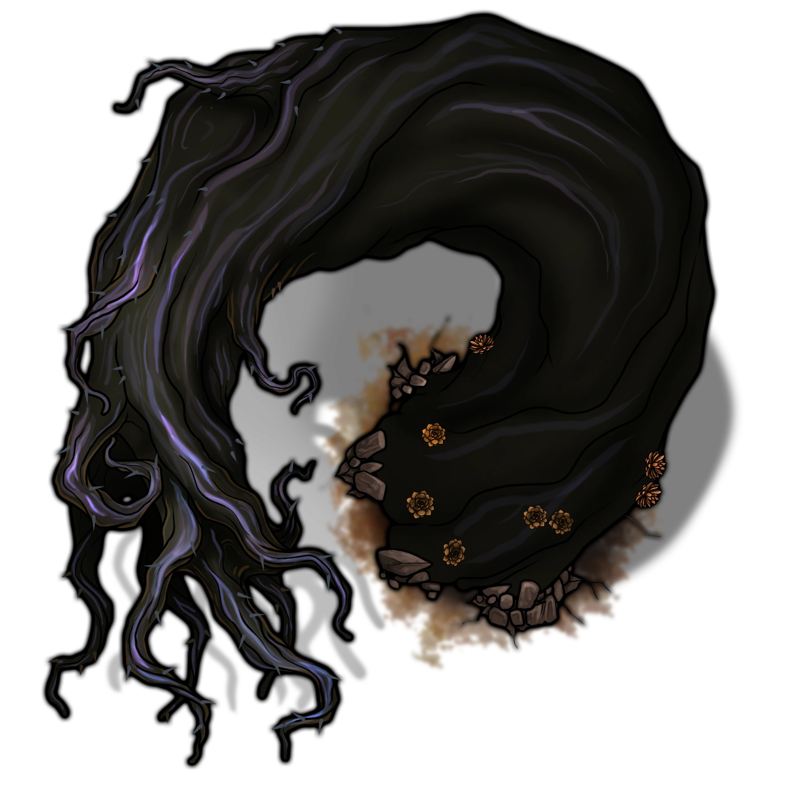
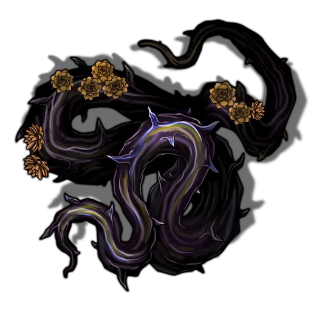

# The Root Issue

> [!warning] Gamemaster
> #### Gamemaster's Summary
>
> This Combat Event occurs in the [[Redrak Fields]] Biome, in any hex without a notable Location. It is substantially more likely to occur after the party has completed Chapter 3, and can repeat up to once every 24 hours until [[Braving the Elements]] is resolved. By confronting these dangerous vines of living obsidian, the characters can:
>
> - Witness the concerning Coran menace afflicting the Redrak Fields.
> - Discover clues that point towards the moon of [[Cora]] as the source of these troubles.
> - Confer with [[Rala Ushna]], if traveling together, about the evolving situation.
> - Protect the caravan of [[Krafton Lilifeld]], if traveling together, and be rewarded for it.
>
> This Event is depicted using the [[Obsidian Vines]] Level of the [[Redrak Fields]] Area Map.

### Obsidian Vine Ambush

If the party is currently traveling with the caravan of [[Krafton Lilifeld]] — first encountered in [[Through the Grapevine]] — the caravan's yarnac panic at the first slight tremble, alerting Krafton's guards to the oncoming danger. The guards in turn alert the party and begin ushering the caravan back the way it came.

Otherwise, the party has at most a moment's warning before …

> [!abstract] Towering Obsidian Vine
> **[[Towering Obsidian Vine]]**
>
> Level 9 (Elite) · Obsidian Vine Constrictor
>
> 
>
> A glittering tendril of black glass bursts forth from the earth, a thick as a tree trunk and tapering off to the size of a Giant's fist at its tail end, which whips menacingly in the air above you. All down its surface glint obsidian thorns, like the vine of an impossible plant made wholly of black crystal.

> [!abstract] Obsidian Vine Outgrowth
> **[[Obsidian Vine Outgrowth]]**
>
> Level 6 (Minion) · Obsidian Vine Constrictor
>
> 
>
> More black vines emerge from the ground around you, these ones only as thick as axeheads and reaching no higher than your waist, but sparkling with the same deadly thorns of finely-pointed obsidian.

> [!tip] Exploration
> #### Recognizing the Vines
>
> Any character who who makes a successful **Arcana (DC 16)** check recalls an esoteric account of the moon of Cora that mentioned obsidian vines, with thorns that anchored them into solid rock in order to resist Cora's intense gravitational fluctuations. These vines were also said to connect to larger underground structures.
>
> - **Knowledge: Cosmology**: The character automatically succeeds on this check.

### Krafton's Retreat

If the party is currently traveling with Krafton's caravan and it is the first time they have encountered this Event while doing so, Captain Tyra Saulter calls out to the party. Read or paraphrase the following:

> [!quote] Read Aloud
> A Human woman in armor — who you recognize from your time with the caravan as Captain Tyra Saulter, leader of Krafton Lilifeld's guard — quickly ushers Krafton's caravan back the way you came, and gestures to the retreating head of House Lilifeld as she calls out to you:
>
> > We have to get him out of here! Take care of that thing, and House Lilifeld will see you paid handsomely!

If the party is traveling with Krafton but they have encountered this Event or [[Muddy Waters]] while traveling with Krafton before, instead read or paraphrase the following:

> [!quote] Read Aloud
> Captain Saulter calls out to you:
>
> > You know the drill! Take it down while we move the caravan to safety!

### Battling the Vines

Any preparations complete, the party must now face the danger of these corrupted Coran vines. Unbeknownst to the party, the corrupt influence of [[Slaith]] is causing localized disturbances resembling strange phenomena that occur regularly on Cora.

> [!danger] Hazard
> #### A Journey Uprooted
>
> Strange vines of hardened, otherworldly obsidian burst forth from the ground, agitated and ready to maul and entangle whatever they find they find. To begin combat:
>
> - The [[Towering Obsidian Vine]] emerges near the center of the party.
> - Two [[Obsidian Vine Outgrowth]] emerge around the party.
>
> If the party is traveling alone, any character with **Awareness (DC 14, Passive)** notices the trembling earth and recognizes it as the sign of a burrowing monster, and may alert the party to impending danger. Otherwise, the party is the party is **Unaware** at the start of combat.
>
> At the beginning of each combat round after the first, consult the Obsidian Vine Moments table below to inject a unique environmental hazard into the combat.
>
> #### Obsidian Vine Tactics
>
> All varieties of obsidian vine in this combat are connected to a single underground structure. Additionally, all varieties:
>
> - Have the [[Burrower]] talent which allows them to move through the earth to disengage from combat or erupt into an attack.
> - Are expert in grasping and ensnaring victims, thanks to their [[Wrestler]] talent.
> - Are [[Spellmute]] and resistant to the effects of magic.
>
> All of the Outgrowths present are controlled by the Towering Obsidian Vine.
>
> When the Towering Obsidian Vine itself takes damage, any character who makes a successful **Awareness (DC 15)** notices that the Obsidian Vine Outgrowths also shudder, indicating they are connected underground. Once this is pointed out, any party member who succeeds on a further **Science (DC 15)** or **Wilderness (DC 15)** check concludes that the Obsidian Vine Outgrowths are controlled by the Towering Obsidian Vine, and destroying it with disable the others. The checks at each step may be repeated each time the Towering Obsidian Vine takes damage, until a party member succeeds.
>
> #### Towering Obsidian Vine Tactics
>
> During combat, the Towering Obsidian Vine will:
>
> - Utilize **Ensnare** to grab an enemy, **Thrash** to damage it severely, and **Swallow** to engulf it in its sinuous mass.
> - Use **Submerging Withdrawal** to retreat each time it sustains roughly 25% of its total Health in damage or at a moment suitable for narrative drama.
> - While submerged, it will **Spawn Offshoot** to continue threatening the party with new Outgrowths which it commands using **Direct the Brood**.
> - While submerged, it will recover some of its Health using **Subterranean Regrowth** until one of its Outgowths has been destroyed, at which point it must resurface.
> - Spend any Heroism it gains to perform **Explosive Emergence**, targeting locations where groups of characters are standing together.
>
> The Towering Obsidian Vine is a mindless predator, operating on biological instinct. It cannot be **Broken** and will not flee the battlefield.
>
> Agitated by the the restlessness of [[Slaith]] (whose corrupt influence drew it here) the vine fights to the death. Upon death, its entire body crumbles to shards of obsidian — including the massive underground root structure and all Obsidian Vine Outgrowths.
>
> #### Obsidian Vine Outgrowth Tactics
>
> Obsidian Vine Outgrowths follow a similar combat pattern to their progenitor, but lack some of its specialized features. In combat they:
>
> - Utilize **Ensnare** to grab an enemy, **Thrash** to damage it severely, and **Swallow** to engulf it in its sinuous mass.
> - If no enemies are in range, they may temporarily burrow underground to move towards the closest foe they can sense.
>
> They are mindless and will not retreat or flee and they cannot become **Broken**.
>
> #### Rala Ushna Tactics
>
> If the party is accompanied by [[Rala Ushna]], he joins them in the fight. During combat, he:
>
> - **Cast Spell** like **Ray of Life** and **Vital Surge**, typically taking his time by using the Compose inflection to conserve upon Focus and using **Refocus** when necessary.
> - Will create an **Ancestral Grove** and remain within it to strengthen his allies.
> - Uses the Earth rune offensively, but will stop once he realizes the elementals he faces are highly resistant or immune to Acid damage, at which point he will **Strike** with his talisman to deal Poison damage instead.
>
> If **Weakened** or **Broken**, Rala attempts to move as far from hostiles as possible while still within range to support the party with spellcasting. However, Rala will never leave the party to fight alone.

At the beginning of each combat round after the first, roll on the following table:

| Range | #### Obsidian Vine Moments |
| --- | --- |
| 1 | #### Tripping Hazard  A sudden growth of obsidian vines sprout from the ground in a 15-foot-radius circle around the largest concentration of party members and their allies, clasping at their feet before burrowing back underground. Those affected must succeed on a **Athletics (DC 14)** check or be knocked @Condition[Prone]. |
| 2 | #### Rough Patch  A patch of thin obsidian vines — tiny glass thorns glinting — sprout from the ground in a 15-foot-radius circle around the largest concentration of party members and their allies, before hardening into inert obsidian. This area is considered Difficult Terrain from now on. |
| 3 | #### Arm and a Tendril  Below a random party member who made a recent melee attack, wrist-thick obsidian vines thrust upward, attempting to pull their weapon away. The character must succeed on an **Athletics (DC 16)** check to dodge the vines or maintain their grip, or else their weapon is pulled from their hands and tossed onto the ground at their feet before the vines retreat back under the surface. |
| 4 | #### Earthquake  The earth shakes beneath the party's feet. All characters must make a **Athletics (DC 12)** check or be knocked @Condition[Prone]. Characters with underground roots are immune to this effect. |
| 5 | #### Gravquake  Bizarrely, gravity seems to invert itself for a moment in a 15-foot-radius circle around the largest concentration of party members and their allies, lifting them 5 feet into the air before dropping them. Those affected must succeed on a **Athletics (DC 14)** check to land on their feet, or else suffer an **Unexpected Fall (Hazard 3, Fortitude, Health, Bludgeoning)** damage and be knocked @Condition[Prone]. Any character who makes a successful **Arcana (DC 14)** check or who has **Knowledge: Cosmology** recognizes this as similar to the gravitational disturbances that occur on the moon of [[Cora]]. |
| 6 | #### Acid Rain  A sudden drizzle of acidic liquid rains down from the sky in a 5-foot-radius circle around the largest concentration of party members and their allies. Affected characters must make a **Athletics (DC 14)** check to duck out of the way, or else suffer **Burning Tar (Hazard 6, Fortitude, Health, Acid)**. Characters who succeed must move out of the radius to gain the benefits of a success — doing so requires no movement action, but does provoke Reactive Strikes as normal. Any character who makes a successful **Arcana (DC 16)** check or who has **Knowledge: Cosmology** recognizes this as similar to foul and corrupt substances that permeate the moon of [[Cora]] due to the influence of the Wild God [[Slinerak]]. |

### Rala's Concerns

If Rala is accompanying the party, and they are encountering this Event for the first time, read or paraphrase the following:

> [!quote] Read Aloud
> Rala brushes himself off, and takes a steady breath.
>
> > That was … terrifying. But I am glad you all were here. I am far better in a field than I am in a fight. I hope I didn't get in the way?

> [!info] Social
> #### The Troubled Apprentice
>
> Rala is deeply concerned by the aggression exhibited by these strange creatures, and hopes to put heads together with the party on the issue. Rala can confirm the following:
>
> - Prior to the secondhand accounts he has gathered in the past few months, nothing such as this has been observed in the area
> - He believes the unflinching hostility of the creature indicates it is out of its natural habitat, or must be deeply agitated by something present in the local ecology.
>
> Rala then asks the party whether they recognize these vines.

### Investigating the Vines

Regardless of whether the party is investigating this strange phenomenon on their own, or attempting to answer Rala's question, they can seek information via a number of strategies:

> [!tip] Exploration
> #### Grasping for Answers
>
> The party can analyze what they witnessed via any of the following methods, if they have not already uncovered similar information during this or other Events in "Disturbed Earth":
>
> - **Knowledge: Elementals** to recognize common properties of earth elementals in the vines' crystalline structure, suggesting a connection to Cora, the moon where earth elementals originate.
> - **Wilderness (DC 12)** to confirm such obsidian vines are not a hazard historically known to plague the Plateau.
> - **Arcana (DC 15)**, **Science (DC 15)**, or **Knowledge: Cosmology** to assemble all the pieces of evidence — the obsidian, the vines, the resistances and vulnerabilities of the creature, and any phenomena from the Obsidian Vine Moments table — into the fact that it is clearly the influence of the elemental moon of Cora.
> - If the party discovered the vines' Acid immunity, or observed the Acid Rain, a **Society (DC 15)** check or **Knowledge: Gods** to recognize the influence of [[Slinerak]], the corrupt Wild God who rules Cora and oozes such foul liquids wherever he reigns, and is worshipped by secretive cultists on Arctus Plateau.

If the party is accompanied by Rala and the party has not yet completed [[Circling the Cause]], Rala concludes by urging the party to push on to [[Rortwark]] and bring their findings to the [[Agrimage Circle]], who Rala believes will know what to do once provided these observations.

### A Reward from House Lilifeld

If the party is traveling with Krafton's caravan, Krafton and his retinue return, ringed by guards. Captain Saulter approaches the party:

> [!quote] Read Aloud
> The eyes of Captain Saulter dart back and forth as she approaches, clearly still on alert.
>
> > Thank you for banishing that foul monstrosity. I hope you understand the need to escort my charge to safety, and even still, I apologize for leaving you to fight it on your own. As promised, we will amply reward you for the risk you took upon yourselves.

> [!info] Social
> #### On the House
>
> Captain Saulter offers a small chest bearing the crest of House Lilifeld, inside of which is:
>
> - Payment of **`[[/award 25 gp]]`** .
> - One [[Potion of Healing]] per time the party has encountered this Event or [[Muddy Waters]] alongside Krafton's caravan.
> - A sealed bottle of [[Lilifeld Vineyard Wine]].

### Concluding the Event

> [!warning] Gamemaster
> #### Next Steps
>
> Once the party has survived the obsidian vines, they can:
>
> - Encounter Krafton Lilifeld on his way to Rortwark (if they have not already done so) in [[Through the Grapevine]], after which they can investigate the source of the elemental threat in [[Circling the Cause]].
> - Encounter other Coran hazards in [[Muddy Waters]].
> - After 24 hours pass, face down yet more vines in a repeat of this Event.
