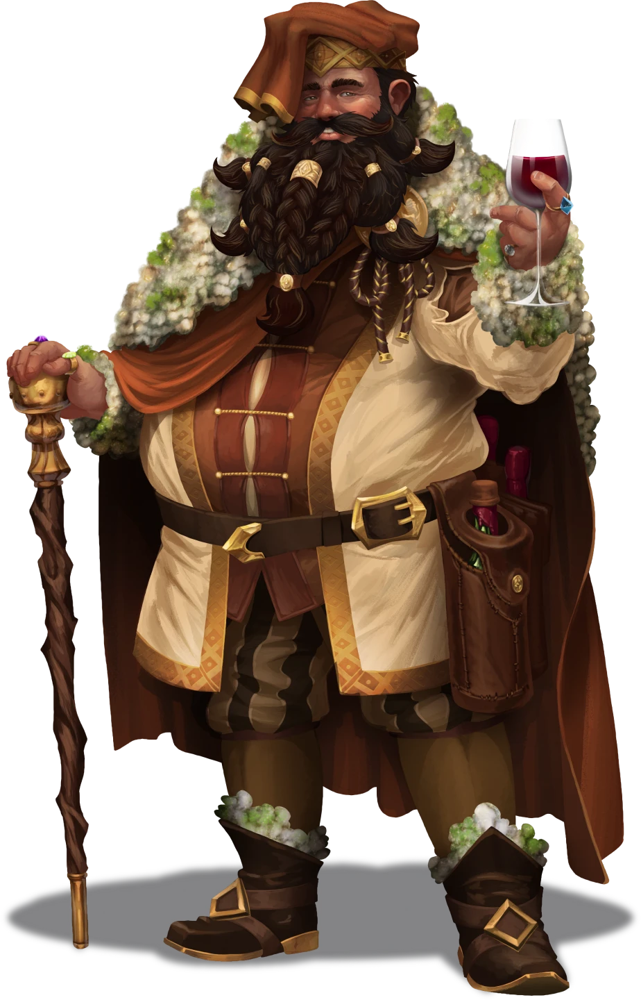
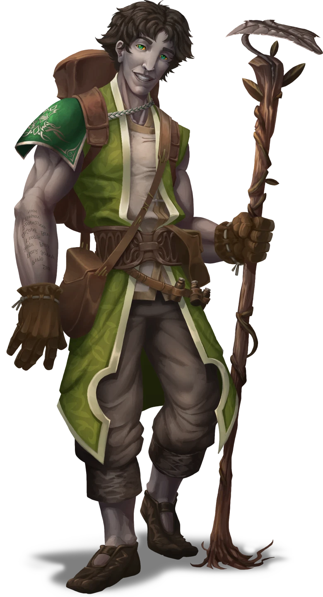

# Through the Grapevine

> [!warning] Gamemaster
> #### Gamemaster's Summary
>
> This Social Event can occur anywhere in the [[Redrak Fields]] Biome (excluding hexes with a named Location) after the party has completed Chapter 3. In this Event, the party encounters a [[House Lilifeld]] caravan traveling from Ordain to the town of [[Rortwark]]. By conversing with the travelers in this caravan, the characters can:
>
> - Meet and potentially befriend [[Krafton Lilifeld]], the famed head of House Lilifeld.
> - Meet [[Rala Ushna]], an apprentice agrimage who wants the party's help with a growing threat to agriculture in the Redrak Fields and beyond.
> - Decide whether or not to travel with Krafton and/or Rala towards [[Rortwark]].
>
> This Event is depicted using the [[Traveling Caravan]] Level of the [[Vista: Redrak Fields]] Vista.

### The Hospitality of House Lilifeld

The party is greeted by Krafton Lilifeld, the boisterous leader of House Lilifeld — the Ordani trading house famous for food production and fine cuisine across the Arctus Plateau. His caravan has stopped to rest, and he is excited for the opportunity to welcome the increasingly reputable adventurers. He hopes to plant the seeds of a valuable alliance … while delicately balancing the politics of revealing a new and not-well-understood threat to Lilifeld's grain production.

> [!abstract] Krafton Lilifeld
> **[[Krafton Lilifeld]]**
>
> Level 4 · Human Trader
>
> 
>
> The finely-dressed Human gestures you in towards him, his jewelry clinking with each sweeping motion of his arm. You get the sense that everything he does, he does grandly. Even so, the warmth in his smile is genuinely inviting, and the jovial tenor of his voice rings out earnestly.

How Krafton greets the party depends on which of the Chapter 3 Main Quests the party completed:

> [!question] Q&A
> **Q:** Greeting[[The Marlstone Gala]]
>
> **A:**
>
> > Pleasure to make your acquaintance, I'm Krafton Lilifeld, head of House Lil— oh, I recognize you! I saw you from far across the hall at the Marlstone Gala, but I was quite busy proving that the wine vinted at my personal vineyard remains the best on the Plateau.
> >
> > I heard a rumor that you were fairly busy yourselves, getting into some trouble with our gracious Wandren hosts. But I wouldn't dare ask about that, now would I?
>
> The man offers a sly smile … and a playful wink.

> [!question] Q&A
> **Q:** Greeting[[Midnight Meeting]]
>
> **A:**
>
> > Pleasure to make your acquaintance, I'm Krafton Lilifeld, head of House Lilifeld.
> >
> > I believe **you're** the inquisitive group that worked with the Veiled Chain to look into the sickness afflicting my house's granaries. I'm grateful for your assistance! Good help is hard to find, and Ordain cannot afford such dangers to its food supply in a time such as this …
>
> For just a moment, his wide smile slips. Then, in an instant, it returns, and he asks:
>
> > Now, what brings you to the Redrak Fields?

> [!question] Q&A
> **Q:** Greeting[[Grave Assignments]]
>
> **A:**
>
> > Pleasure to meet you, I'm Krafton Lilifeld, head of House Lilifeld. And you must be the adventurers that caused quite a furor in the Burial Grounds — working with Sionia no less. How **delightfully** controversial. I respect anyone so unafraid of what people think.
> >
> > If I were to speak plainly, I'd say my own attention to appearances is one of my greatest strengths … and greatest weaknesses.
>
> The man offers a sly smile … and a playful wink.
>
> > What brings brave folk such as yourselves to the Redrak Fields?

> [!info] Social
> #### A Warm Welcome
>
> Krafton immediately offers shade and refreshments, eager to make a good impression on the party, given the reputation they have recently made for themselves in Ordain.
>
> Krafton is even friendlier to anyone who compliments House Liliefeld's reputation for fine food and good wine — a strategy that would naturally occur to anyone with **Culture: Ordani** or **Knowledge: Trade**.
>
> He is happy to discuss the following topics:
>
> - The purported purpose of his caravan is to carry gifts for the [[Agrimage Circle]] and marketable goods to Rortwark, along with supplies for [[Lilifeld Vineyard]], his personal vineyard just outside Rortwark.
> - His caravan also intends to investigate a potential disturbance to the local environment — secretly however, Krafton is downplaying the danger, and is hesitant to share details.
> - Rortwark is an important seat of agricultural power, hosting the Agrimage Circle and growing food for the Arctus Plateau.
> - His caravan is accompanied by Rala Ushna, a young Agrimage apprentice who Krafton thinks is a bit of a worrywart, but with a good heart.
>
> Specific dialogue options for Krafton on the above topics are presented below this block.
>
> #### His True Purpose
>
> Any character who hears Krafton discuss the purpose of the caravan and makes a successful **Deception (DC 16)** check determines that Krafton is downplaying the urgency of his investigation and the potential danger to agriculture in the Redrak Fields, likely for fear of damage to his house's reputation.
>
> - **Knowledge: Intrigue**: The character gains **+2 Boons** on this check.
> - **Knowledge: Politics**: The character gains **+2 Boons** on this check.
> - **Critical Success**: The character also recognizes that Krafton is undermining Rala's credibility as he fears Rala's urgency about the issue will reflect poorly on House Lilifeld.
>
> #### Pressing for Details
>
> Any character who presses Krafton for details on the environmental disturbance and makes a successful **Diplomacy (DC 16)** check can convince him to share that he *"may have misspoken, in order to avoid overly worrying anyone"* and the threat is serious — whole fields are withering for unknown reasons, and others have been overtaken by vine-like structures made of pure obsidian.
>
> - **Knowledge: Politics**: The character gains **+2 Boons** on this check.
> - **Character complimented House Lilifeld's reputation:** The character gains **+2 Boons** on this check.
>
> If the party convinces him to confide about the true danger, he adds that if the party meets him in Rortwark, he may very well offer them a job investigating and addressing this issue.
>
> If the party is interested in this potential work, he also offers that they may travel to Rortwark with his caravan, and continue sharing in its hospitality.

> [!question] Q&A
> **Q:** About the caravan?
>
> **A:**
>
> > We're carrying the finest House Lilifeld has to offer, back from Ordain to Rortwark. The best food and fertilizer in Aterica, to serve as gracious gifts for the Agrimage Circle — along with supplies for my personal vineyard and a few marketable goods, of course.
> >
> > There's also the **minor** matter of a potential disturbance to the farmland of the Redrak Fields, which we are investigating in collaboration with the apprentice Agrimage accompanying us.
>
> Krafton glances at a nervous-looking Kivahr standing on the edge of the caravan, before waving a hand dismissively.
>
> > But not to worry, we at House Lilifeld always stay well ahead of any such disruptions — the people must eat, as I always say!

> [!question] Q&A
> **Q:** About House Lilifeld?
>
> **A:**
>
> > Only the prime purveyor of all goods cooked and comestible in the Arctus Plateau! Not to mention the best chefs, and my personal passion: the finest wines. Eat anywhere in Ordain, and if it's any good, I assure you we had a hand in it … if not more than one! Surely you've partaken of our delicacies before?

> [!question] Q&A
> **Q:** About Rortwark?
>
> **A:**
>
> > The seat of the Agrimage Council, and the center of an important breadbasket for the Plateau. It's made up of hardworking Arcturians, and even few Ordani who volunteer on farms and send the fruits of their labor back home.
> >
> > We at House Lilifeld hold quite a bit of respect for the citizens of Rortwark — as do I personally. In fact, my own personal vineyard isn't far from the settlement.

> [!question] Q&A
> **Q:** About the apprentice Agrimage Rala?
>
> **A:**
>
> > A kind young fellow, who tends to the earth beneath our feet, and cares much all those who live upon it.
>
> After glancing around, Krafton leans in close to whisper conspiratorially to you all.
>
> > Though if you ask me, a bit of a worrywart. Still, his heart's in the right place.

Once the party is finished discussing the above topics with Krafton, he invites them to share in the products of his personal vineyard.

> [!quote] Read Aloud
> As Krafton's many retainers settle down and help themselves to refreshments, the House Lilifeld head retrieves an ornate chest from the back of a nearby yarnac. Opening it, he removes a number of glass goblets and a bottle of wine, decorated with a braided rope and a wax seal bearing the crest of House Lilifeld.
>
> > That's enough business for now! Let's celebrate this fortunate meeting with a gift: the oldest vintage I have on hand, grown and vinted at my personal vineyard! And for those who don't partake, the barrel over there is freshly squeezed from the very same grapes.

The wine (and grape juice) that Krafton offers is among the most expensive available on the Arctus Plateau, and if he judges a party member capable of properly appreciating it, he provides some for the party to take with them.

> [!quote] Read Aloud
> After waiting for you all to sip, Krafton asks with a genuine eagerness:
>
> > So, what do you think?

> [!info] Social
> #### The Finer Things
>
> After any party member samples the drink, the first of them to make a successful **Diplomacy (DC 14)** or **Deception (DC 14)** check is able to convince Krafton that they have superb taste and proper appreciation for his personal passion project. As such, he gifts the party a sealed bottle of [[Lilifeld Vineyard Wine]] — an expensive and much sought after trade good.
>
> - **Knowledge: Trade**: The character gains **+2 Boons** on this check.

Before the party leaves, if they did not already coax Krafton into sharing details about the environmental disturbance (during which he offers the party the opportunity to travel with him), Krafton closes the conversation with the following offer:

> [!quote] Read Aloud
> > Before we part ways, I'd like to extend an open invitation to visit me in Rortwark if you have a moment. I have much to attend to upon my return to the settlement, and I would be quite surprised if I **didn't** find work for adventurers as illustrious as yourselves.

### The Concerned Agrimage

Once the party has finished conversing with Krafton, they are stopped by Rala Ushna, an apprentice agrimage who desperately wants their help addressing a growing threat to the Redrak Fields.

Though Rala does not yet know this, the threat originates from Slinerak, a powerful elemental of the moon [[Cora]], who long ago became corrupted by the Wild God [[Slinerak]].

> [!abstract] Rala Ushna
> **[[Rala Ushna]]**
>
> Level 5 · Kivahr Agrimage
>
> 
>
> Tall, skinny, young, and affable, this fellow has an infectious energy about him. He dresses simply, wearing traditional Arcturian garb with Bejak accents, all under an official Redrak Agrimage apprentice tabard. His right arm bears a litany of inked names, running from his elbow to his wrist.

> [!quote] Read Aloud
> > Hi! Hello. I'm Rala, apprentice to the Agrimage Circle. I, well— I couldn't help but overhear your conversation with Mr. Lilifeld. I think … there's more you should know about our journey. In fact, if you're as capable as he seems to believe … we could really use your help.

> [!info] Social
> #### A Plea for Aid
>
> Rala believes passionately in the urgency of the threat to the Redrak Fields, and will try hard to convince the party of it. To that end, he will readily discuss:
>
> - A growing environmental disturbance that threatens to cause famine across the Plateau.
> - He wants the party to join him in Rortwark as he presents his findings to the head of the Agrimage Circle, [[Eamon Mariflor]]. He hopes the party can address whatever powerful force may be behind this. He believes Krafton or the Circle will reward them for it.
> - That this disturbance is causing whole fields to wither, and vine-like obsidian structures to sprout from the ground. It perhaps also explains hostile elementals in the area.
> - His personal life — if and only if asked — in which case he shares that he left the Ushna family home at [[Ushna Dredging]] to join up with the Agrimage Circle.
> - That the Agrimage Circle is wise body who tends to the land and its people, and Rala hopes to one day become a true agrimage, not just an apprentice.
>
> Specific dialogue options for Rala on the above topics are presented below this block.
>
> Any character who makes a successful `[[/check diplomacy 11]]` determines that Rala is being entirely earnest, and truly believes that the Redrak Fields is under dire threat. If anything, he is holding back the urgency of his concern, fearing it will implicitly accuse the famed Krafton Lilifeld of downplaying the threat.
>
> #### Assessing the Threat
>
> Any character who hears Rala discuss details of the environmental disturbance and makes a successful **Wilderness (DC 14)** check concurs that if the strange phenomena that Rala described are truly occurring, then he is not exaggerating about the danger — the cascading impact on the ecosystem could very well mean mass starvation for the inhabitants of the Arctus Plateau.
>
> - **Knowledge: Plants**: The character gains **+2 Boons** on this check.
>
> Meanwhile, any character who hears Rala mention the vine-like obsidian growths and makes a successful **Arcana (DC 18)** check recalls an esoteric account of the moon of Cora that mentioned obsidian vines growing across the moon's surface, their thorns anchored into solid rock in order to resist Cora's intense gravitational fluctuations.
>
> - **Knowledge: Cosmology**: The character automatically succeeds on this check.

> [!question] Q&A
> **Q:** About the help needed?
>
> **A:**
>
> > I'll spare you the details of my investigation unless you wish to hear them, but I fear there is a grave and growing threat to these lands — one that could cause famine across the Plateau. I'm taking my findings to Eamon Mariflor and the rest of the Agrimage Circle in Rortwark. Mr. Lilifeld agreed to accompany me, as his house oversees much farmland in the Redrak Fields, but he seems … reluctant to speak publicly about it.
> >
> > Would you all join me in Rortwark? I fear whatever is behind this growing disaster may be more than I can handle without further aid. While I do not have much to offer, I am sure Mr. Lilifeld and the Agrimage Circle will reward you for your troubles. More than that …
>
> After a pause, his voice swells with passion, and with it, a confidence he has thus far lacked.
>
> > … **surely** you must also see that famine is a danger is too dire to ignore, yes?

> [!question] Q&A
> **Q:** About the environmental disturbance?
>
> **A:**
>
> > Crop failures have been worsening in the Redrak Fields for years, but now entire farms are dying overnight, and strange vine-like outcroppings of obsidian glass are sprouting impossibly from the ground. I've never seen anything like it. I think they may even relate to the reports of attacks by hostile elementals — which are at odds with the local folklore about friendly elementals visiting to tend the earth in the wake of disasters. If this issue gets any worse, agriculture in the Redrak Fields could collapse, and with it, much of the Plateau could starve.

> [!question] Q&A
> **Q:** About Rala?
>
> **A:**
>
> > I'm no one important. Just a simple agrimage … or, well, apprentice … who cares for these lands. I was born and raised here, at Ushna Dredging — my family's docks and long-time home. But I found myself called to the life of my Bejaki ancestors … the life of the wandering nomad. Just me and Buttercup here …
>
> He lovingly pats the yarnac next to him.
>
> > … drifting between the Agrimage Circle's many Enclaves. But now duty calls me back; what brings you to my homelands?

> [!question] Q&A
> **Q:** About Eamon Mariflor / the Agrimage Circle?
>
> **A:**
>
> > The stewards of this land, and all across the Plateau. The Circle's agrimagic nurtures the environment, while its insight and mediation tends the beings that live within it. While the Circle holds no formal authority, many seek its council on matters natural and communal.
> >
> > I'm hoping that the vast knowledge of the Steward Eamon Mariflor will help us unearth the true cause of this calamity.
>
> His gaze turns sheepishly away from you, and his cheeks blush a pale yellow.
>
> > … and that one day, I might go from an apprentice, to a true Agrimage of the Circle.

If the party agrees to meet Rala in Rortwark, Rala offers that they may join Krafton's caravan on its journey to the settlement, and that alternatively, Rala is willing to part ways with Krafton's caravan in order to accompany the party instead (as long as they pursue this issue):

> [!quote] Read Aloud
> > If you'd like, I'm sure Mr. Lilifeld would welcome your company on the remainder of our journey to Rortwark. And he's not exaggerating when he claims his house's food is the best in the Plateau!
>
> He offers a weak smile, clearly trying to ease any stress caused by his earlier urgency, then places a hand upon his yarnac.
>
> > Though if you'd rather not, Buttercup and I would also be happy to part ways with the caravan and join you on your travels through Redrak Fields, provided you're willing to help me look into this issue along the way.

### Traveling Apart

If the party declines all offers to travel with Krafton's caravan, mark the following Event Outcome:

`[[/outcome separate]]`

Additionally, if the party asks Rala to accompany them on their separate journey, he and his yarnac Buttercup will travel with them anywhere in the Redrak Fields, provided they stay reasonably focused on pursuing this Quest.

If the party declines Rala's offer of accompaniment, or they later change their focus away from this Quest, they can meet back up with Rala at the next major Event in the sequence, such as [[Circling the Cause]] or [[Dredging for Answers]].

### Traveling Together

If the party accepts an offer from Krafton or Rala to journey with the caravan, the party and Krafton's retinue travel together as a single caravan until Rortwark. Along the way, the party is:

- Invited to dine on rare delicacies proudly prepared by Krafton Lilifeld himself.
- Introduced to Captain Tyra Saulter (Lawful Good, Arcturian Human, she/her), a proud woman in ornate armor, who leads Krafton's guard and handles security for the caravan. She welcomes the addition of capable adventurers such as the party, in case of any trouble along the road.

If the party chooses this route, mark the following Event Outcome:

`[[/outcome together]]`

### Concluding the Event

> [!warning] Gamemaster
> #### Krafton's Caravan
>
> Upon completion of this Event, [[Krafton's Caravan]] will be added to the Region Map in the hex in which the Event took place.
>
> - If the party chose to [[Through the Grapevine]], the players control the [[Party]] as normal.
> - If the party chose to [[Through the Grapevine]], the members of the [[Party]] are temporarily combined into [[Krafton's Caravan]] and the Party caravan is removed.
>
> As the Gamemaster, you should ensure that Krafton's Caravan (regardless of whether the party travels with it or not) moves from here to Krafton's urgent destination,[[Rortwark]].
>
> If the party chose to [[Through the Grapevine]], after Krafton's caravan arrives in Rortwark, the [[Party]] may once again be separately placed on the Region Map.
>
> #### Next Steps
>
> Once the party has finished talking with Krafton and Rala, their next steps depend on whether they choose to combine caravans with Krafton, or to continue traveling separately:
>
> - If they travel together, the combined caravan will make for [[Rortwark]] with haste, where the party will meet the Agrimage Circle and learn more about the growing elemental threat in [[Circling the Cause]].
> - If they travel separately, Krafton will continue on, but urge the party to attend him in Rortwark later. If they do, this will also trigger [[Circling the Cause]]. The party may also opt to have Rala accompany their caravan as they travel through the Redrak Fields.
>
> Regardless of which path the party chooses, they will likely encounter trouble along the way:
>
> - They may be ambushed by obsidian vines in [[The Root Issue]].
> - They may be attacked by earth elementals in [[Muddy Waters]].
