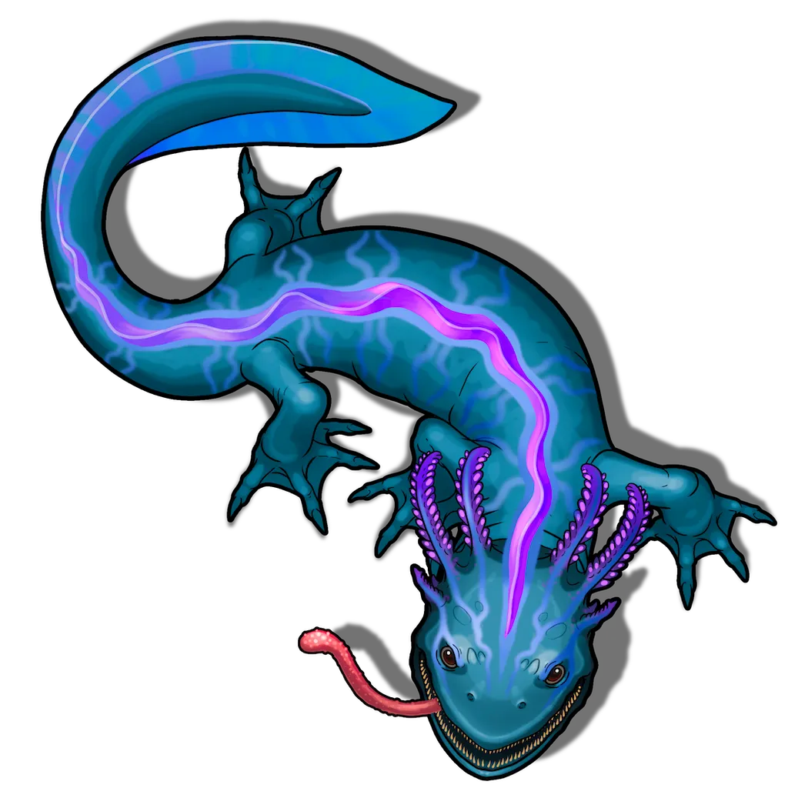

# Dripstones Menace

> [!warning] Gamemaster
> #### Gamemaster's Summary
>
> This combat event occurs semi-randomly while traveling through the [[Dripstones]] biome. During this event, the party can:
>
> - Encounter a [[Hydroxol]], a formidable adversary.
> - Harvest some useful crafting ingredients if they defeat their foe.

### Hydroxol Attack

The party are assaulted by a Hydroxol that emerges from a nearby pond with intent to protect its territory. If the party stands and fights the Hydroxol, they may be able to extract some valuable resources from its carcass, and a few useful items from its belly.

> [!abstract] Hydroxol
> **[[Hydroxol]]**
>
> Level 3 (Elite) · Amphibian Hydroxol
>
> 
>
> This large creature watches its surroundings with keen eyes, its wide maw hanging open, prepared to snap at a moment's notice. A long tongue moves back and forth, like it is actively scenting the area. It's wide frame boasts an almost gelatinous sheen with threads of shimmering ethereal light running down its back from head to tail, and large glowing gills pulse with each breath it takes.

> [!danger] Hazard
> #### Hydroxol Tactics
>
> The Hydroxol is aggressive and territorial. It will fight to the death unless it's **Morale** is broken, in which case it will flee upon falling below half of its maximum **Health**.
>
> The Hydroxol will rush towards the nearest target it can percieve, using [[Restraining Chomp]] to attempt and restrain the target, making it vulnerable to its deadly [[Thrash]] attack.
>
> If it has a target **Restrained** it may try to disengage and drag the target away into the water where it is at an advantage due to its ability to swim. The Hydroxol knows that most land-bound prey will drown if held underwater long enough, so it is likely to submerge with its prey.
>
> #### Fight or Flight
>
> Both the party and the Hydroxol will fight unless either attempts to retreat. If the Hydroxol is cornered and unable to escape, it will fight ferociously to the death.
>
> If the party chooses to flee, the Hydroxol will give chase but not past the edges of the Scene. If the party flees the area the Hydroxol returns to its den. If the party was attacked while resting, this has likely forced them to leave certain belongings behind.

Once the party has defeated the Hydroxol, they can spend some time investigating and studying the corpse of the slain beast.

> [!tip] Exploration
> #### Identifying the Hydroxol
>
> Characters with **Knowledge: Beasts** or succeding on a **Science (DC 16, Passive)** check know some information about these giant amphibians.
>
> - **Success**: These beasts are called "Hydroxol", are naturally territorial omnivores that nest in watery, secluded places. They can get quite large, and prefer to drag prey into deep water, drowning them there if possible.
> - **Critical Success**: Hydroxol are especially drawn to places with greater connections to the water moon Mayis or locations suffused with elemental water magic. In such places they can grow even larger, rarer Gray Hydroxol.
>
> #### It Ate What?
>
> A character who investigates the body of the defeated Hydroxol and makes a successful **Awareness (DC 12)** check notices some oddities inside the creature's semi-translucent belly. The party may cut the beast open find various items in its guts.
>
> - Roll three times on the [[Hydroxol Stomach Contents]] table to determine which items are found within the cadaver.
>
> #### Hydrophobic Hides
>
> Any character with **Wilderness (DC 13, Passive)** knows that a Hydroxol corpse contains numerous organs and other parts that can be harvested as valuable crafting ingredients.
>
> - Characters with **Knowledge: Crafts** or **Knowledge: Monsters** have **+2 Boons** on this check.
>
> The following items can be harvested from a single Hydroxol:
>
> - [[Hydroxol Bioluminescence]] (x4) which is processed into colorful, luminous paints, dyes and inks.
> - [[Hydroxol Gills]] (x2) which are an ingredient used to create water breathing potions.
> - [[Hydroxol Hide]] (x1) which may be used to craft waterproof equipment like packs, cloaks, and tarps.

Whether the party stands and fights, or flees from the territorial beast, they are able to continue on with their exploration of the region.
