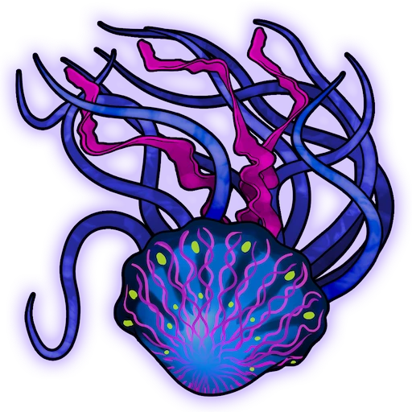
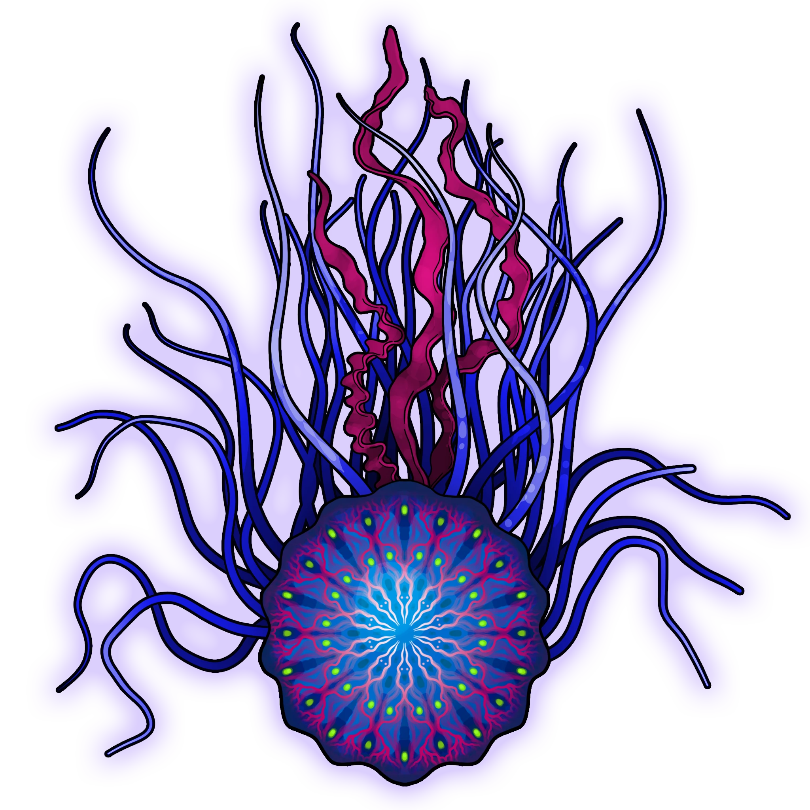

# Corrupted Depths

> [!warning] Gamemaster
> #### Gamemaster's Summary
>
> This combat event can occur while traversing the [[Lake of Whispers]] in the [[Fogbound Caverns]] section of the Pathways. In this event the party can either:
>
> - Hunt some of the strange [[Corrupted Kezus Jelly]]'s as the swarm the party
> - Move on quickly after recognizing that the jellies are not interested in the party.
>
> This event is repeatable, but on a cooldown so it cannot happen for several days after it has been encountered.

The event begins with the party floating across the Lake of Whispers upon the water vehicle they possess as they move through the [[Fogbound Caverns]].

> [!abstract] Corrupted Kezus Jelly
> **[[Corrupted Kezus Jelly]]**
>
> Level 1 · Unknown Unknown
>
> 

> [!abstract] Giant Corrupted Kezus Jelly
> **[[Giant Corrupted Kezus Jelly]]**
>
> Level 1 · Unknown Unknown
>
> 

The jellies are not immediately hostile, so the party can choose whether to take the first move or simply investigate.

> [!tip] Exploration
> #### Light in the Depths
>
> The party can decide that the jellies pose no danger to them, and they can move on without engaging in combat. This can end the encounter quickly.
>
> A `[[/check prc 17 passive]]` or successful **Awareness (DC 15)** or **Awareness (DC 15)** check will notice that the jellies are ignoring the party and floating through the water without any apparent purpose. They react to the passing of the water vehicle but are not aggressive or hostile.
>
> 1. **Result of 16+.** By studying the jellies closely, you realize that they are aware of the party but are not aggressive, leaving them alone will result may be the best course of action.
> 2. **Result of 17+.** These jellies do not appear to be entirely natural creatures, or perhaps they may have been once, however, their colors and glowing markings seem to suggest some kind of Abyssal corruption.
>
> A successful **Wilderness (DC 15)** or check or **Knowledge: Crafts** or **Knowledge: Alchemy** will notice that the jellies are rare creatures that if they were harvested for parts would produce [[Kezus Jelly]] which is highly valuable and even more so when refined into[[Kezus Ointment]]. The party can decide whether attacking the jellies here is worth the risk!

> [!danger] Hazard
> #### Kezus Jelly Tactics
>
> If the party attacks one of the jellies, combat begins. The jellies will turn red — indicating their aggression and anger — and attack as a group.
>
> The encounter with the jellies is straightforward, as they all move toward the water vehicle that the party is floating on as a single entity. They target the party members or characters randomly but will switch their attacks to anyone in the water if they fall in.
