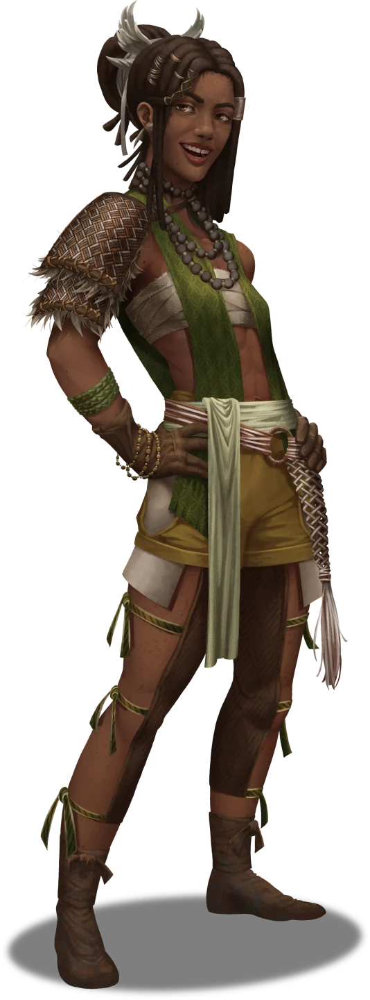

# Grassland Artifice

> [!warning] Gamemaster
> #### Gamemaster's Summary
>
> This social event allows the characters to encounter the agrimage Moriah Foxhaven, whom they've found roaming the Golden Flats with her caravan of beast-riding companions. In this event, the characters can:
>
> - Meet Moriah Foxhaven, an Arcturian agrimage from Steed's Point who is known for crafting wondrous items like the Grassland Talisman.
> - Procure a Grassland Talisman from Moriah, which will protect them from Jurtak poison while they traverse Steed's Point.

### The Wandering Agrimage

With guidance from Rattletrap, the party can locate a roving agrimage on the plains westward of the Eastern River to procure a Grassland Talisman, which should help the characters as they explore the Jurtak-infested reaches of Steed's Point.

The sun-kissed agrimage [[Moriah Foxhaven]] lives amongst a group of beast-riding nomads, and is known to fashion these talismans with her arcane craft. Moriah and her companions are happy to welcome the party into their camp for a while if their intentions are pure and their gold or barter is worthy.

> [!abstract] Moriah Foxhaven
> **[[Moriah Foxhaven]]**
>
> Level 1 · Unknown Unknown
>
> 

> [!info] Social
> #### Meeting the Agrimage
>
> Moriah Foxhaven and her community of beast-riding wanderers are used to meeting all sorts of folk on the dusty path to here and there, so the appearance of the party should come as no surprise to the unnamed band of rovers.
>
> Headstrong and heartfelt, Moriah is quick to strike up conversation with the characters when they arrive, and is willing to discuss the following:
>
> - The [[Grassland Talisman]] and how it might help the party survive the poisonous Jurtak attacks they've been warned about.
> - More about herself and her beast-riding companions.
> - A brief history about the rise and fall of Steed's Point, with discourse about its most prominent denizens — including Rattletrap, Kali Andrella, and Bertron Steed.
> - A short introduction to agrimagic.

> [!question] Q&A
> **Q:** About yourself?
>
> **A:**
>
> > I'm just a traveler, like yourselves. One who has seen more than her fair share of hardship in too short an amount of time. So I put my agrimagic to good use by cultivating this little community of ours and helping the good people of the Golden Flats when I can.

> [!question] Q&A
> **Q:** About Agrimagic?
>
> **A:**
>
> > Agrimagic is an Arcturian tradition I've always studied with pride, not simply because it runs in the family, but due to some longing I've felt since youth. My sorcery stems from Ember itself, and I'm fortunate to be able to give a little magic back to the world from time to time.

> [!question] Q&A
> **Q:** Steed's Point?
>
> **A:**
>
> > It started with an earthquake. Then the Jurtak came. Soon, a well-meaning but misguided agrimage — one considerably more powerful than myself — summoned scores of gore birds to stem the saurian tide. Steed's Point was caught up in the fray, and that's how I lost my hometown. I abandoned Steed's Point before it got too dangerous to leave.

> [!question] Q&A
> **Q:** The Grassland Talisman?
>
> **A:**
>
> > Nobody deserves to die from the venom on a Jurtak's blade. Thanks to Ember's bounties, I've managed to weave a special magic that wards against the deadly toxin. A Grassland Talisman will certainly help you mitigate the mortal threat of Jurtak poison. But it's magic is fleeting, and it won't save you from a Jurtak geomancer's umbral sorcery.

> [!question] Q&A
> **Q:** About Jurtak?
>
> **A:**
>
> > The Jurtak are foul and verminous creatures that hail from the deepest, lightless depths of Ember's Pathways. These aberrations are motivated by little more than sheer cruelty and their carnivorous appetites.

> [!tip] Exploration
> #### The Grassland Talisman
>
> The so-called [[Grassland Talisman]] is a peculiar magic item fashioned by Moriah Foxhaven, utilizing her skills as an agrimage to ward its wearer against the potent poison used by the Jurtak.
>
> Moriah Foxhaven charges a sum of 50 gp for the consumable item, but can be persuaded to lower the price.
>
> Any character who succeeds on a **Diplomacy (DC 15)** check is able to convince Moriah to sell the item at a discount for 40 gp.
