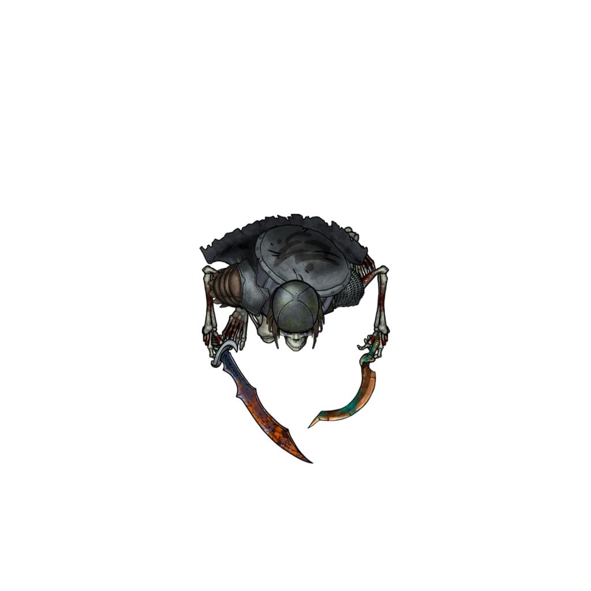

# Shent Observatory

> [!warning] Gamemaster
> #### Gamemaster's Summary
>
> This Exploration and Combat Event can occur while traveling through the [[Rustvar Valleys]]. In this Event, the party can:
>
> - Investigate a ruined observatory once used by the [[Shent]] to study cosmological forces, and later repurposed by Arcturians as a barrow.
> - Realign its rusting instrument to reveal a treasure cache.
> - Fend off a group of undead warriors that rise to defend the site.

### Exploring the Observatory

The observatory lies in ruin atop a stone outcropping. A broad stepped platform dominates the site, crumbling around a mechanism half-buried in mossy rubble.

> [!tip] Exploration
> #### Identifying the Ruin
>
> Characters with **Knowledge: Shent**, **Knowledge: Ancients**, or Proficiency in **Society (DC undefined)** identify the site as a ruined Shent observatory, and can estimate its age as approximately 3,000 years old.
>
> **Ancestry: Arcturian** characters, characters with **Knowledge: Ancients** or **Knowledge: Rituals**, and characters with Proficiency in **Society (DC undefined)** identify markers — burial niches and engraved funerary script — that suggest the site was used, or later repurposed, as a barrow by early Arcturian settlers. They can estimate the age of these markers as approximately 1,000 years old.
>
> Characters who make a successful **Arcana (DC 16)** check recognize the engraved funerary script as ritualized [[Gentle Repose]] spells, though their magic has long since faded.

`[[/outcome identifiedRuinShent]]`

`[[/outcome identifiedRuinArcturian]]`

When a character inspects the stepped platform, read or paraphrase the following:

> [!quote] Read Aloud
> The faded stepped platform is scored with weathered carvings, though much of it still lies beneath rubble and overgrowth. The lengths of metal jutting from its surface sway with the wind, and their slow movement sends a faint grinding sound through the stone.

> [!tip] Exploration
> #### Investigating the Stepped Platform
>
> Any character who makes a successful **Awareness (DC 15)** check while examining the stepped platform determines that the rusting metal arms were once part of a larger astronomical mechanism. Most still rest in deliberate relation to the carvings on the stone, but one has long since slipped from its proper alignment.
>
> - Characters with **Knowledge: Cosmology**, characters who can understand **Language: Pathward**, and characters who [[Shent Observatory]] as an observatory automatically succeed on this check.
>
> #### Restoring the Mechanism
>
> A character who understands the stepped platform's function may attempt to force the unaligned metal arm into alignment by making a **Athletics (DC 16)** check. On a failure, the arm groans and shifts, but does not lock into place. On a success, the mechanism settles into place with a heavy clunk, a hidden compartment grinds open at the base of the stepped platform, and the [[Shent Observatory]].
>
> If the characters attempt to move the arm three separate times and fail each time, the arm snaps off but jams partially into place, forcing the hidden compartment halfway open and triggering the [[Shent Observatory]]. The cache can then be excavated over the course of 1 hour using appropriate tools, such as [[Mason's Tools]].
>
> #### The Funerary Cache
>
> Inside the hidden compartment lies a sealed funerary cache placed there by ancient Arcturian settlers: a collection of ritual objects once used to prepare and honor the dead. The cache is a large, lacquered wood chest that contains the following:
>
> - A bronze funerary mask with severe expression, covered in verdigris and wrapped in stiff linen cloth (worth **`[[/award party 200gp]]`**).
> - A [[Spell Scroll]] of [[Gentle Repose]], featuring the same funerary script present on the ruins.
> - A bronze urn engraved with ancient Arcturian ritual symbols and covered in verdigris, containing trace amounts of foul-smelling oil (worth **`[[/award party 25gp]]`**).
> - An ancient Arcturian [[Funerary Ritual Garb]].
> - A linen bundle of 20 [[Tallow Candles]], rancid with age.
> - Dried herbs that crumble at the touch.

`[[/outcome funeraryCacheFound]]`

#### Signara Attunement: Funerary Cache Found

If the party discovers the funerary cache, they advance their **Attunement: Signara (+1)** at the conclusion of the event.

### Rising Skallith

When the mechanism locks into place, read or paraphrase the following:

> [!quote] Read Aloud
> The metal arm settles into alignment with a deep, grinding scream. For a moment, nothing happens. Then a deeper groan rattles through the ruin; dust spills from the seams cut through the stonework, and old niches grind open, exhaling air that smells of death. Something buried here is beginning to stir.

> [!abstract] Skallith
> **[[Skallith]]**
>
> Level 1 · Skallith Commonfolk
>
> 
>
> You behold the terrifying appearance of a reanimated humanoid skeleton, whose decrepit bones remain dreadfully assembled, despite the lack of sinew and flesh. This loathsome skeletal creature wields a timeworn blade, and a rotted shortbow is slung across its bony back.

> [!abstract] Skallith Warrior
> **[[Skallith Warrior]]**
>
> Level 3 · Skallith Fighter
>
> 
>
> You behold the terrifying appearance of a reanimated humanoid skeleton, whose decrepit bones remain dreadfully assembled, despite the lack of sinew and flesh. This skeletal warrior is clad in corroded armor, rusted from untold centuries in the grave. A rusty longsword at the creature's side belies its noteworthy strength, and a helmet crowns its cracked and decaying skull.

> [!danger] Hazard
> #### Skallith Numbers
>
> There are 4 [[Skallith]] and 3 [[Skallith Warrior]].
>
> #### Skallith Tactics
>
> As undead, the skallith prioritize the closest enemy they can see, with no regard for tactical optimization beyond what weapon can strike their target.
>
> #### Fight or Flight
>
> The skallith fight until destroyed.
>
> If the party chooses to flee, the skallith pursue, but not past the edges of the Scene.

### Concluding the Event

Once the party has defeated the skallith and finished exploring the Shent observatory, they're free to continue on their journey.
