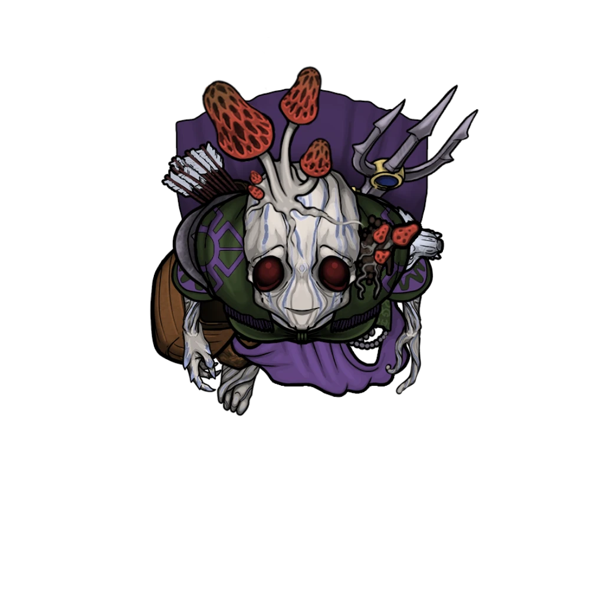

# Strange Thornlings

> [!warning] Gamemaster
> #### Gamemaster's Summary
>
> This exploration event sees the party encounter a small group of strange, afflicted Thornlings bearing a colony of psychic fungus. The fungus, which identifies itself as the Sporix, feeds on plants and absorbs their life energies. It has recently expanded to take control of some Thornlings that were exploring the depths. The party can:
>
> - Fight the afflicted, destroying them.
> - Attempt to make contact with the Sporix colony.
> - Let them pass without interference.
>
> #### A Rare Encounter
>
> This event will only ever trigger once, currently. While there may be more Sporix-based events in the future, right now this is the only instance of this sickness appearing in the current chapters. If you would like them to reappear, and become a minor plot point, you are free to.
>
> They can be encountered growing on other plants, including other fungus, and should only be encountered underground in the Pathways, and always far from sources of light.
>
> #### What Are The Sporix?
>
> The Sporix is a semi-sentient magical fungus that grows in the darkest, dampest regions of the Sinkhole Depths. These fungus colonies specifically target plants, working their way into the core of the afflicted plant. Once embedded, the fungal colonies take over the plant and begin consuming its life force until the host withers and dies.
>
> Thankfully, the Sporix have not managed to spread very far, as it is only well suited to dark, damp regions. The fungal weakness to heat and light makes it hard for them to survive anywhere light touches, and greatly limits the spread of colonies.
>
> #### Parasitic Fungus
>
> Mechanically, Sporix colonies function like a disease which is capable of afflicting any plants on Ember, including Thornlings. Narratively speaking, the Sporix is a parasitic fungus not unlike the cordyceps fungus on earth.
>
> While most plants can be inflicted easily, Thornlings are much more difficult, and must already be weakened by sickness, starvation, or fatigue to be susceptible. In most cases, player characters will be in no danger. We have no provided any mechanics or saves to resist the Sporix since it's assumed player Thornlings won't be at risk.
>
> #### Curing the Affliction
>
> The Sporix colonies are highly resilient, and spread quickly. If caught early, the small colonies could be surgically cut out of the host's body, but once it takes hold, the afflicted being needs powerful magical intervention.

### Fighting the Afflicted

> [!abstract] Sporix Host
> **[[Sporix Host]]**
>
> Level 1 (Minion) · Thornling Grappler
>
> 
>
> This thornling's bark is pale and withered, their foliage equally dry and dying. They appear to be on the brink of death, glassy-eyed, and in something of a stupor. Their body is covered in brightly colored, glowing fungus that pulses and shimmers in strange patterns.

The Sporix afflicted Thornlings are not initially hostile, and don't attack unless provoked first. There are nine of them all told, and they are easy to spot since they are glowing and make no attempt to conceal themselves. Though some are armed and armored, none of their equipment appears to be in good, usable order.

> [!danger] Hazard
> #### Favored Prey: Thornlings
>
> If the party has a Thornling, all nine Sporix hosts become hostile the moment any one of them perceives the non-afflicted Thornling, and attack. The Sporix colony that has taken control of them wants nothing more than to spread itself to other Thornlings and resorts to violence as its primary method of doing so.
>
> #### Sporix Host Tactics
>
> Thornlings serving as a Sporix Host have little to speak of in the way of tactics: they rush enemies and attempt to punch, kick, and bite them until they stop moving. They attempt to prioritize other unafflicted Thornlings if they are aware of any, but are careful enough not to kill them. They need the Thornlings alive.
>
> While they do attack mindlessly, they are coordinated, and focus on whatever they perceive to be the greatest danger. They also have a faint sense of self-preservation and attempt to flee if **Broken**, **Weakened** or if more than half their number have been defeated.

### Examining the Afflicted

> [!tip] Exploration
> #### Rare Insights
>
> Sporix are not well documented or well understood, and they have only been witnessed a few times; they are more myth than reality. Characters with **Knowledge: Subterranea** may have heard rumors of the Sporix, but have never seen them or heard any credible accounts before now.
>
> Characters with **Knowledge: Undeath** that examine the thornlings will recognize that they are not undead, at least not as one traditionally understands them to be. Furthermore, characters with `[[/knowledge soul]]` recognize that these thornling souls are likely trapped in their bodies, stuck between life and death, not unlike undead.
>
> Characters wtih **Knowledge: Abyssals** might suspect that these beings are abyss tainted, but examining them reveals no such telltale signs. That doesn't rule out the presence of such a taint, just that it's not manifesting in usual ways.
>
> #### Invasive Growths
>
> A successful **Medicine (DC 12)** while examining one of the afflicted reveals that the Thornlings are still alive, but barely. Their flesh and foliage are withered and ill-colored, giving the appearance of death or undeath, though that is not actually the case.
>
> - **Critical Success** The fungus growing out of them has split open their skin and looks to be coming from deep within them. These wounds combined with the clear signs of long-term malnutrition indicate to you that these afflicted may die out in the next week or so. Short of surgery to remove all the fungus, clean, and then seal the wounds, you haven't the faintest idea how you could actually save them. You’re not even certain that such an invasive procedure wouldn’t prove fatal by itself.
>
> #### Strange Behavior
>
> A successful **`[[/skill diplomacy 15]]`** check while watching the afflicted Thornlings reveals that they all seem to react to certain stimuli in unison, leading you to believe they might all be sharing their senses, or connected to each other.
>
> - A further successful **Arcana (DC 15)** check, with this insight, leads you to suspect leads you to suspect the fungus may actually be some sort of psionic colony capable of bridging minds.
>
> #### Magical Diagnosis
>
> - Use of **Vital Sense** reveals the presence of an invasive fungal growth that has found its way into the target's nervous system. The fungal infection is directly controlling them, and has suppressed most of their higher mental functions.
> - Using magic to read the surface thoughts of the afflicted hears only a dim whisper of numerous little reactive impulses, sentient but hardly intelligent. Digging deeper discovers that the minds of the thornlings are all but lost, and in their place is the fungal growth that has taken over.
> - Using **Talent: Wildspeaker** does allow for more direct communication (see below) but is not strong enough to issue commands. The fungal growth controlling the Thornlings is already smart and more resistant than any mundane plant.
>
> #### Failed Treatments
>
> Targeting the afflicted with any other form of healing or restorative magic is effective. Rather than restoring lost hit points, it instead causes the afflicted considerable pain and turns them hostile to the source of the magic.

> [!info] Social
> #### Communicating with the Sporix
>
> Using the **Talent: Wildspeaker** wildspeakerallows a character to converse with the fungus directly. Doing this reveals that the fungal growth is known as the Sporix. If contacted, they have very little say and are single-minded:
>
> > We are the Sporix. We are of the rot and darkness of Ember. We spread to grow, and grow to exist. The Thornlings are ours now. They are ideal. Most plants cannot walk. These ones are ideal. We will find more of them and multiply.

Once the afflicted Thornlings have been defeated or examined, the party may continue their travels. Since the Sporix-afflicted Thornlings are wandering aimlessly, they are never in the same place twice.
